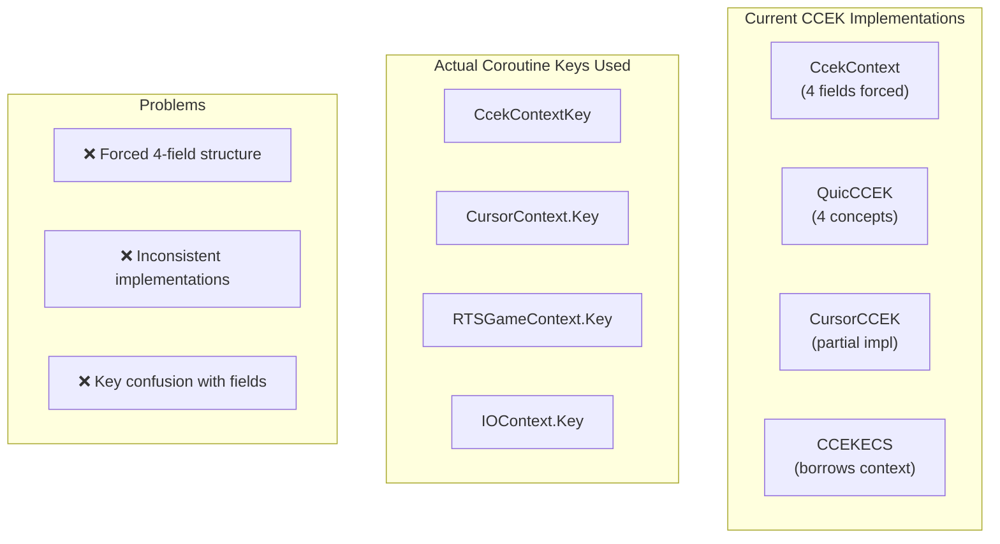
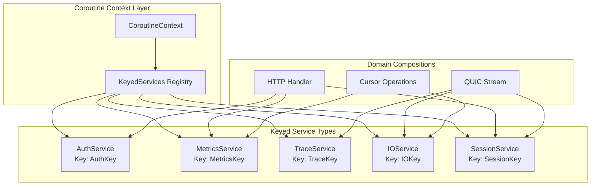
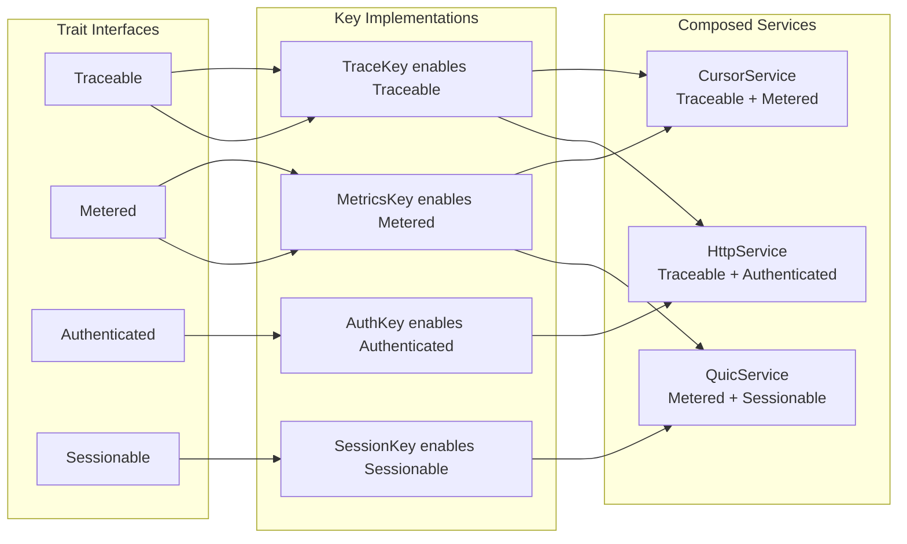
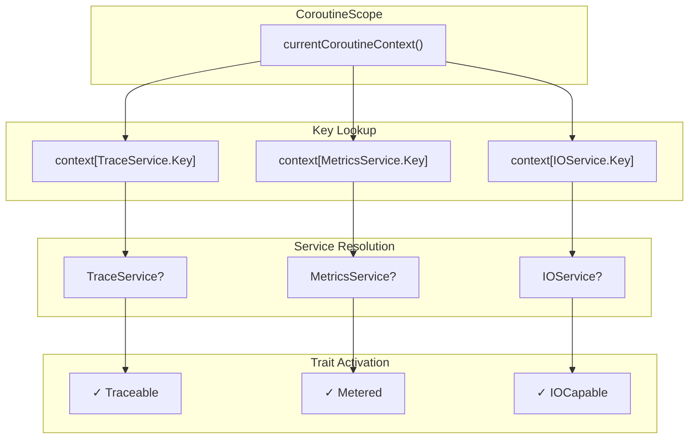

# Keyed Services Architecture - Coroutine Context Composition

## Current State Analysis



## Proposed Architecture: Pure Keyed Services



## Key-Based Trait Composition



## Implementation Pattern

```kotlin
// Base keyed service
interface KeyedService : CoroutineContext.Element

// Trait interfaces
interface Traceable {
    suspend fun trace(operation: String)
}

interface Metered {
    suspend fun meter(metric: String, value: Long)
}

// Concrete services with keys
data class TraceService(val tracer: Tracer) : KeyedService, Traceable {
    companion object Key : CoroutineContext.Key<TraceService>
    override val key = Key
    override suspend fun trace(operation: String) = tracer.trace(operation)
}

data class MetricsService(val collector: MetricsCollector) : KeyedService, Metered {
    companion object Key : CoroutineContext.Key<MetricsService>
    override val key = Key
    override suspend fun meter(metric: String, value: Long) = collector.record(metric, value)
}

// Domain usage - compose what you need
suspend fun handleHttpRequest(request: HttpRequest) = coroutineScope {
    val trace = coroutineContext[TraceService.Key] ?: error("No trace service")
    val auth = coroutineContext[AuthService.Key] ?: error("No auth service")
    
    trace.trace("http.request.start")
    auth.authenticate(request.headers)
    // ... handle request
}
```

## Service Discovery Graph



## Migration Path

1. **Remove 4-field requirements** - CCEK is just a key pattern
2. **Define trait interfaces** - What capabilities do services provide?
3. **Create keyed services** - One key per service, implementing relevant traits
4. **Compose at use sites** - Pull only needed services from context

## Benefits

- **No forced structure** - Services define their own shape
- **Trait-based composition** - Mix capabilities as needed
- **Type-safe lookup** - Keys guarantee correct service types
- **Clear dependencies** - Explicit service requirements at use sites