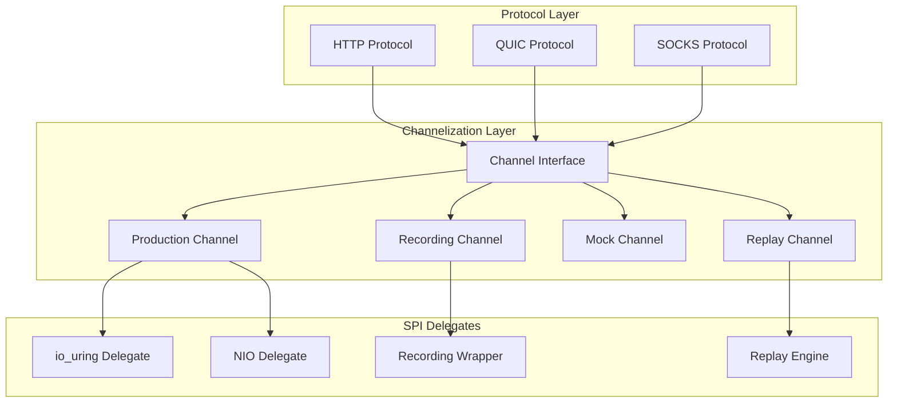

# Channelization Architecture: Protocol Sacrifice for Testability

## The Channel Abstraction Layer



## Channel Interface Design

```kotlin
// Common channel abstraction
interface Channel {
    suspend fun read(size: Int): ByteArray
    suspend fun write(data: ByteArray): Int
    suspend fun close()
    
    // Metadata for recording/replay
    val id: ChannelId
    val timestamp: Long
}

// Channel factory with SPI pattern
interface ChannelProvider {
    fun createChannel(config: ChannelConfig): Channel
}

// Recording delegate wrapper
class RecordingChannel(
    private val delegate: Channel,
    private val recorder: ChannelRecorder
) : Channel {
    override suspend fun read(size: Int): ByteArray {
        val data = delegate.read(size)
        recorder.recordRead(id, timestamp, data)
        return data
    }
    
    override suspend fun write(data: ByteArray): Int {
        val written = delegate.write(data)
        recorder.recordWrite(id, timestamp, data, written)
        return written
    }
    
    override suspend fun close() {
        recorder.recordClose(id, timestamp)
        delegate.close()
    }
    
    override val id = delegate.id
    override val timestamp get() = System.currentTimeMillis()
}
```

## NIO SPI Recording Architecture

```kotlin
// Service Provider Interface for channel implementations
interface ChannelSPI {
    fun supports(type: ChannelType): Boolean
    fun create(config: ChannelConfig): Channel
}

// Recording SPI that wraps any other SPI
class RecordingSPI(
    private val delegate: ChannelSPI,
    private val recordingConfig: RecordingConfig
) : ChannelSPI {
    override fun supports(type: ChannelType) = delegate.supports(type)
    
    override fun create(config: ChannelConfig): Channel {
        val channel = delegate.create(config)
        return if (recordingConfig.enabled) {
            RecordingChannel(channel, recordingConfig.recorder)
        } else {
            channel
        }
    }
}

// Platform-specific SPIs
class NIOChannelSPI : ChannelSPI {
    override fun create(config: ChannelConfig): Channel = 
        NIOChannel(config)
}

class IoUringChannelSPI : ChannelSPI {
    override fun create(config: ChannelConfig): Channel = 
        IoUringChannel(config)
}
```

## Replay and Simulation

```kotlin
// Replay recorded channel interactions
class ReplayChannel(
    private val recording: ChannelRecording
) : Channel {
    private var position = 0
    
    override suspend fun read(size: Int): ByteArray {
        val event = recording.events[position++]
        check(event is ReadEvent && event.size == size) {
            "Replay mismatch: expected read($size)"
        }
        delay(event.duration) // Simulate timing
        return event.data
    }
    
    override suspend fun write(data: ByteArray): Int {
        val event = recording.events[position++]
        check(event is WriteEvent && event.data.contentEquals(data)) {
            "Replay mismatch: expected write(${data.size} bytes)"
        }
        delay(event.duration)
        return event.written
    }
}

// Channel simulation for testing
class SimulatedChannel(
    private val behavior: ChannelBehavior
) : Channel {
    override suspend fun read(size: Int): ByteArray =
        behavior.simulateRead(size)
    
    override suspend fun write(data: ByteArray): Int =
        behavior.simulateWrite(data)
}
```

## Protocol Testing with Channels

```kotlin
// Test HTTP protocol with mock channels
class HttpProtocolTest {
    @Test
    fun `test HTTP request parsing`() = runTest {
        // Create mock channel with predefined data
        val channel = MockChannel().apply {
            enqueueRead("GET / HTTP/1.1\r\nHost: example.com\r\n\r\n".toByteArray())
            enqueueWrite(ByteArray(1024)) // Response buffer
        }
        
        // Protocol code uses channel abstraction
        val request = HttpParser.parse(channel)
        assertEquals("GET", request.method)
        assertEquals("/", request.path)
    }
    
    @Test
    fun `test with recorded production traffic`() = runTest {
        // Load recorded channel session
        val recording = ChannelRecording.load("prod-session-001.rec")
        val channel = ReplayChannel(recording)
        
        // Replay exact production scenario
        val protocol = HttpProtocol(channel)
        val results = protocol.handleSession()
        
        // Verify behavior matches production
        assertEquals(recording.expectedResults, results)
    }
}
```

## Benefits of Channelization

1. **Clean Testing**: Protocols work with channel abstraction, not real I/O
2. **Recording/Replay**: Capture production traffic for debugging
3. **Simulation**: Test edge cases and failure modes
4. **Platform Independence**: Same protocol code, different channel implementations
5. **Performance**: No overhead in production (delegates directly to io_uring/NIO)

## Integration with Coroutine Services

```kotlin
// Channel service in coroutine context
interface ChannelService : KeyedService {
    suspend fun openChannel(config: ChannelConfig): Channel
    companion object Key : CoroutineContext.Key<ChannelService>
}

// Production service
class ProductionChannelService(
    private val spi: ChannelSPI
) : ChannelService {
    override val key = ChannelService.Key
    override suspend fun openChannel(config: ChannelConfig) = 
        spi.create(config)
}

// Test service with recording
class TestChannelService(
    private val recorder: ChannelRecorder
) : ChannelService {
    override val key = ChannelService.Key
    override suspend fun openChannel(config: ChannelConfig) =
        RecordingChannel(MockChannel(), recorder)
}
```

This architecture provides the clean separation needed for:
- Unit testing protocols without real I/O
- Recording production traffic for analysis
- Replaying scenarios for debugging
- Simulating network conditions
- Platform-specific optimizations under a common interface