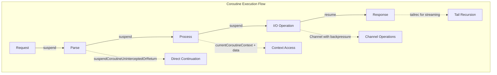
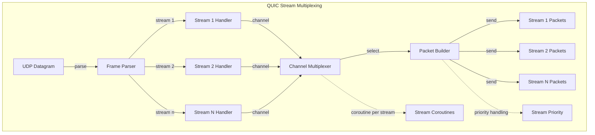
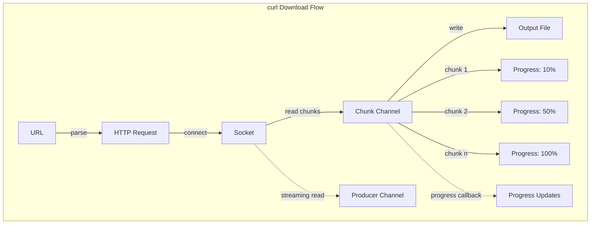
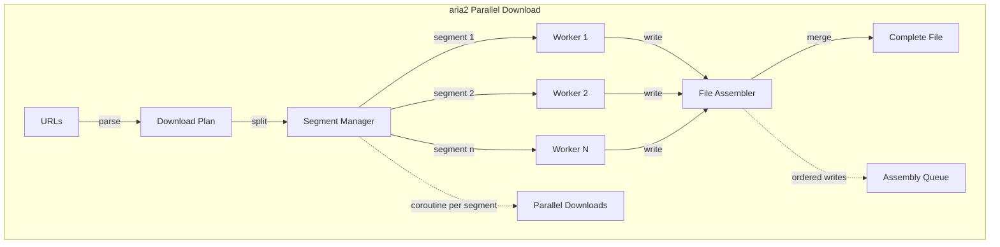
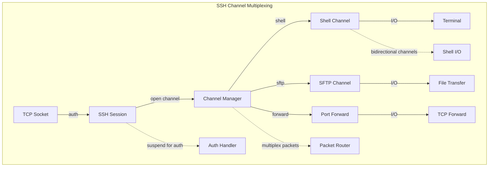
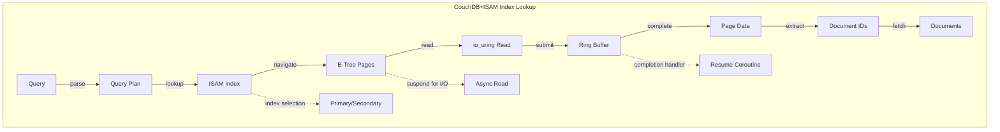
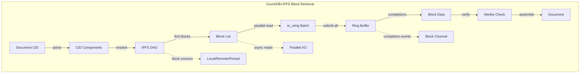

# Channel & Protocol CCEK TODO - Compositional Coroutine Context

This document defines the compositional coroutine context structure with actual async continuation protocols for major channel/protocol services.

---

## Core Coroutine Patterns



---

## CouchDB Service

```mermaid
flowchart TD
    subgraph "CouchDB Service Flow"
        A[HTTP Request] -->|parse| B[BBCursive Parser]
        B -->|query| C[DB Connection]
        C -->|stream| D[Document Channel]
        D -->|serialize| E[Response Stream]
        
        E -->|chunk 1| F1[Response Chunk 1]
        E -->|chunk 2| F2[Response Chunk 2]
        E -->|chunk n| FN[Response Chunk N]
        
        F1 & F2 & FN -->|write| G[HTTP Response] 
        
        B -.->|suspend for parse| BP[Async Parse]
        D -.->|Channel(BUFFERED)| DC[Backpressure]
        C -.->|connection pool| CP[DB Pool]
    end
```

### CouchDB Implementation Checklist
- [ ] BBCursive parser for CouchDB protocol with zero-copy continuations
- [ ] Session context composition: `currentCoroutineContext() + CouchContext(dbName)`
- [ ] Channel allocation based on document size: `when (docSize) { ... }`
- [ ] Tail-recursive document streaming with backpressure
- [ ] View query continuation compiler

---

## QUIC Service



### QUIC Implementation Checklist
- [ ] Frame parser with suspension points per stream
- [ ] Per-stream coroutine context: `streamContext(streamId)`
- [ ] Multiplexed channel select with cancellation
- [ ] Priority-based continuation scheduling
- [ ] Flow control via suspended continuations

---

## curl Client



### curl Implementation Checklist
- [ ] URL parser with continuation points
- [ ] HTTP client context with timeout/retry
- [ ] ProducerScope for streaming downloads
- [ ] Progress callback continuations
- [ ] Range request support via tail recursion

---

## aria2 Client



### aria2 Implementation Checklist
- [ ] Multi-URL parser with validation
- [ ] Concurrent coroutine contexts with supervisor
- [ ] Per-segment channels with buffer limits
- [ ] Segment assembler with continuation callbacks
- [ ] Retry logic per segment with exponential backoff

---

## SSH Client



### SSH Implementation Checklist
- [ ] Auth state machine with suspension points
- [ ] Session context with keep-alive coroutine
- [ ] Channel multiplexing via channelFlow
- [ ] Per-channel protocol handlers
- [ ] Bidirectional flow with cancellation propagation

---

## CouchDB + ISAM with io_uring



### CouchDB+ISAM Implementation Checklist
- [ ] Query parser with ISAM-aware optimization
- [ ] ISAM index context with key path tracking
- [ ] io_uring submission queue preparation
- [ ] Continuation storage in SQE userData
- [ ] CQE completion handler with continuation resume
- [ ] Async transitions from index lookups to io_uring operations

---

## CouchDB + IPFS with io_uring



### CouchDB+IPFS Implementation Checklist
- [ ] CID parser with multi-hash support
- [ ] IPFS DAG context with block resolution strategy
- [ ] io_uring batch submission for parallel block reads
- [ ] Continuation-per-block with async/await coordination
- [ ] Ring buffer pool for high-throughput operations
- [ ] Async transitions from DAG resolution to io_uring I/O
- [ ] Merkle tree verification with suspended continuations

---

## io_uring Integration Patterns

### 1. io_uring Async I/O Pattern
```kotlin
// Suspend coroutine while io_uring performs I/O
suspend fun readAsync(fd: Int, size: Int): ByteArray {
    return suspendCoroutineUninterceptedOrReturn { cont ->
        val sqe = ring.getSqe()
        val buffer = ByteBuffer.allocateDirect(size)
        
        sqe.prepareRead(fd, buffer, 0)
        sqe.userData = cont.asOpaque() // Store continuation
        ring.submit()
        
        COROUTINE_SUSPENDED
    }
}
```

### 2. Multi-Ring Coordination
```kotlin
// Multiple io_uring instances for different subsystems
class MultiRingCoordinator {
    val isamRing = IoUring(entries = 4096, flags = IORING_SETUP_SQPOLL)
    val ipfsRing = IoUring(entries = 8192, flags = IORING_SETUP_IOPOLL)
    val couchRing = IoUring(entries = 2048)
    
    suspend fun coordinate() = coroutineScope {
        launch { processIsamCompletions(isamRing) }
        launch { processIpfsCompletions(ipfsRing) }
        launch { processCouchCompletions(couchRing) }
    }
}
```

### 3. Continuation Opaque Pointers
```kotlin
// Store continuations as opaque pointers in SQE userData
inline class ContinuationHandle(val ptr: Long) {
    fun toContinuation<T>(): Continuation<T> = 
        Unsafe.getObject(ptr) as Continuation<T>
        
    companion object {
        fun <T> from(cont: Continuation<T>): ContinuationHandle =
            ContinuationHandle(Unsafe.putObject(cont))
    }
}
```

---

## Common Continuation Patterns

### 1. Direct Continuation Access
```kotlin
suspendCoroutineUninterceptedOrReturn { cont ->
    // Zero-copy async operation
    nativeApi.callAsync { result ->
        cont.resume(result)
    }
    COROUTINE_SUSPENDED
}
```

### 2. Context Composition
```kotlin
withContext(currentCoroutineContext() + CustomContext(data)) {
    // Operations with composed context
}
```

### 3. Tail Recursive Streaming
```kotlin
tailrec suspend fun stream(offset: Long): Unit =
    if (hasMore(offset)) {
        emit(readChunk(offset))
        stream(offset + chunkSize)
    } else Unit
```

### 4. Backpressure via Channels
```kotlin
Channel<T>(
    capacity = adaptiveCapacity(load),
    onBufferOverflow = BufferOverflow.SUSPEND
)
```

### 5. Cancellable Continuations
```kotlin
suspendCancellableCoroutine { cont ->
    val handle = startOperation()
    cont.invokeOnCancellation {
        handle.cancel()
    }
}
```