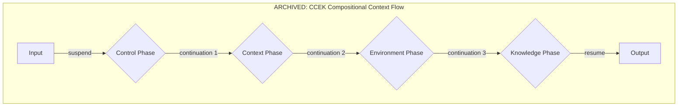
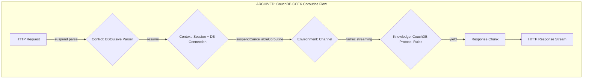
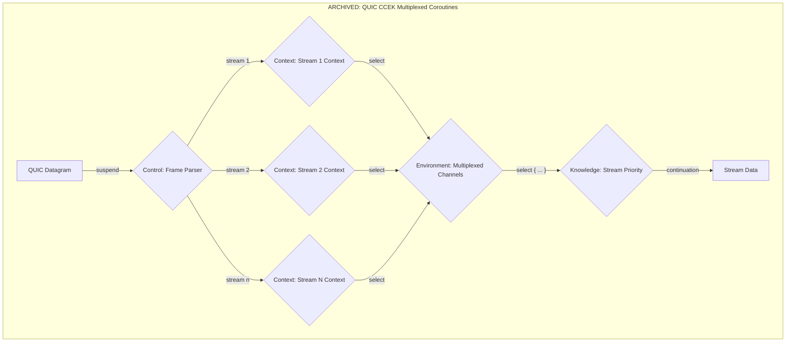

# [ARCHIVED] Original CCEK Exploration Document

> **Note**: This document contains early, complex brainstorming for a "Compositional Coroutine Context." The patterns described here have been **superseded and simplified** by the refined approach detailed in **`COMPOSITIONAL_CONTEXT_PATTERNS.md`**.
>
> This file is preserved as historical context only, as per the Code Preservation Protocol for architectural artifacts. For current and future development, please refer to the patterns in **`COMPOSITIONAL_CONTEXT_PATTERNS.md`**.

---

## Original CCEK Continuation Protocol Concept

---

## Original CouchDB Service with Async Continuations Concept

---

## Original QUIC Service with Multiplexed Continuations Concept

---

> **Reminder**: These original diagrams represent a conceptual phase that has evolved. The current, implemented pattern uses a much simpler `HandlerRegistry` and standard `CoroutineContext` composition. Please see **`COMPOSITIONAL_CONTEXT_PATTERNS.md`**.
