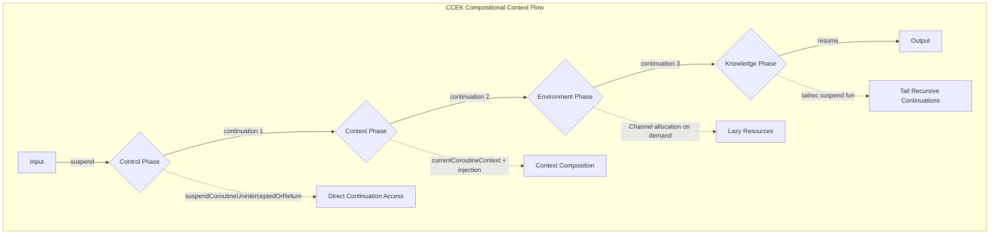
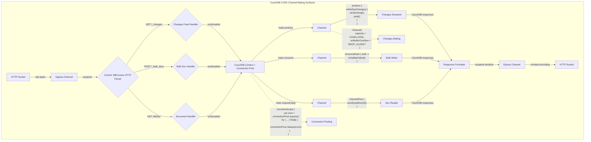
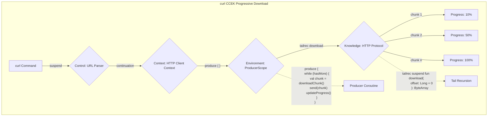
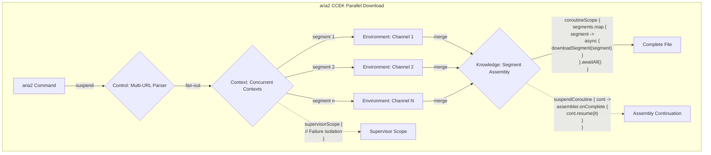
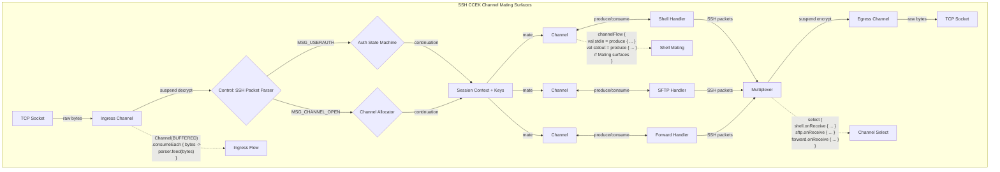
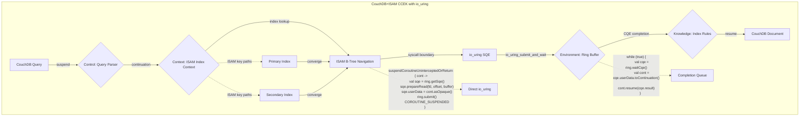

# Channel & Protocol CCEK TODO - Compositional Coroutine Context

This document defines the compositional coroutine context structure with actual async continuation protocols for major channel/protocol services.

---

## Core CCEK Continuation Protocol



---

## CouchDB Service with Async Continuations



### CouchDB Implementation Checklist
- [ ] BBCursive parser for CouchDB protocol with zero-copy continuations
- [ ] Session context composition: `currentCoroutineContext() + CouchContext(dbName)`
- [ ] Channel allocation based on document size: `when (docSize) { ... }`
- [ ] Tail-recursive document streaming with backpressure
- [ ] View query continuation compiler

---

## QUIC Service with Multiplexed Continuations

```mermaid
flowchart TD
    subgraph "QUIC CCEK Channel Mating Surfaces"
        %% Ingress Surface - UDP Datagram
        A[UDP Socket] -->|datagrams| ING[Ingress Channel<QuicPacket>]
        ING -->|suspend decrypt| B{Control: QUIC Frame Parser}
        
        %% Control Phase - Frame Demux
        B -->|STREAM frame| STREAM{Stream Demuxer}
        B -->|ACK frame| ACK{ACK Processor}
        B -->|CRYPTO frame| CRYPTO{Crypto Handler}
        
        %% Context Phase - Per-Stream Contexts
        STREAM -->|"streamId lookup"| C[Stream Context Registry]
        C -->|create/get| SC1[Stream 1 Context]
        C -->|create/get| SC2[Stream 2 Context]
        C -->|create/get| SCN[Stream N Context]
        
        %% Environment Phase - Stream Channels
        SC1 -->|mate| D1[Channel<StreamData> #1]
        SC2 -->|mate| D2[Channel<StreamData> #2]
        SCN -->|mate| DN[Channel<StreamData> #N]
        
        %% Bidirectional Stream Mating
        D1 <-->|"produce/consume"| APP1[App Handler 1]
        D2 <-->|"produce/consume"| APP2[App Handler 2]
        DN <-->|"produce/consume"| APPN[App Handler N]
        
        %% Knowledge Phase - Priority & Flow Control
        APP1 & APP2 & APPN -->|prioritized| E{Priority Scheduler}
        E -->|"select {
            urgent.onReceive { ... }
            normal.onReceive { ... }
            bulk.onReceive { ... }
        }"| MUX[Frame Multiplexer]
        
        %% Egress Surface
        MUX -->|QUIC frames| PKT[Packet Builder]
        PKT -->|suspend encrypt| EGR[Egress Channel<QuicPacket>]
        EGR -->|datagrams| UDP[UDP Socket]
        
        %% Channel Mating Details
        D1 -.->|"Channel<StreamData>(
            capacity = windowSize,
            onBufferOverflow = SUSPEND
        )"| WIN1[Flow Control]
        
        C -.->|"ConcurrentHashMap<StreamId, 
            StreamContext>()"| REG[Stream Registry]
        
        E -.->|"channelFlow {
            launch { handleUrgent() }
            launch { handleNormal() }
            launch { handleBulk() }
        }"| PRIO[Priority Handling]
    end
```



### QUIC Implementation Checklist
- [ ] Frame parser with suspension points per stream
- [ ] Per-stream coroutine context: `streamContext(streamId)`
- [ ] Multiplexed channel select with cancellation
- [ ] Priority-based continuation scheduling
- [ ] Flow control via suspended continuations

---

## curl Client with Progressive Download



### curl Implementation Checklist
- [ ] URL parser with continuation points
- [ ] HTTP client context with timeout/retry
- [ ] ProducerScope for streaming downloads
- [ ] Progress callback continuations
- [ ] Range request support via tail recursion

---

## aria2 Client with Parallel Segments



### aria2 Implementation Checklist
- [ ] Multi-URL parser with validation
- [ ] Concurrent coroutine contexts with supervisor
- [ ] Per-segment channels with buffer limits
- [ ] Segment assembler with continuation callbacks
- [ ] Retry logic per segment with exponential backoff

---

## SSH Client with Channel Multiplexing



### SSH Implementation Checklist
- [ ] Auth state machine with suspension points
- [ ] Session context with keep-alive coroutine
- [ ] Channel multiplexing via channelFlow
- [ ] Per-channel protocol handlers
- [ ] Bidirectional flow with cancellation propagation

---

## CouchDB + ISAM with io_uring Integration



### CouchDB+ISAM Implementation Checklist
- [ ] Query parser with ISAM-aware optimization
- [ ] ISAM index context with key path tracking
- [ ] io_uring submission queue preparation
- [ ] Continuation storage in SQE userData
- [ ] CQE completion handler with continuation resume
- [ ] Async boundary between index lookups and io_uring operations

---

## CouchDB + IPFS with io_uring Block Retrieval

```mermaid
flowchart TD
    subgraph "CouchDB+IPFS CCEK with io_uring"
        A[CouchDB Doc Request] -->|suspend| B{Control: CID Parser}
        B -->|continuation| C{Context: IPFS DAG Context}
        
        C -->|resolve blocks| D[IPFS Block Resolution]
        D -->|batch I/O| E[io_uring Multi-SQE]
        
        E -->|"batch submit"| F{Environment: Ring Buffer Pool}
        F -->|parallel CQEs| G{Knowledge: Merkle DAG Rules}
        
        G -->|assemble| H[Complete Document]
        
        D -.->|"coroutineScope {
            blocks.map { block ->
                async {
                    suspendCoroutine { cont ->
                        val sqe = ring.getSqe()
                        sqe.prepareReadv(block.fds, block.iovecs)
                        sqe.userData = cont.asOpaque()
                    }
                }
            }.awaitAll()
        }"| BATCH[Batch io_uring]
        
        F -.->|"Channel<CQE>(UNLIMITED)"| PARA[Parallel Completions]
        
        C -.->|"IPFS paths"| IPFS1[Local Blocks]
        C -.->|"IPFS paths"| IPFS2[Remote Blocks]
        C -.->|"IPFS paths"| IPFS3[Pinned Blocks]
        IPFS1 & IPFS2 & IPFS3 -->|merge| D
        
        G -.->|"Merkle verification"| MV[suspendCoroutine { cont ->
            verifyMerkleRoot { valid ->
                cont.resume(valid)
            }
        }]
    end
```

### CouchDB+IPFS Implementation Checklist
- [ ] CID parser with multi-hash support
- [ ] IPFS DAG context with block resolution strategy
- [ ] io_uring batch submission for parallel block reads
- [ ] Continuation-per-block with async/await coordination
- [ ] Ring buffer pool for high-throughput operations
- [ ] Async transitions from DAG resolution to io_uring I/O
- [ ] Merkle tree verification with suspended continuations

---

## io_uring Integration Patterns

### 1. Application to Kernel Boundary Pattern
```kotlin
// Application coroutine crosses into kernel space via io_uring
suspend fun crossKernelBoundary(request: Request): Response {
    // Application space: prepare request
    val prepared = prepareRequest(request)
    
    // Cross boundary: suspend at syscall interface
    return suspendCoroutineUninterceptedOrReturn { cont ->
        // Kernel space: io_uring submission
        val sqe = ring.getSqe()
        sqe.prepareOp(prepared)
        sqe.userData = cont.asOpaque()
        ring.submit()
        COROUTINE_SUSPENDED
    }
}
```

### 2. Multi-Ring Coordination
```kotlin
// Multiple io_uring instances for different subsystems
class MultiRingCoordinator {
    val isamRing = IoUring(entries = 4096, flags = IORING_SETUP_SQPOLL)
    val ipfsRing = IoUring(entries = 8192, flags = IORING_SETUP_IOPOLL)
    val couchRing = IoUring(entries = 2048)
    
    suspend fun coordinate() = coroutineScope {
        launch { processIsamCompletions(isamRing) }
        launch { processIpfsCompletions(ipfsRing) }
        launch { processCouchCompletions(couchRing) }
    }
}
```

### 3. Continuation Opaque Pointers
```kotlin
// Store continuations as opaque pointers in SQE userData
inline class ContinuationHandle(val ptr: Long) {
    fun toContinuation<T>(): Continuation<T> = 
        Unsafe.getObject(ptr) as Continuation<T>
        
    companion object {
        fun <T> from(cont: Continuation<T>): ContinuationHandle =
            ContinuationHandle(Unsafe.putObject(cont))
    }
}
```

---

## Common Continuation Patterns

### 1. Direct Continuation Access
```kotlin
suspendCoroutineUninterceptedOrReturn { cont ->
    // Zero-copy async operation
    nativeApi.callAsync { result ->
        cont.resume(result)
    }
    COROUTINE_SUSPENDED
}
```

### 2. Context Composition
```kotlin
withContext(currentCoroutineContext() + CustomContext(data)) {
    // Operations with composed context
}
```

### 3. Tail Recursive Streaming
```kotlin
tailrec suspend fun stream(offset: Long): Unit =
    if (hasMore(offset)) {
        emit(readChunk(offset))
        stream(offset + chunkSize)
    } else Unit
```

### 4. Backpressure via Channels
```kotlin
Channel<T>(
    capacity = adaptiveCapacity(load),
    onBufferOverflow = BufferOverflow.SUSPEND
)
```

### 5. Cancellable Continuations
```kotlin
suspendCancellableCoroutine { cont ->
    val handle = startOperation()
    cont.invokeOnCancellation {
        handle.cancel()
    }
}
```