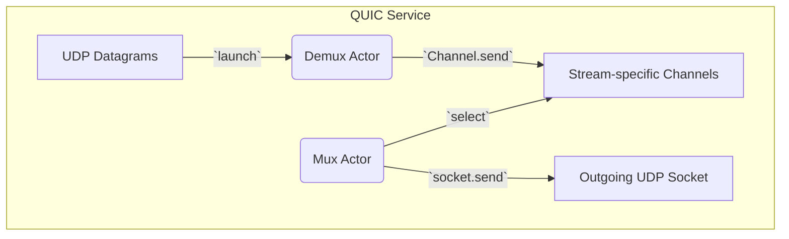
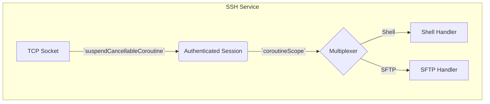
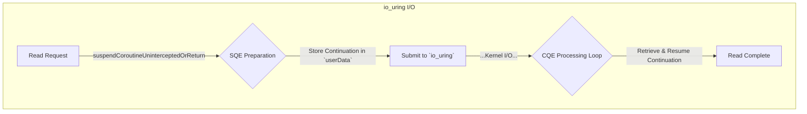

# Production Coroutine & Channel Patterns

This document provides concise, production-ready examples for implementing services using Kotlin coroutines and channels, aligned with the project's refined architectural style. For more detailed explanations and the `HandlerRegistry` pattern, see `COMPOSITIONAL_CONTEXT_PATTERNS.md`.

---

## 1. CouchDB Service with `channelFlow`

```mermaid
flowchart TD
    subgraph "CouchDB Service"
        A[HTTP Request] -->|`suspendCoroutine`| B[Parsed Request]
        B -->|`coroutineContext[...`| C[Database Query]
        C -->|`channelFlow`| D[Document Stream]
        D -->|Backpressure| E[Serialize Response]
    end
```

### Implementation

```kotlin
import borg.trikeshed.lib.*
import kotlinx.coroutines.flow.channelFlow

// Represents a DB connection stored in the coroutine context
data class DbConnection(val conn: Any) : kotlin.coroutines.CoroutineContext.Element {
    override val key = Key
    companion object Key : kotlin.coroutines.CoroutineContext.Key<DbConnection>
}

// Assumes `httpParser` and `buildResponse` are defined elsewhere
suspend fun handleCouchRequest(request: ByteArray): ByteArray {
    // 1. Asynchronously parse the request
    val parsed = suspendCoroutine { cont ->
        httpParser.parseAsync(request) { result -> cont.resume(result) }
    }

    // 2. Access database connection from the context
    val conn = coroutineContext[DbConnection]?.conn
        ?: error("No DB connection in context")

    // 3. Stream results efficiently using a channelFlow
    val docs = channelFlow {
        conn.query(parsed.query).forEach { doc ->
            send(doc) // Suspends if the channel is full (backpressure)
        }
    }

    // 4. Build a response from the stream of documents
    return buildResponse(docs)
}
```

---

## 2. QUIC Service with `select` Multiplexing



### Implementation

```kotlin
import kotlinx.coroutines.*
import kotlinx.coroutines.selects.select
import kotlinx.coroutines.channels.Channel

// A map to hold channels for each QUIC stream ID
val streams = java.util.concurrent.ConcurrentHashMap<Int, Channel<ByteArray>>()

suspend fun handleQuic(socket: DatagramSocket) = coroutineScope {
    // Coroutine for demultiplexing incoming packets
    launch {
        while (isActive) {
            val packet = socket.receive()
            val streamId = parseStreamId(packet)
            // Get or create a channel for the stream and send data to it
            streams.getOrPut(streamId) { Channel(Channel.BUFFERED) }
                .send(packet.data)
        }
    }

    // Coroutine for multiplexing outgoing packets
    launch {
        while (isActive) {
            // `select` waits for the first receive operation to complete
            select<Unit> {
                streams.forEach { (id, channel) ->
                    channel.onReceive { data ->
                        socket.send(buildPacket(id, data))
                    }
                }
            }
        }
    }
}
```

---

## 3. SSH Service with `suspendCancellableCoroutine`



### Implementation

```kotlin
import kotlinx.coroutines.*
import kotlinx.coroutines.channels.Channel

suspend fun handleSsh(socket: Socket) {
    // 1. Authenticate with cancellation support
    val session = suspendCancellableCoroutine { cont ->
        sshAuth.authenticate(socket) { result ->
            if (cont.isActive) {
                if (result.isSuccess) cont.resume(result.session)
                else cont.resumeWithException(result.error)
            }
        }
        // Define cancellation handler
        cont.invokeOnCancellation { sshAuth.cancel() }
    }

    // 2. Set up channel multiplexing within a coroutine scope
    coroutineScope {
        val channels = mutableMapOf<Int, Channel<ByteArray>>()

        // Coroutine to read packets and route them to the correct channel
        launch {
            while (isActive) {
                val packet = session.readPacket()
                channels[packet.channelId]?.send(packet.data)
            }
        }

        // Handler for new channel requests from the client
        session.onChannelOpen { id, type ->
            channels[id] = Channel(Channel.BUFFERED)
            when (type) {
                "shell" -> launch { handleShell(channels.getValue(id)) }
                "sftp"  -> launch { handleSftp(channels.getValue(id)) }
                // etc.
            }
        }
    }
}
```

---

## 4. `io_uring` Integration with Continuations



### Implementation

```kotlin
import kotlin.coroutines.*
import kotlin.coroutines.intrinsics.*

suspend fun readWithUring(fd: Int, size: Int): ByteArray {
    return suspendCoroutineUninterceptedOrReturn { cont ->
        val sqe = ring.getSqe()
        val buffer = ByteBuffer.allocateDirect(size)

        // Prepare a read operation on the submission queue entry (SQE)
        sqe.prepareRead(fd, buffer, 0)
        // CRITICAL: Store the continuation's raw handle in `userData`
        sqe.userData = StoreContinuation(cont)

        ring.submit() // Submit the operation to the kernel
        COROUTINE_SUSPENDED // Suspend the coroutine until the CQE processor resumes it
    }
}

// This runs in a separate, dedicated dispatcher (e.g., Dispatchers.IO)
suspend fun processUringCompletions() {
    while (true) {
        // Wait for a completion queue entry (CQE)
        val cqe = ring.waitCqe()
        // Retrieve the coroutine's continuation from `userData`
        val cont = RetrieveContinuation<ByteArray>(cqe.userData)

        if (cqe.res < 0) { // Error case
            cont.resumeWithException(IOException("Read failed: ${cqe.res}"))
        } else { // Success case
            val buffer = cqe.getBuffer()
            cont.resume(buffer.toByteArray()) // Resume the coroutine with the result
        }

        ring.cqeSeen(cqe) // Mark CQE as processed
    }
}
```