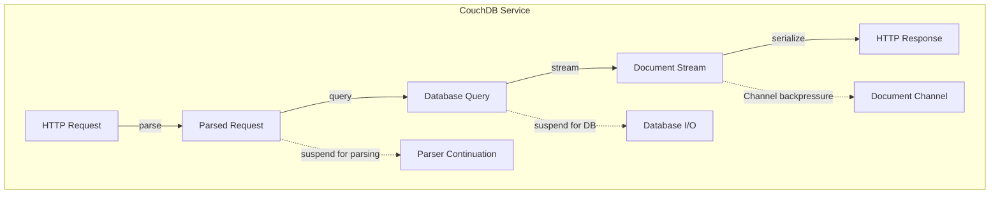
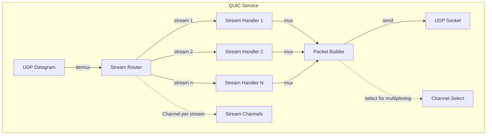
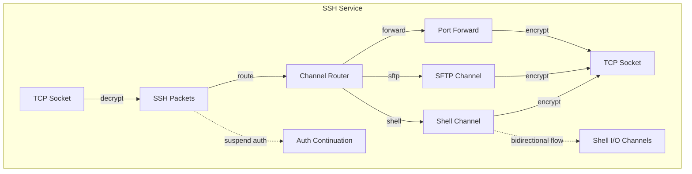
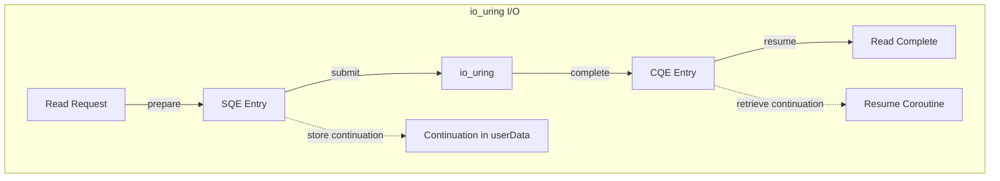

# Channel & Coroutine Patterns - Simple Version

## CouchDB Service



### Implementation
```kotlin
suspend fun handleCouchRequest(request: ByteArray): ByteArray {
    // Parse HTTP
    val parsed = suspendCoroutine { cont ->
        httpParser.parseAsync(request) { result ->
            cont.resume(result)
        }
    }
    
    // Query with connection from context
    val conn = coroutineContext[DbConnection]?.conn 
        ?: error("No DB connection")
    
    // Stream results through channel
    val docs = channelFlow {
        conn.query(parsed.query).forEach { doc ->
            send(doc) // Suspends on backpressure
        }
    }
    
    // Serialize response
    return buildResponse(docs)
}
```

---

## QUIC Service  



### Implementation
```kotlin
suspend fun handleQuic(socket: DatagramSocket) = coroutineScope {
    val streams = ConcurrentHashMap<Int, Channel<ByteArray>>()
    
    // Demux incoming
    launch {
        while (isActive) {
            val packet = socket.receive()
            val streamId = parseStreamId(packet)
            streams.getOrPut(streamId) { Channel() }
                .send(packet.data)
        }
    }
    
    // Mux outgoing
    launch {
        while (isActive) {
            select {
                streams.forEach { (id, channel) ->
                    channel.onReceive { data ->
                        socket.send(buildPacket(id, data))
                    }
                }
            }
        }
    }
}
```

---

## SSH Service



### Implementation
```kotlin
suspend fun handleSsh(socket: Socket) {
    // Auth
    val session = suspendCancellableCoroutine { cont ->
        sshAuth.authenticate(socket) { result ->
            if (result.isSuccess) cont.resume(result.session)
            else cont.resumeWithException(result.error)
        }
    }
    
    // Channel multiplexing
    coroutineScope {
        val channels = mutableMapOf<Int, Channel<ByteArray>>()
        
        // Read loop
        launch {
            while (isActive) {
                val packet = session.readPacket()
                channels[packet.channelId]?.send(packet.data)
            }
        }
        
        // Channel handlers
        session.onChannelOpen { id, type ->
            channels[id] = Channel()
            when (type) {
                "shell" -> launch { handleShell(channels[id]) }
                "sftp" -> launch { handleSftp(channels[id]) }
                "forward" -> launch { handleForward(channels[id]) }
            }
        }
    }
}
```

---

## io_uring Integration



### Implementation
```kotlin
suspend fun readWithUring(fd: Int, size: Int): ByteArray {
    return suspendCoroutineUninterceptedOrReturn { cont ->
        val sqe = ring.getSqe()
        val buffer = ByteBuffer.allocateDirect(size)
        
        sqe.prepareRead(fd, buffer, 0)
        sqe.userData = StoreContination(cont) // Store for completion
        
        ring.submit()
        COROUTINE_SUSPENDED
    }
}

// Completion handler (runs in separate coroutine)
suspend fun processCompletions() {
    while (true) {
        val cqe = ring.waitCqe()
        val cont = RetrieveContinuation<ByteArray>(cqe.userData)
        
        if (cqe.res < 0) {
            cont.resumeWithException(IOException("Read failed: ${cqe.res}"))
        } else {
            val buffer = cqe.getBuffer()
            cont.resume(buffer.toByteArray())
        }
        
        ring.cqeSeen(cqe)
    }
}
```

---

## Common Patterns

### 1. Simple Suspension
```kotlin
suspend fun doAsync(param: String): Result {
    return suspendCoroutine { cont ->
        asyncApi.call(param) { result ->
            cont.resume(result)
        }
    }
}
```

### 2. Channel Backpressure
```kotlin
val channel = Channel<Data>(
    capacity = Channel.BUFFERED,
    onBufferOverflow = BufferOverflow.SUSPEND
)
```

### 3. Context Usage
```kotlin
// Add to context
withContext(DbConnection(conn) + RequestId(id)) {
    doWork()
}

// Access from context
val conn = coroutineContext[DbConnection]?.conn
val reqId = coroutineContext[RequestId]?.id
```

### 4. Streaming with Channels
```kotlin
fun streamData() = channelFlow {
    while (hasMore()) {
        send(readNext()) // Suspends on backpressure
    }
}
```

### 5. Multiplexing with Select
```kotlin
select {
    channel1.onReceive { data ->
        process1(data)
    }
    channel2.onReceive { data ->
        process2(data)  
    }
}
```