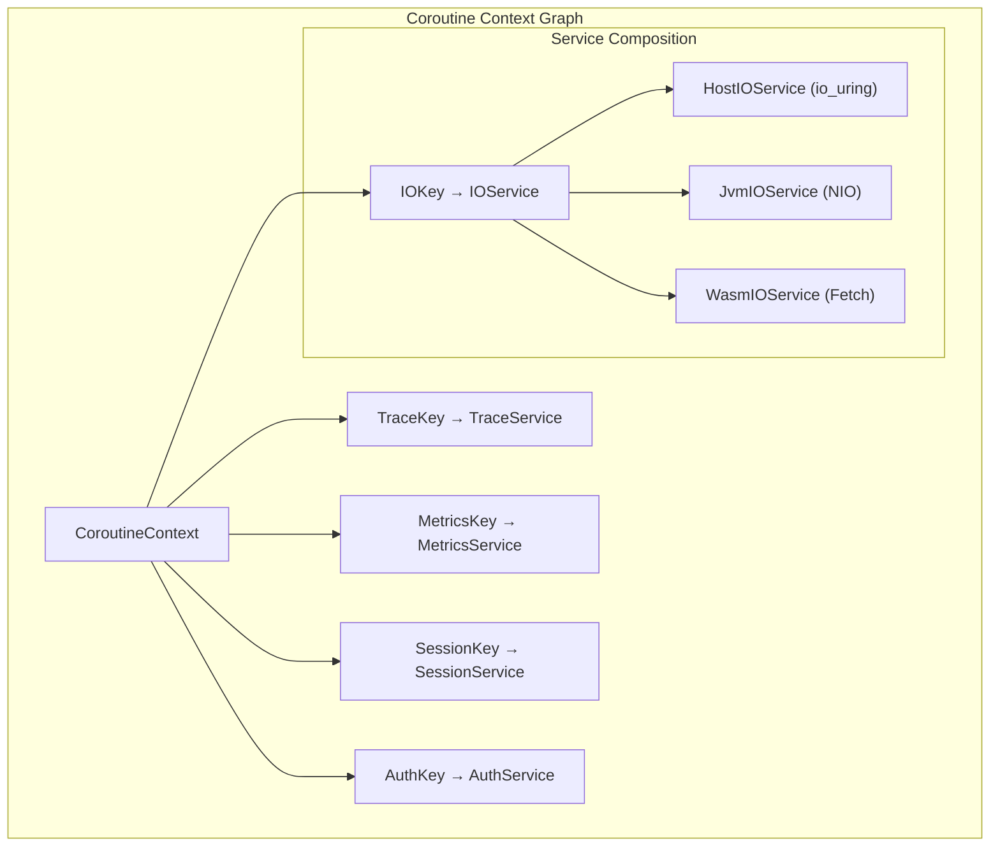

# Coroutine Key Graph Architecture

## Core Architecture: Keys as Service Graph



## Common Language Implementation

```kotlin
// === Common Code (all platforms) ===

// Base service interface
interface KeyedService : CoroutineContext.Element

// Service interfaces
interface TraceService : KeyedService {
    suspend fun trace(operation: String, metadata: Map<String, Any> = emptyMap())
    companion object Key : CoroutineContext.Key<TraceService>
}

interface IOService : KeyedService {
    suspend fun <T> execute(operation: IOOperation<T>): T
    companion object Key : CoroutineContext.Key<IOService>
}

interface MetricsService : KeyedService {
    suspend fun record(metric: String, value: Long, tags: Map<String, String> = emptyMap())
    companion object Key : CoroutineContext.Key<MetricsService>
}

// IO Operations (platform agnostic)
sealed class IOOperation<T> {
    data class Read(val fd: Int, val size: Int) : IOOperation<ByteArray>()
    data class Write(val fd: Int, val data: ByteArray) : IOOperation<Int>()
    data class Accept(val fd: Int) : IOOperation<Connection>()
    data class Connect(val address: String, val port: Int) : IOOperation<Connection>()
}

// Service discovery
suspend inline fun <reified T : KeyedService> currentService(): T? =
    coroutineContext[T::class.companionObjectInstance as CoroutineContext.Key<T>]

suspend inline fun <reified T : KeyedService> requireService(): T =
    currentService<T>() ?: error("No ${T::class.simpleName} in context")
```

## Platform-Specific Implementations

```kotlin
// === Linux/Host Platform (io_uring) ===

class HostIOService(private val ring: IOUring) : IOService {
    override val key = IOService.Key
    
    override suspend fun <T> execute(operation: IOOperation<T>): T = when (operation) {
        is IOOperation.Read -> executeRead(operation)
        is IOOperation.Write -> executeWrite(operation)
        is IOOperation.Accept -> executeAccept(operation)
        is IOOperation.Connect -> executeConnect(operation)
    }
    
    @Suppress("UNCHECKED_CAST")
    private suspend fun <T> executeRead(op: IOOperation.Read): T = 
        suspendCoroutine { cont ->
            ring.prepareSqe { sqe ->
                sqe.prepareRead(op.fd, op.size)
                sqe.userData = cont
            }
            ring.submit()
        } as T
}

// === JVM Platform (NIO) ===

class JvmIOService : IOService {
    override val key = IOService.Key
    
    override suspend fun <T> execute(operation: IOOperation<T>): T = 
        withContext(Dispatchers.IO) {
            when (operation) {
                is IOOperation.Read -> ByteBuffer.allocate(operation.size).apply {
                    // NIO channel read
                }.array() as T
                // ... other operations
            }
        }
}
```

## Service Composition Pattern

```kotlin
// Build context with required services
suspend fun <T> withServices(
    io: IOService,
    trace: TraceService? = null,
    metrics: MetricsService? = null,
    block: suspend CoroutineScope.() -> T
): T = coroutineScope {
    val context = coroutineContext +
        io +
        (trace ?: EmptyCoroutineContext) +
        (metrics ?: EmptyCoroutineContext)
    
    withContext(context) {
        block()
    }
}

// Usage - same code all platforms
suspend fun handleRequest(request: Request) {
    val io = requireService<IOService>()
    val trace = currentService<TraceService>()
    
    trace?.trace("request.start", mapOf("path" to request.path))
    
    val data = io.execute(IOOperation.Read(request.fd, 4096))
    val response = processData(data)
    
    io.execute(IOOperation.Write(request.fd, response))
    trace?.trace("request.end")
}
```

## Platform Bootstrap

```kotlin
// === Host Platform ===
suspend fun main() {
    val ring = IOUring.create()
    val ioService = HostIOService(ring)
    val traceService = JaegerTraceService()
    
    withServices(io = ioService, trace = traceService) {
        runServer()
    }
}

// === JVM Platform (exact same application code) ===
suspend fun main() {
    val ioService = JvmIOService()
    val traceService = ConsoleTraceService()
    
    withServices(io = ioService, trace = traceService) {
        runServer()  // Same runServer() function
    }
}
```

## Key Graph Benefits

1. **Service Discovery**: Services found by key in coroutine context
2. **Platform Abstraction**: Same keys, different implementations
3. **Composition**: Mix and match services as needed
4. **Type Safety**: Compile-time service resolution
5. **Zero Overhead**: No virtual dispatch in hot paths

## Advanced Patterns

```kotlin
// Conditional service enhancement
suspend fun withMetricsIf(condition: Boolean, block: suspend () -> Unit) {
    if (condition && currentService<MetricsService>() == null) {
        withContext(PrometheusMetricsService()) {
            block()
        }
    } else {
        block()
    }
}

// Service interceptors
class TracingIOService(private val delegate: IOService) : IOService {
    override val key = IOService.Key
    
    override suspend fun <T> execute(operation: IOOperation<T>): T {
        val trace = currentService<TraceService>()
        trace?.trace("io.start", mapOf("op" to operation::class.simpleName))
        return try {
            delegate.execute(operation)
        } finally {
            trace?.trace("io.end")
        }
    }
}
```

This architecture provides:
- Common Kotlin code across all platforms
- Platform-optimal implementations (io_uring on Linux, NIO on JVM)
- Clean service discovery via coroutine context keys
- Type-safe, composable service graphs