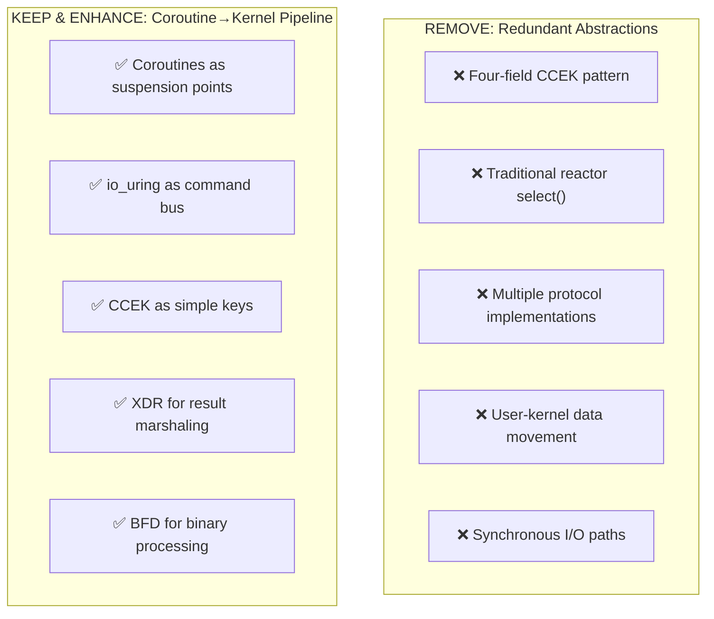
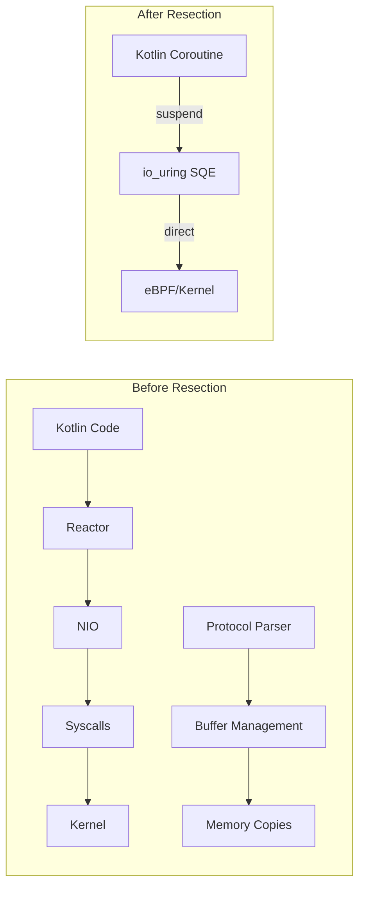

# Endgame Architecture Resection

## The Real Cut: What Actually Gets Removed



## Proper Resection Analysis

### 1. **CCEK Pattern**

```kotlin
// REMOVE: Forced four-field structure
data class CcekContext(
    val control: Control,      // ❌ Artificial
    val context: Context,      // ❌ Redundant
    val environment: Environment, // ❌ Forced
    val knowledge: Knowledge   // ❌ Overthinking
)

// KEEP: Simple coroutine keys
data class KernelOp(val id: Int) : CoroutineContext.Key<KernelOp>
```

### 2. **Reactor → io_uring Native**

```kotlin
// REMOVE: Java NIO-style reactor
interface SelectableChannel {
    fun register(selector: Selector, ops: Int) // ❌
}

// KEEP: Direct io_uring operations
suspend fun ioOperation() = uring.submit { sqe ->
    sqe.prepareRead(fd, buffer, offset)
}
```

### 3. **Protocol Consolidation**

```kotlin
// REMOVE: Separate HTTP/QUIC/SOCKS implementations
// KEEP: Unified protocol engine with eBPF parsing

class UnifiedProtocolEngine {
    // Parse happens in eBPF, Kotlin just coordinates
    suspend fun handle(fd: Int) = uring.submit { sqe ->
        sqe.prepareCmd(EBPF_PROTOCOL_PARSER)
            .withFd(fd)
    }
}
```

## The Correct Resection Principle

**Remove abstractions that hide the kernel interface.**



## Module Resection Strategy

| Module | Action | Rationale |
|--------|--------|-----------|
| trikeshed-lib | **KEEP** | Core types (Join, Indexed) are useful |
| trikeshed-io | **REFACTOR** | Make it pure io_uring wrappers |
| trikeshed-reactor | **REMOVE** | Replaced by io_uring |
| trikeshed-ccek | **SIMPLIFY** | Just CoroutineContext.Key |
| trikeshed-net/* | **MERGE** | One eBPF protocol parser |
| trikeshed-cursor | **ENHANCE** | Direct kernel columnar ops |

## The Surgical Cuts

### 1. **Remove Intermediate Buffers**

```kotlin
// REMOVE: ByteBuffer abstractions
// KEEP: Direct registered buffers with io_uring
```

### 2. **Remove Protocol State Machines**

```kotlin
// REMOVE: HttpStateMachine, QuicStateMachine, SocksStateMachine
// KEEP: Single eBPF program that handles all protocols
```

### 3. **Remove Async Abstractions**

```kotlin
// REMOVE: AsyncChannel, SelectableChannel, SelectionKey
// KEEP: suspend fun + io_uring
```

## What Remains

The entire codebase becomes:

1. **Coroutine suspension points** - Where we wait for kernel
2. **io_uring command builders** - How we talk to kernel
3. **eBPF program loaders** - What runs in kernel
4. **XDR result decoders** - How we get data back

Everything else is removed. The kernel does the work.
        PARSE["Protocol Parsing"]
        DISPATCH["Command Dispatch"]
    end

    subgraph "Kernel (Everything Else)"
        EBPF["eBPF Programs"]
        LSM["LSM Trees"]
        CXL["CXL Memory"]
        DPU["DPU Offload"]
    end
    
    PARSE -->|"io_uring cmd"| EBPF
    DISPATCH -->|"suspend point"| EBPF
    
    style PARSE fill:#fcc
    style DISPATCH fill:#fcc
    style EBPF fill:#cfc
    style LSM fill:#cfc
    style CXL fill:#cfc
    style DPU fill:#cfc

```

## Module Resection List

| Module | Keep | Remove | Transform To |
|--------|------|--------|--------------|
| trikeshed-lib | ✅ | Data processing | Kernel command builders |
| trikeshed-io | ✅ | Read/write logic | io_uring wrappers |
| trikeshed-reactor | ❌ | Everything | Use io_uring directly |
| trikeshed-net | ⚠️ | Protocol handling | Parse → kernel command |
| trikeshed-ccek | ✅ | - | Coroutine→kernel mapping |
| trikeshed-couchdb | ✅ | DB operations | Rename: trikeshed-kernel-db |

## The Final Cut

```kotlin
// This is ALL the userspace code you need:
suspend fun handleRequest(bytes: ByteArray): Response {
    val command = parseMinimal(bytes)  // Minimal parsing
    return kernelExecute(command)       // Everything else in kernel
}

suspend fun kernelExecute(cmd: Command) = suspendCoroutine { cont ->
    uring.prepareCmd(EBPF_PROGRAM_ID)
        .withArgs(cmd)
        .withContinuation(cont)
        .submit()
    COROUTINE_SUSPENDED
}
```

## What's Left After Resection

1. **Thin protocol parsers** - Just enough to build kernel commands
2. **Coroutine suspension points** - Map to kernel operations  
3. **io_uring command builders** - The only syscall interface
4. **eBPF program loaders** - Deploy "stored procedures" to kernel

Everything else runs in the kernel. The userspace is just a control plane.
