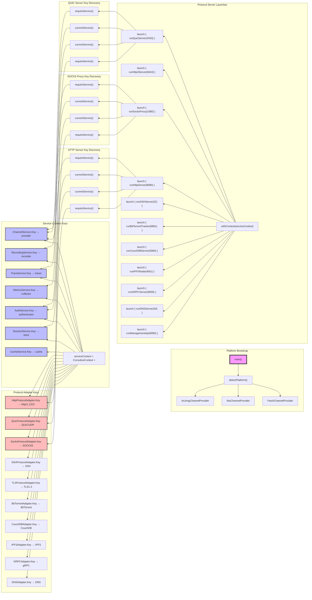
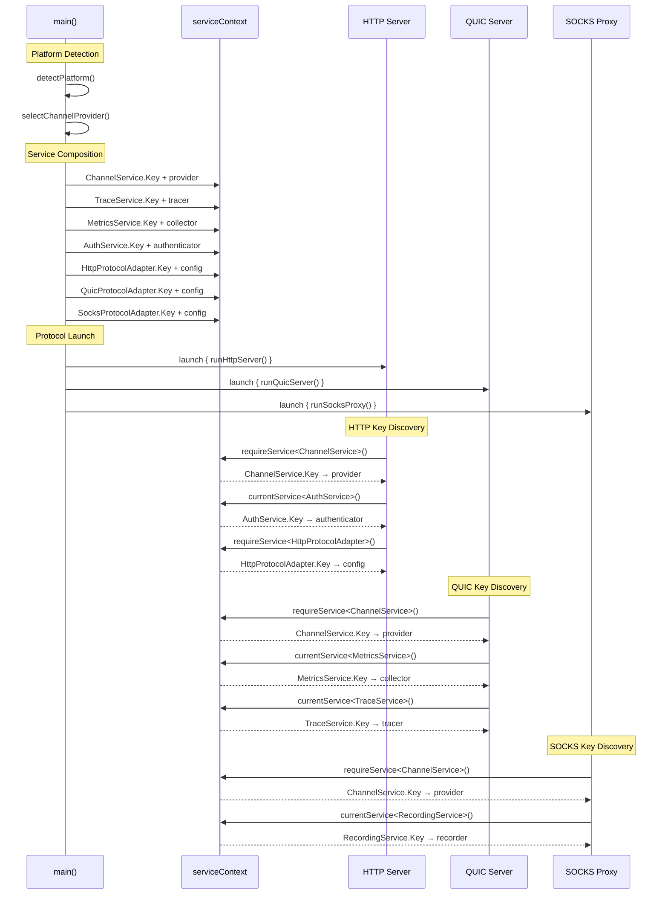
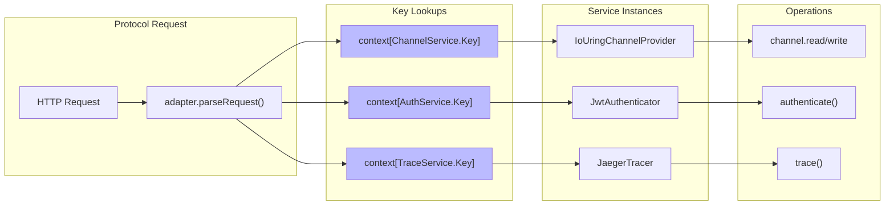

# Key Composition Graph with Key Names

## Complete Key Graph from main()



## Key Resolution Flow



## Channel Operation with Keys



## Key Dependencies Matrix

| Protocol | ChannelService.Key | AuthService.Key | TraceService.Key | MetricsService.Key | RecordingService.Key |
|----------|-------------------|-----------------|------------------|-------------------|---------------------|
| HTTP     | ✅ Required       | 🟡 Optional     | 🟡 Optional      | 🟡 Optional       | ❌ Not used         |
| QUIC     | ✅ Required       | ❌ Not used     | 🟡 Optional      | 🟡 Optional       | ❌ Not used         |
| SOCKS    | ✅ Required       | 🟡 Optional     | ❌ Not used      | ❌ Not used       | 🟡 Optional         |

## Runtime Key Resolution

```kotlin
// Key discovery happens at protocol startup
suspend fun runHttpServer(port: Int) {
    // These resolve to actual instances via key lookup
    val channelService = requireService<ChannelService>()          // ChannelService.Key
    val authService = currentService<AuthService>()               // AuthService.Key?
    val httpAdapter = requireService<HttpProtocolAdapter>()       // HttpProtocolAdapter.Key
    
    // Key-resolved services used throughout request handling
    val serverChannel = channelService.openChannel(config)
    // ...
}
```