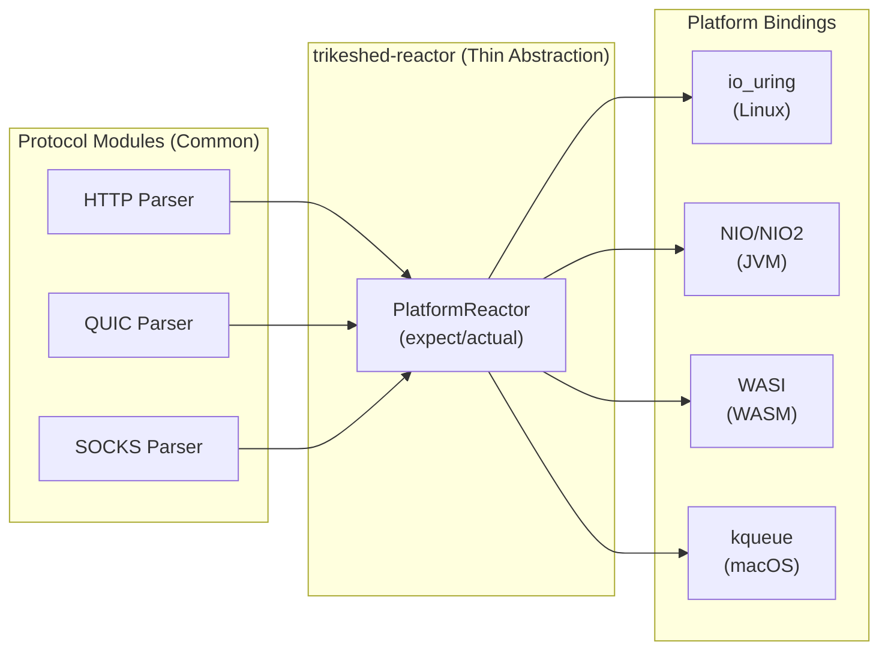

# KMP Endgame Architecture: Platform-Aware Kernel Integration

## The Challenge: One Codebase, Multiple Realities

```mermaid
graph TB
    subgraph "Common Code (KMP)"
        COMMON["Coroutine Abstractions<br/>suspend fun query()"]
    end
    
    subgraph "Platform Implementations"
        subgraph "Linux Native"
            LINUX["io_uring direct<br/>eBPF programs<br/>Zero-copy"]
        end
        
        subgraph "JVM"
            JVM["NIO Channels<br/>CompletableFuture<br/>Fallback reactor"]
        end
        
        subgraph "WASM"
            WASM["JS Promises<br/>WebWorkers<br/>SharedArrayBuffer"]
        end
        
        subgraph "macOS/Windows"
            OTHER["kqueue/IOCP<br/>Platform async"]
        end
    end
    
    COMMON --> LINUX & JVM & WASM & OTHER
```

## The Solution: Platform-Specific Reactors

```kotlin
// Common interface
expect class PlatformReactor {
    suspend fun submitOperation(op: Operation): Result
}

// Linux implementation (io_uring)
actual class PlatformReactor {
    actual suspend fun submitOperation(op: Operation): Result = 
        suspendCoroutine { cont ->
            uring.submit { sqe ->
                sqe.prepareCmd(op.toKernelCmd())
                sqe.userData = cont
            }
        }
}

// JVM implementation (no io_uring)
actual class PlatformReactor {
    private val executor = Executors.newFixedThreadPool(N)
    
    actual suspend fun submitOperation(op: Operation): Result =
        suspendCancellableCoroutine { cont ->
            executor.submit {
                val result = nioOperation(op)
                cont.resume(result)
            }
        }
}
```

## Reactor Separation Strategy



## Command Line on JVM (No io_uring)

```kotlin
// Same API, different implementation
suspend fun main(args: Array<String>) {
    val reactor = PlatformReactor() // Gets JVM implementation
    
    // This code is identical across platforms
    reactor.submitOperation(
        HttpOperation.Parse(request)
    ).collect { result ->
        println(result)
    }
}
```

## The Endgame Resection (Revised)

### Keep (All Platforms)
- Coroutine suspension points
- Protocol parsers (minimal)
- Platform reactor abstraction

### Remove (All Platforms)
- Complex async abstractions
- Buffer management layers
- Protocol state machines

### Platform-Specific
- **Linux**: Direct io_uring + eBPF
- **JVM**: Minimal NIO wrapper
- **WASM**: Promise-based async
- **Native**: Platform event loops

## Module Structure

```
trikeshed-reactor/
├── commonMain/
│   └── PlatformReactor.kt     # expect declarations
├── linuxMain/
│   └── IoUringReactor.kt      # io_uring implementation
├── jvmMain/
│   └── NioReactor.kt          # NIO fallback
├── wasmJsMain/
│   └── JsReactor.kt           # JavaScript promises
└── nativeMain/
    └── NativeReactor.kt       # kqueue/epoll/IOCP
```

## Key Insight

The "endgame" is platform-aware:
- **Linux gets the full kernel database** (io_uring + eBPF)
- **JVM gets efficient fallback** (NIO with coroutines)
- **WASM gets browser-native async** (Promises + Workers)
- **Other platforms get native event loops**

One codebase, optimal per platform.