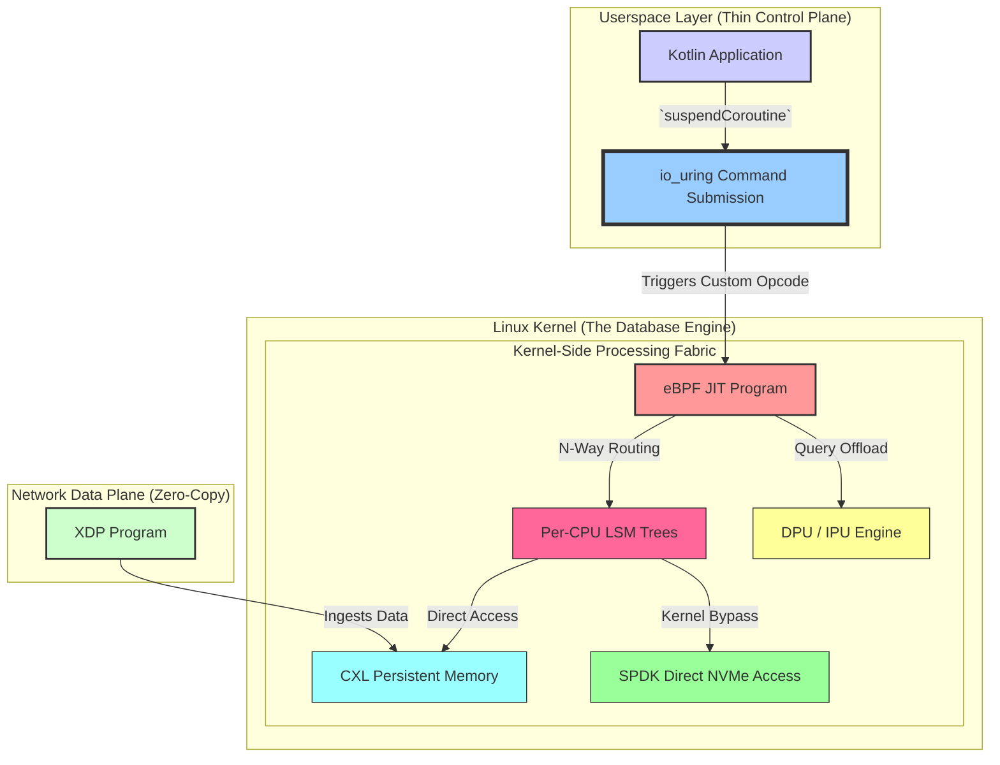

# Linux Endgame: The Kernel as the Database

## Executive Mandate: The Endgame is Now

The core architectural objective is to treat the Linux kernel not merely as an I/O scheduler but as the primary, high-performance database engine. All userspace code, particularly in Kotlin, serves one purpose: to act as an efficient **control plane** that dispatches complex, data-aware logic for execution directly within the kernel via `io_uring` and eBPF. This is not a future "Stage 2"; it is the singular focus of our system design.

This approach eliminates the user-kernel boundary for data processing, achieving true zero-copy performance where data is filtered, aggregated, and processed where it lives: in kernel space, next to the hardware.

---

## Core Technologies: The Inevitable Integration

The following technologies are not separate options but integral, combined components of the final architecture.

| Technology | Role in Endgame Architecture | Status |
| :--- | :--- | :--- |
| **`io_uring`** | The **command submission interface** to the kernel. Used to trigger eBPF programs and custom kernel modules, not just for basic I/O. | ✅ **Canonical** |
| **eBPF** | The **in-kernel JIT runtime**. Provides the safe, programmable "stored procedures" that execute directly on data blocks. | ✅ **Canonical** |
| **DPU/IPU** | The **compaction and query offload engine**. The kernel eBPF programs dispatch compaction/query tasks to specialized hardware. | ✅ **Canonical** |
| **CXL Memory**| The **primary memory tier**. LSM memtables and L0 SSTables reside on CXL, making them persistent and kernel-accessible. | ✅ **Canonical** |
| **SPDK** | The **kernel-bypass storage driver**. Used by kernel-side logic for direct NVMe access, bypassing the block layer entirely. | ✅ **Canonical** |

---

## The Unified Architecture: Kernel as Compute Fabric

The Kotlin `io_uring` interface serves as the entry point into this kernel-level compute fabric.

**1. The eBPF "Stored Procedure" (Conceptual In-Kernel C Code)**
This eBPF program is loaded into the kernel and attached to a custom `io_uring` command.

```c
// THIS IS THE KERNEL JIT. IT IS THE TRUTH.
SEC("uring/cmd")
int bpf_nway_query_router(struct io_uring_cmd *cmd) {
    // 1. Get arguments from the userspace Kotlin code
    u64 key_hash = (u64)cmd->arg1;
    char* user_buffer = (char*)cmd->arg2; // Where to write the final result

    // 2. KERNEL-SIDE N-WAY ROUTING
    u32 tree_id = key_hash % CONFIG_NUM_LSM_TREES;

    // 3. KERNEL-SIDE I/O to LSM TREE (via SPDK)
    // The data never leaves the kernel
    void* sstable_data = spdk_direct_read(lsm_tree_fds[tree_id], key_hash);
    if (!sstable_data) {
        return -EIO; // Error
    }

    // 4. KERNEL-SIDE DATA PROCESSING
    // This BPF program filters/aggregates the data
    char* result = bpf_filter_records(sstable_data, key_hash);

    // 5. COPY ONLY THE FINAL RESULT TO USERSPACE
    copy_to_user(user_buffer, result, strlen(result));

    return 0; // Success
}
```

**2. The Kotlin "Control Plane" Submission Code**
This Kotlin code's *only* job is to dispatch the command to the kernel. All heavy lifting is done by the eBPF program above.

```kotlin
// IORING_OP_URING_CMD is the real opcode to trigger our BPF program.
const val BPF_OP_NWAY_QUERY = 512 // Our custom, registered command ID

// The sole purpose of this function is to trigger the in-kernel logic.
suspend fun executeKernelQuery(ring: IoUring, key: ByteArray): Result<String> {
    // Suspend this coroutine until the kernel's eBPF program is fully done.
    return suspendCoroutineUninterceptedOrReturn { cont ->
        val sqe = ring.getSqe()
        val resultBuffer = allocateResultBuffer() // Allocate buffer for final result

        // 1. Prepare the custom kernel command (IORING_OP_URING_CMD).
        val cmd = sqe.prepareUringCmd(BPF_OP_NWAY_QUERY)

        // 2. Pass arguments to the eBPF program.
        cmd.arg1 = key.xxhash64()             // Hashed key
        cmd.arg2 = resultBuffer.getAddress()  // Pointer to our result buffer

        // 3. The continuation handle IS the transaction ID.
        // It uniquely identifies this request.
        sqe.userData = StoreContinuation(cont)

        // 4. Submit to the kernel and suspend.
        // The coroutine now waits until the BPF program completes.
        ring.submit()
        COROUTINE_SUSPENDED
    }
}
```

---

## Architectural Visualization: The Thanos-Level Integration

The userspace is minimal. All logic radiates from `io_uring` into the hardware-accelerated kernel fabric.



### The Inevitable Data Flow

A single `suspendCoroutineUninterceptedOrReturn` call from Kotlin initiates a complete, in-kernel data processing pipeline:

1.  **Submission**: Kotlin submits a custom command via `io_uring`.
2.  **Dispatch**: The `io_uring` subsystem dispatches to our eBPF program.
3.  **Routing & I/O**: The eBPF program routes the request to the correct LSM Tree, reading data blocks directly from CXL or NVMe via SPDK. **The data does not cross the kernel boundary.**
4.  **Compute**: The eBPF program filters and processes the data, or offloads it to a DPU for heavier computation.
5.  **Result**: **Only the final, tiny result** is copied back to the userspace buffer.
6.  **Resumption**: The `io_uring` completion queue entry (CQE) is posted, and its `userData` is used to find and resume the exact Kotlin coroutine that was suspended in step 1.

This is the canonical pattern. All I/O-related Kotlin code should be built to serve this model.