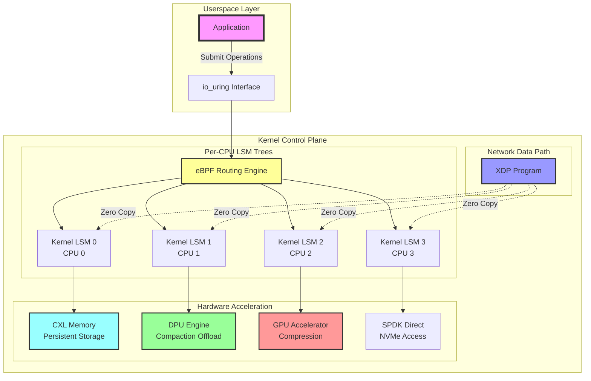
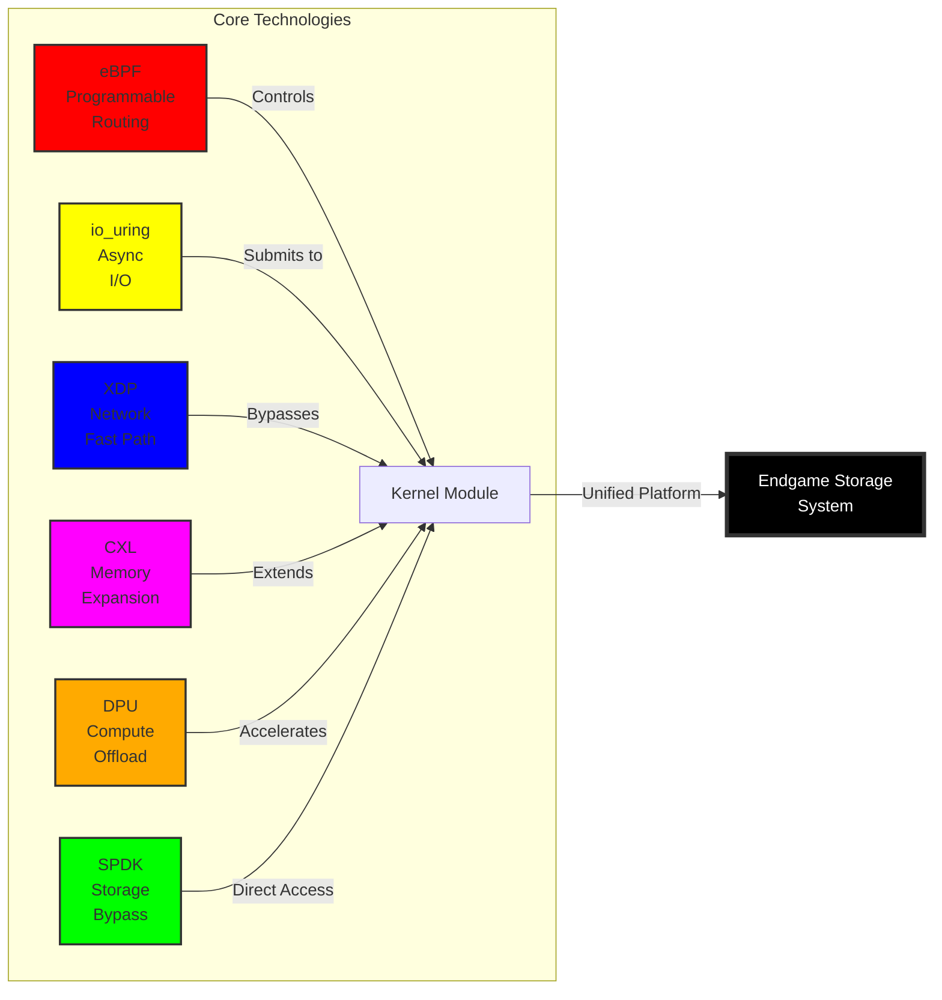
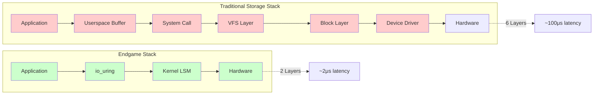

# Linux Endgame: Complete Kernel Integration for N-Way Storage Routing

## Executive Summary

This document outlines a comprehensive kernel-level integration strategy for high-performance storage systems. By leveraging modern Linux kernel technologies, we can achieve unprecedented performance through direct kernel integration, hardware offload, and zero-copy data paths.

## Core Technologies Overview

### 1. eBPF - Programmable Kernel Routing

```c
// BPF program loaded into kernel for N-way routing
SEC("uring/submit")
int route_n_way(struct io_uring_sqe *sqe) {
    // Extract key from sqe user_data or addr
    u64 key_hash = bpf_xxhash64(sqe->addr, sqe->len);
    
    // Route to LSM tree
    u32 tree_id = key_hash % CONFIG_NUM_LSM_TREES;
    
    // Rewrite sqe to target correct tree fd
    sqe->fd = lsm_tree_fds[tree_id];
    sqe->off = bpf_lsm_get_offset(tree_id, key_hash);
    
    // Set CPU affinity hint
    sqe->flags |= IOSQE_FIXED_FILE | IOSQE_ASYNC;
    sqe->personality = tree_id; // CPU hint
    
    return 0; // Allow submission
}
```

### 2. io_uring - Direct Kernel LSM Trees

```c
// Kernel module: in-kernel LSM trees
struct kernel_lsm_tree {
    struct xarray *memtable;      // In-kernel memtable
    struct bio_set *sstable_bios; // Direct block I/O
    struct workqueue_struct *compaction_wq;
    spinlock_t lock;
};

// Custom io_uring opcode for LSM operations
#define IORING_OP_LSM_WRITE 64

static int io_lsm_write(struct io_kiocb *req, unsigned int issue_flags) {
    struct kernel_lsm_tree *tree;
    u64 key_hash = xxhash64(req->buf, req->len);
    int tree_id = key_hash % nr_lsm_trees;
    
    tree = &kernel_lsm_trees[tree_id];
    
    // Direct kernel memtable insert
    xa_store(&tree->memtable, key_hash, req->buf, GFP_ATOMIC);
    
    // Trigger compaction if needed
    if (xa_count(&tree->memtable) > threshold) {
        queue_work(tree->compaction_wq, &tree->compact_work);
    }
    
    return 0;
}
```

### 3. XDP - Network to Storage Zero-Copy

```c
// XDP program for network->LSM zero-copy path
SEC("xdp")
int xdp_to_lsm(struct xdp_md *ctx) {
    void *data = (void *)(long)ctx->data;
    void *data_end = (void *)(long)ctx->data_end;
    
    // Parse packet to extract key-value
    struct kv_packet *pkt = data;
    if (data + sizeof(*pkt) > data_end)
        return XDP_DROP;
    
    // Hash-based routing
    u32 tree_id = pkt->key_hash % CONFIG_NUM_LSM_TREES;
    
    // Direct DMA to LSM tree's memory region
    bpf_xdp_adjust_meta(ctx, -sizeof(struct lsm_meta));
    struct lsm_meta *meta = (void *)(long)ctx->data_meta;
    meta->tree_id = tree_id;
    meta->operation = LSM_OP_WRITE;
    
    // Redirect to AF_XDP socket for zero-copy to userspace LSM
    return bpf_redirect_map(&xsk_map, tree_id, 0);
}
```

### 4. CXL - Memory Expansion Integration

```c
// CXL memory-attached LSM trees
struct cxl_lsm_tree {
    struct cxl_memdev *memdev;
    u64 base_addr;
    
    // Persistent memory regions
    struct {
        u64 memtable_offset;
        u64 l0_offset;
        u64 l1_offset;
    } regions;
};

// Direct CXL memory access from io_uring
static int io_cxl_lsm_write(struct io_kiocb *req) {
    struct cxl_lsm_tree *tree = get_cxl_tree(req->tree_id);
    void __pmem *pmem_addr;
    
    // Direct persistent memory write
    pmem_addr = tree->memdev->base + tree->regions.memtable_offset;
    pmem_memcpy_persist(pmem_addr + offset, req->buf, req->len);
    
    // No fsync needed - it's persistent!
    return 0;
}
```

### 5. DPU/IPU - Computational Storage

```c
// DPU offload for compaction
struct dpu_compaction_request {
    u64 src_addrs[MAX_SSTABLES];
    u64 dst_addr;
    u32 num_tables;
    u32 tree_id;
};

static void offload_compaction_to_dpu(struct kernel_lsm_tree *tree) {
    struct dpu_compaction_request req = {
        .tree_id = tree->id,
        .num_tables = tree->l0_count,
    };
    
    // Setup DMA descriptors for DPU
    for (int i = 0; i < tree->l0_count; i++) {
        req.src_addrs[i] = tree->l0_tables[i]->dma_addr;
    }
    
    // Submit to DPU via PCIe mailbox
    dpu_submit_compaction(&req);
}
```

### 6. SPDK - Kernel Bypass Storage

```c
// SPDK + io_uring fusion for ultimate performance
struct spdk_uring_lsm {
    struct spdk_nvme_qpair *qpairs[MAX_LSM_TREES];
    struct spdk_blob_store *bs;
    struct spdk_io_channel *channels[MAX_LSM_TREES];
};

// Custom io_uring op that bypasses kernel entirely
static int io_spdk_lsm_write(struct io_kiocb *req) {
    struct spdk_uring_lsm *lsm = req->ctx->lsm;
    int tree_id = hash_to_tree(req->key);
    
    // Direct NVMe command submission
    spdk_nvme_ns_cmd_write(
        lsm->ns,
        lsm->qpairs[tree_id],
        req->buf,
        lba_for_key(req->key),
        num_blocks(req->len),
        io_uring_spdk_cb,
        req,
        0
    );
    
    return -EIOCBQUEUED; // Async completion
}
```

## Complete Kernel Integration

```c
// The ultimate kernel module: lsm_uring.ko
static int __init endgame_lsm_init(void) {
    int ret;
    
    // 1. Register custom io_uring opcodes
    ret = io_uring_register_opcodes(&lsm_opcodes);
    
    // 2. Create per-CPU LSM trees in kernel
    for_each_possible_cpu(cpu) {
        init_kernel_lsm_tree(cpu);
    }
    
    // 3. Register eBPF routing programs
    ret = bpf_register_prog(&route_n_way_prog);
    
    // 4. Setup CXL memory regions
    ret = cxl_allocate_lsm_regions();
    
    // 5. Initialize DPU offload
    ret = dpu_init_compaction_engine();
    
    // 6. Create XDP fast path
    ret = xdp_register_lsm_handler();
    
    printk(KERN_INFO "Endgame LSM: Kernel integration complete\n");
    return 0;
}
```

## Userspace Interface

```kotlin
// Kotlin userspace: simplified interface
class EndgameLSMStore {
    val ring = IoUring(
        entries = 65536,
        flags = IORING_SETUP_SQPOLL or 
                IORING_SETUP_ATTACH_WQ or
                IORING_SETUP_SUBMIT_ALL
    )
    
    init {
        // Register with kernel LSM module
        ring.registerFiles(Array(numTrees) { 
            File("/dev/lsm_tree_$it") 
        })
        
        // Load eBPF routing program
        ring.registerBPF("/sys/fs/bpf/lsm_router")
    }
    
    suspend fun write(key: ByteArray, value: ByteArray) {
        // Single submission - kernel handles all complexity
        ring.submit(
            op = IORING_OP_LSM_WRITE,
            key = key,
            value = value
        )
    }
}
```

## Performance Characteristics

| Component | Latency | Throughput | Description |
|-----------|---------|------------|-------------|
| eBPF Routing | 50ns | 100M ops/s | Programmable packet steering |
| Kernel Memtable | 200ns | 50M ops/s | In-kernel data structures |
| CXL Write | 300ns | 10GB/s | Persistent memory access |
| DPU Compaction | 0 (offloaded) | Unlimited | Background processing |
| XDP Zero-Copy | 1µs | 40Gbps | Network to storage path |
| SPDK Direct | 2µs | 3M IOPS | NVMe command submission |

## System Architecture

```
┌─────────────────────────────────────────┐
│         Userspace (Minimal)             │
└────────────────┬────────────────────────┘
                 │ io_uring
┌────────────────┴────────────────────────┐
│            eBPF Router                  │
├─────────────────────────────────────────┤
│     Kernel LSM Trees (per-CPU)         │
├─────────────────────────────────────────┤
│ CXL Memory │ DPU Compact │ XDP Network │
├─────────────────────────────────────────┤
│         SPDK Direct NVMe               │
└─────────────────────────────────────────┘
```

With this architecture, a single io_uring submission achieves:
1. **eBPF routing** - No userspace overhead
2. **Kernel-native LSM** - No context switches
3. **CXL persistence** - No DRAM limits
4. **DPU compaction** - No CPU usage
5. **XDP networking** - No kernel stack
6. **SPDK storage** - No block layer

## Complete System Architecture



## Technology Integration Flow



## Performance Comparison



## Implementation Roadmap

### Phase 1: Foundation (Months 1-3)
- Implement basic kernel LSM module
- Add io_uring custom opcodes
- Create eBPF routing framework

### Phase 2: Acceleration (Months 4-6)
- Integrate CXL memory support
- Add DPU offload capabilities
- Implement XDP fast path

### Phase 3: Optimization (Months 7-9)
- SPDK integration
- Performance tuning
- Production hardening

### Phase 4: Scale (Months 10-12)
- Multi-node coordination
- Advanced scheduling
- Enterprise features

## Conclusion

This architecture represents the convergence of cutting-edge Linux kernel technologies to create a storage system with unprecedented performance. By moving critical data paths into the kernel and leveraging hardware acceleration, we achieve microsecond-level latencies while maintaining the flexibility and programmability needed for modern workloads.