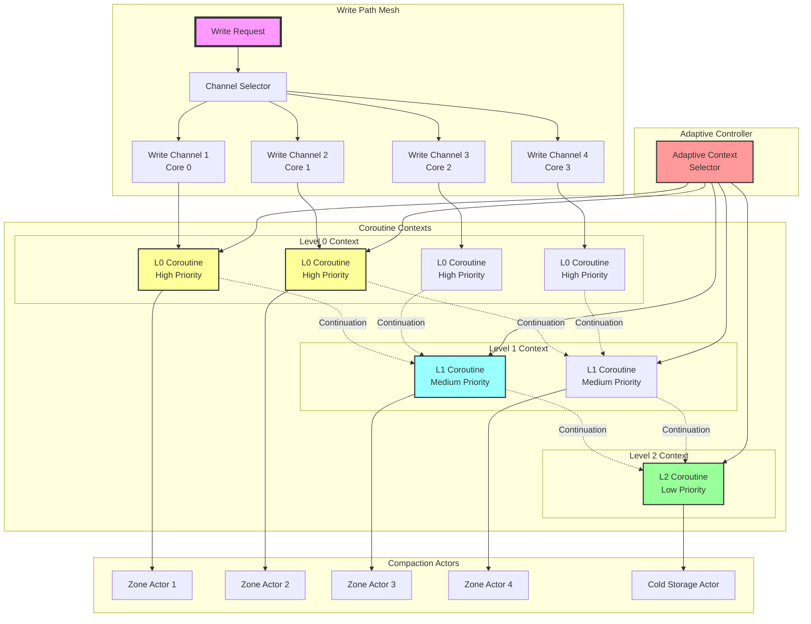
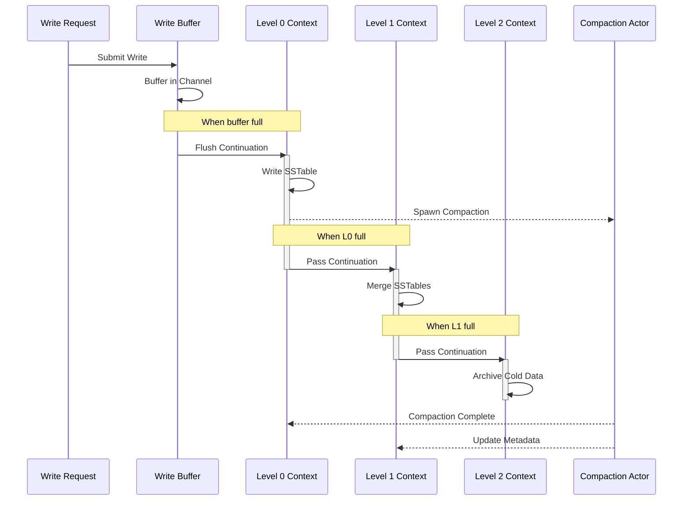

# LSM as Coroutine Context Mesh

## The Core Insight: LSM = Coroutine Coordination Pattern

LSM trees aren't just a data structure - they're a **coroutine coordination mesh** where:
- Each level is a coroutine context
- Compaction is context switching
- Data flows through continuation chains

## LSM as Coroutine Contexts

```kotlin
// Each LSM level is a coroutine context
class LSMCoroutineMesh {
    // Level contexts with different priorities
    val levelContexts = Indexed<CoroutineContext> { level ->
        // Higher levels = lower priority, larger batches
        CoroutineName("LSM-L$level") +
        Dispatchers.IO.limitedParallelism(1) +
        CompactionContext(
            priority = Priority.LOW - level,
            batchSize = 10.pow(level)
        )
    }
    
    // Write path: high priority context
    val writeContext = CoroutineName("LSM-Write") +
                      Dispatchers.Default +
                      WriteBufferContext(flushThreshold = 32.MB)
    
    // Compaction coordinator mesh
    val compactionMesh = SupervisorJob() +
                        CoroutineName("LSM-Mesh") +
                        CompactionCoordinator()
}
```

## Compaction as Continuation Passing

```kotlin
// Compaction is just continuation passing between contexts
class CompactionContinuation {
    suspend fun compact() = coroutineScope {
        // Each level spawns its compaction in its own context
        levelContexts.mapIndexed { level, context ->
            async(context) {
                // Continuation passes data to next level
                val data = receiveFromLevel(level)
                val compacted = mergeSort(data)
                
                // Pass continuation to next level
                if (level < maxLevel) {
                    sendToLevel(level + 1, compacted)
                }
            }
        }
    }
}
```

## Write Buffers as Channel Mesh

```kotlin
class WriteBufferMesh {
    // Multiple write channels (coroutine mesh)
    val writeChannels = Indexed<Channel<WriteOp>>(numCores) {
        Channel<WriteOp>(capacity = 1024)
    }
    
    // Flush coordination via select
    suspend fun flushCoordinator() = coroutineScope {
        while (isActive) {
            select<Unit> {
                writeChannels.forEachIndexed { idx, channel ->
                    channel.onReceiveCatching { result ->
                        if (shouldFlush(idx)) {
                            launchFlush(idx)
                        }
                    }
                }
            }
        }
    }
}
```

## LSM Strategies as Context Policies

```kotlin
// Each compaction strategy is a coroutine context element
sealed class CompactionPolicy : CoroutineContext.Element {
    companion object Key : CoroutineContext.Key<CompactionPolicy>
    override val key get() = Key
    
    object Leveled : CompactionPolicy() {
        override suspend fun compact() = withContext(Dispatchers.IO) {
            // Level-by-level coordination
        }
    }
    
    object Tiered : CompactionPolicy() {
        override suspend fun compact() = supervisorScope {
            // Parallel tier compactions
        }
    }
    
    object FIFO : CompactionPolicy() {
        override suspend fun compact() = withContext(Dispatchers.Default) {
            // Time-based eviction
        }
    }
}
```

## Zone Compaction as Actor Mesh

```kotlin
// Each zone is an actor in the mesh
class ZoneCompactionMesh {
    // Actor per zone
    val zoneActors = Indexed<CompactionActor>(zoneCount) { zoneId ->
        CompactionActor(
            zoneId = zoneId,
            context = Dispatchers.IO.limitedParallelism(1)
        )
    }
    
    // Coordination via message passing
    fun coordinateCompaction() = flow {
        while (currentCoroutineContext().isActive) {
            // Round-robin messages to zone actors
            val zone = (currentZone++) % zoneCount
            zoneActors[zone].send(CompactZone)
            emit(zone)
            delay(compactionInterval)
        }
    }
}
```

## Hot/Cold as Context Hierarchies

```kotlin
// Temperature-based context switching
class TemperatureContextMesh {
    val hotContext = Dispatchers.IO + 
                     ThreadPoolDispatcher(4) +
                     CompactionPriority.HIGH
    
    val coldContext = Dispatchers.IO.limitedParallelism(1) +
                      CompactionPriority.LOW
    
    suspend fun routeByTemperature(data: SSTable) {
        val context = if (data.isHot()) hotContext else coldContext
        
        withContext(context) {
            compact(data)
        }
    }
}
```

## Adaptive Strategy as Context Selection

```kotlin
// Dynamic context selection based on workload
class AdaptiveContextMesh {
    val contextSelector = flow {
        while (currentCoroutineContext().isActive) {
            val signals = collectSignals()
            val optimalContext = when {
                signals.writeHeavy -> tieredContext
                signals.readHeavy -> leveledContext
                signals.timeSeries -> fifoContext
                else -> universalContext
            }
            emit(optimalContext)
            delay(adaptationInterval)
        }
    }.shareIn(GlobalScope, SharingStarted.Lazily, replay = 1)
}
```

## The Full Mesh Architecture

```kotlin
class LSMCoroutineStorage : CoroutineScope {
    override val coroutineContext = 
        SupervisorJob() +
        CoroutineName("LSM-Storage") +
        CoroutineExceptionHandler { _, e ->
            log.error("LSM mesh error", e)
        }
    
    // Write mesh - fan out
    val writeMesh = WriteBufferMesh()
    
    // Compaction mesh - hierarchical  
    val compactionMesh = LSMCoroutineMesh()
    
    // Zone mesh - spatial
    val zoneMesh = ZoneCompactionMesh()
    
    // Temperature mesh - temporal
    val tempMesh = TemperatureContextMesh()
    
    // Adaptive mesh - meta
    val adaptiveMesh = AdaptiveContextMesh()
    
    // Start the mesh
    fun start() = launch {
        launch { writeMesh.flushCoordinator() }
        launch { compactionMesh.compact() }
        launch { zoneMesh.coordinateCompaction().collect() }
        launch { adaptiveMesh.contextSelector.collect() }
    }
}
```

## Why This Is Powerful

1. **Natural Parallelism** - Each level/zone is independent coroutine
2. **Backpressure** - Channels handle flow control
3. **Priority Scheduling** - Context elements define priority
4. **Failure Isolation** - SupervisorJob prevents cascade failures
5. **Dynamic Adaptation** - Context switching based on workload
6. **Composable** - Contexts compose naturally

The LSM tree becomes a living coroutine mesh where data flows through contexts, transforming at each level!

## Coroutine Mesh Architecture



## Context Flow Sequence

