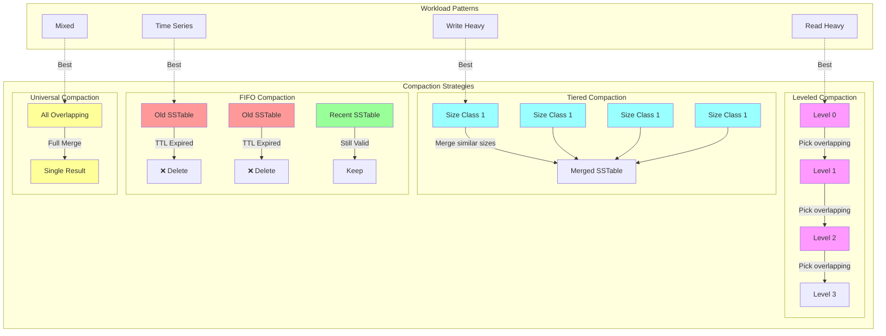
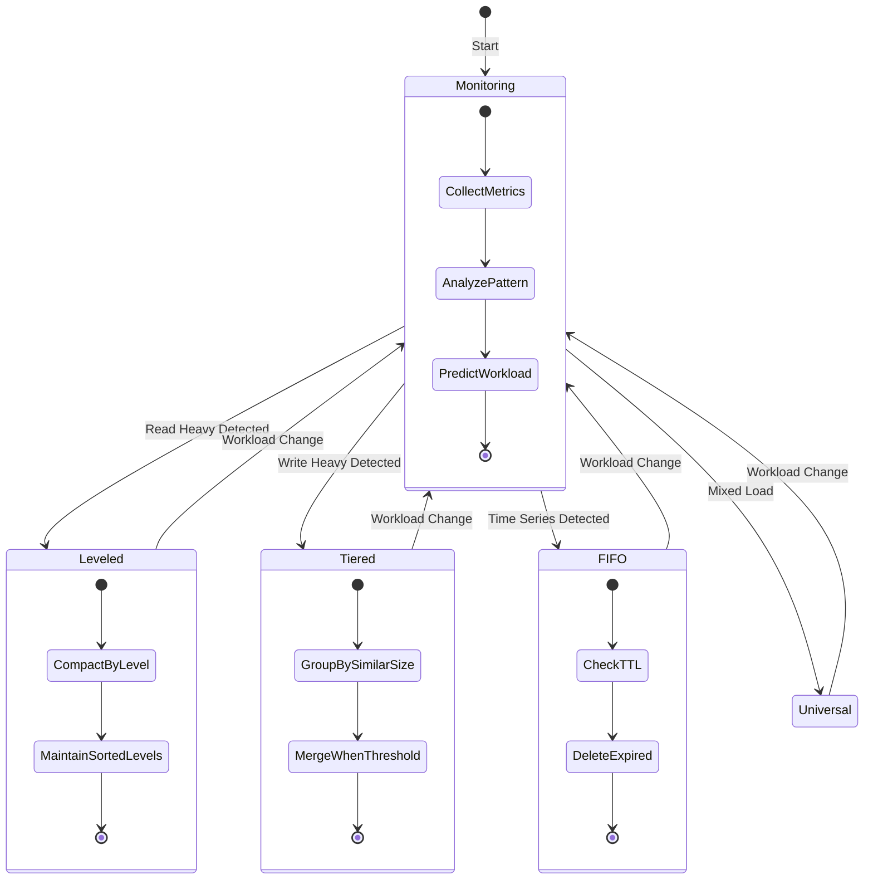

# LSM Tree Strategies for TrikeShed Columnar Storage

> **RETIRED**: This document has been superseded by TDD tests and detailed specifications.
> 
> - **TDD Tests**: See `tests/tdd/LSMStrategiesTDDTest.kt` for implementation requirements
> - **Technical Specification**: See `docs/storage/LSM_COMPACTION_STRATEGIES.md` for detailed specs
> - **Background**: LSM trees require efficient compaction strategies to manage write amplification, space amplification, and read performance
>
> This document is preserved for historical reference only. All development should reference the TDD tests and specification documents.

---

**Original Content (Retired):**

## Core LSM Strategies

### 1. Leveled Compaction (RocksDB/LevelDB Style)

```kotlin
class LeveledCompactionStrategy {
    // Each level has fixed size ratio (typically 10x)
    val levelSizeRatio = 10
    
    // Compact when level exceeds target size
    fun shouldCompact(level: Int): Boolean {
        val targetSize = baseLevelSize * levelSizeRatio.pow(level)
        return levels[level].totalSize > targetSize
    }
    
    // Pick files with overlapping key ranges
    fun pickFilesToCompact(level: Int): Indexed<SSTable> {
        val currentLevel = levels[level]
        val nextLevel = levels[level + 1]
        
        // Find overlapping ranges for merge
        return currentLevel.files.filter { file ->
            nextLevel.hasOverlappingRange(file.keyRange)
        }.toIndexed()
    }
}
```

**Pros**: Predictable space amplification (~1.1x)  
**Cons**: Higher write amplification (10-30x)  
**Best for**: Read-heavy workloads

### 2. Tiered Compaction (Cassandra Style)

```kotlin
class TieredCompactionStrategy {
    // Merge files of similar size
    val tierThreshold = 4 // Merge when 4 files of similar size
    
    fun pickFilesToCompact(): Indexed<SSTable> {
        // Group files by size buckets
        val sizeBuckets = files.groupBy { 
            log2(it.size).toInt() // Size class
        }
        
        // Find tier with enough files
        return sizeBuckets.values
            .firstOrNull { it.size >= tierThreshold }
            ?.toIndexed() ?: emptyIndexed()
    }
}
```

**Pros**: Lower write amplification (2-10x)  
**Cons**: Higher space amplification (~2x)  
**Best for**: Write-heavy workloads

### 3. FIFO Compaction (Time-Series Optimized)

```kotlin
class FIFOCompactionStrategy {
    val ttl = 7.days
    
    fun compact() {
        // Simply delete old files, no merge needed!
        val cutoff = now() - ttl
        levels.forEach { level ->
            level.files.removeAll { 
                it.oldestTimestamp < cutoff 
            }
        }
    }
}
```

**Pros**: Zero write amplification!  
**Cons**: Only works for time-series data  
**Best for**: Logs, metrics, time-series

### 4. Universal Compaction (RocksDB Alternative)

```kotlin
class UniversalCompactionStrategy {
    // Compact based on space amplification ratio
    val spaceAmpRatioTrigger = 1.25
    
    fun shouldCompact(): Boolean {
        val totalSize = levels.sumOf { it.totalSize }
        val uniqueKeySize = estimateUniqueKeySize()
        return totalSize / uniqueKeySize > spaceAmpRatioTrigger
    }
    
    // Merge all overlapping files at once
    fun compact() {
        val overlappingSets = findOverlappingSets()
        overlappingSets.forEach { set ->
            mergeFiles(set) // Full merge
        }
    }
}
```

**Pros**: Bounded space amplification  
**Cons**: Spiky I/O patterns  
**Best for**: Mixed workloads

## Columnar-Specific LSM Strategies

### 5. Column-Aware Compaction

```kotlin
class ColumnarLSMStrategy {
    // Different strategy per column type
    val columnStrategies = mapOf(
        "timestamp" to FIFOCompactionStrategy(),
        "user_id" to LeveledCompactionStrategy(),
        "metrics" to TieredCompactionStrategy()
    )
    
    // Coordinate compactions across columns
    fun coordinatedCompaction() {
        // Find columns that need compaction
        val needsCompaction = columns.filter { col ->
            col.strategy.shouldCompact()
        }
        
        // Batch compactions for I/O efficiency
        if (needsCompaction.size >= minBatchSize) {
            runBatchCompaction(needsCompaction)
        }
    }
}
```

### 6. Zone-Based Compaction (For TrikeShed ISAM)

```kotlin
class ZoneCompactionStrategy {
    // Divide keyspace into zones
    val zoneCount = 256
    
    // Compact one zone at a time
    fun compactZone(zoneId: Int) {
        val zoneRange = getZoneKeyRange(zoneId)
        val zoneFiles = files.filter { 
            it.keyRange.overlaps(zoneRange) 
        }
        
        // Merge only within zone
        val merged = mergeFiles(zoneFiles, zoneRange)
        writeISAMFormat(merged, zoneId)
    }
    
    // Round-robin through zones
    fun incrementalCompaction() {
        val zone = (currentZone++) % zoneCount
        compactZone(zone)
    }
}
```

### 7. Adaptive Compaction (ML-Driven)

```kotlin
class AdaptiveCompactionStrategy {
    val model = CompactionPredictor()
    
    data class WorkloadSignals(
        val writeRate: Double,
        val readRate: Double,
        val spaceAmp: Double,
        val readLatencyP99: Double
    )
    
    fun pickStrategy(): CompactionStrategy {
        val signals = collectSignals()
        
        return when (model.predict(signals)) {
            WorkloadType.WRITE_HEAVY -> TieredCompactionStrategy()
            WorkloadType.READ_HEAVY -> LeveledCompactionStrategy()
            WorkloadType.TIME_SERIES -> FIFOCompactionStrategy()
            WorkloadType.MIXED -> UniversalCompactionStrategy()
        }
    }
}
```

## Hybrid Strategies for Production

### 8. Hot/Cold Separation

```kotlin
class HotColdCompactionStrategy {
    // Recent data: aggressive compaction
    val hotStrategy = LeveledCompactionStrategy(
        levelSizeRatio = 4 // Smaller levels
    )
    
    // Old data: lazy compaction
    val coldStrategy = TieredCompactionStrategy(
        tierThreshold = 10 // Larger batches
    )
    
    fun compact(file: SSTable) {
        val age = now() - file.createdAt
        if (age < hotThreshold) {
            hotStrategy.compact(file)
        } else {
            coldStrategy.compact(file)
        }
    }
}
```

### 9. Priority-Based Compaction

```kotlin
class PriorityCompactionStrategy {
    val compactionQueue = PriorityQueue<CompactionJob> { a, b ->
        // Priority formula
        val scoreA = a.spaceWaste * a.readHeat / a.estimatedCost
        val scoreB = b.spaceWaste * b.readHeat / b.estimatedCost
        scoreB.compareTo(scoreA)
    }
    
    fun scheduleCompactions() {
        // Add all potential compactions
        levels.forEach { level ->
            level.files.forEach { file ->
                compactionQueue.add(analyzeFile(file))
            }
        }
        
        // Run top priority compactions
        while (hasIOBudget() && compactionQueue.isNotEmpty()) {
            val job = compactionQueue.poll()
            runCompaction(job)
        }
    }
}
```

### 10. Write-Buffer Aware Strategy

```kotlin
class WriteBufferAwareStrategy {
    // Multiple write buffers for parallelism
    val writeBuffers = Indexed<MemTable>(numCores) {
        MemTable(size = 32.MB)
    }
    
    // Flush coordination
    fun coordinatedFlush() {
        // Find buffers nearing capacity
        val nearFull = writeBuffers.filter { 
            it.usage > 0.8 
        }
        
        if (nearFull.size >= 2) {
            // Batch flush for I/O efficiency
            val merged = mergeSortedBuffers(nearFull)
            val sstable = merged.toSSTable()
            level0.add(sstable)
            nearFull.forEach { it.clear() }
        }
    }
}
```

## Choosing the Right Strategy

```kotlin
fun recommendStrategy(workload: WorkloadProfile): CompactionStrategy {
    return when {
        // Time-series data with TTL
        workload.hasTimeBasedDeletion -> FIFOCompactionStrategy()
        
        // Write-heavy with relaxed consistency
        workload.writeRatio > 0.8 -> TieredCompactionStrategy()
        
        // Read-heavy with tight SLA
        workload.readLatencyP99 < 10.ms -> LeveledCompactionStrategy()
        
        // Large dataset with hot/cold pattern
        workload.dataSize > 1.TB && workload.hasTemporalLocality -> 
            HotColdCompactionStrategy()
        
        // Default balanced approach
        else -> UniversalCompactionStrategy()
    }
}
```

## Implementation Tips

1. **Start with Leveled** - Most predictable behavior
2. **Monitor write amplification** - Switch to Tiered if > 20x
3. **Use FIFO for time-series** - Massive efficiency gain
4. **Consider hybrid approaches** - Different strategies for different data
5. **Batch compactions** - Amortize I/O costs
6. **Zone-based for large data** - Incremental progress
7. **Adaptive for multi-tenant** - Let the system learn

The key is matching the compaction strategy to your workload pattern!

## Strategy Comparison Diagram



## Adaptive Strategy State Machine


