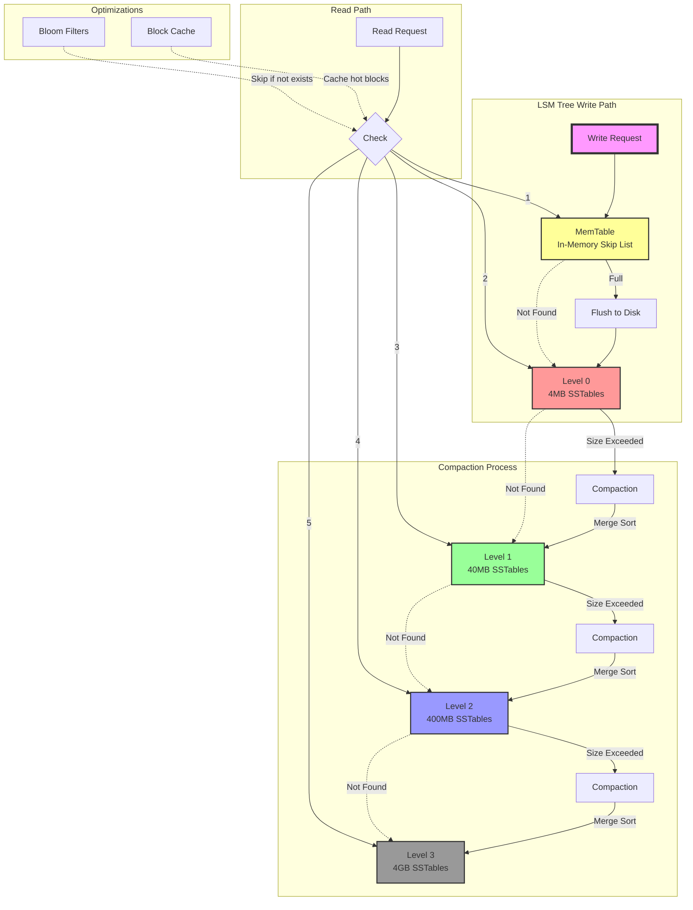

# LSM Trees Explained: Log-Structured Merge Trees

## What is an LSM Tree?

LSM (Log-Structured Merge) trees are a write-optimized data structure that turns random writes into sequential writes. Think of it as a multi-level cache that periodically merges down.

## The Core Idea

Instead of updating data in-place (like B+ trees), LSM trees:
1. **Buffer writes in memory** (MemTable)
2. **Flush to disk sequentially** when full
3. **Merge sorted files** in background

```kotlin
// Simplified LSM structure
class LSMTree {
    // Level 0: In-memory buffer (fast writes)
    val memTable = SkipList<Key, Value>()
    
    // Level 1-N: On-disk sorted files (SSTables)
    val levels = Indexed<Level> {
        Level(
            maxSize = 10.MB * (10.pow(it)), // Each level 10x larger
            files = mutableListOf<SSTable>()
        )
    }
}
```

## Why LSM Trees Beat Append-Only

### Append-Only (CouchDB style)
```
Write 1: [A=1]────────────►
Write 2: [A=2]────────────►  (A=1 still on disk!)
Write 3: [A=3]────────────►  (A=1, A=2 still on disk!)
Result: 3x space for 1 key!
```

### LSM Tree
```
Write 1: [A=1] → MemTable
Write 2: [A=2] → MemTable (overwrites A=1 in memory)
Write 3: [A=3] → MemTable (overwrites A=2 in memory)
Flush:   [A=3] → Disk (only latest value!)
Result: 1x space for 1 key
```

## The LSM Write Path

```kotlin
class LSMWritePath {
    fun write(key: Key, value: Value) {
        // 1. Write to in-memory table (instant)
        memTable.put(key, value)
        
        // 2. If memory full, flush to Level 0
        if (memTable.size > threshold) {
            val sstable = memTable.toSSTable()
            level0.add(sstable)
            memTable.clear()
        }
        
        // 3. Background: merge levels when full
        if (level0.size > level0.maxSize) {
            compactLevel(0)
        }
    }
}
```

## Visual Example: 3-Level LSM

```
Level 0 (Memory): [A=3, B=2, C=1] ← New writes go here
                        ↓ Flush when full
Level 1 (4MB):    [SST1: A=2..F=5] [SST2: G=1..M=9]
                        ↓ Merge when full  
Level 2 (40MB):   [SST3: A=1..Z=99] ← Old stable data
```

## Compaction: The Key to Efficiency

```kotlin
fun compactLevel(level: Int) {
    val currentLevel = levels[level]
    val nextLevel = levels[level + 1]
    
    // Merge-sort all files from both levels
    val merged = mergeSortedFiles(
        currentLevel.files + nextLevel.files
    )
    
    // Keep only latest version of each key
    val compacted = merged.groupBy { it.key }
        .mapValues { it.value.last() }
    
    // Write back as new SSTables
    nextLevel.files = compacted.toSSTables()
    currentLevel.files.clear()
}
```

## LSM vs B+ Tree Trade-offs

| Operation | B+ Tree | LSM Tree |
|-----------|---------|----------|
| Random Write | O(log N) disk seeks | O(1) memory write |
| Sequential Write | O(log N) | O(1) |
| Point Read | O(log N) - one seek | O(k log N) - check k levels |
| Range Scan | Excellent | Good (merge k iterators) |
| Space Amplification | ~1.5x | ~1.1x |
| Write Amplification | ~1x | ~10-30x |

## Why LSM for Columnar Storage?

```kotlin
// LSM + Columnar = Perfect Match
class ColumnarLSM {
    // Each column gets its own LSM tree
    val columns = Indexed<LSMTree> { columnId ->
        LSMTree(
            memTableSize = 32.MB,
            compressionDict = trainedDicts[columnId]
        )
    }
    
    // Batch writes across columns
    fun writeBatch(rows: Indexed<Row>) {
        rows.forEach { row ->
            columns.forEachIndexed { colId, lsm ->
                lsm.write(row.id, row.values[colId])
            }
        }
    }
}
```

## Real-World LSM Users

- **RocksDB** (Facebook) - Powers MySQL, Kafka, CockroachDB
- **LevelDB** (Google) - Chrome's IndexedDB
- **Cassandra** - Distributed database
- **ClickHouse** - Columnar analytics DB
- **Couchbase** - After abandoning CouchDB's append-only

## LSM Tree Architecture



## The Bottom Line

LSM trees solve the "write amplification" problem of append-only systems by:
1. **Batching writes** in memory first
2. **Writing sequentially** to disk (SSD-friendly)
3. **Compacting levels** to remove old versions
4. **Trading read complexity** for write efficiency

For columnar stores with TrikeShed's ISAM, LSM provides the write path while ISAM provides the efficient read path - best of both worlds!