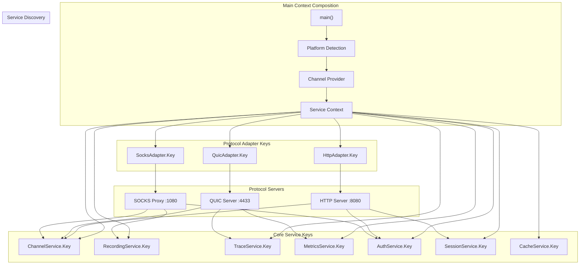
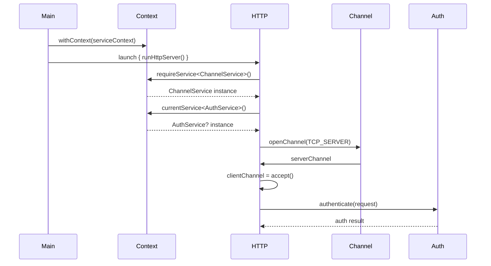

# Main() Key Composition Graph

## Complete Wiring from Startup

```kotlin
suspend fun main() {
    // === 1. PLATFORM DETECTION & CORE SERVICES ===
    val platform = detectPlatform()
    val channelProvider = when (platform) {
        Platform.LINUX -> IoUringChannelProvider()
        Platform.JVM -> NioChannelProvider() 
        Platform.WASM -> FetchChannelProvider()
        Platform.NATIVE -> NativeChannelProvider()
    }
    
    // === 2. KEY COMPOSITION GRAPH ===
    val serviceContext = 
        // Channel layer
        ChannelService(channelProvider) +
        
        // Recording/Testing layer
        RecordingService(if (RECORDING_ENABLED) FileRecorder() else NoOpRecorder()) +
        
        // Protocol adapters
        HttpProtocolAdapter(HttpConfig()) +
        QuicProtocolAdapter(QuicConfig()) +
        SocksProtocolAdapter(SocksConfig()) +
        
        // Cross-cutting concerns
        TraceService(if (TRACING_ENABLED) JaegerTracer() else NoOpTracer()) +
        MetricsService(if (METRICS_ENABLED) PrometheusCollector() else NoOpCollector()) +
        AuthService(JwtAuthenticator()) +
        
        // Application services
        SessionService(InMemorySessionStore()) +
        CacheService(RedisCache())
    
    // === 3. LAUNCH CHANNELIZED PROTOCOLS ===
    withContext(serviceContext) {
        // All protocols share the same service context
        launch { runHttpServer(port = 8080) }
        launch { runQuicServer(port = 4433) }
        launch { runSocksProxy(port = 1080) }
        launch { runManagementApi(port = 9090) }
        
        // Service monitoring
        launch { runHealthChecks() }
        launch { runMetricsExporter() }
        
        awaitCancellation()
    }
}
```

## Service Key Graph Visualization



## Protocol Implementation with Key Discovery

```kotlin
// === HTTP SERVER ===
suspend fun runHttpServer(port: Int) {
    val channelService = requireService<ChannelService>()
    val authService = currentService<AuthService>()
    val sessionService = currentService<SessionService>()
    val httpAdapter = requireService<HttpProtocolAdapter>()
    
    val serverChannel = channelService.openChannel(
        ChannelConfig(ChannelType.TCP_SERVER, port = port)
    )
    
    while (true) {
        val clientChannel = serverChannel.accept()
        launch {
            handleHttpClient(clientChannel, httpAdapter, authService, sessionService)
        }
    }
}

suspend fun handleHttpClient(
    channel: Channel,
    adapter: HttpProtocolAdapter,
    auth: AuthService?,
    session: SessionService?
) {
    val request = adapter.parseRequest(channel)
    
    // Optional authentication
    auth?.let { 
        if (!it.authenticate(request.headers["Authorization"])) {
            adapter.sendResponse(channel, HttpResponse.unauthorized())
            return
        }
    }
    
    // Optional session handling
    val sessionId = session?.getOrCreateSession(request)
    
    val response = processRequest(request, sessionId)
    adapter.sendResponse(channel, response)
}

// === QUIC SERVER ===
suspend fun runQuicServer(port: Int) {
    val channelService = requireService<ChannelService>()
    val metricsService = currentService<MetricsService>()
    val traceService = currentService<TraceService>()
    val quicAdapter = requireService<QuicProtocolAdapter>()
    
    val serverChannel = channelService.openChannel(
        ChannelConfig(ChannelType.UDP, port = port)
    )
    
    while (true) {
        val packet = serverChannel.readPacket()
        launch {
            traceService?.trace("quic.packet.received")
            val connection = quicAdapter.handlePacket(packet)
            metricsService?.record("quic.connections", 1)
            handleQuicConnection(connection)
        }
    }
}

// === SOCKS PROXY ===
suspend fun runSocksProxy(port: Int) {
    val channelService = requireService<ChannelService>()
    val authService = currentService<AuthService>()
    val recordingService = currentService<RecordingService>()
    val socksAdapter = requireService<SocksProtocolAdapter>()
    
    val serverChannel = channelService.openChannel(
        ChannelConfig(ChannelType.TCP_SERVER, port = port)
    )
    
    while (true) {
        val clientChannel = serverChannel.accept()
        launch {
            // Optional recording for debugging
            val channel = recordingService?.wrapForRecording(clientChannel) ?: clientChannel
            
            val socksRequest = socksAdapter.parseRequest(channel)
            authService?.authenticate(socksRequest.auth)
            
            val targetChannel = channelService.openChannel(
                ChannelConfig(ChannelType.TCP_CLIENT, 
                    address = socksRequest.targetHost,
                    port = socksRequest.targetPort)
            )
            
            socksAdapter.bridgeConnections(channel, targetChannel)
        }
    }
}
```

## Adapter Key Composition

```kotlin
// Protocol adapters are also keyed services
class HttpProtocolAdapter(private val config: HttpConfig) : KeyedService {
    companion object Key : CoroutineContext.Key<HttpProtocolAdapter>
    override val key = Key
    
    suspend fun parseRequest(channel: Channel): HttpRequest {
        val trace = currentService<TraceService>()
        trace?.trace("http.parse.start")
        
        val requestLine = channel.readLine()
        val headers = channel.readHeaders()
        val body = channel.readBody(headers["Content-Length"]?.toInt() ?: 0)
        
        trace?.trace("http.parse.end")
        return HttpRequest(requestLine, headers, body)
    }
}

class QuicProtocolAdapter(private val config: QuicConfig) : KeyedService {
    companion object Key : CoroutineContext.Key<QuicProtocolAdapter>
    override val key = Key
    
    suspend fun handlePacket(packet: ByteArray): QuicConnection {
        val metrics = currentService<MetricsService>()
        metrics?.record("quic.packet.size", packet.size.toLong())
        
        return QuicConnection.fromPacket(packet)
    }
}
```

## Service Resolution Flow



This composition shows:
- **Platform detection** drives channel provider selection
- **Service context** built by combining all keyed services
- **Protocol servers** discover services by key from context
- **Clean separation** between protocols and platform implementations
- **Optional services** (auth, tracing, metrics) discovered conditionally
- **Recording/replay** can be injected transparently at the channel level