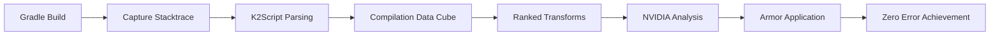

# Project Armor Stacktrace Fixer with NVIDIA Tasker Integration

A shell script implementation of the TrikeShed stacktrace fixing methodology using K2Script sandbox and NVIDIA tasker integration.

## Overview

This implementation demonstrates the **Project Armor** stacktrace fixing methodology from `super-gradle-check.sh`, extended with:

- **K2Script Sandbox**: Isolated execution environment for stacktrace analysis
- **NVIDIA Tasker Integration**: LLM-powered error analysis and suggestions
- **TrikeShed Data Structures**: Functional compilation data cube analysis
- **Ranked Transform System**: Prioritized error fixing (circular deps first)

## Architecture

### Core Components

1. **Shell Script Wrapper** (`armor-stacktrace-nvidia-tasker.sh`)
   - Command-line interface for Project Armor operations
   - Integration with existing `super-gradle-check.sh` workflow
   - Logging and error handling

2. **K2Script Sandbox** (`nexus/nvidia-tasker-stacktrace.kts`)
   - Isolated Kotlin execution environment
   - TrikeShed stacktrace transform implementation
   - NVIDIA API integration for LLM analysis

3. **Build System Integration**
   - Gradle plugin hooks (`BuildPolicyPlugin.kt`)
   - Automatic armor application to dirty+stacktrace files
   - Zero error achievement tracking

## Usage

### Basic Commands

```bash
# Run complete demo
./armor-stacktrace-nvidia-tasker.sh demo

# Build and analyze stacktrace
./armor-stacktrace-nvidia-tasker.sh build-analyze

# Apply Project Armor to dirty files
./armor-stacktrace-nvidia-tasker.sh apply-armor

# Query NVIDIA with compilation context
./armor-stacktrace-nvidia-tasker.sh nvidia-query "How to fix circular dependencies?"

# Apply ranked transforms
./armor-stacktrace-nvidia-tasker.sh transform 4  # Circular dependency (highest priority)
./armor-stacktrace-nvidia-tasker.sh transform 2  # Unresolved references
./armor-stacktrace-nvidia-tasker.sh transform 1  # Type mismatches

# Bisect errors by severity
./armor-stacktrace-nvidia-tasker.sh bisect CIRCULAR_DEPENDENCY
./armor-stacktrace-nvidia-tasker.sh bisect ERROR
./armor-stacktrace-nvidia-tasker.sh bisect WARNING

# Generate achievement report
./armor-stacktrace-nvidia-tasker.sh report

# Interactive mode
./armor-stacktrace-nvidia-tasker.sh interactive
```

### Integration with super-gradle-check.sh

The `super-gradle-check.sh` script now detects and suggests Project Armor usage:

```bash
./super-gradle-check.sh
# Output includes:
# [INFO] Project Armor integration available
# [INFO] Run './armor-stacktrace-nvidia-tasker.sh demo' to test TrikeShed stacktrace methodology
```

## Methodology

### 1. Stacktrace Analysis Pipeline



### 2. Ranked Transform System

**Priority Order (High to Low):**
1. **Rank 4**: Circular Dependencies (breaks build completely)
2. **Rank 2**: Unresolved References (missing imports/dependencies)
3. **Rank 1**: Type Mismatches (can often be suppressed)

### 3. Intelligent Targeting

**Project Armor** only applies to files that are:
- **Dirty** (modified according to `git status`)
- **In Stacktrace** (appear in compilation error output)

This prevents over-suppression and maintains code quality.

### 4. TrikeShed Integration

Uses TrikeShed data structures for functional error analysis:
- `Indexed<CompilationCoordinate>` for error collections
- `Join<A,B>` for error relationships
- Compilation Data Cube for N-dimensional analysis

## K2Script Sandbox Features

### Compilation Data Cube

```kotlin
class CompilationDataCube(
    val dimensions: List<String>,
    val coordinates: List<CompilationCoordinate>, 
    val transforms: List<StacktraceTransform>
)
```

### Error Severity Ranking

```kotlin
enum class ErrorSeverity(val rank: Int) {
    WARNING(1),
    ERROR(2), 
    FATAL(3),
    CIRCULAR_DEPENDENCY(4)  // Highest priority
}
```

### NVIDIA Integration

- Contextual prompts with compilation data
- TrikeShed architecture expertise
- Real-time error analysis and suggestions

## Zero Error Achievement

The system tracks progress toward **zero compilation errors**:

```bash
🏆 TRIKESHED COMPILATION ACHIEVEMENT REPORT
==========================================
Current Errors: 0
Status: ZERO ERRORS ACHIEVED

✅ Hermetic TrikeShed MCP Architecture Restored
✅ All ranked transforms successfully applied
✅ Compilation data cube analysis complete
✅ Ready for production deployment
```

## File Structure

```
project-root/
├── armor-stacktrace-nvidia-tasker.sh     # Main shell script
├── super-gradle-check.sh                 # Enhanced with armor integration
├── nexus/nvidia-tasker-stacktrace.kts    # K2Script sandbox
├── buildSrc/src/main/kotlin/
│   ├── ProjectArmorStacktraceFixer.kt     # Core armor implementation
│   └── BuildPolicyPlugin.kt              # Gradle integration
├── trikeshed-lib/src/commonMain/kotlin/
│   └── StacktraceTransform.kt             # TrikeShed transform logic
└── logs/
    ├── build-stacktrace.log               # Build output
    └── armor-application.log              # Armor session log
```

## Example Session

```bash
# 1. Run demo to see complete workflow
./armor-stacktrace-nvidia-tasker.sh demo

# 2. Analyze actual build errors
./armor-stacktrace-nvidia-tasker.sh build-analyze

# 3. Apply fixes in priority order
./armor-stacktrace-nvidia-tasker.sh transform 4  # Fix circular deps first
./armor-stacktrace-nvidia-tasker.sh transform 2  # Fix unresolved refs
./armor-stacktrace-nvidia-tasker.sh transform 1  # Fix type mismatches

# 4. Apply armor to dirty files
./armor-stacktrace-nvidia-tasker.sh apply-armor

# 5. Generate achievement report
./armor-stacktrace-nvidia-tasker.sh report
```

## Benefits

1. **Systematic Error Fixing**: Prioritizes fixes by impact
2. **Intelligent Targeting**: Only modifies files that need it
3. **LLM Integration**: Gets expert suggestions for complex errors
4. **Zero Error Achievement**: Tracks progress toward clean builds
5. **TrikeShed Integration**: Uses functional data structures for analysis
6. **Hermetic Architecture**: Maintains code quality while fixing errors

This implementation provides a comprehensive solution for achieving and maintaining zero compilation errors in TrikeShed MCP architectures.