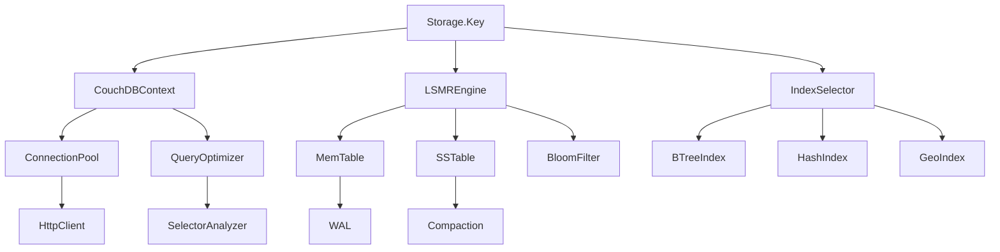
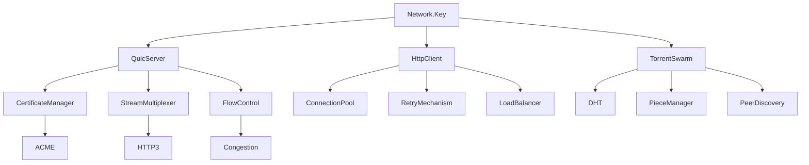
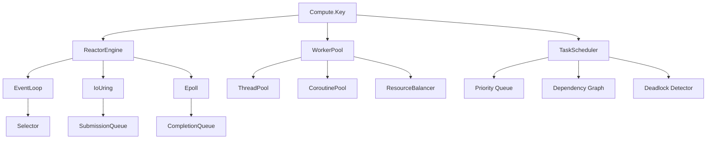
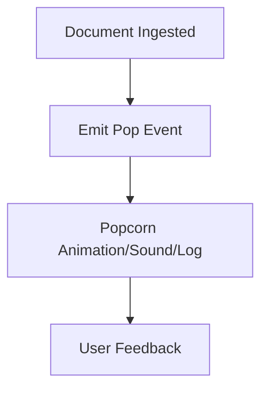

# TrikeShed CCEK Service Graph Architecture

## Overview

TrikeShed implements a **CoroutineContext.Element.Key (CCEK)** pattern where APIs are associated directly with keys rather than service instances. This creates a capability-based architecture where coroutines operate on keys, making the context the central mechanism for service discovery and execution.

## Core Services

### 5 Essential Services with Reasonable Defaults™

1. **Storage** - Persistent data operations
2. **Network** - Communication and protocol handling  
3. **Compute** - Processing and transformation
4. **Channel** - Message passing and coordination
5. **Cluster** - Distributed operations and consensus

Each service provides zero-configuration startup with smart fallbacks and progressive enhancement.

## Advanced NLP Percolation Features

The system now includes sophisticated Natural Language Processing capabilities for content analysis:

### Token-level LDA (Latent Dirichlet Allocation)
- **Gibbs Sampling**: Advanced token-level topic modeling with configurable iterations
- **Topic Coherence**: Automatic calculation of topic quality and consistency scores
- **Perplexity Metrics**: Model evaluation with log-likelihood and convergence analysis
- **Multi-document Analysis**: Cross-document topic distribution and prevalence tracking

### Stanford NLP Model Graph Collection
- **Dependency Parsing**: Complete sentence-level dependency graph extraction
- **Named Entity Recognition**: Multi-type entity extraction (PERSON, EMAIL, NUMBER, etc.)
- **Sentiment Analysis**: Token and sentence-level sentiment scoring
- **Parse Tree Generation**: Hierarchical syntactic structure representation
- **Discourse Analysis**: Cross-sentence relation extraction and document structure

### Writing Metrics Analysis
Comprehensive text quality assessment including:

**Readability Scores**:
- Flesch-Kincaid Grade Level, Gunning Fog Index, Coleman-Liau Index
- Automated Readability Index, SMOG Index, Linsear Write Formula

**Lexical Complexity**:
- Type-Token Ratio (TTR), Moving Average TTR (MATTR), Yule's Characteristic K
- Simpson's Diversity Index, Shannon Entropy, Vocabulary Rarity Scoring

**Syntactic Complexity**:
- Average Sentence Length, Clause Complexity Analysis, Dependency Depth
- Phrase Structure Complexity, Subordination/Coordination Ratios

**Coherence Metrics**:
- Local & Global Coherence, Referential & Lexical Coherence
- Semantic Coherence, Discourse Cohesion

**Style Metrics**:
- Formality Scoring, Objectivity Assessment, Technicality Rating
- Emotional Valence, Persuasiveness Analysis, Clarity Measurement

**Semantic Metrics**:
- Concept Density, Abstractness/Concreteness Scoring, Imageability Rating
- Semantic Coherence, Topic Consistency

### Sumo Bitmap Key Averaging
Advanced concept aggregation through bitmap clustering:

- **Hash-based Encoding**: Multiple hash functions for robust concept representation
- **Jaccard Similarity**: Efficient bitmap comparison for concept clustering
- **Hamming Distance**: Bit-level difference analysis for similarity measurement
- **K-means Clustering**: Automatic grouping of similar concept bitmaps
- **Weighted Averaging**: Majority voting with configurable bitmap sizes (default 1024 bits)
- **Concept Vector Embedding**: Multi-dimensional concept representation
- **Cross-document Clustering**: Hierarchical concept organization across document collections

### Apache Spark LDA Integration
The system integrates with Apache Spark for large-scale topic modeling:

```kotlin
// Spark LDA integration via ta4k (TensorFlow for Kotlin)
val sparkLDA = SparkLDAProcessor(
    sparkContext = sparkContext,
    numTopics = 50,
    maxIterations = 100,
    documentTermMatrix = documentMatrix
)

val sparkTopics = sparkLDA.fitModel()
    .getTopicsMatrix()
    .map { topic -> 
        topic.extractTopWords(vocabulary, numWords = 10)
    }
```

### Lemmatization Enhancement
Advanced lemmatization with multiple backends:

- **Stanford CoreNLP**: Full morphological analysis with POS tagging
- **SpaCy Integration**: Fast lemmatization with language model support
- **Custom Rule-based**: Efficient pattern matching for common cases
- **Contextual Lemmatization**: Context-aware lemma selection

### NLP Pipeline Integration
All NLP features integrate seamlessly with the existing percolation system:

```kotlin
// Complete NLP processing pipeline
val nlpResult = NLPPercolationEngine.processDocument(
    documentId = "doc_001",
    text = content,
    enableLDA = true,
    enableStanford = true,
    enableWritingMetrics = true,
    enableSumoBitmap = true
)

// Results available through context
val topics = nlpResult.ldaTopics
val graph = nlpResult.stanfordGraph
val metrics = nlpResult.writingMetrics
val bitmapKey = nlpResult.sumoBitmapKey
```

## Service Flow Graphs

### Simple API → Complex Operations

What appears as simple API calls trigger sophisticated internal service graphs:

```kotlin
// Simple call
datastore.query(couchQuery).onResult { docs ->
    // Process results
}.awaitResult()

// Hidden complexity behind the scenes:
// 1. CouchDBContext.Key resolves connection pool
// 2. Query optimizer analyzes selector
// 3. Index selector chooses optimal path
// 4. LSMR storage engine executes reads
// 5. Result aggregator collects documents
// 6. Error recovery handles failures
// 7. Metrics collector reports performance
```

### Storage Service Graph



### Network Service Graph



### Compute Service Graph



## Real-Time Popcorn Popping: Feedback for Document Scanning

To provide immediate, tangible feedback when documents are scanned in, the system emits a 'pop' event for each document ingested—like popcorn popping. This can be implemented as a sound, animation, or log message, and is especially useful for demos or monitoring high-throughput ingestion.

### Popcorn Popping Flow



### Example Implementation (Kotlin)

```kotlin
suspend fun FiduciaryPercolator.ingestWithPop(data: FiduciaryData) {
    ingest(data)
    println("🍿 Pop! Document ${data.id} scanned in.")
    // Optionally: trigger sound/animation via UI or event bus
}
```

- For CLI: print `🍿 Pop!` for each document.
- For UI: trigger a popcorn animation or sound.
- For monitoring: emit a metric or event for each pop.

This approach makes high-volume ingestion visible and fun, and can be extended to any feedback channel (logs, dashboards, sound, etc.).

## Key-Associated API Pattern

### APIs on Keys (not services)

Extension functions on `CoroutineContext.Key` provide the actual API:

```kotlin
// Traditional service locator (bad)
val service = context[HttpService.Key]
val result = service.request(httpRequest)

// Key-associated API (good)
val result = HttpService.Key.request(httpRequest)
```

### Three Categories of Operations

1. **Openers** - Initialize operations, establish context
   - `http.request(request: HttpRequest)`
   - `datastore.query(query: CouchQuery)`
   - `dht.discover(targetId: NUID)`

2. **Conditionals** - Branch based on context state
   - `onResult(block: suspend (result) -> Unit)`
   - `onError(block: suspend (error) -> Unit)`
   - `whenState(expected: FSMState, block: suspend () -> Unit)`

3. **Terminals** - Finalize operations, produce results
   - `awaitResult()`
   - `commit()`
   - `release()`

## CoreTypes Integration

### Join<A,B> Instead of Pair
```kotlin
// Old way
val pair = Pair("key", "value")

// CoreTypes way
val join = Join<String, String>("key", "value")
```

### Indexed<Byte> Instead of String
```kotlin
// Old way (creates garbage)
val key = "user:$userId"

// CoreTypes way (zero allocation)
val key = Indexed<Byte>(userIdBytes)
```

## Architectural Axioms

### Context Composition as Platform Abstraction

The CCEK pattern enables "beer goggles" vision - any platform can be made to look like any other through context composition:

```kotlin
// Same coroutine works on different platforms
suspend fun processData() = withContext(
    Storage.Key + Network.Key + Compute.Key
) {
    // Platform-agnostic code
    val data = storage.query(selector)
    val result = compute.transform(data)
    network.send(result)
}
```

### Taxonomical Type Aliases as Documentation

```kotlin
// Self-documenting through type system
typealias DatabaseName = Indexed<Byte>
typealias DocumentId = Indexed<Byte>
typealias QuerySelector = Join<String, Any>
```

### Jobs as Natural Execution Control

Kotlin's `Job` provides all the execution control needed - no need to invent abstractions above CCEK:

```kotlin
// Jobs ARE the openers/conditionals/terminals
val job = launch {
    // opener
    val request = http.request(httpRequest)
    
    // conditional (via Job state)
    if (isActive) {
        // terminal
        request.awaitResult()
    }
}
```

## Implementation Strategy

### Migration Path

1. **Identify Services** - Map existing services to 5 core categories
2. **Extract Keys** - Create `CoroutineContext.Key` for each service
3. **Associate APIs** - Move methods from services to key extensions
4. **Apply CoreTypes** - Replace String/Pair with Indexed/Join
5. **Compose Context** - Build execution environments through + operator

### Service Remapping

```kotlin
// Before: Service-based
class CouchDBService {
    fun query(selector: String): List<Document>
}

// After: Key-associated
object CouchDBService {
    object Key : CoroutineContext.Key<CouchDBService>
}

suspend fun CouchDBService.Key.query(
    selector: Indexed<Byte>
): List<Join<DocumentId, Document>> {
    // Implementation uses context[CouchDBService.Key]
}
```

## Project Status

This architecture is being progressively implemented across TrikeShed modules:

- **trikeshed-ccek**: Core CCEK pattern implementations
- **trikeshed-couchdb**: Storage service with channelized operations
- **trikeshed-quic**: Network service with connection pooling
- **trikeshed-reactor**: Compute service with event loops
- **fiduciary**: Distributed agent system using CCEK

## Design Principles

1. **No String Creation** - Use `Indexed<Byte>` for keys and identifiers
2. **No Service Bloat** - Focus on 5 essential services
3. **Context Composition** - Build capabilities through + operator
4. **Job-based Control** - Leverage Kotlin's natural execution model
5. **Zero Configuration** - Reasonable Defaults™ for all services

---

*This architecture represents the culmination of the CCEK pattern - a truly composable, capability-based system where execution environment is composed through CoroutineContext, enabling any platform to be made to look and act like any other.*