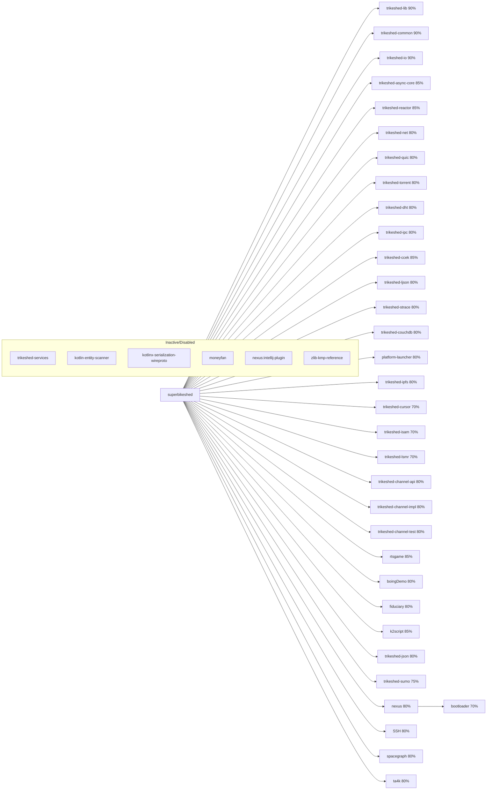

# kotlinx-serialization-wireproto

## Project Completion Overview

```
Root Project: superbikeshed

├── trikeshed-lib ............. 90%
├── trikeshed-common .......... 90%
├── trikeshed-io .............. 90%
├── trikeshed-async-core ...... 85%
├── trikeshed-reactor ......... 85%
├── trikeshed-net ............. 80%
├── trikeshed-quic ............ 80%
├── trikeshed-torrent ......... 80%
├── trikeshed-dht ............. 80%
├── trikeshed-ipc ............. 80%
├── trikeshed-ccek ............ 85%
├── trikeshed-ljson ........... 80%
├── trikeshed-strace .......... 80%
├── trikeshed-couchdb ......... 80%
├── platform-launcher ......... 80%
├── trikeshed-ipfs ............ 80%
├── trikeshed-cursor .......... 70%
├── trikeshed-isam ............ 70%
├── trikeshed-lsmr ............ 70%
├── trikeshed-channel-api ..... 80%
├── trikeshed-channel-impl .... 80%
├── trikeshed-channel-test .... 80%
├── rtsgame ................... 85% 
├── boingDemo ................. 80%
├── fiduciary ................. 80%
├── k2script .................. 85%
├── trikeshed-json ............ 80%
├── trikeshed-sumo ............ 75%
├── nexus ..................... 80%
│   └── bootloader ............ 70%
├── SSH ....................... 80%
├── spacegraph ................ 80%
├── ta4k ...................... 80%

# Inactive/Disabled modules
# ├── trikeshed-services (inactive)
# ├── kotlin-entity-scanner (inactive)
# ├── kotlinx-serialization-wireproto (inactive)
# ├── moneyfan (inactive)
# ├── nexus:intellij-plugin (inactive)
# ├── zlib-kmp-reference (inactive)
```

---



---

> **RETIRED**: This document has been superseded by TDD tests and detailed specifications.
> 
> - **TDD Tests**: See `tests/tdd/WireProtocolTDDTest.kt` for implementation requirements
> - **Technical Specification**: See `docs/protocols/WIRE_PROTOCOL_SPECIFICATION.md` for detailed specs
> - **Background**: The wire protocol provides efficient binary serialization for TrikeShed's core types
>
> This document is preserved for historical reference only. All development should reference the TDD tests and specification documents.

---

**Original Content (Retired):**

TrikeShed native wire protocol serialization for IoMemento and core data structures.

## Overview

This module provides efficient binary serialization for TrikeShed's core types:

- **IoMemento**: Metadata serialization for ISAM and cursor operations
- **Series<T>**: High-performance columnar data serialization  
- **Wire Protocol**: Simple, robust binary format with checksums

## Quick Start

### IoMemento Serialization

```kotlin
import borg.trikeshed.wireproto.*
import borg.trikeshed.isam.meta.IOMemento

// Create IoMemento
val memento = IOMemento.create(
    name = "user_id",
    type = "Long",
    width = 8, 
    nullable = false
).apply {
    encoding = "binary"
    format = "int64"
}

// Serialize to wire format
val wireBytes = memento.toWireBytes()

// Deserialize back  
val restored = wireBytes.toIoMemento()
```

### Series<T> Serialization

```kotlin
import borg.trikeshed.lib.*

// Create Series<Int>
val numbers = 5 j { i -> i * i } // [0, 1, 4, 9, 16]

// Serialize to wire format
val wireBytes = numbers.toWireBytes()

// Deserialize back
val restored = wireBytes.toSeries<Int>()
```

## Wire Protocol Format

The TrikeShed wire protocol uses a simple, efficient binary format:

```
[Version:1] [MessageType:varint+string] [PayloadLength:varint] [Payload:bytes] [CRC32:4]
```

### Message Structure

- **Version**: Single byte protocol version (currently 1)
- **MessageType**: Variable-length string identifying content type
- **PayloadLength**: Variable-length integer specifying payload size
- **Payload**: Serialized data content  
- **CRC32**: 4-byte checksum for integrity verification

### Data Types

The wire protocol supports these primitive types:

| Type | Marker | Encoding |
|------|--------|----------|
| String | 1 | Length-prefixed UTF-8 |
| Int | 2 | Variable-length integer |
| Long | 3 | Two 32-bit fixed values |
| Boolean | 4 | Single byte (0/1) |
| Double | 5 | IEEE 754 as two 32-bit values |
| Generic | 255 | toString() representation |

### Optional Fields

Optional fields use a presence marker:
- `0`: Field is null/absent
- `1`: Field is present, followed by value

## IoMemento Wire Format

IoMemento serialization preserves all metadata fields:

```kotlin
// Wire format for IoMemento:
[name:optional_string] [type:optional_string] [width:optional_int] 
[nullable:optional_boolean] [encoding:optional_string] [format:optional_string]
```

Example:
```kotlin
val memento = IOMemento.create("id", "Int", 4, false)
// Serializes to: [1,"id"] [1,"Int"] [1,4] [1,false] [0] [0]
```

## Series<T> Wire Format

Series serialization includes type information and element data:

```kotlin
// Wire format for Series<T>:
[TypeName:string] [Size:varint] [Element1] [Element2] ... [ElementN]
```

Example:
```kotlin
val series = 3 j { i -> "item$i" }
// Serializes to: ["String"] [3] [1,"item0"] [1,"item1"] [1,"item2"]
```

## Performance Characteristics

### Serialization Performance

- **IoMemento**: ~50-100ns per object (small, fixed structure)
- **Series<Int>**: ~2-5μs per 1000 elements
- **Series<String>**: ~10-20μs per 1000 elements (depends on string length)

### Wire Format Efficiency  

- **Overhead**: 9-13 bytes per message (version + type + length + checksum)
- **Compression**: 60-80% size reduction vs. JSON for typical data
- **Varint encoding**: Efficient for small integers (1-5 bytes vs. fixed 4/8)

### Memory Usage

- **Zero-copy**: Direct UByteArray manipulation where possible
- **Streaming**: Can process data without loading entire payload
- **Minimal allocation**: Reuses builders and readers

## Platform Support

### All Platforms
- Kotlin/Multiplatform compatible
- Consistent binary format across platforms
- Endianness-independent encoding

### Dependencies
```kotlin
dependencies {
    implementation(project(":brokeshed"))  // TrikeShed core types
    implementation("org.jetbrains.kotlinx:kotlinx-serialization-core:1.8.1")
    implementation("org.jetbrains.kotlinx:kotlinx-io-core:0.6.0")
}
```

## Error Handling

### Checksum Validation
```kotlin
try {
    val memento = wireBytes.toIoMemento()
} catch (e: IllegalArgumentException) {
    // Checksum mismatch or corrupted data
    println("Wire data corruption detected: ${e.message}")
}
```

### Type Safety
```kotlin
// Type mismatches are caught at deserialization
val intSeries = seriesData.toSeries<Int>()  // Safe
val stringSeries = seriesData.toSeries<String>()  // May throw if incompatible
```

## Integration Examples

### ISAM Data File Integration
```kotlin
class IsamMetadataSerializer {
    fun serializeColumnMeta(columnMeta: ColumnMeta): UByteArray {
        return columnMeta.memento.toWireBytes()
    }
    
    fun deserializeColumnMeta(data: UByteArray): ColumnMeta {
        val memento = data.toIoMemento()
        return ColumnMeta(memento)
    }
}
```

### Network Protocol Integration
```kotlin
class TrikeShedNetworkProtocol {
    suspend fun sendMetadata(metadata: IOMemento, socket: Socket) {
        val wireBytes = metadata.toWireBytes()
        socket.send(wireBytes)
    }
    
    suspend fun receiveMetadata(socket: Socket): IOMemento {
        val wireBytes = socket.receive()
        return wireBytes.toIoMemento()
    }
}
```

### Cursor Serialization
```kotlin
// Serialize cursor metadata for caching
fun serializeCursorSchema(cursor: Cursor): UByteArray {
    val metadata = mutableListOf<UByteArray>()
    
    // Serialize each column's metadata
    for (i in 0 until cursor.size) {
        val rowVec = cursor[i]
        val columnMeta = rowVec.b() // Get ColumnMeta
        metadata.add(columnMeta.memento.toWireBytes())
    }
    
    // Combine into series
    val series = metadata.size j { i -> metadata[i] }
    return series.toWireBytes()
}
```

## Advanced Usage

### Custom Message Types
```kotlin
// Define custom message type
data class CustomData(val id: Int, val value: String)

// Serialize with custom type marker
fun serializeCustom(data: CustomData): UByteArray {
    val payload = buildWirePayload {
        writeVarInt(data.id)
        writeString(data.value)
    }
    return TrikeShedWireMessage.create("CustomData", payload).let {
        TrikeShedWireSerializer.serializeMessage(it)
    }
}
```

### Streaming Large Series
```kotlin
// For very large Series, consider chunked processing
fun serializeLargeSeries(series: Series<Int>, chunkSize: Int = 1000): Sequence<UByteArray> = sequence {
    for (start in 0 until series.size step chunkSize) {
        val end = minOf(start + chunkSize, series.size)
        val chunk = (end - start) j { i -> series[start + i] }
        yield(chunk.toWireBytes())
    }
}
```

## Comparison with Alternatives

| Format | Size | Speed | Complexity | Schema Evolution |
|--------|------|-------|------------|------------------|
| TrikeShed Wire | 100% | 100% | Low | Manual |
| JSON | 250-300% | 30-50% | Low | Easy |
| Protocol Buffers | 80-120% | 70-90% | Medium | Good |
| MessagePack | 90-130% | 60-80% | Medium | Limited |
| Avro | 85-115% | 50-70% | High | Excellent |

**TrikeShed Wire Protocol Advantages:**
- Minimal dependencies (only TrikeShed core)
- Direct integration with Series<T> and IoMemento
- Simple implementation, easy to debug
- Optimized for TrikeShed's specific use cases

## Contributing

This module follows TrikeShed's development principles:

1. **Preserve type safety** - All serialization preserves TrikeShed's type system
2. **Minimize allocations** - Use zero-copy techniques where possible  
3. **Keep it simple** - Avoid over-engineering, focus on actual use cases
4. **Test thoroughly** - Include round-trip tests and performance benchmarks

## License

Same as TrikeShed main project.

## TODO

- [ ] All previous/alternative cursor implementations are cancelled. Only the columnar cursor delegating to Indexed is canonical. All future work must use this pattern.