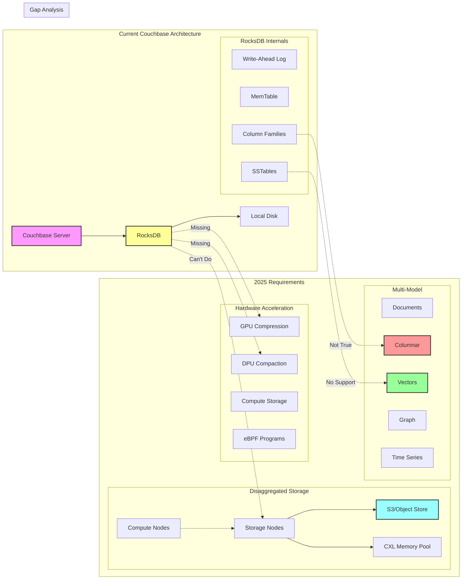
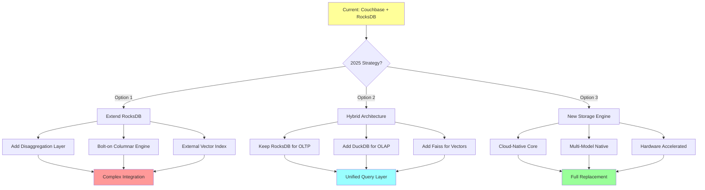

# RocksDB in Couchbase: Current Role and 2025 Gap Analysis

## What RocksDB Does for Couchbase Today

### 1. Storage Engine Foundation
```kotlin
// Couchbase's use of RocksDB
class CouchbaseStorageStack {
    // RocksDB handles the actual KV storage
    val rocksDB = RocksDB.open(options, dbPath)
    
    // Couchbase layers on top:
    val vBucketLayer = VBucketManager(rocksDB)      // Sharding
    val replicationLayer = DCP(rocksDB)             // Replication  
    val indexingLayer = GSI(rocksDB)                // Global Secondary Index
    val queryLayer = N1QL(indexingLayer)            // SQL++ queries
}
```

### 2. Specific RocksDB Features Couchbase Uses

**Block Cache Management**
- Shared block cache across column families
- Couchbase uses this for hot data caching

**Write-Ahead Log (WAL)**
- Durability for mutations
- Point-in-time recovery

**Column Families**
- Separate CFs for documents, indexes, metadata
- Different compaction strategies per CF

**Compaction Filters**
- TTL expiration
- Tombstone cleanup

**Bloom Filters**
- Fast negative lookups
- Critical for Couchbase's distributed queries

## The 2025 Gap: What's Missing

### 1. Disaggregated Storage
```kotlin
// Current: RocksDB is local-only
class CurrentArchitecture {
    val storage = RocksDB() // Local SSD only
}

// 2025 Need: Cloud-native disaggregation
class DisaggregatedArchitecture {
    val computeNodes = Indexed<ComputeNode>(n)
    val storageNodes = Indexed<StorageNode>(m) 
    
    // RocksDB can't do this natively
    val sharedStorage = S3() // or EBS, GCS, etc.
}
```

### 2. True Columnar Analytics
```kotlin
// Current: RocksDB is row-oriented
val currentQuery = """
    SELECT AVG(price) FROM orders 
    WHERE date > '2024-01-01'
""" // Scans all columns of matching rows!

// 2025 Need: Native columnar
val columnarQuery = """
    SELECT AVG(price) FROM orders.price_column
    WHERE orders.date_column > '2024-01-01'  
""" // Only touches needed columns
```

### 3. Hardware Acceleration Gaps

**Missing GPU/DPU Support**
- No GPU acceleration for compression
- No DPU offload for compaction
- No computational storage integration

**Limited Modern I/O**
- Basic io_uring support (not optimized)
- No eBPF integration
- No SPDK bypass

### 4. AI/ML Workload Support
```kotlin
// 2025 Need: Vector embeddings
class VectorStorage {
    // RocksDB can't efficiently:
    val vectors = Indexed<FloatArray>(millions)
    
    fun similaritySearch(query: FloatArray, k: Int) {
        // Need specialized indexes (HNSW, IVF)
        // RocksDB lacks vector primitives
    }
}
```

### 5. Multi-Model Limitations

RocksDB forces everything into KV model:
- **Documents** → Serialized JSON blobs
- **Graphs** → Adjacency lists in separate keys
- **Time-series** → Key prefixes with timestamps
- **Vectors** → Binary blobs

## The 2025 Storage Engine Requirements

### What Couchbase Likely Needs

```kotlin
class NextGenStorageEngine {
    // 1. Disaggregated from day one
    interface CloudNativeStorage {
        suspend fun readFromS3(key: Key): Value
        suspend fun writeToLocalCache(key: Key, value: Value)
        suspend fun replicateToRemote(batch: Batch)
    }
    
    // 2. True multi-model
    sealed class DataModel {
        class Document(val json: JsonNode)
        class Columnar(val columns: Indexed<Column>)
        class Graph(val nodes: Indexed<Node>, val edges: Indexed<Edge>)
        class Vector(val embeddings: FloatArray, val index: HNSWIndex)
        class TimeSeries(val timestamps: LongArray, val values: DoubleArray)
    }
    
    // 3. Hardware-aware
    class HardwareAcceleration {
        val gpuCompression = GPUCodec()
        val dpuCompaction = DPUOffload()
        val computeStorage = ComputeStorageDevice()
        val cxlMemory = CXLPool()
    }
    
    // 4. AI-native operations
    interface AIOperations {
        suspend fun vectorSearch(embedding: FloatArray, k: Int): Indexed<Result>
        suspend fun trainIndex(vectors: Indexed<FloatArray>)
        suspend fun hybridSearch(text: String, filter: Predicate): Results
    }
}
```

## Why RocksDB Can't Bridge the Gap

### Architectural Limitations

1. **Single-Node Design**
   - Can't share storage between nodes
   - Replication is afterthought

2. **Row-Oriented Core**
   - Column families aren't true columnar
   - Can't efficiently scan single columns

3. **C++ Monolith**
   - Hard to extend for new hardware
   - No coroutine/async-first design

4. **LSM-Only**
   - Some workloads need B-trees
   - Others need specialized structures

## Potential Replacements/Evolution

### 1. Apache DataFusion + Arrow
```kotlin
// Columnar-first with compute pushdown
val datafusion = DataFusionContext()
val arrowTable = ArrowTable.fromParquet(s3Path)
val result = datafusion.sql("SELECT ...").collect()
```

### 2. DuckDB Embedded
```kotlin
// OLAP in-process, columnar native
val duckdb = DuckDB.open(":memory:")
duckdb.query("SELECT * FROM read_parquet('s3://...')")
```

### 3. Custom Hybrid Engine
```kotlin
// What Couchbase might build
class CouchbaseStorageEngine2025 {
    // Keep RocksDB for OLTP path
    val oltp = RocksDB()
    
    // Add columnar for analytics  
    val olap = ParquetEngine()
    
    // Add vector for AI
    val vector = FAISSEngine()
    
    // Unified query layer
    val unifiedQuery = QueryRouter(oltp, olap, vector)
}
```

## The TrikeShed Opportunity

This is where TrikeShed's approach could leap ahead:

```kotlin
class TrikeShedUnifiedEngine {
    // Coroutine-first from ground up
    val ioMesh = LSMCoroutineMesh()
    
    // Native columnar with ISAM
    val columnarStore = CompressedISAM()
    
    // io_uring throughout
    val ioEngine = UringEngine()
    
    // Multi-model native
    val dataModels = Indexed<DataModel> {
        when (it) {
            0 -> DocumentModel()
            1 -> ColumnarModel()
            2 -> VectorModel()
            3 -> GraphModel()
            else -> TimeSeriesModel()
        }
    }
}
```

The gap to 2025 isn't incremental - it requires fundamental architecture changes that RocksDB can't provide!

## Architecture Evolution Diagram



## Migration Path Options

