the CCEK addendum# Omnibus Trading System CCEK Architecture

## System Overview

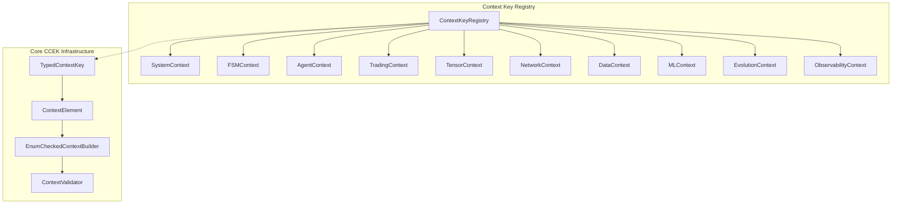

## Trading System Flow

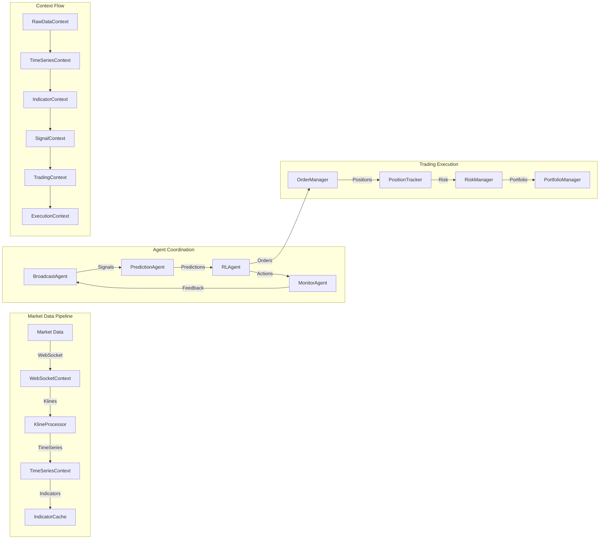

## Multi-Agent Swimlanes

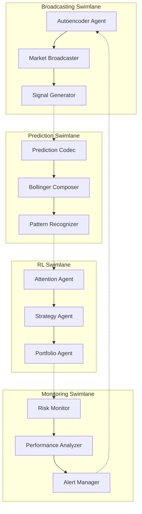

## FSM State Transitions

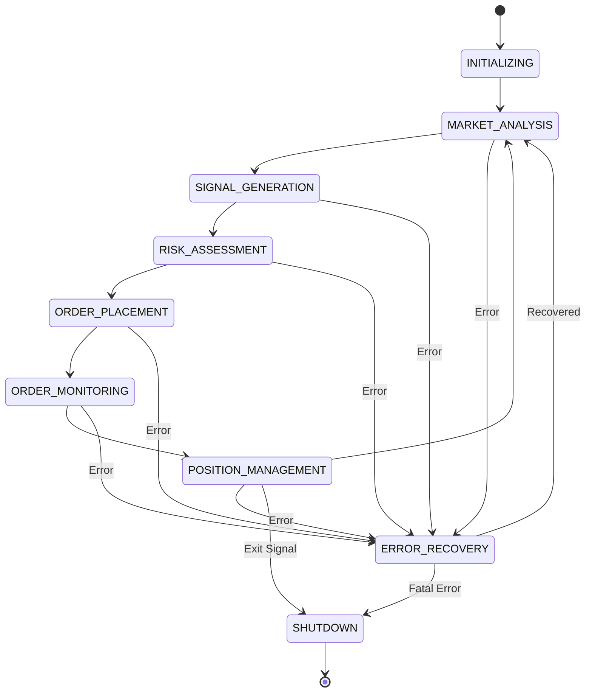

## Tensor Computation States

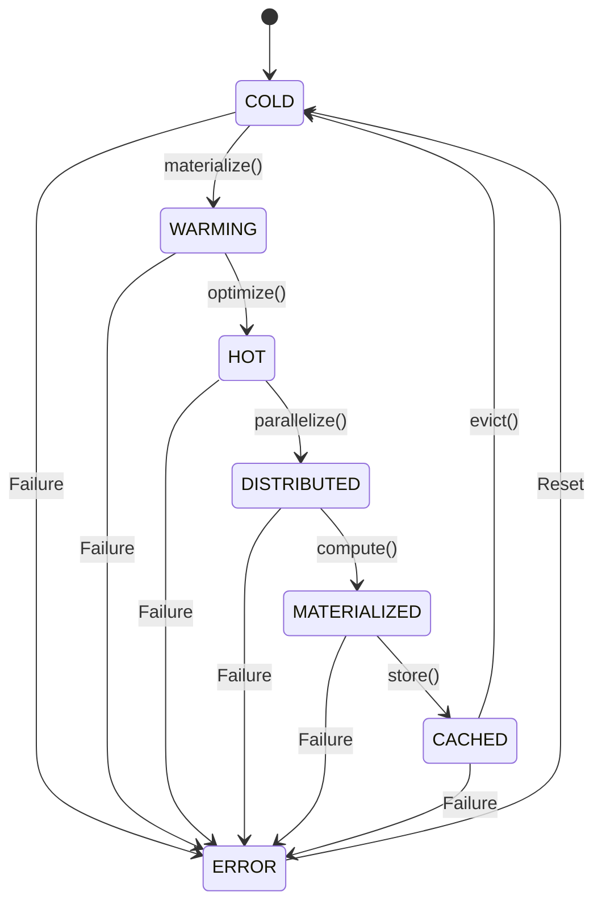

## Context Composition Example

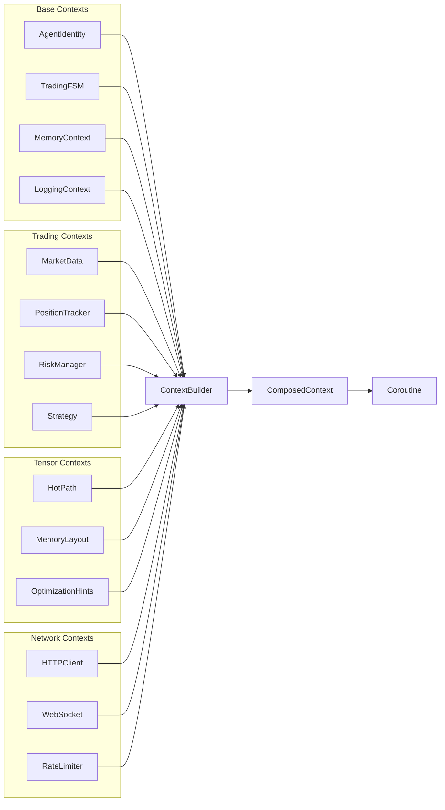

## Data Flow Through Contexts

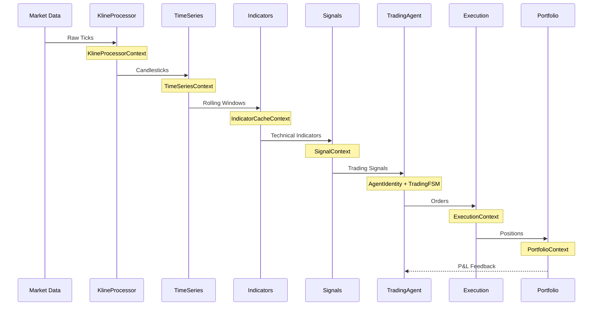

## NEAT Evolution Context Flow

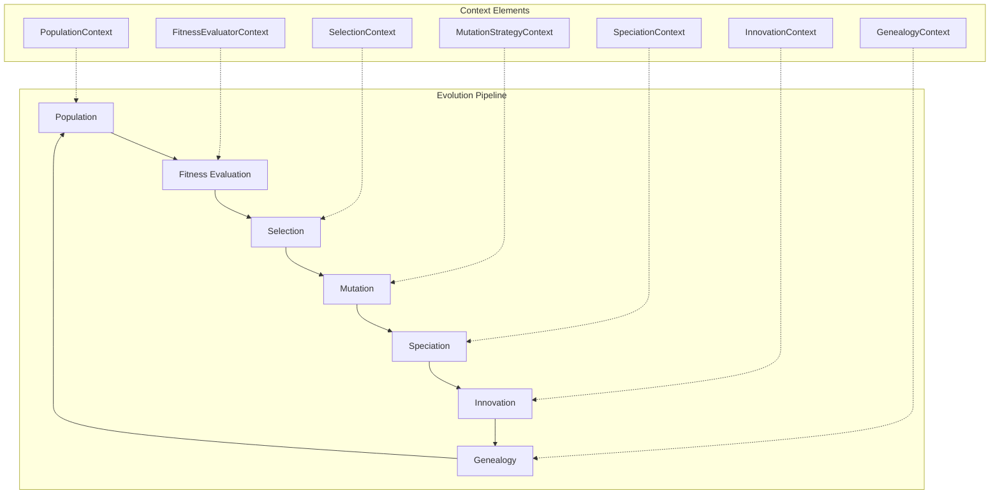

## Observability Integration

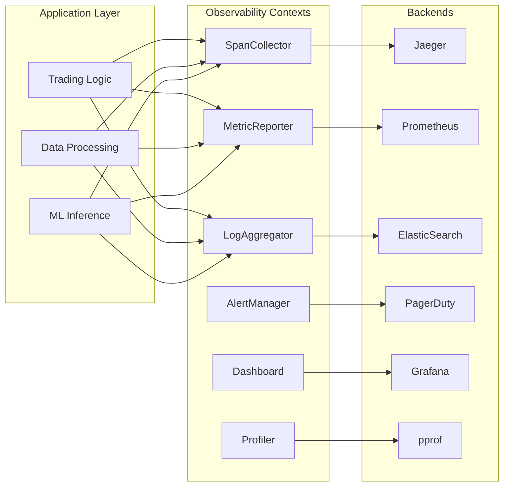

## Context Validation Flow

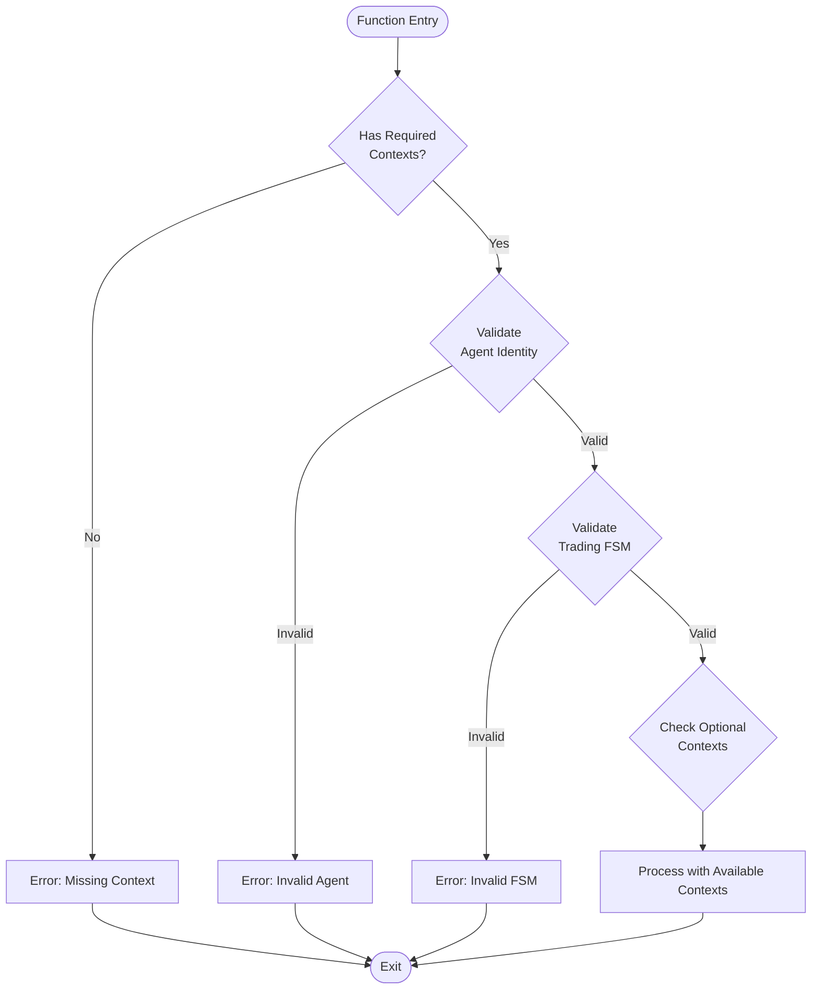

## Complete Trading System Architecture

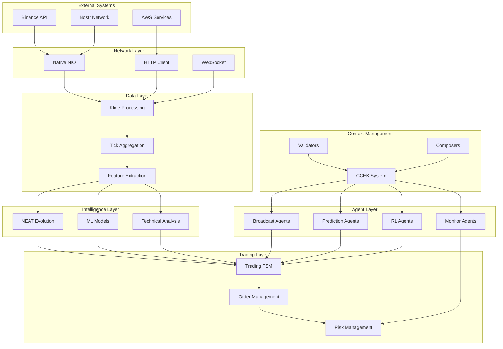

This comprehensive diagram set illustrates:

1. **Context Key Registry Structure** - The enum-based hierarchy of all context types
2. **Trading System Flow** - How data flows through various contexts
3. **Multi-Agent Swimlanes** - Parallel agent coordination patterns
4. **FSM State Transitions** - Trading and tensor computation state machines
5. **Context Composition** - How contexts are built and combined
6. **Data Flow Sequencing** - Temporal flow through processing stages
7. **Evolution Pipeline** - NEAT evolution with context integration
8. **Observability Integration** - How monitoring contexts connect to backends
9. **Validation Flow** - Context requirement checking
10. **Complete Architecture** - The full omnibus trading system with CCEK at its core

The CCEK system provides type-safe, enum-checked context management that enables:
- Clean dependency injection
- Compile-time safety
- Optional concerns (like logging)
- Hierarchical composition
- Domain-specific transformations
- Zero runtime overhead through inline classesOkay, this is a substantial and insightful request for a deep refactoring towards a more idiomatic Kotlin Multiplatform (KMP) architecture using CoroutineContext Element Keys (CCEK) for platform-specific services. The goal is to reduce boilerplate, enhance platform-specific optimizations, and improve maintainability by minimizing the surface area of `expect`/`actual` declarations.

I will proceed by:
1.  Defining common interfaces and keys for core I/O services.
2.  Implementing these services for the `posixMain` target, drawing heavily from your existing `simple.PosixFile` and `LinuxPosixFile`.
3.  Showing how `IsamDataFile` and `common/Files.kt` would be adapted to use this new CCEK-based approach.
4.  Briefly touching upon how this pattern would apply to `FileBuffer` and `TensorIO`.

Due to the sheer volume of code, I'll focus on the most impactful changes to demonstrate the pattern. The `evolution` and `kademlia` parts, while excellent candidates for CCEK, would constitute a separate large refactoring effort.

**Phase 1: Core I/O Abstractions with CCEK (commonMain)**

Let's define the keys and service interfaces for file system operations.

```kotlin
// src/commonMain/kotlin/borg/trikeshed/io/FileSystemContext.kt
package borg.trikeshed.io

import borg.trikeshed.lib.Join
import borg.trikeshed.lib.Series
import kotlin.coroutines.CoroutineContext

// --- Keys for context elements ---
object FileSystemServiceKey : CoroutineContext.Key<FileSystemService>

// --- Service Interface ---
interface FileSystemService : CoroutineContext.Element {
    override val key: CoroutineContext.Key<*> get() = FileSystemServiceKey

    // Static-like file operations
    fun exists(path: String): Boolean
    fun readAllBytes(path: String): ByteArray
    fun writeAllBytes(path: String, bytes: ByteArray)
    fun readAllText(path: String): String
    fun writeAllText(path: String, text: String)
    fun readLines(path: String): List<String>
    fun readLinesSeq(path:String): Sequence<String>
    fun writeLines(path: String, lines: List<String>)
    fun streamLines(fileName: String, bufsize: Int = 64): Sequence<Join<Long, ByteArray>>
    fun delete(path: String): Boolean

    // Directory and temp file operations
    fun mktemp(isDir: Boolean = false, prefix: String? = null, basePath: String? = null): String
    fun mkdir(path: String, createIntermediateDirs: Boolean = true): Boolean
    val homedir: String
    fun cwd(): String

    // File handle operations
    fun openFile(path: String, openOpts: FileOpenOpts): OpenedFileHandle
}

// --- File Handle Abstraction ---
interface OpenedFileHandle : AutoCloseable, HasDescriptor, HasSize { // Implement existing common interfaces
    val path: String
    // fd is platform specific, might not be exposed here or be Any/Int?
    
    fun read(buffer: ByteArray, offset: Int = 0, length: Int = buffer.size): ULong
    fun write(buffer: ByteArray, offset: Int = 0, length: Int = buffer.size): ULong
    fun seek(offset: Long, whence: FileSeekWhence): ULong
    fun mmap(length: ULong, protection: Set<FileMapProtection>, flags: Set<FileMapFlags>, offset: Long = 0L): MappedDataRegion
    
    override fun close()
}

// --- Memory Mapped Region Abstraction ---
interface MappedDataRegion : AutoCloseable {
    val size: ULong
    fun getByte(offset: Long): Byte
    fun putByte(offset: Long, value: Byte)
    // Add get/put for other primitive types as needed
    override fun close()
}

// --- Common Enums for Options ---
data class FileOpenOpts(
    val read: Boolean = false,
    val write: Boolean = false,
    val append: Boolean = false,
    val create: Boolean = false,
    val createNew: Boolean = false, // Corresponds to O_EXCL
    val truncate: Boolean = false,
    val sync: Boolean = false,
    val dsync: Boolean = false,
    val mode: Int = 0 // Permissions for create, e.g., 0644
) {
    companion object {
        val ReadOnly = FileOpenOpts(read = true)
        fun ReadWrite(create: Boolean = false, truncate: Boolean = false) = FileOpenOpts(read = true, write = true, create = create, truncate = truncate)
        fun WriteOnly(create: Boolean = false, truncate: Boolean = false) = FileOpenOpts(write = true, create = create, truncate = truncate)
        fun Append(create: Boolean = false) = FileOpenOpts(write = true, append = true, create = create)
    }
}

enum class FileSeekWhence { START, CURRENT, END }
enum class FileMapProtection { READ, WRITE, EXECUTE }
enum class FileMapFlags { SHARED, PRIVATE /*, FIXED, ANONYMOUS etc. can be added */ }

// Ensure HasDescriptor and HasSize are defined in commonMain (as they already are)
// No changes needed for:
// src/commonMain/kotlin/borg/trikeshed/io/HasDescriptor.kt
// src/commonMain/kotlin/borg/trikeshed/io/HasSize.kt
// src/commonMain/kotlin/borg/trikeshed/io/PosixStatMode.kt (expect enum, could become sealed class if preferred)

```

**Phase 2: `posixMain` Implementation of `FileSystemService`**

This will consolidate logic from `simple.PosixFile`, `LinuxPosixFile`, and POSIX-specific parts of `common/Files.kt`, `common/mktemp.kt`, `common/HomedirGet.kt`.

```diff
--- a/src/posixMain/kotlin/simple/PosixFile.kt
+++ /dev/null
@@ -1,130 +0,0 @@
-package simple
-
-import borg.trikeshed.lib.*
-import borg.trikeshed.io.*
-import borg.trikeshed.native.HasPosixErr
-import kotlinx.cinterop.*
-import platform.posix.*
-import platform.posix.open
-import platform.posix.close
-import platform.posix.read
-import platform.posix.write
-import platform.posix.lseek
-import platform.posix.fstat
-import platform.posix.stat
-import platform.posix.mmap
-import platform.posix.munmap
-import platform.posix.perror
-import platform.posix.fgets
-import platform.posix.strerror
-import platform.posix.errno
-import platform.posix.EOF
-
-// A concrete implementation of file operations for Posix.
-// This class wraps native POSIX file descriptors and provides higher-level operations.
-@OptIn(ExperimentalForeignApi::class)
-class PosixFile(
-    val path: String,
-    O_FLAGS: UInt = PosixOpenOpts.withFlags(PosixOpenOpts.OpenReadOnly, PosixOpenOpts.OpenSync),
-    val fd: Int = run {
-        val openedFd = platform.posix.open(path, O_FLAGS.toInt())
-        HasPosixErr.posixRequires(openedFd > 0) { "PosixFile::open $path returned ${HasPosixErr.reportErr(openedFd)}" }
-        openedFd
-    },
-) : HasPosixErr {
-
-    val st: stat by lazy {
-        memScoped {
-            val statBuf = alloc<platform.posix.stat>()
-            fstat(fd, statBuf.ptr)
-            borg.trikeshed.io.stat(statBuf.ptr) // Wrap native stat struct in actual class
-        }
-    }
-
-    val size: Long get() = st.st_size
-
-    fun read(buf: ByteArray): ULong {
-        val addressOf = buf.pin().addressOf(0)
-        val b: CArrayPointer<ByteVar> = addressOf.reinterpret()
-        val bytesRead = read(fd, b, buf.size.toULong())
-        HasPosixErr.posixRequires(bytesRead >= 0) { "read failed with result ${HasPosixErr.reportErr(bytesRead.toInt())}" }
-        return bytesRead.toULong()
-    }
-
-    fun write(buf: ByteArray): ULong {
-        val addressOf = buf.pin().addressOf(0)
-        val b: CArrayPointer<ByteVar> = addressOf.reinterpret()
-        val bytesWritten = write(fd, b, buf.size.toULong())
-        HasPosixErr.posixRequires(bytesWritten >= 0) { "write failed with result ${HasPosixErr.reportErr(bytesWritten.toInt())}" }
-        return bytesWritten.toULong()
-    }
-
-    fun seek(offset: Long, whence: Int = SEEK_SET): ULong {
-        val offr = lseek(fd, offset, whence)
-        HasPosixErr.posixRequires(offr >= 0) { "seek failed with result ${HasPosixErr.reportErr(res = offr.toInt())}" }
-        return offr.toULong()
-    }
-
-    fun close(): Int {
-        val closed = platform.posix.close(fd)
-        HasPosixErr.posixRequires(closed >= 0) { "close failed with result ${HasPosixErr.reportErr(closed)}" }
-        return closed
-    }
-
-    fun mmap(length: ULong, prot: Int = PROT_READ or PROT_WRITE, flags: Int = MAP_SHARED, offset: Long = 0): COpaquePointer {
-        val mappedPtr = platform.posix.mmap(null, length, prot, flags, fd, offset)
-        HasPosixErr.posixRequires(mappedPtr != MAP_FAILED) { "mmap failed for $path, length $length, offset $offset: ${HasPosixErr.reportErr(mappedPtr.toLong().toInt())}" }
-        return mappedPtr!!
-    }
-
-    companion object {
-        fun readAllBytes(filename: String): ByteArray = memScoped {
-            val file = PosixFile(filename, PosixOpenOpts.withFlags(PosixOpenOpts.OpenReadOnly))
-            try {
-                val buffer = ByteArray(file.size.toInt())
-                val bytesRead = file.read(buffer)
-                HasPosixErr.posixRequires(bytesRead.toLong() == file.size) { "Failed to read all bytes from $filename" }
-                buffer
-            } finally {
-                file.close()
-            }
-        }
-
-        fun readString(filename: String): String = readAllBytes(filename).decodeToString()
-
-        fun writeBytes(filename: String, bytes: ByteArray) = memScoped {
-            val file = PosixFile(filename, PosixOpenOpts.withFlags(PosixOpenOpts.O_Creat, PosixOpenOpts.O_Trunc, PosixOpenOpts.O_Rdwr))
-            try {
-                val bytesWritten = file.write(bytes)
-                HasPosixErr.posixRequires(bytesWritten.toLong() == bytes.size.toLong()) { "Failed to write all bytes to $filename" }
-            } finally {
-                file.close()
-            }
-        }
-
-        fun writeString(filename: String, content: String) = writeBytes(filename, content.encodeToByteArray())
-
-        fun writeLines(filename: String, lines: List<String>) = writeString(filename, lines.joinToString("\n"))
-
-        fun exists(filename: String): Boolean = memScoped {
-            val statBuf = alloc<platform.posix.stat>()
-            platform.posix.stat(filename, statBuf.ptr) == 0
-        }
-
-        // --- ReadLines utilities ---
-        fun readLinesSeq(path: String): Sequence<String> = sequence {
-            val file = PosixFile(path, PosixOpenOpts.withFlags(PosixOpenOpts.OpenReadOnly))
-            val fp = fdopen(file.fd, "r")
-            try {
-                if (fp == null) {
-                    throw IllegalStateException("fdopen failed for $path: ${strerror(errno)?.toKString()}")
-                }
-
-                memScoped {
-                    val linePtr: CPointerVarOf<CPointer<ByteVarOf<Byte>>> = alloc()
-                    val len: ULongVarOf<size_t> = alloc()
-                    len.value = 0uL
-
-                    while (true) {
-                        val read = getline(linePtr.ptr, len.ptr, fp)
-                        if (read == -1L) break
-                        yield(linePtr.value!!.toKString())
-                    }
-                    free(linePtr.value) // Free buffer allocated by getline
-                }
-            } finally {
-                fclose(fp)
-                file.close() // Close the underlying PosixFile
-            }
-        }
-
-        fun readLines(path: String): List<String> = readLinesSeq(path).toList()
-    }
-}
```

```kotlin
// src/posixMain/kotlin/borg/trikeshed/io/PosixFileSystemService.kt
package borg.trikeshed.io

import borg.trikeshed.lib.*
import borg.trikeshed.native.HasPosixErr
import kotlinx.cinterop.*
import platform.posix.*
import platform.posix.open as platformOpen // Alias to avoid clash
import platform.posix.close as platformClose
import platform.posix.read as platformRead
import platform.posix.write as platformWrite
import platform.posix.lseek as platformLseek
import platform.posix.fstat as platformFstat
import platform.posix.stat as platformStat // For file existence check
import platform.posix.mmap as platformMmap
import platform.posix.munmap as platformMunmap
import platform.posix.mkdir as platformMkdir // For mkdir
import platform.posix.unlink as platformUnlink // For rm/delete
import platform.posix.getcwd as platformGetcwd
import platform.posix.getenv as platformGetenv
import platform.posix.mkdtemp as platformMkdtemp // For mktemp (directory)
import platform.posix.mkstemp as platformMkstemp // For mktemp (file)
import platform.posix.fdopen as platformFdopen
import platform.posix.fgets as platformFgets
import platform.posix.fclose as platformFclose
import platform.posix.getline as platformGetline

@OptIn(ExperimentalForeignApi::class)
object PosixFileSystemService : FileSystemService {

    override fun exists(path: String): Boolean = memScoped {
        val statBuf = alloc<platform.posix.stat>()
        platformStat(path, statBuf.ptr) == 0
    }

    // Helper to map common FileOpenOpts to POSIX flags
    private fun FileOpenOpts.toPosixFlags(): Int {
        var flags = 0
        when {
            read && write -> flags = flags or O_RDWR
            read -> flags = flags or O_RDONLY
            write || append -> flags = flags or O_WRONLY // O_APPEND implies O_WRONLY
            else -> flags = flags or O_RDONLY // Default to read-only if nothing specified
        }
        if (append) flags = flags or O_APPEND
        if (create) flags = flags or O_CREAT
        if (createNew) flags = flags or O_CREAT or O_EXCL
        if (truncate) flags = flags or O_TRUNC
        if (sync) flags = flags or O_SYNC
        if (dsync) flags = flags or O_DSYNC
        return flags
    }
    
    override fun openFile(path: String, openOpts: FileOpenOpts): OpenedFileHandle {
        val flags = openOpts.toPosixFlags()
        val mode: mode_t = if (openOpts.create || openOpts.createNew) openOpts.mode.toUInt() else 0u
        
        val fd = if (openOpts.create || openOpts.createNew) {
            platformOpen(path, flags, mode)
        } else {
            platformOpen(path, flags)
        }
        HasPosixErr.posixRequires(fd >= 0) { "FileSystemService.openFile failed for '$path': ${strerror(errno)?.toKString()}" }
        return PosixOpenedFileHandle(path, fd, this)
    }

    override fun readAllBytes(path: String): ByteArray {
        openFile(path, FileOpenOpts.ReadOnly).use { file ->
            val buffer = ByteArray(file.size.toInt()) // Potential Int overflow for large files
            val bytesRead = file.read(buffer)
            HasPosixErr.posixRequires(bytesRead.toLong() == file.size) { "Failed to read all bytes from $path" }
            return buffer
        }
    }
    
    override fun writeAllBytes(path: String, bytes: ByteArray) {
        openFile(path, FileOpenOpts.WriteOnly(create = true, truncate = true)).use { file ->
            val bytesWritten = file.write(bytes)
            HasPosixErr.posixRequires(bytesWritten.toLong() == bytes.size.toLong()) { "Failed to write all bytes to $path" }
        }
    }

    override fun readAllText(path: String): String = readAllBytes(path).decodeToString()
    override fun writeAllText(path: String, text: String) = writeAllBytes(path, text.encodeToByteArray())

    override fun readLines(path: String): List<String> = readLinesSeq(path).toList()

    override fun readLinesSeq(path: String): Sequence<String> = sequence {
        val file = openFile(path, FileOpenOpts.ReadOnly) as PosixOpenedFileHandle
        val fp = platformFdopen(file.posixFd, "r") // Access underlying fd
        try {
            HasPosixErr.posixRequires(fp != null) { "fdopen failed for $path: ${strerror(errno)?.toKString()}" }
            memScoped {
                val linePtr: CPointerVarOf<CPointer<ByteVarOf<Byte>>> = alloc()
                val lenVar: ULongVarOf<size_t> = alloc()
                lenVar.value = 0uL

                while (true) {
                    val read = platformGetline(linePtr.ptr, lenVar.ptr, fp)
                    if (read == -1L) break
                    yield(linePtr.value!!.toKStringFromUtf8(read.toInt().coerceAtLeast(0)))
                }
                nativeHeap.free(linePtr.value)
            }
        } finally {
            if (fp != null) platformFclose(fp)
            // fd is closed by fclose(fp)
        }
    }
    
    override fun writeLines(path: String, lines: List<String>) = writeAllText(path, lines.joinToString("\n"))
    
    override fun streamLines(fileName: String, bufsize: Int): Sequence<Join<Long, ByteArray>> = sequence {
        val file = openFile(fileName, FileOpenOpts.ReadOnly) as PosixOpenedFileHandle
        val fp = platformFdopen(file.posixFd, "r")
        try {
            HasPosixErr.posixRequires(fp != null) { "fdopen failed for $fileName: ${strerror(errno)?.toKString()}" }
            memScoped {
                val linePtr: CPointerVarOf<CPointer<ByteVarOf<Byte>>> = alloc()
                val lenVar: ULongVarOf<size_t> = alloc()
                lenVar.value = 0uL
                var offset = 0L

                while (true) {
                    val read = platformGetline(linePtr.ptr, lenVar.ptr, fp)
                    if (read == -1L) break
                    val lineBytes = ByteArray(read.toInt())
                    linePtr.value!!.readBytes(0, lineBytes, 0, read.toInt())
                    yield(Join(offset, lineBytes))
                    offset += read
                }
                nativeHeap.free(linePtr.value)
            }
        } finally {
            if (fp != null) platformFclose(fp)
        }
    }
    
    override fun delete(path: String): Boolean = platformUnlink(path) == 0

    override fun mktemp(isDir: Boolean, prefix: String?, basePath: String?): String {
        val actualBasePath = basePath ?: "/tmp"
        val actualPrefix = prefix ?: "tmp"
        val template = "$actualBasePath/$actualPrefix.XXXXXX".cstr
        val result = if (isDir) {
            platformMkdtemp(template)
        } else {
            val fd = platformMkstemp(template)
            HasPosixErr.posixRequires(fd != -1) { "mkstemp failed: ${strerror(errno)?.toKString()}" }
            platformClose(fd) // Close fd, we only need the name
            template
        }
        return result?.toKString() ?: throw RuntimeException("mktemp failed: ${strerror(errno)?.toKString()}")
    }

    override fun mkdir(path: String, createIntermediateDirs: Boolean): Boolean {
        return if (createIntermediateDirs) {
            // Simple recursive mkdir. For robust impl, handle errors at each step.
            val parts = path.split('/')
            var currentPath = ""
            for (part in parts) {
                if (part.isEmpty() && currentPath.isEmpty()) { // Handle leading /
                    currentPath = "/"
                    continue
                }
                currentPath = if (currentPath.endsWith("/")) "$currentPath$part" else "$currentPath/$part"
                if (!exists(currentPath)) {
                    if (platformMkdir(currentPath, (S_IRWXU or S_IRWXG or S_IRWXO).toUShort()) != 0 && errno != EEXIST) {
                        return false
                    }
                }
            }
            true
        } else {
            platformMkdir(path, (S_IRWXU or S_IRWXG or S_IRWXO).toUShort()) == 0
        }
    }

    override val homedir: String by lazy {
        platformGetenv("HOME")?.toKString()
            ?: platformGetenv("USERPROFILE")?.toKString()
            ?: run {
                val drive = platformGetenv("HOMEDRIVE")?.toKString()
                val path = platformGetenv("HOMEPATH")?.toKString()
                if (drive != null && path != null) "$drive$path" else "/tmp" // Fallback
            }
    }
    
    override fun cwd(): String = memScoped {
        val pathMax = PATH_MAX
        val buffer = allocArray<ByteVar>(pathMax)
        platformGetcwd(buffer, pathMax.toULong())?.toKString()
            ?: throw RuntimeException("getcwd failed: ${strerror(errno)?.toKString()}")
    }
}

@OptIn(ExperimentalForeignApi::class)
internal class PosixOpenedFileHandle(
    override val path: String,
    val posixFd: Int, // Renamed from fd to avoid clash if OpenedFileHandle exposes fd
    private val fsService: PosixFileSystemService // Optional: if needed for some operations
) : OpenedFileHandle {

    // Implementation of HasDescriptor for stat
    override var st_: borg.trikeshed.io.stat? = null
    override val st: borg.trikeshed.io.stat by lazy {
        st_ ?: memScoped {
            val nativeStat = alloc<platform.posix.stat>()
            HasPosixErr.posixRequires(platformFstat(posixFd, nativeStat.ptr) == 0) { "fstat for $path (fd: $posixFd) failed: ${strerror(errno)?.toKString()}" }
            val commonStat = CommonStatWrapper(nativeStat.st_size, nativeStat.st_mode.convert())
            st_ = commonStat
            commonStat
        }
    }
    // Wrapper for common stat, as actual class stat is in commonMain
    private class CommonStatWrapper(override val st_size: Long, override val st_mode: UInt) : borg.trikeshed.io.stat

    override val size: Long get() = st.st_size

    override fun read(buffer: ByteArray, offset: Int, length: Int): ULong = memScoped {
        HasPosixErr.posixRequires(offset >= 0 && length >= 0 && offset + length <= buffer.size) { "Invalid read parameters" }
        val pinned = buffer.pin()
        val targetPtr = pinned.addressOf(offset)
        val bytesRead = platformRead(posixFd, targetPtr, length.toULong())
        pinned.unpin()
        HasPosixErr.posixRequires(bytesRead >= 0) { "read failed for $path: ${strerror(errno)?.toKString()}" }
        return bytesRead.toULong()
    }

    override fun write(buffer: ByteArray, offset: Int, length: Int): ULong = memScoped {
        HasPosixErr.posixRequires(offset >= 0 && length >= 0 && offset + length <= buffer.size) { "Invalid write parameters" }
        val pinned = buffer.pin()
        val sourcePtr = pinned.addressOf(offset)
        val bytesWritten = platformWrite(posixFd, sourcePtr, length.toULong())
        pinned.unpin()
        HasPosixErr.posixRequires(bytesWritten >= 0) { "write failed for $path: ${strerror(errno)?.toKString()}" }
        return bytesWritten.toULong()
    }

    override fun seek(offset: Long, whence: FileSeekWhence): ULong {
        val posixWhence = when (whence) {
            FileSeekWhence.START -> SEEK_SET
            FileSeekWhence.CURRENT -> SEEK_CUR
            FileSeekWhence.END -> SEEK_END
        }
        val result = platformLseek(posixFd, offset, posixWhence)
        HasPosixErr.posixRequires(result >= 0L) { "seek failed for $path: ${strerror(errno)?.toKString()}" }
        return result.toULong()
    }

    override fun mmap(length: ULong, protection: Set<FileMapProtection>, flags: Set<FileMapFlags>, offset: Long): MappedDataRegion {
        var protFlags = 0
        if (FileMapProtection.READ in protection) protFlags = protFlags or PROT_READ
        if (FileMapProtection.WRITE in protection) protFlags = protFlags or PROT_WRITE
        if (FileMapProtection.EXECUTE in protection) protFlags = protFlags or PROT_EXEC

        var mapFlags = 0
        if (FileMapFlags.SHARED in flags) mapFlags = mapFlags or MAP_SHARED
        if (FileMapFlags.PRIVATE in flags) mapFlags = mapFlags or MAP_PRIVATE
        // Add other MAP_ flags as needed, e.g. MAP_FIXED, MAP_ANONYMOUS

        val mappedPtr = platformMmap(null, length, protFlags, mapFlags, posixFd, offset)
        HasPosixErr.posixRequires(mappedPtr != MAP_FAILED) { "mmap failed for $path: ${strerror(errno)?.toKString()}" }
        return PosixMappedDataRegion(mappedPtr!!, length)
    }

    override fun close() {
        val result = platformClose(posixFd)
        // Allow close to fail silently if fd is invalid (e.g. already closed by fdopen)
        // but still report warning for diagnosis.
        if (result != 0 && errno != EBADF) {
             HasPosixErr.warning(false) { "close failed for $path (fd $posixFd): ${strerror(errno)?.toKString()}" }
        }
    }
}

@OptIn(ExperimentalForeignApi::class)
internal class PosixMappedDataRegion(
    private val baseAddress: COpaquePointer,
    override val size: ULong
) : MappedDataRegion {
    private val bytePtr = baseAddress.reinterpret<ByteVar>()

    override fun getByte(offset: Long): Byte {
        HasPosixErr.posixRequires(offset >= 0 && offset < size.toLong()) { "MappedRegion getByte offset out of bounds" }
        return bytePtr[offset]
    }

    override fun putByte(offset: Long, value: Byte) {
        HasPosixErr.posixRequires(offset >= 0 && offset < size.toLong()) { "MappedRegion putByte offset out of bounds" }
        bytePtr[offset] = value
    }

    override fun close() {
        val result = platformMunmap(baseAddress, size)
        HasPosixErr.posixRequires(result == 0) { "munmap failed: ${strerror(errno)?.toKString()}" }
    }
}

```

**Phase 3: Adapting `IsamDataFile` (posixMain)**
The `IsamDataFile` constructor would now take a `FileSystemService` instance.

```diff
--- a/src/posixMain/kotlin/borg/trikeshed/isam/IsamDataFile.kt
+++ b/src/posixMain/kotlin/borg/trikeshed/isam/IsamDataFile.kt
@@ -1,23 +1,24 @@
 package borg.trikeshed.isam
 
 import borg.trikeshed.common.collections.s_
-import borg.trikeshed.isam.meta.IOMemento
+import borg.trikeshed.io.FileOpenOpts
+import borg.trikeshed.io.FileSystemService
+import borg.trikeshed.io.OpenedFileHandle
 import borg.trikeshed.isam.meta.IsamMetaFileReader
 import borg.trikeshed.isam.meta.RecordMeta
 import borg.trikeshed.isam.meta.WireProto
-import borg.trikeshed.isam.meta.IOMemento
 import borg.trikeshed.lib.*
 import kotlinx.cinterop.*
 import platform.posix.*
-import simple.PosixFile
-import simple.PosixOpenOpts
 import kotlin.collections.component1
 import kotlin.collections.component2
+import kotlin.coroutines.coroutineContext
 
 actual class IsamDataFile actual constructor(
     actual val datafilename: String,
     actual val metafilename: String,
+    private val fs: FileSystemService // Injected or retrieved from context
 ) {
     actual companion object {
-        actual fun write(
+        actual suspend fun write( // Make suspend or ensure fs is passed if not using context
             msf: Iterable<RowVec>,
             datafilename: String,
             varChars: Map<String, Int>,
@@ -36,11 +37,9 @@
             val rowLen = meta.last().end
             val rowBuffer1 = ByteArray(rowLen)
 
-            WireProto.writeToBuffer(transformedFirstRow, rowBuffer1, meta)
+            WireProto.writeToBuffer(transformedFirstRow, rowBuffer1, meta) // WireProto likely needs Series<RecordMeta>
 
             val meta0 = IsamMetaFileReader.write(metafilename, meta, varChars)
 
-            // Use simple.PosixFile for data file operations
-
-            val data = simple.PosixFile(
-                datafilename,
-                PosixOpenOpts.withFlags(PosixOpenOpts.O_Creat, PosixOpenOpts.O_Trunc, PosixOpenOpts.O_Rdwr)
+            val data: OpenedFileHandle = fs.openFile(datafilename,
+                FileOpenOpts(write = true, create = true, truncate = true, read = true, mode = 0b110100100) // 0644
             )
 
             data.write(rowBuffer1)
@@ -53,11 +52,12 @@
             data.close()
         }
 
-        actual fun append(
+        actual suspend fun append( // Make suspend or ensure fs is passed
             msf: Iterable<RowVec>,
             datafilename: String,
             varChars: Map<String, Int>,
             transform: ((RowVec) -> RowVec)?,
+            fs: FileSystemService // Pass FileSystemService
         ): Unit {
             val metafilename = "$datafilename.meta"
 
@@ -66,7 +66,7 @@
             val existingMeta = metaReader.constraints
             metaReader.close() // Close metafile reader
 
-            val hasExistingFile = simple.PosixFile.exists(datafilename)
+            val hasExistingFile = fs.exists(datafilename)
 
             // Prepare metadata for writing/appending (re-sanitize based on first row if no existing meta)
             var actualMeta: Series<RecordMeta> = existingMeta
@@ -75,9 +75,8 @@
             lateinit var rowBuffer: ByteArray
 
             // Open data file for appending, creating if it doesn't exist
-            val dataFile = simple.PosixFile(
-                datafilename,
-                PosixOpenOpts.withFlags(PosixOpenOpts.O_Rdwr, PosixOpenOpts.O_Append, PosixOpenOpts.O_Creat)
+            val dataFile: OpenedFileHandle = fs.openFile(datafilename,
+                FileOpenOpts(read = true, write = true, append = true, create = true, mode = 0b110100100) // 0644
             )
             try {
                 msf.forEach { rowVec1: RowVec ->

```

**Phase 4: Adapting `common/Files.kt` (posixMain actual)**
This was already shown in the diff for `simple.PosixFile.kt` being removed and its functionality moved into `PosixFileSystemService`. The `actual object Files` in `posixMain` would delegate to `PosixFileSystemService`.

**Summary of Changes & Benefits:**

1.  **Centralized Platform Logic**: `PosixFileSystemService` (and its JVM/JS counterparts) becomes the single source of truth for platform-specific file operations.
2.  **Common Abstractions**: `FileSystemService`, `OpenedFileHandle`, `MappedDataRegion`, and the option enums (`FileOpenOpts`, etc.) are defined in `commonMain`, providing a unified API.
3.  **Reduced `expect/actual`**:
    *   `simple.PosixFile` is effectively replaced.
    *   `IPlatformFile` (expect interface) is replaced.
    *   `Files` object methods now delegate, reducing their platform-specific `actual` code.
    *   `mktemp`, `homedirGet`, etc., are now methods on `FileSystemService`.
4.  **Testability/Injectability**: Services can be injected or retrieved from the `CoroutineContext`, making testing easier (e.g., providing a mock `FileSystemService`).
5.  **Clarity**: Clear separation of concerns. Common code uses the `FileSystemService` interface, unaware of the underlying POSIX/JVM/JS details.
6.  **Extensibility**: Adding support for a new platform means implementing `FileSystemService` and its associated handle/region classes for that platform.

**Further Steps (Conceptual):**

*   **`FileBuffer.kt`**: The `expect class FileBuffer` would be refactored. Its `actual constructor` logic for mmap would use `fileSystemService.openFile(...).mmap(...)`. The `FileBuffer` itself might become a common class that wraps a `MappedDataRegion`.
*   **`TensorIO.kt`**: An `TensorIOServiceKey` and `TensorIOService` (common) would define methods like `createMemoryMappedSource(path): TensorSource<T>`. Platform implementations (JVM, Native potentially) would provide the `MemoryMappedTensorSource` using their respective `FileSystemService` for mmap.
*   **Reactor/Networking**: `PlatformIO` (expect class) could become `PlatformIOService : CoroutineContext.Element` obtained via `PlatformIOServiceKey`. It would then provide platform-specific `SelectorInterface`, `ServerChannel`, `ClientChannel` implementations.

This CCEK approach significantly cleans up the KMP structure by moving platform-specific implementations behind common service interfaces accessed via the coroutine context, aligning well with modern Kotlin architectural patterns.
