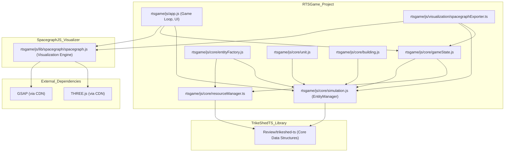
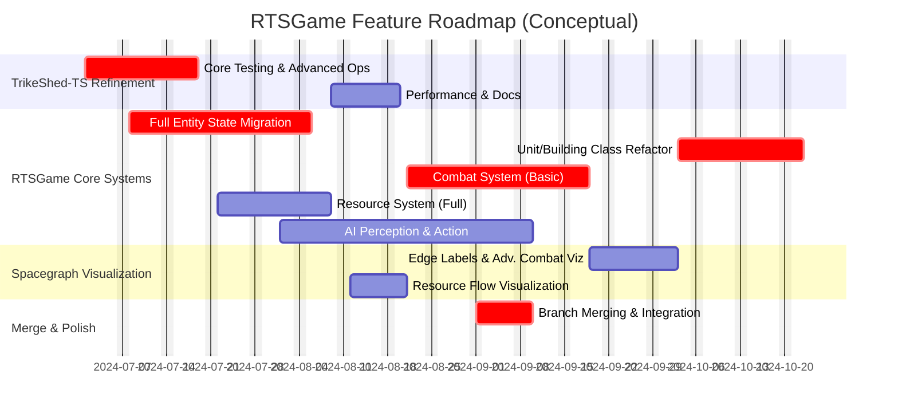

# TODO Roadmap & Project Status

This document outlines pending tasks, conceptual features, and areas for future development across the `trikeshed` and `rtsgame` projects.

## I. `trikeshed-ts` (TypeScript Data Structure Library)

### Core Functionality & API
- [ ] **P1: Comprehensive Unit Testing:** Implement a full suite of unit tests for all `trikeshed-ts` core functions and data structures (`Join`, `Series`, `Tensor`, `Cursor`).
- [ ] **P2: Advanced Tensor/Cursor Operations:**
    - [ ] Port `zip` operation.
    - [ ] Port `combine` operation.
    - [ ] Implement `linearToCoords` and `coordsToLinear` for Tensors.
    - [ ] Implement `materialize` for Tensors.
    - [ ] Implement broadcasting capabilities for binary operations.
    - [ ] Add more sophisticated slicing/dicing/reshaping methods for Tensors and Cursors (e.g., by boolean mask Series, by step/stride).
- [ ] **P2: Performance Optimization:** Profile and optimize critical paths in `Series`, `Tensor`, and `Cursor` operations, especially for immutable updates on large structures.
- [ ] **P3: Enhanced Error Handling:** Review and expand error handling for robustness (e.g., more specific error types, validation of accessor functions).
- [ ] **P2: `CursorWithMeta` and Column Operations:**
    - [ ] Implement a `CursorWithMeta<T>` concept, potentially as a class wrapping a data `Cursor` and a metadata `Series<ColumnMeta>`.
    - [ ] Implement column exclusion/selection by name (e.g., `cursor.exclude("colName")`, `cursor.select("colA", "colB")`).
    - [ ] Consider porting utility display functions like `head()` or `show()` if desired for a `trikeshed-ts-utils` package (keeping core pure).
- [ ] **P3: Documentation:** Add TSDoc comments for all public APIs in `trikeshed-ts`.

## II. `rtsgame` - Core Systems & `trikeshed-ts` Integration

### Entity System (`EntityManager`, `Unit.js`, `Building.js`, `EntityFactory.js`)
- [ ] **P1: Full Entity State Migration to `trikeshed-ts`:**
    - [ ] Define all necessary entity components (beyond position/health) in `EntityManager` Cursors (e.g., owner, current action, energy, Computronium cores, custom stats from design docs).
    - [ ] Update `EntityFactory` to initialize all entity data into these `trikeshed-ts` structures.
- [ ] **P1: Refactor `Unit.js` and `Building.js`:**
    - [ ] Remove direct state properties (e.g., `this.x`, `this.hp`).
    - [ ] Implement methods to query `EntityManager` for their state.
    - [ ] Implement methods to request state changes via `EntityManager` (which then performs immutable updates on its Cursors).
- [ ] **P2: Implement Combat Data Properties in `Unit.js`:**
    - [ ] Add logic for `isAttacking`, `currentTargetId`.
    - [ ] Implement calculation/tracking for `recentDamageDealt`.
    - [ ] Design and implement a system for `combatEfficiencyScore` (or more general "Wattage Alpha" metrics).
- [ ] **P2: Optimize Immutable Updates:** Investigate batching updates to `EntityManager` Cursors or enhancing `trikeshed-ts` with more efficient multi-update operations if performance becomes an issue.

### Resource System (`resourceManager.ts`, `gameState.js`)
- [ ] **P1: Actual Income/Cost Implementation:**
    - [ ] Integrate `BUILDING_YIELDS` from `gameConstants.js` into per-tick income calculation in `Simulation.gameLoop`.
    - [ ] Integrate `BUILDING_COSTS` and `UNIT_COSTS` (from `unitTypes.js` - needs to be defined/used) into `EntityFactory` for accurate resource deduction.
    - [ ] Ensure player ID is correctly determined for costs/income.
- [ ] **P2: Dynamic Map Resource Node Management:**
    - [ ] Implement logic for linking resource extractor structures (from `EntityManager`) to specific `mapResourceNodes` (e.g., via proximity or explicit targeting).
    - [ ] Implement actual depletion of `mapResourceNodes` in `resourceManager.ts` based on extraction rates of linked structures.
- [ ] **P3: Terrain Composition & Consumption:**
    - [ ] Design and implement `trikeshed-ts` structures for per-tile `RawLandscapeMatter` and `RawMaterialComposition` (e.g., 3D Tensor or Cursor of Series).
    - [ ] Implement "Quarry Machine" logic to extract from terrain composition.
- [ ] **P3: Advanced Resource Types:**
    - [ ] Integrate "Specific Minerals" (Ferrite, Crylithium already in `PlayerResourceType` enum, but need sources like terrain).
    - [ ] Implement "Specialized Alloys" (requires new factory logic and mineral consumption).
    - [ ] Design and implement "Battery Charge" (local unit state) and "Computational Cycles" (local unit state, related to Computronium Cores).

### Combat System (Core Logic - based on `the-rts-concepts.md`)
- [ ] **P1: Basic Combat Resolution:**
    - [ ] Implement damage calculation based on attacker's weapon stats and target's armor/shields.
    - [ ] Apply damage to HP components in `EntityManager`'s `trikeshed-ts` structures.
    - [ ] Handle unit destruction.
- [ ] **P2: Diverse Damage Types & Armor/Shield Mechanics:**
    - [ ] Implement different damage types (Kinetic, Energy, EMP, etc.).
    - [ ] Implement armor types and their specific resistances/vulnerabilities.
    - [ ] Implement shield HP, recharge, and interaction with damage types.
- [ ] **P2: Weapon Systems:**
    - [ ] Define weapon statistics (RoF, range, projectile type, energy cost, capacitor) for units.
    - [ ] Implement weapon firing logic, cooldowns, capacitor draw.
- [ ] **P3: Special Abilities & Advanced Combat Features:**
    - [ ] Implement framework for unit special abilities.
    - [ ] Consider AoE damage, status effects, etc.

### AI System (AI-Codec Philosophy)
- [ ] **P1: AI State Perception:**
    - [ ] Design and implement how AI agents read and query game state from `EntityManager`, `ResourceManager`, etc. (e.g., creating specialized views or accessors on `trikeshed-ts` data for AI).
- [ ] **P2: AI Action Representation & Execution:**
    - [ ] Define a clear data structure for AI commands/intentions.
    - [ ] Implement systems for AI agents to submit these actions.
    - [ ] Ensure the main game loop (`Simulation.gameLoop`) can process these AI actions and update the game state ("codec" function).
- [ ] **P3: Basic AI Behaviors:**
    - [ ] Implement simple AI for resource gathering (e.g., build extractors).
    - [ ] Implement simple combat AI (e.g., attack-move).
- [ ] **P3: Computronium Cores & "Dining Philosophers":** Design and implement the AI resource allocation model for unit functions.

### Command & Control (C&C)
- [ ] **P3: Basic C&C Framework:**
    - [ ] Implement concepts of command hierarchy (if applicable to AI or player control).
    - [ ] Consider how latency and PoW (as per `the-rts-concepts.md`) would affect AI command processing.

## III. `spacegraph.js` Visualization Integration

- [ ] **P2: Display Edge Labels:** Enhance `Edge` class in `spacegraph.js` to render labels (e.g., for damage on attack lines, resource flow amounts).
- [ ] **P2: Refine "Wattage Alpha" / Combat Effectiveness Visualization:**
    - [ ] Implement more meaningful calculation for `combatEfficiencyScore` in `rtsgame`.
    - [ ] Use this score for more nuanced node styling (e.g., color intensity, size modulation, icons).
- [ ] **P3: Explicit Resource Flow Visualization:**
    - [ ] Create edges representing resources moving from map nodes -> extractors -> player pools -> factories -> units.
    - [ ] Style these edges to indicate resource type and flow rate/amount.
- [ ] **P3: "Attention and Story" Heuristics:**
    - [ ] Develop logic in `spacegraphExporter` or a layer above it to identify critical events (e.g., major battle, base under attack, resource starvation) and flag corresponding nodes/edges for special highlighting in `spacegraph.js`.
- [ ] **P3: Performance for Large Graphs:** Investigate and implement optimizations if `spacegraph.js` struggles with many dynamic nodes/edges from `rtsgame`.
- [ ] **P3: Interactivity & UX for Graph:**
    - [ ] Add filtering options (e.g., show only resource graph, only combat graph for a player).
    - [ ] Implement search/focus on specific entities.
    - [ ] If replay data is available, consider time-scrubbing capabilities.

## IV. Build & Infrastructure

- [ ] **P3: Kotlin/JS Build for `trikeshed-core` (If Revisited):**
    - [ ] Resolve Gradle wrapper execution issues in a suitable build environment.
    - [ ] Confirm successful generation of actual JS artifacts from Kotlin `trikeshed-core`.
    - [ ] Evaluate if these artifacts should replace/supplement `trikeshed-ts` for any consumers.
- [ ] **P2: Automated Testing Setup:**
    - [ ] Configure Jest or similar for `trikeshed-ts`.
    - [ ] Configure testing framework for `rtsgame` integration tests.

## V. Merging Strategy

- [ ] **P1: Define Merge Order for Feature Branches:**
    - `feat-trikeshed-ts-port-and-rtsgame-integration` (Base for TS version)
    - `feat-rtsgame-resource-system` (Depends on `trikeshed-ts` integration)
    - `feat-rtsgame-spacegraph-integration-v1` (Initial Spacegraph setup)
    - `feat-rtsgame-spacegraph-combat-viz-v1` (Enhances Spacegraph with combat data)
    - Create a main development branch (e.g., `develop` or `main`) if not already standard.
    - Plan for sequential merging, resolving conflicts at each step. Consider squash merges for feature branches to keep main history cleaner.

## VI. Diagrams

### A. Component Dependencies



### B. Data Flow for Visualization

```mermaid
graph TD
    A[RTSGame State: GameState (Player Resources, Map Nodes)] --> C{spacegraphExporter.ts};
    B[RTSGame State: EntityManager (Units, Buildings, Combat Events)] --> C;
    C -- SpaceGraphData JSON --> D[Spacegraph.js: loadDynamicData()];
    D -- Parsed Nodes & Edges --> E[Spacegraph.js: Rendering Engine];
    E --> F[User View: Dynamic Graph Visualization];
```

### C. Conceptual Feature Roadmap (Gantt - Illustrative)


