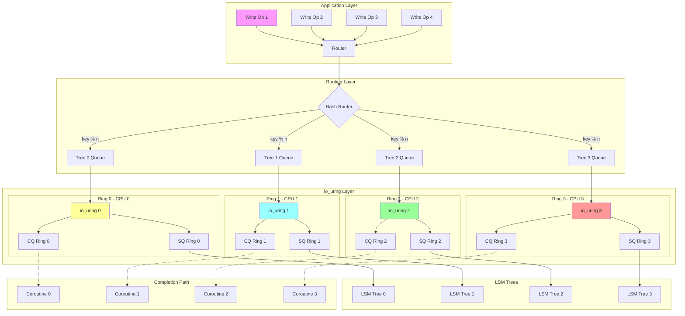
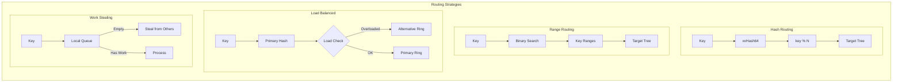
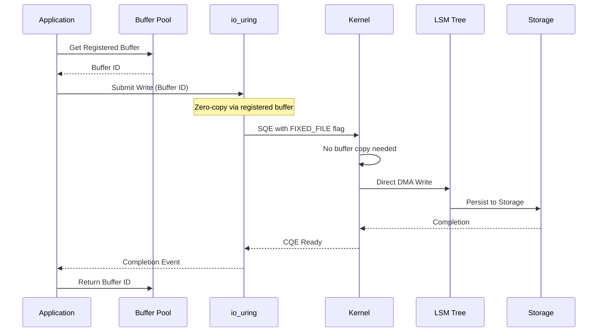

# [ARCHIVED] URING_NWAY_ROUTING.md

> **Note:** This document is now **stale** and has been **superseded** by `LINUX_ENDGAME_KERNEL_INTEGRATION.md`.
> All future development and architectural reference should use the new document.
>
> The content below is preserved for historical context only.

---

# io_uring N-Way Routing to LSM Trees

## The Core Challenge

Routing io_uring operations N-ways to multiple LSM trees while maintaining:
- Order guarantees per key
- Maximum parallelism
- Fair scheduling
- Backpressure handling

## Basic N-Way Router Design

```kotlin
class UringNWayRouter(
    val numTrees: Int,
    val ringSize: Int = 4096
) {
    // One io_uring instance per LSM tree
    val rings = Indexed<IoUring>(numTrees) { treeId ->
        IoUring(entries = ringSize / numTrees)
    }
    
    // Submission queues per tree
    val submissionQueues = Indexed<Channel<UringOp>>(numTrees) {
        Channel(capacity = Channel.UNLIMITED)
    }
    
    // Key-to-tree routing function
    fun routeKey(key: ByteArray): Int {
        // Consistent hashing to ensure same key always goes to same tree
        return key.xxhash64() % numTrees
    }
}
```

## Routing Strategies

### 1. Hash-Based Routing (Simplest)

```kotlin
class HashRouter : UringRouter {
    override suspend fun route(op: WriteOp) {
        val treeId = op.key.xxhash64() % numTrees
        
        // Submit to specific ring
        rings[treeId].submitWrite(
            fd = trees[treeId].fd,
            buffer = op.value,
            offset = trees[treeId].getOffset(op.key)
        )
    }
}
```

### 2. Range-Based Routing (Ordered)

```kotlin
class RangeRouter : UringRouter {
    // Pre-computed key ranges per tree
    val keyRanges = computeKeyRanges(numTrees)
    
    override suspend fun route(op: WriteOp) {
        val treeId = keyRanges.binarySearch { range ->
            when {
                op.key < range.start -> -1
                op.key > range.end -> 1
                else -> 0
            }
        }
        
        rings[treeId].submitWrite(op)
    }
}
```

### 3. Load-Balanced Routing

```kotlin
class LoadBalancedRouter : UringRouter {
    // Track pending ops per ring
    val pendingOps = AtomicIntArray(numTrees)
    
    override suspend fun route(op: WriteOp) {
        // Primary tree based on key
        val primary = op.key.xxhash64() % numTrees
        
        // Find least loaded ring within affinity distance
        val selected = (0 until numTrees).minBy { i ->
            val distance = (i - primary + numTrees) % numTrees
            pendingOps[i] + distance * 100 // Penalty for distance
        }
        
        pendingOps.incrementAndGet(selected)
        rings[selected].submitWrite(op)
    }
}
```

## Advanced Submission Patterns

### 4. Batch Submission Router

```kotlin
class BatchSubmissionRouter(
    val batchSize: Int = 32,
    val batchTimeout: Duration = 10.milliseconds
) {
    // Batch builders per tree
    val batches = Indexed<BatchBuilder>(numTrees) {
        BatchBuilder(batchSize)
    }
    
    suspend fun routeBatch(ops: Indexed<WriteOp>) {
        // Group by target tree
        val grouped = ops.groupBy { op -> 
            routeKey(op.key) 
        }
        
        // Submit batches in parallel
        coroutineScope {
            grouped.forEach { (treeId, treeOps) ->
                launch {
                    val sqe = rings[treeId].getSqeBatch(treeOps.size)
                    treeOps.forEachIndexed { i, op ->
                        sqe[i].prepWrite(
                            fd = trees[treeId].fd,
                            buf = op.value,
                            offset = trees[treeId].getOffset(op.key)
                        )
                    }
                    rings[treeId].submit()
                }
            }
        }
    }
}
```

### 5. Vectored I/O Router

```kotlin
class VectoredIORouter {
    // Use readv/writev for multiple operations
    suspend fun routeVectored(ops: Indexed<WriteOp>) {
        val byTree = ops.groupBy { routeKey(it.key) }
        
        byTree.forEach { (treeId, treeOps) ->
            // Build iovec array
            val iovecs = treeOps.map { op ->
                iovec(
                    base = op.value.address,
                    len = op.value.size
                )
            }.toIndexed()
            
            // Single vectored write
            rings[treeId].submitWritev(
                fd = trees[treeId].fd,
                iovecs = iovecs,
                offset = trees[treeId].currentOffset
            )
        }
    }
}
```

## Coordination Patterns

### 6. Coroutine-Per-Ring Pattern

```kotlin
class CoroutinePerRingRouter {
    init {
        // Launch coroutine per ring
        rings.forEachIndexed { treeId, ring ->
            launch {
                ringProcessor(treeId, ring)
            }
        }
    }
    
    suspend fun ringProcessor(treeId: Int, ring: IoUring) {
        while (isActive) {
            // Collect ops for this tree
            val ops = submissionQueues[treeId].receiveBatch(32)
            
            // Submit batch
            ring.submitBatch(ops)
            
            // Process completions
            ring.processCompletions { cqe ->
                handleCompletion(treeId, cqe)
            }
        }
    }
}
```

### 7. Work-Stealing Router

```kotlin
class WorkStealingRouter {
    // Deques for work stealing
    val workQueues = Indexed<ConcurrentLinkedDeque<WriteOp>>(numTrees) {
        ConcurrentLinkedDeque()
    }
    
    suspend fun stealingWorker(workerId: Int) {
        while (isActive) {
            // Try local queue first
            var op = workQueues[workerId].pollFirst()
            
            // Steal from others if empty
            if (op == null) {
                val victim = (workerId + 1 + random.nextInt(numTrees - 1)) % numTrees
                op = workQueues[victim].pollLast()
            }
            
            if (op != null) {
                rings[workerId].submitWrite(op)
            } else {
                delay(1) // Backoff
            }
        }
    }
}
```

## Ordering Guarantees

### 8. Per-Key Ordering Router

```kotlin
class PerKeyOrderingRouter {
    // Ordering queues per key hash bucket
    val orderingQueues = Indexed<Channel<WriteOp>>(numTrees * 16) {
        Channel(Channel.UNLIMITED)
    }
    
    suspend fun routeOrdered(op: WriteOp) {
        // Fine-grained key bucket
        val bucket = op.key.xxhash64() % (numTrees * 16)
        
        // Ensure ordering within bucket
        orderingQueues[bucket].send(op)
    }
    
    // Per-bucket processor
    suspend fun bucketProcessor(bucketId: Int) {
        val treeId = bucketId % numTrees
        
        for (op in orderingQueues[bucketId]) {
            rings[treeId].submitWrite(op)
            // Wait for completion before next
            rings[treeId].awaitCompletion()
        }
    }
}
```

## Complete N-Way System

### 9. Production N-Way Router

```kotlin
class ProductionUringRouter(
    val trees: Indexed<LSMTree>,
    val config: RouterConfig
) : CoroutineScope {
    override val coroutineContext = 
        Dispatchers.IO + SupervisorJob()
    
    // Rings with CPU affinity
    val rings = Indexed<IoUring>(trees.size) { treeId ->
        IoUring(
            entries = config.ringSize,
            flags = IORING_SETUP_SQPOLL or IORING_SETUP_SQ_AFF,
            sqThreadCpu = treeId % Runtime.getRuntime().availableProcessors()
        )
    }
    
    // Submission strategy
    val router = when (config.strategy) {
        Strategy.HASH -> HashRouter()
        Strategy.RANGE -> RangeRouter()
        Strategy.LOAD_BALANCED -> LoadBalancedRouter()
        Strategy.WORK_STEALING -> WorkStealingRouter()
    }
    
    // Metrics
    val metrics = RouterMetrics()
    
    fun start() {
        // Launch ring processors
        rings.forEachIndexed { id, ring ->
            launch {
                processRing(id, ring)
            }
        }
        
        // Launch completion handler
        launch {
            completionAggregator()
        }
        
        // Launch rebalancer
        launch {
            periodicRebalance()
        }
    }
    
    suspend fun submitWrite(key: ByteArray, value: ByteArray) {
        metrics.writes.increment()
        router.route(WriteOp(key, value))
    }
    
    suspend fun periodicRebalance() {
        while (isActive) {
            delay(config.rebalanceInterval)
            
            // Check for hotspots
            val loadPerTree = metrics.getLoadPerTree()
            if (loadPerTree.stdDev() > config.loadThreshold) {
                rebalanceKeyRanges()
            }
        }
    }
}
```

### 10. Zero-Copy Integration

```kotlin
class ZeroCopyRouter {
    // Registered buffers for zero-copy
    val registeredBuffers = Indexed<RegisteredBufferRing>(numTrees) { treeId ->
        rings[treeId].registerBufferRing(
            bufferSize = 4096,
            ringEntries = 1024
        )
    }
    
    suspend fun zeroRoute(op: WriteOp) {
        val treeId = routeKey(op.key)
        
        // Get buffer from registered ring
        val bufId = registeredBuffers[treeId].getBuffer()
        
        // Zero-copy write using buffer ID
        rings[treeId].submitWriteFixed(
            fd = trees[treeId].fd,
            bufId = bufId,
            offset = trees[treeId].getOffset(op.key)
        )
    }
}
```

## Key Insights

1. **Ring per tree** - Avoids contention,  allows CPU affinity
2. **Consistent routing** - Same key always goes to same tree
3. **Batch submission** - Amortize syscall overhead
4. **Work stealing** - Balance load dynamically
5. **Ordering queues** - Maintain per-key guarantees
6. **Zero-copy paths** - Use registered buffers
7. **Coroutine coordination** - Natural async/await patterns

The key is treating each io_uring as a coroutine context that maps to an LSM tree!

## N-Way Routing Architecture



## Advanced Routing Patterns



## Zero-Copy Data Flow

