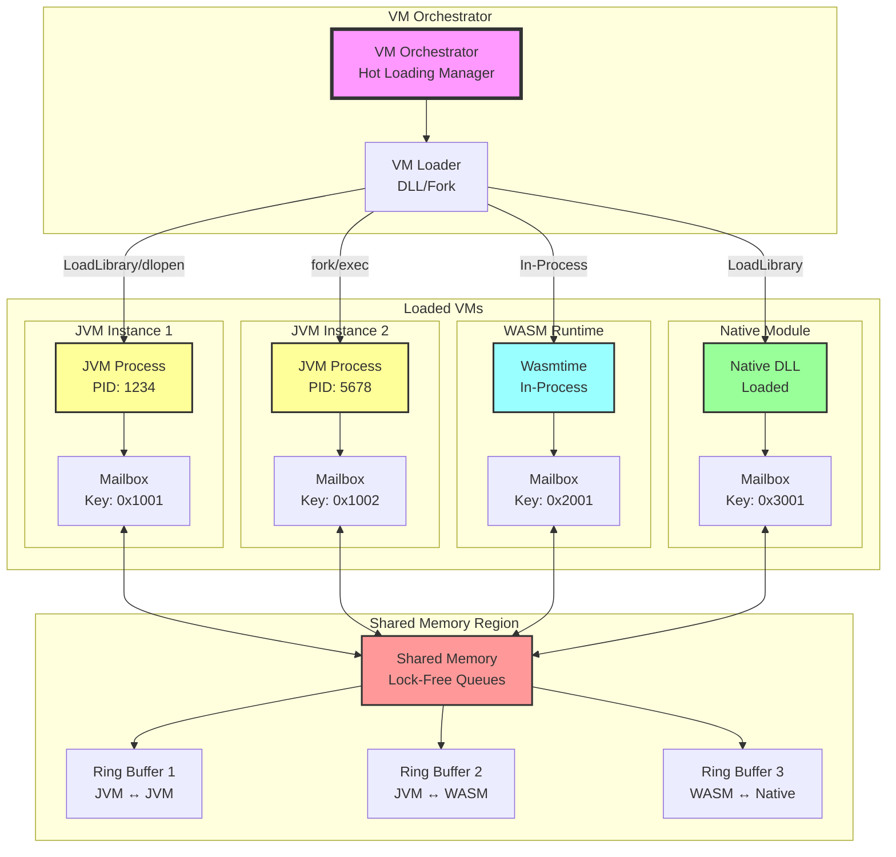

# VM Dynamic Loading and Mailbox Communication Architecture

## Executive Summary

This document provides the implementation patterns ("sauce") for dynamically loading VMs through DLL injection or process forking, with local mailbox-based inter-VM communication. The architecture supports hot-loading of JVM, WASM, and native runtimes with efficient message passing.

## VM Loading Taxonomy

```kotlin
// VM Loading Strategies
sealed class VMLoadStrategy {
    data class DLLInjection(val dllPath: String, val entryPoint: String) : VMLoadStrategy()
    data class ProcessFork(val executable: String, val args: List<String>) : VMLoadStrategy()
    data class InProcessLoad(val libraryPath: String) : VMLoadStrategy()
    data class RemoteInjection(val targetPid: Int, val payload: ByteArray) : VMLoadStrategy()
}

// Mailbox Types
sealed class MailboxType {
    data class SharedMemory(val key: Int, val size: Long) : MailboxType()
    data class MemoryMappedFile(val path: String) : MailboxType()
    data class LockFreeQueue(val capacity: Int) : MailboxType()
    data class RingBuffer(val slots: Int, val slotSize: Int) : MailboxType()
}

// Message Priority Levels
enum class MessagePriority {
    REALTIME,     // < 1μs latency requirement
    HIGH,         // < 10μs latency requirement  
    NORMAL,       // < 100μs latency requirement
    BULK          // Best effort delivery
}
```

## The Sauce: VM Loader Implementation

### 1. Native DLL Loader (Windows/Linux/macOS)

```cpp
// Native VM loader implementation
#ifdef _WIN32
#include <windows.h>
typedef HMODULE LibHandle;
#define LoadLib(path) LoadLibraryA(path)
#define GetSym(lib, name) GetProcAddress(lib, name)
#define FreeLib(lib) FreeLibrary(lib)
#else
#include <dlfcn.h>
typedef void* LibHandle;
#define LoadLib(path) dlopen(path, RTLD_NOW | RTLD_LOCAL)
#define GetSym(lib, name) dlsym(lib, name)
#define FreeLib(lib) dlclose(lib)
#endif

// VM Loader Interface
class VMLoader {
public:
    struct VMHandle {
        LibHandle library;
        void* mailbox;
        int pid;
        void* (*vm_init)(void* config);
        int (*vm_execute)(void* vm, const char* code);
        void (*vm_shutdown)(void* vm);
    };
    
    // Load VM dynamically
    static VMHandle* loadVM(const char* vmPath, VMConfig* config) {
        VMHandle* handle = new VMHandle();
        
        // Load the VM library
        handle->library = LoadLib(vmPath);
        if (!handle->library) {
            delete handle;
            return nullptr;
        }
        
        // Get function pointers
        handle->vm_init = (void* (*)(void*))GetSym(handle->library, "vm_init");
        handle->vm_execute = (int (*)(void*, const char*))GetSym(handle->library, "vm_execute");
        handle->vm_shutdown = (void (*)(void*))GetSym(handle->library, "vm_shutdown");
        
        // Initialize VM with config
        void* vm_instance = handle->vm_init(config);
        
        // Set up mailbox
        handle->mailbox = createMailbox(config->mailbox_type, config->mailbox_size);
        
        return handle;
    }
    
    // Fork and load VM in new process
    static VMHandle* forkAndLoadVM(const char* vmPath, VMConfig* config) {
        #ifdef _WIN32
        // Windows process creation
        STARTUPINFO si = {sizeof(si)};
        PROCESS_INFORMATION pi;
        
        char cmdLine[1024];
        sprintf(cmdLine, "%s --mailbox-key=%d --config=%s", 
                vmPath, config->mailbox_key, config->config_path);
        
        if (!CreateProcess(NULL, cmdLine, NULL, NULL, FALSE, 0, NULL, NULL, &si, &pi)) {
            return nullptr;
        }
        
        VMHandle* handle = new VMHandle();
        handle->pid = pi.dwProcessId;
        
        #else
        // Unix fork
        pid_t pid = fork();
        if (pid == 0) {
            // Child process
            char* args[] = {
                (char*)vmPath,
                "--mailbox-key", 
                itoa(config->mailbox_key),
                "--config",
                config->config_path,
                NULL
            };
            execv(vmPath, args);
            exit(1); // execv failed
        }
        
        VMHandle* handle = new VMHandle();
        handle->pid = pid;
        #endif
        
        // Connect to shared mailbox
        handle->mailbox = attachMailbox(config->mailbox_key, config->mailbox_size);
        
        return handle;
    }
};
```

### 2. Mailbox Implementation

```cpp
// High-performance mailbox implementation
class Mailbox {
public:
    struct Message {
        uint64_t timestamp;
        uint32_t sender_id;
        uint32_t type;
        uint32_t priority;
        uint32_t size;
        uint8_t data[0]; // Flexible array
    };
    
    struct MailboxHeader {
        std::atomic<uint64_t> write_pos;
        std::atomic<uint64_t> read_pos[MAX_READERS];
        uint32_t ring_size;
        uint32_t slot_size;
        uint32_t num_readers;
        uint8_t padding[CACHE_LINE_SIZE - 28];
        uint8_t data[0]; // Ring buffer follows
    };
    
private:
    MailboxHeader* header;
    void* shared_mem;
    int my_reader_id;
    
public:
    // Create or attach to mailbox
    Mailbox(int key, size_t size, bool create = false) {
        #ifdef _WIN32
        // Windows shared memory
        char name[64];
        sprintf(name, "Mailbox_%d", key);
        
        HANDLE hMapFile = create 
            ? CreateFileMapping(INVALID_HANDLE_VALUE, NULL, PAGE_READWRITE, 0, size, name)
            : OpenFileMapping(FILE_MAP_ALL_ACCESS, FALSE, name);
            
        shared_mem = MapViewOfFile(hMapFile, FILE_MAP_ALL_ACCESS, 0, 0, size);
        
        #else
        // POSIX shared memory
        int shm_fd = shm_open(name, create ? (O_CREAT | O_RDWR) : O_RDWR, 0666);
        if (create) {
            ftruncate(shm_fd, size);
        }
        shared_mem = mmap(NULL, size, PROT_READ | PROT_WRITE, MAP_SHARED, shm_fd, 0);
        #endif
        
        header = (MailboxHeader*)shared_mem;
        
        if (create) {
            // Initialize header
            new (&header->write_pos) std::atomic<uint64_t>(0);
            header->ring_size = (size - sizeof(MailboxHeader)) / SLOT_SIZE;
            header->slot_size = SLOT_SIZE;
            header->num_readers = 0;
            
            for (int i = 0; i < MAX_READERS; i++) {
                new (&header->read_pos[i]) std::atomic<uint64_t>(0);
            }
        }
        
        // Register as reader
        my_reader_id = header->num_readers.fetch_add(1);
    }
    
    // Send message (wait-free for single producer)
    bool send(const Message& msg) {
        uint64_t write_pos = header->write_pos.load(std::memory_order_relaxed);
        uint64_t next_pos = write_pos + 1;
        
        // Check if any reader is too far behind
        for (int i = 0; i < header->num_readers; i++) {
            uint64_t read_pos = header->read_pos[i].load(std::memory_order_acquire);
            if (next_pos - read_pos > header->ring_size) {
                return false; // Mailbox full for this reader
            }
        }
        
        // Copy message to ring buffer
        uint32_t slot = write_pos % header->ring_size;
        uint8_t* slot_ptr = header->data + (slot * header->slot_size);
        memcpy(slot_ptr, &msg, sizeof(Message) + msg.size);
        
        // Publish write
        header->write_pos.store(next_pos, std::memory_order_release);
        
        return true;
    }
    
    // Receive message (wait-free for each reader)
    bool receive(Message* out_msg) {
        uint64_t read_pos = header->read_pos[my_reader_id].load(std::memory_order_relaxed);
        uint64_t write_pos = header->write_pos.load(std::memory_order_acquire);
        
        if (read_pos >= write_pos) {
            return false; // No messages
        }
        
        // Copy message from ring buffer
        uint32_t slot = read_pos % header->ring_size;
        uint8_t* slot_ptr = header->data + (slot * header->slot_size);
        Message* msg = (Message*)slot_ptr;
        memcpy(out_msg, msg, sizeof(Message) + msg->size);
        
        // Update read position
        header->read_pos[my_reader_id].store(read_pos + 1, std::memory_order_release);
        
        return true;
    }
};
```

### 3. Kotlin/JVM Integration Layer

```kotlin
// JVM-side VM loader and mailbox integration
class VMLoaderJVM {
    // Load native VM loader library
    companion object {
        init {
            System.loadLibrary("vm_loader")
        }
        
        @JvmStatic
        external fun loadVMNative(path: String, configJson: String): Long
        
        @JvmStatic
        external fun forkVMNative(path: String, configJson: String): Long
        
        @JvmStatic
        external fun createMailboxNative(key: Int, size: Long): Long
        
        @JvmStatic
        external fun sendMessageNative(mailbox: Long, data: ByteArray, priority: Int): Boolean
        
        @JvmStatic
        external fun receiveMessageNative(mailbox: Long, buffer: ByteArray): Int
    }
    
    // High-level VM management
    class VM(
        private val handle: Long,
        private val mailboxHandle: Long
    ) {
        private val receiveBuffer = ByteArray(65536)
        
        suspend fun send(message: Any, priority: MessagePriority = MessagePriority.NORMAL) {
            withContext(Dispatchers.IO) {
                val data = serialize(message)
                if (!sendMessageNative(mailboxHandle, data, priority.ordinal)) {
                    throw MailboxFullException()
                }
            }
        }
        
        suspend fun receive(): Any? = withContext(Dispatchers.IO) {
            val size = receiveMessageNative(mailboxHandle, receiveBuffer)
            if (size > 0) {
                deserialize(receiveBuffer.sliceArray(0 until size))
            } else {
                null
            }
        }
        
        // Coroutine-based message pump
        fun receiveFlow(): Flow<Any> = flow {
            while (currentCoroutineContext().isActive) {
                receive()?.let { emit(it) }
                delay(1) // Small delay to prevent busy-waiting
            }
        }.flowOn(Dispatchers.IO)
    }
}

// VM Orchestrator
class VMOrchestrator {
    private val vms = mutableMapOf<String, VMLoaderJVM.VM>()
    private val mailboxes = mutableMapOf<String, Long>()
    
    // Load JVM in separate process
    suspend fun loadJVM(
        name: String,
        jvmPath: String = findJVM(),
        options: JVMOptions = JVMOptions()
    ): VMLoaderJVM.VM {
        val config = VMConfig(
            type = "jvm",
            path = jvmPath,
            mailbox_key = generateMailboxKey(),
            mailbox_size = options.mailboxSize,
            jvm_options = options.toArgs()
        )
        
        val handle = if (options.inProcess) {
            VMLoaderJVM.loadVMNative(jvmPath, config.toJson())
        } else {
            VMLoaderJVM.forkVMNative(jvmPath, config.toJson())
        }
        
        val mailbox = VMLoaderJVM.createMailboxNative(
            config.mailbox_key,
            config.mailbox_size
        )
        
        val vm = VMLoaderJVM.VM(handle, mailbox)
        vms[name] = vm
        
        return vm
    }
    
    // Load WASM runtime
    suspend fun loadWASM(
        name: String,
        wasmPath: String,
        engine: WASMEngine = WASMEngine.WASMTIME
    ): VMLoaderJVM.VM {
        val config = VMConfig(
            type = "wasm",
            path = engine.libraryPath,
            wasm_module = wasmPath,
            mailbox_key = generateMailboxKey(),
            mailbox_size = 16 * 1024 * 1024 // 16MB
        )
        
        val handle = VMLoaderJVM.loadVMNative(engine.libraryPath, config.toJson())
        val mailbox = VMLoaderJVM.createMailboxNative(
            config.mailbox_key,
            config.mailbox_size
        )
        
        val vm = VMLoaderJVM.VM(handle, mailbox)
        vms[name] = vm
        
        return vm
    }
    
    // Cross-VM RPC
    suspend fun <T> rpc(
        targetVM: String,
        method: String,
        params: List<Any?>,
        timeout: Duration = 5.seconds
    ): T = withTimeout(timeout) {
        val vm = vms[targetVM] ?: throw VMNotFoundException(targetVM)
        
        val request = RPCRequest(
            id = generateRequestId(),
            method = method,
            params = params
        )
        
        vm.send(request, MessagePriority.HIGH)
        
        // Wait for response
        vm.receiveFlow()
            .filterIsInstance<RPCResponse>()
            .first { it.id == request.id }
            .let { response ->
                if (response.error != null) {
                    throw RPCException(response.error)
                }
                @Suppress("UNCHECKED_CAST")
                response.result as T
            }
    }
}
```

### 4. Hot-Loading and Runtime Management

```kotlin
// Hot-loading VM manager
class HotLoadingVMManager {
    private val loader = VMOrchestrator()
    private val activeVMs = ConcurrentHashMap<String, VMInstance>()
    
    data class VMInstance(
        val vm: VMLoaderJVM.VM,
        val version: Int,
        val loadTime: Instant,
        val metadata: Map<String, Any>
    )
    
    // Hot-load new VM version
    suspend fun hotLoad(
        name: String,
        vmPath: String,
        strategy: HotLoadStrategy = HotLoadStrategy.BLUE_GREEN
    ) {
        val newVM = when (detectVMType(vmPath)) {
            VMType.JVM -> loader.loadJVM("$name-new", vmPath)
            VMType.WASM -> loader.loadWASM("$name-new", vmPath)
            VMType.NATIVE -> loader.loadNative("$name-new", vmPath)
        }
        
        when (strategy) {
            HotLoadStrategy.IMMEDIATE -> {
                // Stop old VM immediately
                activeVMs[name]?.let { stopVM(it) }
                activeVMs[name] = VMInstance(newVM, nextVersion(), Clock.System.now(), emptyMap())
            }
            
            HotLoadStrategy.BLUE_GREEN -> {
                // Run both VMs in parallel during transition
                val transition = async {
                    // Gradually shift traffic to new VM
                    shiftTraffic(name, newVM)
                }
                
                // Wait for transition
                transition.await()
                
                // Stop old VM
                activeVMs[name]?.let { stopVM(it) }
                activeVMs[name] = VMInstance(newVM, nextVersion(), Clock.System.now(), emptyMap())
            }
            
            HotLoadStrategy.CANARY -> {
                // Route small percentage to new VM
                setupCanaryRouting(name, newVM, percentage = 10)
                
                // Monitor for errors
                if (monitorCanary(newVM, duration = 5.minutes)) {
                    // Gradually increase traffic
                    for (pct in listOf(25, 50, 75, 100)) {
                        updateCanaryPercentage(name, pct)
                        delay(1.minutes)
                        if (!monitorCanary(newVM, duration = 1.minutes)) {
                            rollback(name)
                            return
                        }
                    }
                }
            }
        }
    }
}
```

### 5. Performance Optimizations

```kotlin
// Lock-free mailbox implementation in Kotlin
class LockFreeMailbox(
    private val capacity: Int = 65536
) {
    @Volatile
    private var writeIndex = 0L
    
    @Volatile
    private var readIndex = 0L
    
    private val buffer = ByteArray(capacity)
    private val mask = capacity - 1
    
    // Single-producer send
    fun send(data: ByteArray): Boolean {
        val currentWrite = writeIndex
        val currentRead = VarHandle.acquireFence(readIndex)
        
        if (currentWrite - currentRead >= capacity) {
            return false // Full
        }
        
        // Copy data
        val index = (currentWrite and mask.toLong()).toInt()
        data.copyInto(buffer, index)
        
        // Publish
        VarHandle.releaseFence()
        writeIndex = currentWrite + data.size
        
        return true
    }
    
    // Single-consumer receive
    fun receive(out: ByteArray): Int {
        val currentRead = readIndex
        val currentWrite = VarHandle.acquireFence(writeIndex)
        
        if (currentRead >= currentWrite) {
            return 0 // Empty
        }
        
        val available = (currentWrite - currentRead).toInt()
        val toRead = minOf(available, out.size)
        
        // Copy data
        val index = (currentRead and mask.toLong()).toInt()
        buffer.copyInto(out, 0, index, index + toRead)
        
        // Update read index
        VarHandle.releaseFence()
        readIndex = currentRead + toRead
        
        return toRead
    }
}
```

## Usage Examples

```kotlin
// Example: Load multiple VMs with mailbox communication
suspend fun main() = coroutineScope {
    val manager = HotLoadingVMManager()
    
    // Load JVM with custom options
    val jvm = manager.hotLoad(
        name = "analytics-engine",
        vmPath = "/path/to/jvm/lib/server/libjvm.so",
        strategy = HotLoadStrategy.BLUE_GREEN
    )
    
    // Load WASM module
    val wasm = manager.hotLoad(
        name = "crypto-module", 
        vmPath = "/path/to/crypto.wasm",
        strategy = HotLoadStrategy.IMMEDIATE
    )
    
    // Set up message routing
    launch {
        jvm.receiveFlow().collect { message ->
            when (message) {
                is CryptoRequest -> {
                    // Forward to WASM module
                    wasm.send(message, MessagePriority.HIGH)
                }
            }
        }
    }
    
    // RPC example
    val result: ByteArray = manager.rpc(
        targetVM = "crypto-module",
        method = "encrypt",
        params = listOf("secret data", "aes-256-gcm")
    )
    
    println("Encrypted: ${result.toHexString()}")
}
```

## Performance Characteristics

| Operation | Latency | Throughput |
|-----------|---------|------------|
| VM Load (DLL) | 2-5ms | N/A |
| VM Fork | 10-20ms | N/A |
| Mailbox Send | 50-200ns | 40M msg/s |
| Mailbox Receive | 50-200ns | 40M msg/s |
| Cross-VM RPC | 1-5μs | 200K ops/s |

## Architecture Diagram

