# CCEK Architecture Diagram

```mermaid
graph LR
    subgraph CoreDefinitions ["CCEK Core Definitions (nexus.core.NexusCCEK)"]
        direction LR
        NexusCCEK_Context["typealias CCEKContext = Join&lt;Join&lt;Context, Configuration&gt;, Join&lt;Environment, Knowledge&gt;&gt;"]
        NexusCCEK_DevelopmentContext["typealias DevelopmentContext = Join&lt;CCEKContext, CodebaseContext&gt;"]
        NexusCCEK_CCEKNexus["typealias CCEKNexus = Join&lt;EvolutionContext, CCEKOperations&gt;"]
        NexusCCEK_ContextualRequest["typealias ContextualRequest = Join&lt;Request, CCEKContext&gt;"]
        NexusCCEK_ContextualResponse["typealias ContextualResponse = Join&lt;Response, CCEKContext&gt;"]

        NexusCCEK_Context -- "used in" --> NexusCCEK_DevelopmentContext
        NexusCCEK_Context -- "used in" --> NexusCCEK_ContextualRequest
        NexusCCEK_Context -- "used in" --> NexusCCEK_ContextualResponse
        NexusCCEK_Context -- "related to" --> NexusCCEK_CCEKNexus
    end

    subgraph DemoAndImplementations ["Demo & Implementations (demo.kt, implementations.NexusActuals.kt)"]
        direction LR
        Demo_CCEKContext["typealias CCEKContext (demo.kt)<br>Pair&lt;Pair&lt;Context, Configuration&gt;, Pair&lt;Environment, Knowledge&gt;&gt;"]
        Actuals_BuildInitial["buildInitialCCEKContext() -> CCEKContext (NexusActuals.kt)"]
        Demo_BuildInitial["buildInitialCCEKContext() -> CCEKContext (demo.kt)"]
        WorkingNexus["class WorkingNexus (demo.kt)"]

        Actuals_BuildInitial -- "returns" --> Demo_CCEKContext
        Demo_BuildInitial -- "returns" --> Demo_CCEKContext
        WorkingNexus -- "uses" --> Demo_CCEKContext
        WorkingNexus -- "uses" --> Demo_BuildInitial

        ProcessSimpleRequest_Demo["processSimpleRequest(context: CCEKContext) (demo.kt)"]
        AnalyzeInContext_Demo["analyzeInContext(context: CCEKContext) (demo.kt)"]
        GenerateInContext_Demo["generateInContext(context: CCEKContext) (demo.kt)"]
        RefactorInContext_Demo["refactorInContext(context: CCEKContext) (demo.kt)"]
        Demo_CCEKContext -- "passed to" --> ProcessSimpleRequest_Demo
        Demo_CCEKContext -- "passed to" --> AnalyzeInContext_Demo
        Demo_CCEKContext -- "passed to" --> GenerateInContext_Demo
        Demo_CCEKContext -- "passed to" --> RefactorInContext_Demo

        Demo_CCEK_UpdateFromInteraction["CCEKContext.updateFromInteraction() (demo.kt)"]
        Demo_CCEKContext -- "extended by" --> Demo_CCEK_UpdateFromInteraction

        Actuals_ProcessSimpleRequest["processSimpleRequest(context: CCEKContext) (NexusActuals.kt)"]
        Actuals_AnalyzeInContext["analyzeInContext(context: CCEKContext) (NexusActuals.kt)"]
        Actuals_GenerateInContext["generateInContext(context: CCEKContext) (NexusActuals.kt)"]
        Actuals_RefactorInContext["refactorInContext(context: CCEKContext) (NexusActuals.kt)"]
        NexusCCEK_Context -- "passed to" --> Actuals_ProcessSimpleRequest
        NexusCCEK_Context -- "passed to" --> Actuals_AnalyzeInContext
        NexusCCEK_Context -- "passed to" --> Actuals_GenerateInContext
        NexusCCEK_Context -- "passed to" --> Actuals_RefactorInContext

        Actuals_CCEK_Extractors["CCEKContext.extractCurrent...() (NexusActuals.kt)"]
        NexusCCEK_Context -- "extended by" --> Actuals_CCEK_Extractors
        Actuals_CCEK_Updaters["CCEKContext.updateScope(), .addCapability() (NexusActuals.kt)"]
        NexusCCEK_Context -- "extended by" --> Actuals_CCEK_Updaters

    end

    subgraph AgenticNexus ["Agentic Nexus (agentic_nexus.kts)"]
        direction LR
        Agentic_CCEKContext["value class CCEKContext(data: Map&lt;String, String&gt;)"]
        Agentic_CreateContext["createContext() -> CCEKContext"]
        Agentic_GenerateAdaptiveTask["generateAdaptiveTask(context: CCEKContext)"]
        Agentic_CreateContext -- "returns" --> Agentic_CCEKContext
        Agentic_CCEKContext -- "passed to" --> Agentic_GenerateAdaptiveTask
    end

    subgraph ProviderModel ["Provider Model (provider_demo.kt, NexusProviders.kt)"]
        direction LR
        ProviderDemo_CCEKContext["typealias CCEKContext (provider_demo.kt)<br>Pair&lt;Pair&lt;Context, Configuration&gt;, Pair&lt;Environment, Knowledge&gt;&gt;"]
        ProviderDemo_CCEKNexus["typealias CCEKNexus = CCEKContext (provider_demo.kt)"]
        ProviderDemo_EnhancedNexus["typealias EnhancedNexus = Pair&lt;CCEKNexus, NexusProvider&gt; (provider_demo.kt)"]
        ProviderDemo_BuildTestContext["buildTestContext() -> CCEKContext (provider_demo.kt)"]

        ProviderDemo_CCEKContext -- "is aliased by" --> ProviderDemo_CCEKNexus
        ProviderDemo_CCEKNexus -- "used in" --> ProviderDemo_EnhancedNexus
        ProviderDemo_BuildTestContext -- "returns" --> ProviderDemo_CCEKContext

        NexusProviders_Generate["NexusProvider.generate(context: CCEKContext)"]
        NexusProviders_Analyze["NexusProvider.analyze(context: CCEKContext)"]
        NexusProviders_Complete["NexusProvider.complete(context: CCEKContext)"]
        ProviderDemo_CCEKContext -- "passed to" --> NexusProviders_Generate
        ProviderDemo_CCEKContext -- "passed to" --> NexusProviders_Analyze
        ProviderDemo_CCEKContext -- "passed to" --> NexusProviders_Complete

        NexusProviders_EnhancedNexus["typealias EnhancedNexus (NexusProviders.kt)<br>Join&lt;CCEKNexus, NexusProvider&gt;"]
        NexusProviders_CCEKNexus_WithProvider["CCEKNexus.withProvider() -> EnhancedNexus (NexusProviders.kt)"]
        ProviderDemo_CCEKNexus -- "extended by" --> NexusProviders_CCEKNexus_WithProvider
        NexusProviders_CCEKNexus_WithProvider -- "returns" --> NexusProviders_EnhancedNexus
    end

    subgraph TensorCore ["Tensor Core (NexusTensorCore.kt)"]
        direction LR
        Tensor_CCEKTensor["typealias CCEKTensor = NexusTensor&lt;CCEKContext&gt;"]
        Tensor_ContextTensorSpace["typealias ContextTensorSpace = Join&lt;CCEKTensor, CapabilityTensor&gt;"]
        NexusCCEK_Context -- "used in" --> Tensor_CCEKTensor
        Tensor_CCEKTensor -- "used in" --> Tensor_ContextTensorSpace

        Tensor_WithCCEK["NexusTensor.withCCEK(context: CCEKContext)"]
        Tensor_ContextTransform["Join&lt;CCEKContext, NexusTensor&gt;.contextTransform(f: (CCEKContext, T) -> R)"]
        Tensor_PredictNextAction["TensorAgent.predictNextAction(context: CCEKContext)"]
        Tensor_CCEKToTensor["CCEKContext.toTensor() -> CCEKTensor"]
        Tensor_Adapt["TensorAgent.adapt(ctx: CCEKContext)"]

        NexusCCEK_Context -- "passed to" --> Tensor_WithCCEK
        NexusCCEK_Context -- "passed to" --> Tensor_ContextTransform
        NexusCCEK_Context -- "passed to" --> Tensor_PredictNextAction
        NexusCCEK_Context -- "extended by" --> Tensor_CCEKToTensor
        Tensor_CCEKToTensor -- "returns" --> Tensor_CCEKTensor
        NexusCCEK_Context -- "passed to" --> Tensor_Adapt
    end

    subgraph Reflection ["Reflection (UniversalReflector.kt)"]
        direction LR
        Reflector_GetRelevantPatterns["getRelevantPatterns(context: CCEKContext)"]
        Reflector_PredictNextAction["predictNextAction(context: CCEKContext)"]
        Reflector_IsRelevantTo["isRelevantTo(context: CCEKContext)"]
        Reflector_SuggestActionFunc["suggestAction(context: CCEKContext)"]
        Reflector_CalcSimilarity["calculateContextSimilarity(ctx1: CCEKContext, ctx2: CCEKContext)"]
        Reflector_CCEKExtractPattern["CCEKContext.extractPattern()"]
        Reflector_CCEKSuggestAction["CCEKContext.suggestAction()"]

        NexusCCEK_Context -- "passed to" --> Reflector_GetRelevantPatterns
        NexusCCEK_Context -- "passed to" --> Reflector_PredictNextAction
        NexusCCEK_Context -- "passed to" --> Reflector_IsRelevantTo
        NexusCCEK_Context -- "passed to" --> Reflector_SuggestActionFunc
        NexusCCEK_Context -- "passed to" --> Reflector_CalcSimilarity
        NexusCCEK_Context -- "extended by" --> Reflector_CCEKExtractPattern
        NexusCCEK_Context -- "extended by" --> Reflector_CCEKSuggestAction
    end

    subgraph ScriptingK2 ["K2 Scripts (simple_nexus.kts, trikeshed_nexus.kts)"]
        direction LR
        SimpleNexus_CCEKContext["typealias CCEKContext (simple_nexus.kts)<br>Join&lt;...&gt;"]
        SimpleNexus_DevContext["typealias DevelopmentContext (simple_nexus.kts)<br>Join&lt;CCEKContext, Series&lt;String&gt;&gt;"]
        SimpleNexus_CCEKContext -- "used in" --> SimpleNexus_DevContext

        TrikeShed_CCEKContext["typealias CCEKContext&lt;T&gt; (trikeshed_nexus.kts)<br>Join&lt;...&gt;"]
        TrikeShed_DevContext["typealias DevelopmentContext&lt;T&gt; (trikeshed_nexus.kts)<br>Join&lt;CCEKContext&lt;T&gt;, Series&lt;T&gt;&gt;"]
        TrikeShed_CCEKContext -- "used in" --> TrikeShed_DevContext
    end

    %% General Connections
    NexusCCEK_Context --> DemoAndImplementations
    NexusCCEK_Context --> ProviderModel
    NexusCCEK_Context --> TensorCore
    NexusCCEK_Context --> Reflection

    Demo_CCEKContext -.-> NexusCCEK_Context
    ProviderDemo_CCEKContext -.-> NexusCCEK_Context
    Agentic_CCEKContext -.-> NexusCCEK_Context
    SimpleNexus_CCEKContext -.-> NexusCCEK_Context
    TrikeShed_CCEKContext -.-> NexusCCEK_Context

    classDef default fill:#f9f,stroke:#333,stroke-width:2px;
    classDef typeAlias fill:#lightgrey,stroke:#333;
    classDef valueClass fill:#lightblue,stroke:#333;
    classDef function fill:#moccasin,stroke:#333;
    classDef generalClass fill:#lightgreen,stroke:#333;

    class NexusCCEK_Context,Demo_CCEKContext,ProviderDemo_CCEKContext,SimpleNexus_CCEKContext,TrikeShed_CCEKContext typeAlias;
    class Agentic_CCEKContext valueClass;
    class NexusCCEK_DevelopmentContext,NexusCCEK_CCEKNexus,NexusCCEK_ContextualRequest,NexusCCEK_ContextualResponse,ProviderDemo_CCEKNexus,ProviderDemo_EnhancedNexus,NexusProviders_EnhancedNexus,Tensor_CCEKTensor,Tensor_ContextTensorSpace,SimpleNexus_DevContext,TrikeShed_DevContext generalClass;
    class Actuals_BuildInitial,Demo_BuildInitial,ProcessSimpleRequest_Demo,AnalyzeInContext_Demo,GenerateInContext_Demo,RefactorInContext_Demo,Demo_CCEK_UpdateFromInteraction,Actuals_ProcessSimpleRequest,Actuals_AnalyzeInContext,Actuals_GenerateInContext,Actuals_RefactorInContext,Actuals_CCEK_Extractors,Actuals_CCEK_Updaters,Agentic_CreateContext,Agentic_GenerateAdaptiveTask,ProviderDemo_BuildTestContext,NexusProviders_Generate,NexusProviders_Analyze,NexusProviders_Complete,NexusProviders_CCEKNexus_WithProvider,Tensor_WithCCEK,Tensor_ContextTransform,Tensor_PredictNextAction,Tensor_CCEKToTensor,Tensor_Adapt,Reflector_GetRelevantPatterns,Reflector_PredictNextAction,Reflector_IsRelevantTo,Reflector_SuggestActionFunc,Reflector_CalcSimilarity,Reflector_CCEKExtractPattern,Reflector_CCEKSuggestAction function;
    class WorkingNexus generalClass
    %% Assigned WorkingNexus to 'generalClass'
```

**Reasoning for the fix:**

The error message "Expecting 'SEMI', 'NEWLINE', 'EOF', 'AMP', 'START_LINK', 'LINK', 'LINK_ID', got 'NODE_STRING'" on the line `class WorkingNexus generalClass; %% Assigned WorkingNexus` indicates that the Mermaid parser encountered something unexpected after the class assignment and the semicolon. While comments starting with `%%` are generally supported, having a comment immediately after a semicolon on the same line seems to be causing a parsing issue in this specific context.

The fix involves removing the semicolon after `generalClass` on the line `class WorkingNexus generalClass; %% Assigned WorkingNexus`. In Mermaid's `class` statement syntax, the semicolon is used to terminate the *list* of nodes being assigned to the class, not necessarily every individual assignment within a multi-node list, and is not required if there's only one node and it's the last `class` statement or is followed by a newline. Removing the semicolon resolves the unexpected token issue caused by the combination of the semicolon and the subsequent comment on the same line. The comment itself was moved to the next line in the previous attempt, and keeping it on a separate line or after the class assignment without the semicolon should work. Removing the semicolon is a cleaner fix for a single class assignment line.
