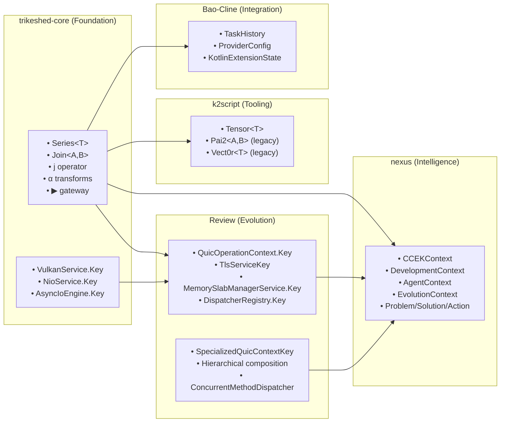
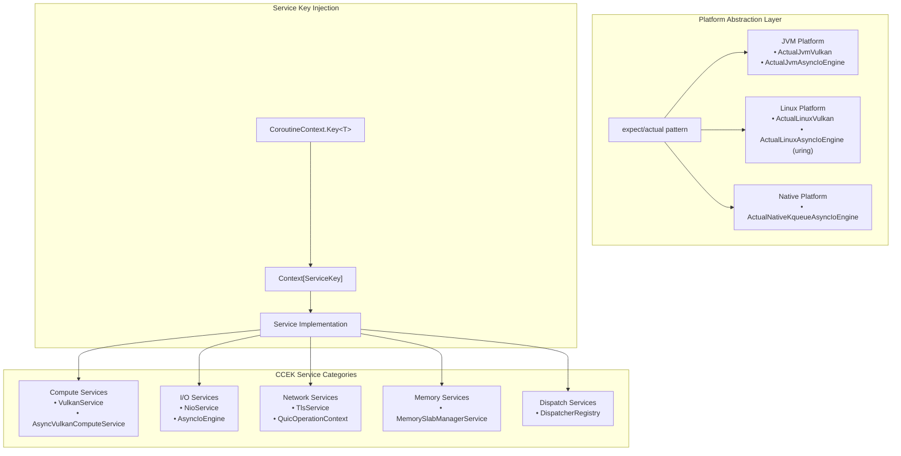
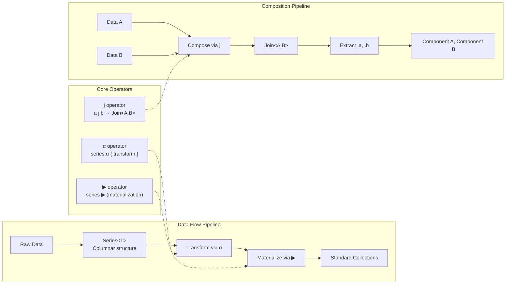

# CCEK Context Keys and Typealias Linkage Documentation

## Core Context Key Architecture

```mermaid
graph TB
    subgraph "Foundation Types"
        Join["Join&lt;A,B&gt;<br/>Core composition operator"]
        Series["Series&lt;T&gt; = Join&lt;Int, (Int) → T&gt;<br/>Columnar data structure"]
        Tensor["Tensor&lt;T&gt; = Join&lt;IntArray, (IntArray) → T&gt;<br/>Multi-dimensional processing"]
    end
    
    subgraph "CCEK Service Keys"
        VulkanKey["VulkanService.Key<br/>GPU compute context"]
        NioKey["NioService.Key<br/>Platform I/O context"]
        AsyncIoKey["AsyncIoEngine.Key<br/>Async operations context"]
        TlsKey["TlsServiceKey<br/>TLS security context"]
        QuicKey["QuicOperationContext.Key<br/>QUIC protocol context"]
        DispatcherKey["DispatcherRegistry.Key<br/>Method dispatch context"]
        MemoryKey["MemorySlabManagerService.Key<br/>Memory management context"]
    end
    
    subgraph "CCEK Hierarchical Contexts"
        CCEKBase["CCEKContext<br/>= Join&lt;Join&lt;Context, Config&gt;, Join&lt;Env, Knowledge&gt;&gt;"]
        DevContext["DevelopmentContext<br/>= Join&lt;CCEKContext, CodebaseContext&gt;"]
        AgentContext["AgentContext<br/>= Join&lt;DevelopmentContext, LearningContext&gt;"]
        EvoContext["EvolutionContext<br/>= Join&lt;AgentContext, AdaptationContext&gt;"]
        NexusContext["CCEKNexus<br/>= Join&lt;EvolutionContext, CCEKOperations&gt;"]
    end
    
    subgraph "Application Domain Types"
        Problem["Problem = Series&lt;String&gt;"]
        Solution["Solution = Series&lt;String&gt;"]
        Action["Action = Join&lt;String, Series&lt;String&gt;&gt;"]
        Workflow["Workflow = Series&lt;Action&gt;"]
        Capability["Capability = Join&lt;String, Series&lt;String&gt;&gt;"]
        ProjectCtx["ProjectContext = Series&lt;Join&lt;String, String&gt;&gt;"]
    end
    
    subgraph "Legacy Compatibility"
        Pai2["Pai2&lt;A,B&gt; = Join&lt;A,B&gt;<br/>Legacy Pair compatibility"]
        Vect0r["Vect0r&lt;T&gt; = Series&lt;T&gt;<br/>Legacy Vector compatibility"]
        Twin["Twin&lt;T&gt; = Join&lt;T,T&gt;<br/>Paired values"]
    end
    
    %% Foundation relationships
    Join --> Series
    Join --> Tensor
    Join --> Twin
    Join --> Pai2
    Series --> Vect0r
    
    %% CCEK hierarchy relationships
    Join --> CCEKBase
    CCEKBase --> DevContext
    DevContext --> AgentContext
    AgentContext --> EvoContext
    EvoContext --> NexusContext
    
    %% Application domain relationships
    Series --> Problem
    Series --> Solution
    Join --> Action
    Series --> Workflow
    Join --> Capability
    Series --> ProjectCtx
    
    %% Context key relationships (dotted lines for service injection)
    VulkanKey -.-> VulkanService[VulkanService Implementation]
    NioKey -.-> NioService[NioService Implementation]
    AsyncIoKey -.-> AsyncIoEngine[AsyncIoEngine Implementation]
    TlsKey -.-> TlsService[TlsService Implementation]
    QuicKey -.-> QuicOperation[QuicOperationContext Implementation]
    DispatcherKey -.-> DispatcherReg[DispatcherRegistry Implementation]
    MemoryKey -.-> MemoryManager[MemorySlabManagerService Implementation]
    
    classDef foundationType fill:#e1f5fe
    classDef ccekType fill:#f3e5f5
    classDef appType fill:#e8f5e8
    classDef legacyType fill:#fff3e0
    classDef serviceType fill:#fce4ec
    
    class Join,Series,Tensor foundationType
    class VulkanKey,NioKey,AsyncIoKey,TlsKey,QuicKey,DispatcherKey,MemoryKey ccekType
    class Problem,Solution,Action,Workflow,Capability,ProjectCtx appType
    class Pai2,Vect0r,Twin legacyType
    class VulkanService,NioService,AsyncIoEngine,TlsService,QuicOperation,DispatcherReg,MemoryManager serviceType
```



## Cross-Module Dependencies



## Service Context Architecture



## TrikeShed Type System Flow



## Key Design Principles

### 1. CCEK Context Management
- **Context**: Operational state and scope awareness
- **Configuration**: System settings and behavioral parameters  
- **Environment**: Platform capabilities and tool integrations
- **Knowledge**: Learned patterns and historical insights

### 2. Hierarchical Composition
```kotlin
CCEKContext = Join<Join<Context, Configuration>, Join<Environment, Knowledge>>
DevelopmentContext = Join<CCEKContext, CodebaseContext>
AgentContext = Join<DevelopmentContext, LearningContext>
EvolutionContext = Join<AgentContext, AdaptationContext>
```

### 3. Service Key Pattern
```kotlin
companion object Key : CoroutineContext.Key<ServiceType>
```
Enables dependency injection through coroutine context lookup.

### 4. Zero-Cost Abstractions
- `@JvmInline value class` wrappers
- Compile-time type safety with runtime erasure
- TrikeShed operators (`j`, `α`, `▶`) as inline functions

### 5. Platform Abstraction
- expect/actual multiplatform pattern
- Platform-specific CCEK service implementations
- Unified service key interface across platforms

## Usage Patterns

### Context Service Lookup
```kotlin
suspend fun useService() {
    val vulkan = coroutineContext[VulkanService.Key]
    val nio = coroutineContext[NioService.Key] 
    val asyncIo = coroutineContext[AsyncIoEngine.Key]
}
```

### CCEK Hierarchy Navigation
```kotlin
val ccek: CCEKContext = context.extractCCEK()
val development: DevelopmentContext = ccek j codebaseContext
val agent: AgentContext = development j learningContext
val evolution: EvolutionContext = agent j adaptationContext
```

### TrikeShed Data Processing
```kotlin
val problems: Problem = Series.of("issue1", "issue2", "issue3")
val solutions: Series<Solution> = problems.α { problem -> 
    generateSolution(problem) 
}
val actions: Series<Action> = solutions.α { solution ->
    solution j extractSteps(solution)
}
```