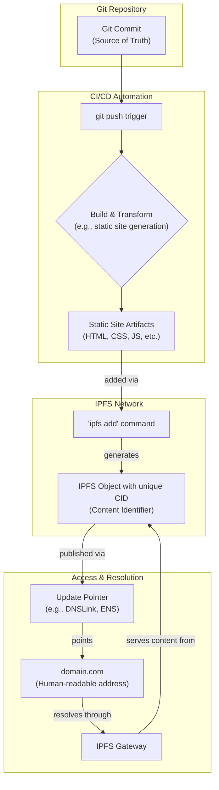

# Cascading Transform: From Git Models to IPFS-Hosted Static Content

This document outlines the process for transforming content versioned in Git into a statically hosted site on the InterPlanetary File System (IPFS). This creates a verifiable and decentralized deployment pipeline.

## Process Overview

The transformation is a multi-stage pipeline that begins with a Git commit and ends with the content being served from IPFS.

## Detailed Stages

Here is a breakdown of each step in the process:

1.  **Git Commit**: The process originates with a commit in a Git repository. This commit represents a specific version of the source content, which can range from application source code to markdown files for documentation.

2.  **CI/CD Trigger**: A `git push` to a designated branch automatically triggers a Continuous Integration/Continuous Deployment (CI/CD) pipeline.

3.  **Build & Transform**: The CI/CD pipeline executes a predefined build and transformation process. This step checks out the code from the triggering commit and performs the necessary actions to produce static web assets. The specifics of this stage depend on the nature of the "git models":
    *   For a web application, this would involve compiling code and bundling assets.
    *   For a documentation site, this might involve using a static site generator like Jekyll or Hugo to convert Markdown into HTML.
    *   For other data models, this step could involve custom scripts to serialize data into a browsable static format.
    The output is a directory containing the complete static site (e.g., `index.html`, CSS, JavaScript, images).

4.  **IPFS Add**: The generated directory of static artifacts is added to the IPFS network using a command like `ipfs add -r <build_directory>`. IPFS processes the directory and all its files, creating a unique Content Identifier (CID) for the root directory. This CID is a cryptographic hash of the contents, ensuring that the data is content-addressed. Any change to any file will result in a new CID for the entire site.

5.  **Publishing the CID**: The new root CID must be linked to a human-readable name for users to access it. This is typically done by updating a pointer:
    *   **DNSLink**: A `TXT` record in the domain's DNS settings is updated to point to the new IPFS CID (e.g., `dnslink=/ipfs/Qm...`).
    *   **Ethereum Name Service (ENS)**: An ENS record can be updated to resolve to the new IPFS CID.

6.  **Access**: Users access the site through a standard URL. An IPFS gateway (either a public one or a self-hosted one) resolves the domain's DNSLink or ENS record, retrieves the content corresponding to the CID from the IPFS network, and serves it to the user's browser.

This entire sequence creates a verifiable and decentralized deployment pipeline where every version of the site is uniquely identified and permanently available on IPFS, directly traceable to a specific Git commit. 