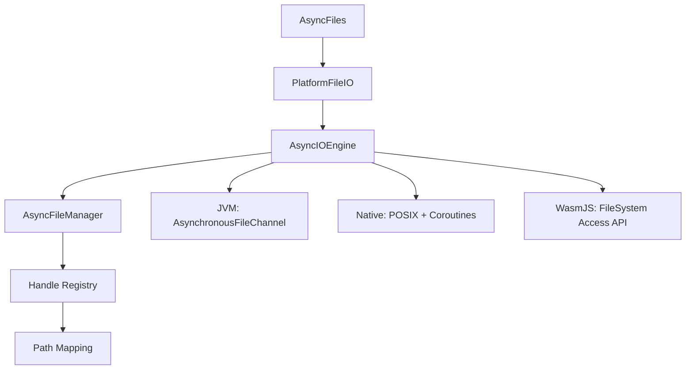

# Async File I/O Implementation

## Overview

The async file I/O system provides non-blocking file operations across multiple platforms (JVM, Native, WasmJS) using Kotlin coroutines and platform-specific optimizations.

## Architecture



## Components

### AsyncFiles
High-level async file operations object providing convenient methods:
- `readAllBytes(path)`: Read entire file as ByteArray
- `readString(path)`: Read entire file as String
- `readAllLines(path)`: Read file as List<String>
- `write(path, content)`: Write ByteArray/String/List<String> to file
- `copyFile(source, dest)`: Copy file asynchronously
- `moveFile(source, dest)`: Move file asynchronously
- `exists(path)`: Check if file exists

### PlatformFileIO
Platform-agnostic interface for async file operations:
- `asyncReadFile(path)`: Read file as ByteArray
- `asyncWriteFile(path, content)`: Write ByteArray to file
- `exists(path)`: Check file existence
- `deleteFile(path)`: Delete file

### AsyncIOEngine
Low-level async I/O engine with platform-specific implementations:
- `read(handle, buffer, offset)`: Read from file handle
- `write(handle, data, offset)`: Write to file handle
- `submitBatch(operations)`: Submit multiple operations
- `completedOperations()`: Get flow of completed operations

### AsyncFileManager
Thread-safe handle-to-path mapping registry:
- `registerFile(path)`: Register file and get handle
- `getPath(handle)`: Get path from handle
- `unregisterFile(handle/path)`: Remove registration

## Platform Implementations

### JVM
- Uses `AsynchronousFileChannel` for true async I/O
- Leverages `Dispatchers.IO` for coroutine context
- Supports batch operations and concurrent access

### Native
- Uses POSIX file operations with coroutines
- `fopen`, `fread`, `fwrite` with `Dispatchers.Default`
- Memory-pinned buffers for efficient I/O

### WasmJS
- Limited file access in browser environment
- Placeholder for FileSystem Access API integration
- Returns null/false for unsupported operations

## Usage Examples

### Basic File Operations
```kotlin
// Read file asynchronously
val content = AsyncFiles.readString("data.txt")

// Write file asynchronously
val success = AsyncFiles.write("output.txt", "Hello, World!")

// Copy file
val copied = AsyncFiles.copyFile("source.txt", "dest.txt")
```

### Low-level Operations
```kotlin
val engine = AsyncIOEngine.create()
val manager = AsyncFileManager.instance

// Register file and get handle
val handle = manager.registerFile("data.txt")

// Read with custom buffer
val buffer = ByteArray(1024)
val bytesRead = engine.read(handle, buffer, 0)

// Write data
val data = "Hello".encodeToByteArray()
val bytesWritten = engine.write(handle, data, 0)
```

### Batch Operations
```kotlin
val operations = listOf(
    IOOperation(1L, IOType.READ, handle1, buffer1, 0),
    IOOperation(2L, IOType.WRITE, handle2, data, 0)
)

val results = engine.submitBatch(operations)
```

## Performance Considerations

### JVM
- `AsynchronousFileChannel` provides true async I/O
- No blocking on I/O operations
- Efficient for high-concurrency scenarios

### Native
- Uses thread pool for async operations
- Memory-pinned buffers reduce copying
- POSIX operations are well-optimized

### Memory Management
- Handles are automatically managed by `AsyncFileManager`
- Buffers are allocated per operation
- Large files should be processed in chunks

## Error Handling

- File not found: Returns `null` for reads, `false` for writes
- Permission errors: Throws appropriate exceptions
- I/O errors: Captured in `IOResult.error`
- Invalid handles: Throws `IllegalArgumentException`

## Testing

Comprehensive TDD tests cover:
- Basic read/write operations
- Large file handling
- Concurrent operations
- Error conditions
- Batch operations
- File management operations

## Future Enhancements

1. **True async I/O on Native**: Implement io_uring (Linux) and kqueue (macOS)
2. **WasmJS FileSystem Access API**: Full browser file access
3. **Streaming operations**: Process files without loading entirely into memory
4. **Compression support**: Built-in gzip/zlib compression
5. **Encryption**: Transparent file encryption/decryption
6. **Caching**: File content caching for repeated access
7. **Progress tracking**: Callbacks for long-running operations

## Integration with Existing Code

The async file I/O system integrates with existing trikeshed components:
- `CCEKFileChannel`: File-based async channels
- `PlatformFileIO`: Extends existing file I/O interface
- `AsyncChannel`: File operations as network-like channels
- `MappedFile`: Memory-mapped file support 