# CCEK System: Enhanced Mermaid Diagram

```mermaid
graph TD
    %% === System Context ===
    subgraph SystemContext["System Context: Agentic Service Mesh"]
        direction LR
        User["<i class='fa fa-user'></i> User"]
        API["<i class='fa fa-cloud'></i> API Gateway"]
        Agent["<i class='fa fa-robot'></i> Agentic Nexus"]
        CCEKCore["<i class='fa fa-cogs'></i> CCEK Core"]
        ServiceMesh["<i class='fa fa-network-wired'></i> Service Mesh"]
        User-->|"REST/GraphQL"|API
        API-->|"Task/Request"|Agent
        Agent-->|"Context/Knowledge"|CCEKCore
        CCEKCore-->|"Result/Action"|Agent
        Agent-->|"Service Discovery"|ServiceMesh
        ServiceMesh-->|"Routing"|Agent
    end

    %% === CCEK Core Definitions (from original) ===
    subgraph CoreDefinitions["CCEK Core Definitions"]
        direction LR
        NexusCCEK_Context["typealias CCEKContext = Join<Join<Context, Configuration>, Join<Environment, Knowledge>>"]
        NexusCCEK_DevelopmentContext["typealias DevelopmentContext = Join<CCEKContext, CodebaseContext>"]
        NexusCCEK_CCEKNexus["typealias CCEKNexus = Join<EvolutionContext, CCEKOperations>"]
        NexusCCEK_ContextualRequest["typealias ContextualRequest = Join<Request, CCEKContext>"]
        NexusCCEK_ContextualResponse["typealias ContextualResponse = Join<Response, CCEKContext>"]
        NexusCCEK_Context -- "used in" --> NexusCCEK_DevelopmentContext
        NexusCCEK_Context -- "used in" --> NexusCCEK_ContextualRequest
        NexusCCEK_Context -- "used in" --> NexusCCEK_ContextualResponse
        NexusCCEK_Context -- "related to" --> NexusCCEK_CCEKNexus
    end

    %% === Demo, Implementations, and Test Coverage ===
    subgraph DemoAndImplementations["Demo & Implementations"]
        direction LR
        Demo_CCEKContext["typealias CCEKContext (demo.kt)"]
        Demo_BuildInitial["buildInitialCCEKContext() (demo.kt)"]
        WorkingNexus["class WorkingNexus (demo.kt)"]
        ProcessSimpleRequest_Demo["processSimpleRequest(context: CCEKContext)"]
        AnalyzeInContext_Demo["analyzeInContext(context: CCEKContext)"]
        GenerateInContext_Demo["generateInContext(context: CCEKContext)"]
        RefactorInContext_Demo["refactorInContext(context: CCEKContext)"]
        Demo_CCEKContext -- "tested by" --> ProcessSimpleRequest_Demo
        Demo_CCEKContext -- "tested by" --> AnalyzeInContext_Demo
        Demo_CCEKContext -- "tested by" --> GenerateInContext_Demo
        Demo_CCEKContext -- "tested by" --> RefactorInContext_Demo
        Demo_BuildInitial -- "returns" --> Demo_CCEKContext
        WorkingNexus -- "uses" --> Demo_CCEKContext
        WorkingNexus -- "uses" --> Demo_BuildInitial
        Demo_CCEK_UpdateFromInteraction["CCEKContext.updateFromInteraction() (demo.kt)"]
        Demo_CCEKContext -- "extended by" --> Demo_CCEK_UpdateFromInteraction
        style ProcessSimpleRequest_Demo fill:#e0ffe0,stroke:#333,stroke-width:2px
        style AnalyzeInContext_Demo fill:#e0ffe0,stroke:#333,stroke-width:2px
        style GenerateInContext_Demo fill:#e0ffe0,stroke:#333,stroke-width:2px
        style RefactorInContext_Demo fill:#e0ffe0,stroke:#333,stroke-width:2px
        %% Test coverage overlay
        class ProcessSimpleRequest_Demo,AnalyzeInContext_Demo,GenerateInContext_Demo,RefactorInContext_Demo testNode;
    end

    %% === Error and Extension Flows ===
    subgraph ErrorAndExtensions["Error & Extension Points"]
        direction LR
        ErrorHandler["<i class='fa fa-exclamation-triangle'></i> ErrorHandler"]
        ExtensionPoint["<i class='fa fa-plug'></i> ExtensionPoint"]
        NexusCCEK_Context -- "error flows to" --> ErrorHandler
        NexusCCEK_Context -- "can be extended by" --> ExtensionPoint
        style ErrorHandler fill:#ffcccc,stroke:#900
        style ExtensionPoint fill:#ccf,stroke:#009
    end

    %% === Reflection, Tensor, Provider, Agentic Nexus, ScriptingK2, Future ===
    subgraph Reflection["Reflection"]
        direction LR
        Reflector_GetRelevantPatterns["getRelevantPatterns(context: CCEKContext)"]
        Reflector_PredictNextAction["predictNextAction(context: CCEKContext)"]
        NexusCCEK_Context -- "passed to" --> Reflector_GetRelevantPatterns
        NexusCCEK_Context -- "passed to" --> Reflector_PredictNextAction
    end
    subgraph TensorCore["Tensor Core"]
        direction LR
        Tensor_CCEKTensor["typealias CCEKTensor = NexusTensor<CCEKContext>"]
        Tensor_ContextTensorSpace["typealias ContextTensorSpace = Join<CCEKTensor, CapabilityTensor>"]
        NexusCCEK_Context -- "used in" --> Tensor_CCEKTensor
        Tensor_CCEKTensor -- "used in" --> Tensor_ContextTensorSpace
    end
    subgraph ProviderModel["Provider Model"]
        direction LR
        ProviderDemo_CCEKContext["typealias CCEKContext (provider_demo.kt)"]
        ProviderDemo_BuildTestContext["buildTestContext() -> CCEKContext"]
        ProviderDemo_BuildTestContext -- "returns" --> ProviderDemo_CCEKContext
        ProviderDemo_CCEKContext -- "used in" --> NexusCCEK_Context
    end
    subgraph AgenticNexus["Agentic Nexus"]
        direction LR
        Agentic_CCEKContext["value class CCEKContext(data: Map<String, String>)"]
        Agentic_CreateContext["createContext() -> CCEKContext"]
        Agentic_GenerateAdaptiveTask["generateAdaptiveTask(context: CCEKContext)"]
        Agentic_CreateContext -- "returns" --> Agentic_CCEKContext
        Agentic_CCEKContext -- "passed to" --> Agentic_GenerateAdaptiveTask
    end
    subgraph ScriptingK2["K2 Scripts"]
        direction LR
        SimpleNexus_CCEKContext["typealias CCEKContext (simple_nexus.kts)"]
        SimpleNexus_DevContext["typealias DevelopmentContext (simple_nexus.kts)"]
        SimpleNexus_CCEKContext -- "used in" --> SimpleNexus_DevContext
    end
    %% Future extensions
    subgraph FutureExtensions["Future Extensions"]
        direction LR
        CCEK_AuditTrail["<i class='fa fa-history'></i> AuditTrail (planned)"]
        CCEK_Observability["<i class='fa fa-eye'></i> Observability (planned)"]
        CCEK_Security["<i class='fa fa-lock'></i> SecurityHooks (planned)"]
        NexusCCEK_Context -- "future" --> CCEK_AuditTrail
        NexusCCEK_Context -- "future" --> CCEK_Observability
        NexusCCEK_Context -- "future" --> CCEK_Security
        style CCEK_AuditTrail fill:#ffe0b2,stroke:#bfa,stroke-width:2px
        style CCEK_Observability fill:#e1bee7,stroke:#a0a,stroke-width:2px
        style CCEK_Security fill:#b3e5fc,stroke:#0288d1,stroke-width:2px
    end

    %% === Legend and Annotations ===
    subgraph Legend["Legend"]
        direction TB
        testNode["<b>Tested Node</b>"]
        errorNode["<b>Error Handler</b>"]
        extensionNode["<b>Extension Point</b>"]
        plannedNode["<b>Planned/Future</b>"]
        testNode -- "green" --> testNode
        errorNode -- "red" --> errorNode
        extensionNode -- "blue" --> extensionNode
        plannedNode -- "yellow/blue/purple" --> plannedNode
    end

    %% === Data Flows and Lifecycle ===
    User -.->|"Request"| API
    API -.->|"Invoke"| Agent
    Agent -.->|"Context"| NexusCCEK_Context
    NexusCCEK_Context -.->|"Lifecycle"| Demo_CCEKContext
    Demo_CCEKContext -.->|"Test"| ProcessSimpleRequest_Demo
    ProcessSimpleRequest_Demo -.->|"Result"| Agent
    Agent -.->|"Respond"| API
    API -.->|"Deliver"| User

    %% === Notes/Annotations ===
    classDef testNode fill:#e0ffe0,stroke:#333,stroke-width:2px;
    classDef errorNode fill:#ffcccc,stroke:#900;
    classDef extensionNode fill:#ccf,stroke:#009;
    classDef plannedNode fill:#ffe0b2,stroke:#bfa,stroke-width:2px;
    %% Key node notes
    click NexusCCEK_Context "#" "CCEKContext is the core context type for all agentic operations."
    click ErrorHandler "#" "Handles all error flows and exceptions in CCEK operations."
    click ExtensionPoint "#" "Extension points for custom logic and plugins."
    click CCEK_AuditTrail "#" "Planned: Full audit trail for all context changes."
    click CCEK_Observability "#" "Planned: Observability hooks for tracing and metrics."
    click CCEK_Security "#" "Planned: Security hooks for context access and mutation."
```

---

# Original Diagram (for reference)

```mermaid
graph LR
    subgraph CoreDefinitions ["CCEK Core Definitions (nexus.core.NexusCCEK)"]
        direction LR
        NexusCCEK_Context["typealias CCEKContext = Join<Join<Context, Configuration>, Join<Environment, Knowledge>>"]
        NexusCCEK_DevelopmentContext["typealias DevelopmentContext = Join<CCEKContext, CodebaseContext>"]
        NexusCCEK_CCEKNexus["typealias CCEKNexus = Join<EvolutionContext, CCEKOperations>"]
        NexusCCEK_ContextualRequest["typealias ContextualRequest = Join<Request, CCEKContext>"]
        NexusCCEK_ContextualResponse["typealias ContextualResponse = Join<Response, CCEKContext>"]

        NexusCCEK_Context -- "used in" --> NexusCCEK_DevelopmentContext
        NexusCCEK_Context -- "used in" --> NexusCCEK_ContextualRequest
        NexusCCEK_Context -- "used in" --> NexusCCEK_ContextualResponse
        NexusCCEK_Context -- "related to" --> NexusCCEK_CCEKNexus
    end

    subgraph DemoAndImplementations ["Demo & Implementations (demo.kt, implementations.NexusActuals.kt)"]
        direction LR
        Demo_CCEKContext["typealias CCEKContext (demo.kt)<br/>Pair<Pair<Context, Configuration>, Pair<Environment, Knowledge>>"]
        Actuals_BuildInitial["buildInitialCCEKContext() -> CCEKContext (NexusActuals.kt)"]
        Demo_BuildInitial["buildInitialCCEKContext() -> CCEKContext (demo.kt)"]
        WorkingNexus["class WorkingNexus (demo.kt)"]

        Actuals_BuildInitial -- "returns" --> Demo_CCEKContext
        Demo_BuildInitial -- "returns" --> Demo_CCEKContext
        WorkingNexus -- "uses" --> Demo_CCEKContext
        WorkingNexus -- "uses" --> Demo_BuildInitial

        ProcessSimpleRequest_Demo["processSimpleRequest(context: CCEKContext) (demo.kt)"]
        AnalyzeInContext_Demo["analyzeInContext(context: CCEKContext) (demo.kt)"]
        GenerateInContext_Demo["generateInContext(context: CCEKContext) (demo.kt)"]
        RefactorInContext_Demo["refactorInContext(context: CCEKContext) (demo.kt)"]
        Demo_CCEKContext -- "passed to" --> ProcessSimpleRequest_Demo
        Demo_CCEKContext -- "passed to" --> AnalyzeInContext_Demo
        Demo_CCEKContext -- "passed to" --> GenerateInContext_Demo
        Demo_CCEKContext -- "passed to" --> RefactorInContext_Demo

        Demo_CCEK_UpdateFromInteraction["CCEKContext.updateFromInteraction() (demo.kt)"]
        Demo_CCEKContext -- "extended by" --> Demo_CCEK_UpdateFromInteraction

        Actuals_ProcessSimpleRequest["processSimpleRequest(context: CCEKContext) (NexusActuals.kt)"]
        Actuals_AnalyzeInContext["analyzeInContext(context: CCEKContext) (NexusActuals.kt)"]
        Actuals_GenerateInContext["generateInContext(context: CCEKContext) (NexusActuals.kt)"]
        Actuals_RefactorInContext["refactorInContext(context: CCEKContext) (NexusActuals.kt)"]
        NexusCCEK_Context -- "passed to" --> Actuals_ProcessSimpleRequest
        NexusCCEK_Context -- "passed to" --> Actuals_AnalyzeInContext
        NexusCCEK_Context -- "passed to" --> Actuals_GenerateInContext
        NexusCCEK_Context -- "passed to" --> Actuals_RefactorInContext

        Actuals_CCEK_Extractors["CCEKContext.extractCurrent...() (NexusActuals.kt)"]
        NexusCCEK_Context -- "extended by" --> Actuals_CCEK_Extractors
        Actuals_CCEK_Updaters["CCEKContext.updateScope(), .addCapability() (NexusActuals.kt)"]
        NexusCCEK_Context -- "extended by" --> Actuals_CCEK_Updaters

    end

    subgraph AgenticNexus ["Agentic Nexus (agentic_nexus.kts)"]
        direction LR
        Agentic_CCEKContext["value class CCEKContext(data: Map<String, String>)"]
        Agentic_CreateContext["createContext() -> CCEKContext"]
        Agentic_GenerateAdaptiveTask["generateAdaptiveTask(context: CCEKContext)"]
        Agentic_CreateContext -- "returns" --> Agentic_CCEKContext
        Agentic_CCEKContext -- "passed to" --> Agentic_GenerateAdaptiveTask
    end

    subgraph ProviderModel ["Provider Model (provider_demo.kt, NexusProviders.kt)"]
        direction LR
        ProviderDemo_CCEKContext["typealias CCEKContext (provider_demo.kt)<br/>Pair<Pair<Context, Configuration>, Pair<Environment, Knowledge>>"]
        ProviderDemo_CCEKNexus["typealias CCEKNexus = CCEKContext (provider_demo.kt)"]
        ProviderDemo_EnhancedNexus["typealias EnhancedNexus = Pair<CCEKNexus, NexusProvider> (provider_demo.kt)"]
        ProviderDemo_BuildTestContext["buildTestContext() -> CCEKContext (provider_demo.kt)"]

        ProviderDemo_CCEKContext -- "is aliased by" --> ProviderDemo_CCEKNexus
        ProviderDemo_CCEKNexus -- "used in" --> ProviderDemo_EnhancedNexus
        ProviderDemo_BuildTestContext -- "returns" --> ProviderDemo_CCEKContext

        NexusProviders_Generate["NexusProvider.generate(context: CCEKContext)"]
        NexusProviders_Analyze["NexusProvider.analyze(context: CCEKContext)"]
        NexusProviders_Complete["NexusProvider.complete(context: CCEKContext)"]
        ProviderDemo_CCEKContext -- "passed to" --> NexusProviders_Generate
        ProviderDemo_CCEKContext -- "passed to" --> NexusProviders_Analyze
        ProviderDemo_CCEKContext -- "passed to" --> NexusProviders_Complete

        NexusProviders_EnhancedNexus["typealias EnhancedNexus (NexusProviders.kt)<br/>Join<CCEKNexus, NexusProvider>"]
        NexusProviders_CCEKNexus_WithProvider["CCEKNexus.withProvider() -> EnhancedNexus (NexusProviders.kt)"]
        ProviderDemo_CCEKNexus -- "extended by" --> NexusProviders_CCEKNexus_WithProvider
        NexusProviders_CCEKNexus_WithProvider -- "returns" --> NexusProviders_EnhancedNexus
    end

    subgraph TensorCore ["Tensor Core (NexusTensorCore.kt)"]
        direction LR
        Tensor_CCEKTensor["typealias CCEKTensor = NexusTensor<CCEKContext>"]
        Tensor_ContextTensorSpace["typealias ContextTensorSpace = Join<CCEKTensor, CapabilityTensor>"]
        NexusCCEK_Context -- "used in" --> Tensor_CCEKTensor
        Tensor_CCEKTensor -- "used in" --> Tensor_ContextTensorSpace

        Tensor_WithCCEK["NexusTensor.withCCEK(context: CCEKContext)"]
        Tensor_ContextTransform["Join<CCEKContext, NexusTensor>.contextTransform(f: (CCEKContext, T) -> R)"]
        Tensor_PredictNextAction["TensorAgent.predictNextAction(context: CCEKContext)"]
        Tensor_CCEKToTensor["CCEKContext.toTensor() -> CCEKTensor"]
        Tensor_Adapt["TensorAgent.adapt(ctx: CCEKContext)"]

        NexusCCEK_Context -- "passed to" --> Tensor_WithCCEK
        NexusCCEK_Context -- "passed to" --> Tensor_ContextTransform
        NexusCCEK_Context -- "passed to" --> Tensor_PredictNextAction
        NexusCCEK_Context -- "extended by" --> Tensor_CCEKToTensor
        Tensor_CCEKToTensor -- "returns" --> Tensor_CCEKTensor
        NexusCCEK_Context -- "passed to" --> Tensor_Adapt
    end

    subgraph Reflection ["Reflection (UniversalReflector.kt)"]
        direction LR
        Reflector_GetRelevantPatterns["getRelevantPatterns(context: CCEKContext)"]
        Reflector_PredictNextAction["predictNextAction(context: CCEKContext)"]
        Reflector_IsRelevantTo["isRelevantTo(context: CCEKContext)"]
        Reflector_SuggestActionFunc["suggestAction(context: CCEKContext)"]
        Reflector_CalcSimilarity["calculateContextSimilarity(ctx1: CCEKContext, ctx2: CCEKContext)"]
        Reflector_CCEKExtractPattern["CCEKContext.extractPattern()"]
        Reflector_CCEKSuggestAction["CCEKContext.suggestAction()"]

        NexusCCEK_Context -- "passed to" --> Reflector_GetRelevantPatterns
        NexusCCEK_Context -- "passed to" --> Reflector_PredictNextAction
        NexusCCEK_Context -- "passed to" --> Reflector_IsRelevantTo
        NexusCCEK_Context -- "passed to" --> Reflector_SuggestActionFunc
        NexusCCEK_Context -- "passed to" --> Reflector_CalcSimilarity
        NexusCCEK_Context -- "extended by" --> Reflector_CCEKExtractPattern
        NexusCCEK_Context -- "extended by" --> Reflector_CCEKSuggestAction
    end

    subgraph ScriptingK2 ["K2 Scripts (simple_nexus.kts, trikeshed_nexus.kts)"]
        direction LR
        SimpleNexus_CCEKContext["typealias CCEKContext (simple_nexus.kts)<br/>Join<...>"]
        SimpleNexus_DevContext["typealias DevelopmentContext (simple_nexus.kts)<br/>Join<CCEKContext, Series<String>>"]
        SimpleNexus_CCEKContext -- "used in" --> SimpleNexus_DevContext

        TrikeShed_CCEKContext["typealias CCEKContext<T> (trikeshed_nexus.kts)<br/>Join<...>"]
        TrikeShed_DevContext["typealias DevelopmentContext<T> (trikeshed_nexus.kts)<br/>Join<CCEKContext<T>, Series<T>>"]
        TrikeShed_CCEKContext -- "used in" --> TrikeShed_DevContext
    end
 
    NexusCCEK_Context --> DemoAndImplementations
    NexusCCEK_Context --> ProviderModel
    NexusCCEK_Context --> TensorCore
    NexusCCEK_Context --> Reflection

    Demo_CCEKContext -.-> NexusCCEK_Context
    ProviderDemo_CCEKContext -.-> NexusCCEK_Context
    Agentic_CCEKContext -.-> NexusCCEK_Context
    SimpleNexus_CCEKContext -.-> NexusCCEK_Context
    TrikeShed_CCEKContext -.-> NexusCCEK_Context

    classDef default fill:#f9f,stroke:#333,stroke-width:2px;
    classDef typeAlias fill:#lightgrey,stroke:#333;
    classDef valueClass fill:#lightblue,stroke:#333;
    classDef function fill:#moccasin,stroke:#333;
    classDef generalClass fill:#lightgreen,stroke:#333;

    class NexusCCEK_Context,Demo_CCEKContext,ProviderDemo_CCEKContext,SimpleNexus_CCEKContext,TrikeShed_CCEKContext typeAlias;
    class Agentic_CCEKContext valueClass;
    class NexusCCEK_DevelopmentContext,NexusCCEK_CCEKNexus,NexusCCEK_ContextualRequest,NexusCCEK_ContextualResponse,ProviderDemo_CCEKNexus,ProviderDemo_EnhancedNexus,NexusProviders_EnhancedNexus,Tensor_CCEKTensor,Tensor_ContextTensorSpace,SimpleNexus_DevContext,TrikeShed_DevContext generalClass;
    class Actuals_BuildInitial,Demo_BuildInitial,ProcessSimpleRequest_Demo,AnalyzeInContext_Demo,GenerateInContext_Demo,RefactorInContext_Demo,Demo_CCEK_UpdateFromInteraction,Actuals_ProcessSimpleRequest,Actuals_AnalyzeInContext,Actuals_GenerateInContext,Actuals_RefactorInContext,Actuals_CCEK_Extractors,Actuals_CCEK_Updaters,ProviderDemo_BuildTestContext,NexusProviders_Generate,NexusProviders_Analyze,NexusProviders_Complete,NexusProviders_CCEKNexus_WithProvider,NexusProviders_CCEKNexus_WithProvider,Tensor_WithCCEK,Tensor_ContextTransform,Tensor_PredictNextAction,Tensor_CCEKToTensor,Tensor_Adapt,Reflector_GetRelevantPatterns,Reflector_PredictNextAction,Reflector_IsRelevantTo,Reflector_SuggestActionFunc,Reflector_CalcSimilarity,Reflector_CCEKExtractPattern,Reflector_CCEKSuggestAction,Agentic_CreateContext,Agentic_GenerateAdaptiveTask function;
    class WorkingNexus generalClass;
```

## TDD: Diagram Test Specification

- [ ] All node definitions are syntactically valid and renderable by mermaid.
- [ ] All subgraphs are present: System Context, Core Definitions, Demo & Implementations, Error & Extension Points, Reflection, Tensor Core, Provider Model, Agentic Nexus, ScriptingK2, Future Extensions, Legend.
- [ ] All relationships/arrows between nodes and subgraphs are present as described in the diagram.
- [ ] The following key nodes are present and correctly linked:
    - [ ] NexusCCEK_Context
    - [ ] ErrorHandler
    - [ ] ExtensionPoint
    - [ ] CCEK_AuditTrail
    - [ ] CCEK_Observability
    - [ ] CCEK_Security
- [ ] The legend and annotation section is present and visually distinct.
- [ ] Data flow and lifecycle arrows (User → API → Agent → CCEKCore, etc.) are present.
- [ ] All clickable notes/annotations for key nodes are present.
- [ ] The diagram renders without errors in a mermaid-compatible viewer.
