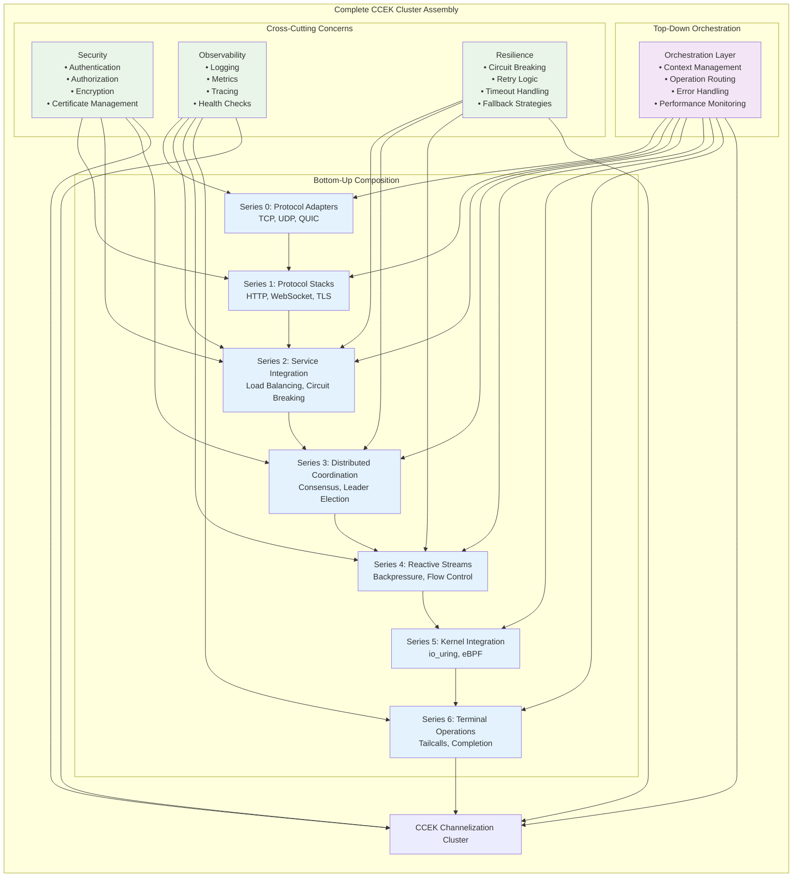

# CCEK Series Complete Landscape Architecture

## Complete CCEK Series Hierarchy with Protocol Tangles

```mermaid
graph LR
    %% Main CCEK Series Flow
    subgraph "CCEK Series 0: Channelization Hierarchy"
        S0[Series 0: Protocol Adapters]
        S0 --> TCP[TCP Adapter<br/>• Connect/Read/Write/Close<br/>• Socket Factory<br/>• Channel Operations]
        S0 --> UDP[UDP Adapter<br/>• Bind/SendTo/ReceiveFrom<br/>• Datagram Factory<br/>• Connectionless I/O]
        S0 --> QUIC[QUIC Adapter<br/>• Connection/Stream/Datagram<br/>• Stream Factory<br/>• Multiplexed Transport]
        
        S0 --> COMP[Composition Layers<br/>• ProtocolStackLayer<br/>• ServiceLayer<br/>• DistributedLayer<br/>• ReactiveLayer<br/>• KernelLayer<br/>• TerminalLayer]
    end
    
    subgraph "CCEK Series 1: Protocol Stack Composition"
        S1[Series 1: Protocol Stacks]
        S1 --> HTTP[HTTP Over TCP Stack<br/>• Request/Response Handling<br/>• Header Processing<br/>• Body Encoding/Decoding]
        S1 --> WS[WebSocket Stack<br/>• Frame Processing<br/>• Handshake Management<br/>• Binary/Text Messages]
        S1 --> TLS[TLS Security Stack<br/>• Handshake Protocol<br/>• Certificate Validation<br/>• Encrypted Transport]
        
        S1 --> PL[Protocol Layers<br/>• CompressionLayer<br/>• EncryptionLayer<br/>• RoutingLayer<br/>• ValidationLayer<br/>• LoggingLayer]
        
        S1 --> PSF[Protocol Stack Factory<br/>• Basic Stack<br/>• Secure Stack<br/>• Routed Stack<br/>• Validated Stack]
    end
    
    subgraph "CCEK Series 2: Service Integration"
        S2[Series 2: Service Layers]
        S2 --> LB[Load Balancing Service<br/>• Round Robin Strategy<br/>• Health Checking<br/>• Backend Selection<br/>• Failure Handling]
        S2 --> CB[Circuit Breaker Service<br/>• Failure Threshold<br/>• Recovery Timeout<br/>• Half-Open State<br/>• Success/Failure Tracking]
        S2 --> CACHE[Caching Service<br/>• LRU Eviction<br/>• TTL Management<br/>• Cache Invalidation<br/>• Hit/Miss Metrics]
        S2 --> AUTH[Authentication Service<br/>• Token Validation<br/>• Session Management<br/>• Permission Checking<br/>• Security Context]
        
        S2 --> SR[Service Registry<br/>• Service Discovery<br/>• Health Monitoring<br/>• Load Balancing<br/>• Service Routing]
    end
    
    subgraph "CCEK Series 3: Distributed Coordination"
        S3[Series 3: Distributed Systems]
        S3 --> CONS[Consensus Layer<br/>• Raft Algorithm<br/>• Leader Election<br/>• Log Replication<br/>• State Machine]
        S3 --> LE[Leader Election<br/>• Election Timeout<br/>• Vote Collection<br/>• Term Management<br/>• Leadership Transfer]
        S3 --> DL[Distributed Locking<br/>• Lock Acquisition<br/>• Deadlock Prevention<br/>• Lock Release<br/>• Timeout Handling]
        S3 --> DC[Distributed Cache<br/>• Cache Coherence<br/>• Invalidation Protocol<br/>• Consistency Models<br/>• Partition Tolerance]
        
        S3 --> RAFT[Raft Consensus<br/>• Follower/Candidate/Leader<br/>• AppendEntries RPC<br/>• RequestVote RPC<br/>• Log Commitment]
    end
    
    subgraph "CCEK Series 4: Reactive Streams"
        S4[Series 4: Reactive Patterns]
        S4 --> BP[Backpressure Layer<br/>• Buffer Management<br/>• Drop Strategies<br/>• Flow Control<br/>• Rate Limiting]
        S4 --> SP[Stream Processing<br/>• Map/Filter/Reduce<br/>• Window Operations<br/>• Merge Operations<br/>• Transform Pipelines]
        S4 --> EB[Event Bus<br/>• Topic Publishing<br/>• Event Subscription<br/>• Event Routing<br/>• Metadata Handling]
        S4 --> FC[Flow Control<br/>• Throttling<br/>• Debouncing<br/>• Sampling<br/>• Token Bucket Rate Limiting]
        
        S4 --> BS[Backpressure Strategies<br/>• BUFFER<br/>• DROP_OLDEST<br/>• DROP_LATEST<br/>• ERROR]
    end
    
    subgraph "CCEK Series 5: Kernel Integration"
        S5[Series 5: Kernel Features]
        S5 --> IOU[io_uring Layer<br/>• Submission Queue<br/>• Completion Queue<br/>• Async I/O Operations<br/>• Kernel Event Loop]
        S5 --> EBPF[eBPF Program Layer<br/>• Program Loading<br/>• Socket Attachment<br/>• Packet Filtering<br/>• Performance Monitoring]
        S5 --> KQ[Kqueue Layer<br/>• Event Notification<br/>• File Descriptor Monitoring<br/>• Signal Handling<br/>• Timer Management]
        S5 --> IOCP[IOCP Layer<br/>• Windows Async I/O<br/>• Completion Ports<br/>• Overlapped Operations<br/>• Thread Pool Integration]
        
        S5 --> KO[Kernel Operations<br/>• KernelReadOperation<br/>• KernelWriteOperation<br/>• KernelAcceptOperation<br/>• BatchedKernelOperation]
    end
    
    subgraph "CCEK Series 6: Terminal Operations"
        S6[Series 6: Terminal Completion]
        S6 --> TO[Tailcall Optimization<br/>• Recursive Tailcalls<br/>• Trampolined Operations<br/>• Stream Terminals<br/>• Buffer Filling]
        S6 --> CL[Completion Layer<br/>• Operation Completion<br/>• Result Aggregation<br/>• Error Handling<br/>• Resource Cleanup]
        S6 --> ST[Stream Terminals<br/>• Collect Operations<br/>• Reduce Operations<br/>• ForEach Operations<br/>• Materialization]
        S6 --> TR[Trampoline System<br/>• Continuation Passing<br/>• Stack Safety<br/>• Recursion Elimination<br/>• Performance Optimization]
        
        S6 --> TC[Tailcall Operations<br/>• FillBufferTailcall<br/>• RecursiveTailcall<br/>• TrampolinedOperation<br/>• StreamTerminalOperation]
    end
    
    %% Protocol Tangle Connections
    subgraph "Protocol Tangle: Higher-Level Interconnections"
        PT[Protocol Tangle]
        PT --> HTTP_TLS[HTTP + TLS<br/>• Secure Web Traffic<br/>• Certificate Pinning<br/>• Protocol Negotiation]
        PT --> WS_TLS[WebSocket + TLS<br/>• WSS Protocol<br/>• Secure Real-time<br/>• Upgrade Handshake]
        PT --> QUIC_TLS[QUIC + TLS<br/>• QUIC Security<br/>• 0-RTT Connections<br/>• Connection Migration]
        PT --> HTTP_WS[HTTP + WebSocket<br/>• Upgrade Protocol<br/>• Handshake Sequence<br/>• Protocol Switching]
        
        PT --> LB_CONS[Load Balancer + Consensus<br/>• Leader-aware Routing<br/>• Health-based Selection<br/>• Failover Coordination]
        PT --> CB_BP[Circuit Breaker + Backpressure<br/>• Adaptive Throttling<br/>• Failure Propagation<br/>• Recovery Coordination]
        PT --> CACHE_DC[Cache + Distributed Cache<br/>• Cache Coherence<br/>• Invalidation Protocol<br/>• Consistency Models]
        PT --> AUTH_TLS[Auth + TLS<br/>• Certificate-based Auth<br/>• Mutual TLS<br/>• Session Binding]
    end
    
    %% Series Composition Flow
    S0 --> S1
    S1 --> S2
    S2 --> S3
    S3 --> S4
    S4 --> S5
    S5 --> S6
    
    %% Cross-Series Dependencies
    S0 -.->|Protocol Adapters| S1
    S1 -.->|Protocol Stacks| S2
    S2 -.->|Service Integration| S3
    S3 -.->|Distributed Coordination| S4
    S4 -.->|Reactive Streams| S5
    S5 -.->|Kernel Integration| S6
    
    %% Protocol Tangle Integration
    PT -.->|Higher-Level Protocols| S1
    PT -.->|Service Coordination| S2
    PT -.->|Distributed Protocols| S3
    PT -.->|Reactive Protocols| S4
    PT -.->|Kernel Protocols| S5
    PT -.->|Terminal Protocols| S6
    
    %% Styling
    classDef series0 fill:#e1f5fe
    classDef series1 fill:#f3e5f5
    classDef series2 fill:#e8f5e8
    classDef series3 fill:#fff3e0
    classDef series4 fill:#fce4ec
    classDef series5 fill:#f1f8e9
    classDef series6 fill:#e0f2f1
    classDef tangle fill:#ffebee
    
    class S0,TCP,UDP,QUIC,COMP series0
    class S1,HTTP,WS,TLS,PL,PSF series1
    class S2,LB,CB,CACHE,AUTH,SR series2
    class S3,CONS,LE,DL,DC,RAFT series3
    class S4,BP,SP,EB,FC,BS series4
    class S5,IOU,EBPF,KQ,IOCP,KO series5
    class S6,TO,CL,ST,TR,TC series6
    class PT,HTTP_TLS,WS_TLS,QUIC_TLS,HTTP_WS,LB_CONS,CB_BP,CACHE_DC,AUTH_TLS tangle
```

## CCEK Series Composition Architecture

## Protocol Tangle Detail View

```mermaid
graph TB
    subgraph "Protocol Tangle: Complex Interconnections"
        subgraph "Transport Layer Tangle"
            TCP_CORE[TCP Core<br/>• Connection Management<br/>• Flow Control<br/>• Congestion Control]
            UDP_CORE[UDP Core<br/>• Datagram Handling<br/>• Best Effort Delivery<br/>• Connectionless]
            QUIC_CORE[QUIC Core<br/>• Stream Multiplexing<br/>• Connection Migration<br/>• 0-RTT Setup]
        end
        
        subgraph "Application Layer Tangle"
            HTTP_APP[HTTP Application<br/>• Request/Response<br/>• Headers/Body<br/>• Status Codes]
            WS_APP[WebSocket Application<br/>• Frame Types<br/>• Control Messages<br/>• Data Frames]
            TLS_APP[TLS Application<br/>• Handshake Protocol<br/>• Record Protocol<br/>• Alert Protocol]
        end
        
        subgraph "Service Layer Tangle"
            LB_SVC[Load Balancer Service<br/>• Health Checks<br/>• Traffic Distribution<br/>• Failover]
            CB_SVC[Circuit Breaker Service<br/>• Failure Detection<br/>• State Management<br/>• Recovery]
            CACHE_SVC[Cache Service<br/>• Storage Management<br/>• Eviction Policies<br/>• Consistency]
        end
        
        subgraph "Distributed Layer Tangle"
            CONS_DIST[Consensus Service<br/>• Leader Election<br/>• Log Replication<br/>• State Machine]
            LOCK_DIST[Distributed Lock<br/>• Lock Acquisition<br/>• Deadlock Prevention<br/>• Release]
            COORD_DIST[Coordination Service<br/>• Service Discovery<br/>• Configuration<br/>• Synchronization]
        end
    end
    
    %% Transport Layer Connections
    TCP_CORE --> HTTP_APP
    TCP_CORE --> WS_APP
    TCP_CORE --> TLS_APP
    
    UDP_CORE --> QUIC_CORE
    QUIC_CORE --> TLS_APP
    
    %% Application Layer Connections
    HTTP_APP --> WS_APP
    TLS_APP --> HTTP_APP
    TLS_APP --> WS_APP
    
    %% Service Layer Connections
    HTTP_APP --> LB_SVC
    WS_APP --> LB_SVC
    LB_SVC --> CB_SVC
    CB_SVC --> CACHE_SVC
    
    %% Distributed Layer Connections
    LB_SVC --> CONS_DIST
    CB_SVC --> LOCK_DIST
    CACHE_SVC --> COORD_DIST
    CONS_DIST --> LOCK_DIST
    LOCK_DIST --> COORD_DIST
    
    %% Cross-Layer Dependencies
    TCP_CORE -.->|Performance| LB_SVC
    QUIC_CORE -.->|Migration| CONS_DIST
    TLS_APP -.->|Security| LOCK_DIST
    HTTP_APP -.->|Routing| COORD_DIST
    
    %% Styling
    classDef transport fill:#e1f5fe
    classDef application fill:#f3e5f5
    classDef service fill:#e8f5e8
    classDef distributed fill:#fff3e0
    
    class TCP_CORE,UDP_CORE,QUIC_CORE transport
    class HTTP_APP,WS_APP,TLS_APP application
    class LB_SVC,CB_SVC,CACHE_SVC service
    class CONS_DIST,LOCK_DIST,COORD_DIST distributed
```

## CCEK Series Data Flow

```mermaid
flowchart TD
    subgraph "Data Flow Through CCEK Series"
        INPUT[Input Request/Data]
        
        subgraph "Series 0: Protocol Adapters"
            ADAPTER[Protocol Adapter Selection<br/>TCP/UDP/QUIC]
            ADAPTER --> CONNECT[Connection Establishment]
            CONNECT --> TRANSFER[Data Transfer]
        end
        
        subgraph "Series 1: Protocol Stacks"
            STACK[Protocol Stack Processing<br/>HTTP/WebSocket/TLS]
            STACK --> PARSING[Message Parsing]
            PARSING --> ENCODING[Data Encoding/Decoding]
        end
        
        subgraph "Series 2: Service Integration"
            SERVICE[Service Layer Processing<br/>Load Balancing/Circuit Breaking]
            SERVICE --> ROUTING[Request Routing]
            ROUTING --> HEALTH[Health Checking]
        end
        
        subgraph "Series 3: Distributed Coordination"
            DIST[Distributed Coordination<br/>Consensus/Leader Election]
            DIST --> CONSENSUS[Consensus Protocol]
            CONSENSUS --> REPLICATION[Data Replication]
        end
        
        subgraph "Series 4: Reactive Streams"
            REACTIVE[Reactive Stream Processing<br/>Backpressure/Flow Control]
            REACTIVE --> STREAM[Stream Operations]
            STREAM --> BACKPRESSURE[Backpressure Handling]
        end
        
        subgraph "Series 5: Kernel Integration"
            KERNEL[Kernel Integration<br/>io_uring/eBPF]
            KERNEL --> ASYNC[Async I/O Operations]
            ASYNC --> MONITORING[Performance Monitoring]
        end
        
        subgraph "Series 6: Terminal Operations"
            TERMINAL[Terminal Operations<br/>Tailcalls/Completion]
            TERMINAL --> COMPLETION[Operation Completion]
            COMPLETION --> CLEANUP[Resource Cleanup]
        end
        
        OUTPUT[Output Response/Result]
    end
    
    %% Flow Connections
    INPUT --> ADAPTER
    TRANSFER --> STACK
    ENCODING --> SERVICE
    HEALTH --> DIST
    REPLICATION --> REACTIVE
    BACKPRESSURE --> KERNEL
    MONITORING --> TERMINAL
    CLEANUP --> OUTPUT
    
    %% Error Handling Flow
    ADAPTER -.->|Error| SERVICE
    STACK -.->|Error| SERVICE
    SERVICE -.->|Error| REACTIVE
    DIST -.->|Error| REACTIVE
    REACTIVE -.->|Error| TERMINAL
    KERNEL -.->|Error| TERMINAL
    
    %% Performance Monitoring Flow
    ADAPTER -.->|Metrics| KERNEL
    STACK -.->|Metrics| KERNEL
    SERVICE -.->|Metrics| KERNEL
    DIST -.->|Metrics| KERNEL
    REACTIVE -.->|Metrics| KERNEL
    TERMINAL -.->|Metrics| KERNEL
    
    %% Styling
    classDef flow fill:#e3f2fd
    classDef error fill:#ffebee
    classDef metrics fill:#f3e5f5
    
    class ADAPTER,CONNECT,TRANSFER,STACK,PARSING,ENCODING,SERVICE,ROUTING,HEALTH,DIST,CONSENSUS,REPLICATION,REACTIVE,STREAM,BACKPRESSURE,KERNEL,ASYNC,MONITORING,TERMINAL,COMPLETION,CLEANUP flow
    class INPUT,OUTPUT flow
```

## Key Architectural Principles

### 1. **Subsumption Hierarchy**
Each series subsumes the capabilities of the previous series while adding new functionality:
- **Series 0**: Raw protocol adapters
- **Series 1**: Protocol composition and stacking
- **Series 2**: Service-level concerns and integration
- **Series 3**: Distributed systems coordination
- **Series 4**: Reactive programming patterns
- **Series 5**: Kernel-level performance optimization
- **Series 6**: Terminal operations and completion

### 2. **Protocol Tangle**
The "tangle" represents complex interconnections between higher-level protocols:
- **Transport Tangle**: TCP/UDP/QUIC interactions
- **Application Tangle**: HTTP/WebSocket/TLS compositions
- **Service Tangle**: Load balancing, circuit breaking, caching coordination
- **Distributed Tangle**: Consensus, locking, coordination protocols

### 3. **Compositional Design**
- Each layer can be composed with others
- Protocol stacks can be built from simple adapters
- Services can be layered for complex behaviors
- Cross-cutting concerns span multiple series

### 4. **Performance Optimization**
- Kernel integration for maximum I/O performance
- Tail-call optimization for stack efficiency
- Backpressure handling for flow control
- Async/await patterns throughout

### 5. **Resilience and Reliability**
- Circuit breaking for failure isolation
- Distributed consensus for consistency
- Health checking and load balancing
- Comprehensive error handling

This architecture provides a complete channelization stack from raw protocols to optimized terminals, with rich interconnections between all layers forming a sophisticated protocol tangle. 