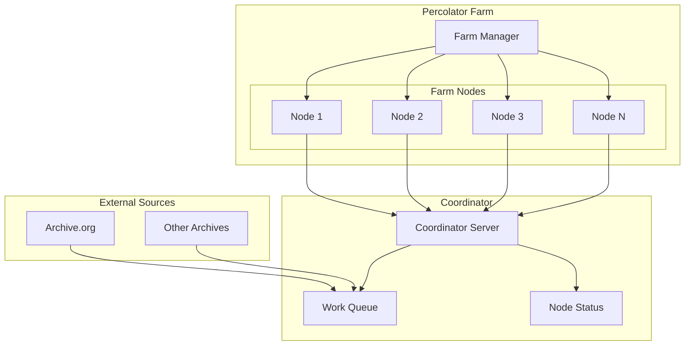

# Percolator Farm Management Guide

## Overview

The Percolator Farm system enables you to run multiple fiduciary agent percolator instances in a coordinated farm configuration. This provides scalable, distributed content extraction capabilities with automatic load balancing and health monitoring.

## Architecture



## Key Components

### 1. PercolatorFarm
- **Purpose**: Manages multiple percolator daemon instances
- **Features**: Auto-scaling, health monitoring, load balancing
- **Location**: `fiduciary/src/commonMain/kotlin/fiduciary/percolator/PercolatorFarm.kt`

### 2. PercolatorCoordinator
- **Purpose**: Distributes work units to volunteer nodes
- **Features**: Work queue management, node registration, result collection
- **Location**: `platform-launcher/src/commonMain/kotlin/fiduciary/percolator/ContentPercolator.kt`

### 3. PercolatorDaemon
- **Purpose**: Individual volunteer node that processes work units
- **Features**: HTTP range requests, content extraction, NLP processing
- **Location**: `platform-launcher/src/commonMain/kotlin/fiduciary/percolator/ContentPercolator.kt`

### 4. Farm Management Script
- **Purpose**: Command-line interface for farm operations
- **Features**: Start/stop farms, monitor status, view logs
- **Location**: `run-percolator-farm.kts`

## Quick Start

### 1. Start a Basic Farm

```bash
# Start a farm with 5 nodes
./run-percolator-farm.kts start --nodes=5

# Start a farm with custom configuration
./run-percolator-farm.kts start \
  --nodes=10 \
  --max-concurrent=5 \
  --coordinator=http://localhost:8888
```

### 2. Monitor Farm Status

```bash
# List all farms
./run-percolator-farm.kts list

# Check specific farm status
./run-percolator-farm.kts status farm-1703123456789

# View farm logs
./run-percolator-farm.kts logs farm-1703123456789
```

### 3. Manage Farms

```bash
# Stop a farm
./run-percolator-farm.kts stop farm-1703123456789

# Scale a farm (restart with new node count)
./run-percolator-farm.kts start --nodes=20
```

## Configuration Options

### Farm Configuration

| Option | Default | Description |
|--------|---------|-------------|
| `--coordinator` | `http://localhost:8888` | Coordinator server URL |
| `--nodes` | `5` | Initial number of nodes |
| `--max-concurrent` | `3` | Max concurrent work per node |
| `--work-dir` | `./percolator-farm` | Base work directory |
| `--max-nodes` | `20` | Maximum nodes for auto-scaling |
| `--min-nodes` | `2` | Minimum nodes for auto-scaling |
| `--no-auto-scale` | `false` | Disable auto-scaling |

### Auto-Scaling Behavior

The farm automatically scales based on workload:

- **Scale Up**: When active nodes fall below `min-nodes`
- **Scale Down**: When active nodes exceed `max-nodes`
- **Health Check**: Removes dead nodes and restarts them
- **Load Balancing**: Distributes work across all active nodes

## Farm Management Commands

### Start Farm
```bash
./run-percolator-farm.kts start [options]
```

**Examples:**
```bash
# Basic farm
./run-percolator-farm.kts start

# High-performance farm
./run-percolator-farm.kts start --nodes=20 --max-concurrent=10

# Custom coordinator
./run-percolator-farm.kts start --coordinator=https://percolator.example.com

# Fixed-size farm (no auto-scaling)
./run-percolator-farm.kts start --nodes=5 --no-auto-scale
```

### Check Status
```bash
./run-percolator-farm.kts status <farm-id>
```

**Output:**
```
📊 FARM STATUS: farm-1703123456789
──────────────────────────────────────────
Coordinator: http://localhost:8888
Nodes: 5
Max Concurrent: 3
Started: 2023-12-21 10:30:45
PID: 12345
✅ Farm is running

📋 Recent logs:
  🌊 Launched node: farm-node-1
  🌊 Launched node: farm-node-2
  📊 FARM STATUS UPDATE
```

### List Farms
```bash
./run-percolator-farm.kts list
```

**Output:**
```
📋 RUNNING FARMS
──────────────────────────────────────────
farm-1703123456789:
  Coordinator: http://localhost:8888
  Nodes: 5
  Started: 2023-12-21 10:30:45

farm-1703123567890:
  Coordinator: https://percolator.example.com
  Nodes: 10
  Started: 2023-12-21 10:35:12
```

### View Logs
```bash
./run-percolator-farm.kts logs <farm-id>
```

### Stop Farm
```bash
./run-percolator-farm.kts stop <farm-id>
```

## Farm Directory Structure

When you start a farm, it creates the following directory structure:

```
./farms/
└── farm-1703123456789/
    ├── farm.info              # Farm configuration and metadata
    ├── farm.log               # Farm manager logs
    ├── farm-error.log         # Farm error logs
    ├── coordinator.log        # Coordinator server logs
    ├── coordinator-error.log  # Coordinator error logs
    └── nodes/                 # Individual node work directories
        ├── farm-node-1/
        ├── farm-node-2/
        ├── farm-node-3/
        └── ...
```

## Monitoring and Metrics

### Farm Statistics

The farm provides real-time statistics:

- **Total Nodes**: Number of nodes in the farm
- **Active Nodes**: Number of nodes currently processing work
- **Active Work**: Number of work units being processed
- **Completed Work**: Number of work units completed
- **Average CPU Usage**: Average CPU utilization across nodes
- **Average Memory Usage**: Average memory utilization across nodes
- **Farm Uptime**: How long the farm has been running

### Coordinator Dashboard

Access the coordinator dashboard at `http://localhost:8888` to see:

- Network statistics
- Active nodes
- Work queue status
- Processing results

## Advanced Usage

### Multiple Farms

You can run multiple farms simultaneously:

```bash
# Start first farm
./run-percolator-farm.kts start --nodes=5 --coordinator=http://localhost:8888

# Start second farm with different coordinator
./run-percolator-farm.kts start --nodes=10 --coordinator=http://localhost:8889
```

### Custom Work Directories

```bash
# Use custom work directory
./run-percolator-farm.kts start --work-dir=/tmp/my-percolator-farm
```

### High-Performance Configuration

```bash
# High-performance farm for intensive workloads
./run-percolator-farm.kts start \
  --nodes=50 \
  --max-concurrent=20 \
  --max-nodes=100 \
  --min-nodes=10
```

## Troubleshooting

### Common Issues

1. **Build Failures**
   ```bash
   # Ensure project builds successfully
   ./gradlew :fiduciary:build
   ```

2. **Port Conflicts**
   ```bash
   # Use different coordinator port
   ./run-percolator-farm.kts start --coordinator=http://localhost:8889
   ```

3. **Permission Issues**
   ```bash
   # Ensure script is executable
   chmod +x run-percolator-farm.kts
   ```

4. **Node Failures**
   - Check individual node logs in `./farms/<farm-id>/nodes/`
   - Farm automatically restarts dead nodes
   - Monitor coordinator logs for network issues

### Debug Mode

To enable verbose logging, modify the farm configuration:

```kotlin
val config = FarmConfig(
    heartbeatInterval = 30, // More frequent heartbeats
    // ... other options
)
```

## Performance Optimization

### Recommended Configurations

**Development/Testing:**
```bash
./run-percolator-farm.kts start --nodes=3 --max-concurrent=2
```

**Production (Medium Load):**
```bash
./run-percolator-farm.kts start --nodes=10 --max-concurrent=5
```

**Production (High Load):**
```bash
./run-percolator-farm.kts start --nodes=50 --max-concurrent=10
```

### Resource Considerations

- **CPU**: Each node uses 1-2 CPU cores
- **Memory**: Each node uses 100-500MB RAM
- **Network**: Range requests minimize bandwidth usage
- **Disk**: Temporary work files in node directories

## Integration with Existing Systems

### Coordinator Integration

The farm integrates with existing percolator coordinators:

```bash
# Connect to existing coordinator
./run-percolator-farm.kts start --coordinator=https://existing-coordinator.com
```

### Work Unit Processing

Farms automatically process work units from coordinators:

1. **Claim Work**: Nodes claim work units from coordinator
2. **Extract Content**: Use HTTP range requests for efficiency
3. **Process Content**: Apply NLP and analysis
4. **Submit Results**: Send results back to coordinator

### Result Storage

Processed results are stored in:

- **Coordinator**: Central result collection
- **Local Storage**: Node work directories
- **External Systems**: IPFS, CouchDB, etc.

## Security Considerations

### Network Security

- Use HTTPS for coordinator communication
- Implement authentication for node registration
- Validate work unit signatures
- Monitor for malicious nodes

### Resource Protection

- Limit maximum concurrent work per node
- Implement rate limiting
- Monitor resource usage
- Set appropriate timeouts

## Future Enhancements

### Planned Features

1. **Dynamic Scaling**: Real-time workload-based scaling
2. **Load Balancing**: Intelligent work distribution
3. **Fault Tolerance**: Automatic failover and recovery
4. **Metrics Dashboard**: Web-based monitoring interface
5. **API Integration**: REST API for farm management
6. **Container Support**: Docker/Kubernetes deployment

### Contributing

To contribute to the percolator farm system:

1. Follow the TrikeShed architectural principles
2. Use `Indexed<T>` and `Join<A, B>` types
3. Implement extension functions for behavior
4. Maintain performance purity (avoid String operations)
5. Write comprehensive tests

## Conclusion

The Percolator Farm system provides a powerful, scalable solution for distributed content extraction. With automatic scaling, health monitoring, and easy management, it enables efficient processing of large archives while minimizing bandwidth usage.

For more information, see:
- [Percolator Implementation](PERCOLATOR_IMPLEMENTATION.md)
- [Fiduciary Architecture](docs/architecture/fiduciary.md)
- [TrikeShed Principles](.cursorrules) 