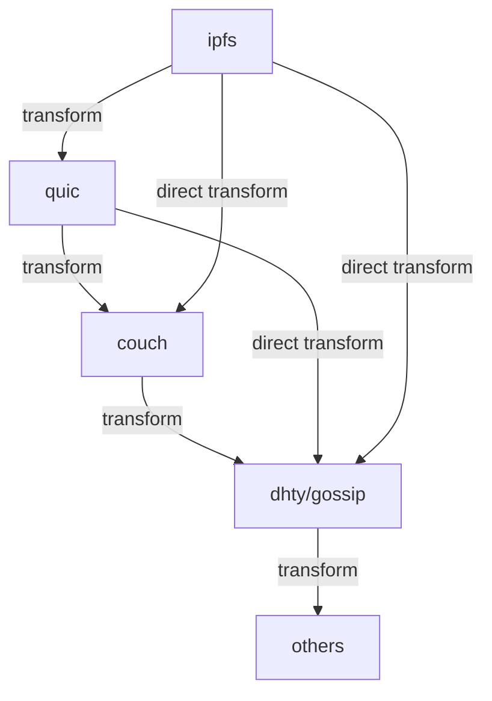

# Platform Middle Bus (N-Way Cache) Design

## Summary
This document describes a platform bus (n-way cache) that interconnects protocol/agent islands—such as IPFS, QUIC, Couch, and DHTy/gossip agents—using a context-element arrangement. The bus dynamically discovers and utilizes the shortest available transform path between any two islands, supporting direct, cached, or multi-hop routes as required. The guiding principle is: **paths are as short as the transform required**.

## Architecture

- **Context Elements**: Each protocol/agent (e.g., ipfs, quic, couch, dhty/gossip) is represented as a context element in a registry/graph.
- **Transform Registry**: The platform maintains a registry of available transforms (adapters/bridges) between protocol islands.
- **Dynamic Routing**: When a message or data needs to move from one island to another, the bus computes the minimal transform chain (shortest path) required, using direct transforms if available, or multi-hop if not.
- **N-Way Cache**: The bus can cache results of common transform chains, enabling fast-path routing for repeated flows.
- **Extensibility**: New protocol islands or transforms can be registered dynamically, and the routing graph updates accordingly.

## Fast-Path Routing Principle
- The bus always prefers the shortest available transform chain between source and destination.
- If a direct transform exists, it is used; otherwise, the minimal multi-hop path is computed.
- Caching is used to accelerate repeated or high-frequency routes.

## Example Protocol Islands
- ipfs
- quic
- couch
- dhty/gossip
- (others can be added)

## Diagram

## Routing Example
- To route from `ipfs` to `dhty/gossip`, the bus checks for a direct transform. If available, it uses it; otherwise, it computes the shortest chain (e.g., ipfs → quic → couch → dhty).
- The result is cached for future use if the route is common.

## Extending the Bus
- Register new protocol islands as context elements.
- Register new transforms (edges) between islands.
- The routing graph and cache update automatically.

## TODOs (Strong, End-Game-Oriented)

1. **Define Transform Interface Contracts**
   - Specify strict, versioned interfaces for all transforms (adapters/bridges) between protocol islands.
   - Reserve: Interface extensibility points for future protocol evolution.

2. **Implement Context Element Registry**
   - Build a robust, dynamic registry for protocol/agent islands and their transforms.
   - Reserve: Hooks for runtime introspection and hot-reload of new islands/transforms.

3. **Shortest Path Routing Engine**
   - Develop a routing engine that computes and caches minimal transform chains between any two context elements.
   - Reserve: Pluggable routing heuristics for future optimization (e.g., cost, latency, load).

4. **N-Way Cache Layer**
   - Implement a high-performance cache for transform results and routing paths.
   - Reserve: Support for distributed/shared cache backends (e.g., Redis, in-memory, custom DHT).

5. **Direct Transform Fast-Path Optimization**
   - Ensure direct transforms are always preferred and benchmarked for performance.
   - Reserve: Mechanisms for dynamic promotion/demotion of fast-paths based on usage patterns.

6. **Extensibility and Plug-in System**
   - Architect a plug-in system for registering new protocol islands and transforms at runtime.
   - Reserve: Security and validation layers for plug-in isolation and trust boundaries.

7. **Observability and Diagnostics**
   - Integrate tracing, logging, and metrics for all routing and transform operations.
   - Reserve: End-game observability hooks for AI-driven optimization and anomaly detection.

8. **End-to-End Test Harness**
   - Build a comprehensive test suite simulating all major protocol flows and transform chains.
   - Reserve: Scenario-based fuzzing and property-based testing for future robustness.

9. **Documentation and Developer Guides**
   - Maintain up-to-date, example-driven documentation for all APIs, transforms, and extension points.
   - Reserve: Living documentation system for continuous integration with codebase changes.

10. **End-Game Optimization Planning**
    - Identify and reserve architectural seams for late-stage, high-impact optimizations (e.g., zero-copy, async pipelines, protocol-specific accelerations).
    - Reserve: Explicit TODO markers in code and docs for all known future optimization targets. 