# Integrated System Documentation: DGM, Nexus, Langchain, KMP, and CCEK

## 1. Introduction

This document describes a unified software architecture integrating several advanced components: Darwin Gödel Machine (DGM), Nexus, Langchain, Kotlin Multiplatform (KMP) via TrikeShed, and Coroutine Context Enabled Kotlin (CCEK). The system is designed to create a powerful, self-improving, and universally adaptable development environment. It leverages AI for code generation and improvement, human-in-the-loop collaboration, and a robust, type-safe, and efficient foundation built with Kotlin.

The core philosophy is to amplify human creativity through intelligent automation, contextual learning, and environmental mastery, leading to exponential development capabilities.

## 2. Core Components

### 2.1. Darwin Gödel Machine (DGM)

DGM is a novel self-improving system that iteratively modifies its own code and empirically validates each change using coding benchmarks (like SWE-bench and Polyglot). It aims for open-ended evolution of its self-improvement capabilities.

- **Key Feature:** Autonomous code evolution and validation.
- **Technology:** Python-based, with API integrations for foundation models.

### 2.2. Nexus

Nexus is envisioned as a universal development agent that combines DGM's self-improvement with interactive human collaboration. It's designed to be IDE-agnostic and language-polyglot, reflecting universally on any development environment or tool.

- **Key Features:**
    - Interactive self-improvement (DGM-style evolution with human feedback).
    - Context learning (patterns, preferences, project-specific knowledge).
    - Universal integration (IDE agnostic, tool orchestration).
    - Universal reflection (environment scanning, capability discovery).
- **Technology:** Kotlin, TrikeShed for data architecture.

### 2.3. Langchain

Langchain is a framework for developing applications powered by language models. It provides tools for managing prompts, chains of LLM calls, memory, and agents.

- **Key Role:** Within this architecture, Langchain is crucial for orchestrating AI-driven tasks, particularly in DGM for its self-improvement loop and within Nexus for scaffolding CCEK (Coroutine Context Enabled Kotlin) executive services.
- **Technology:** Python library, integrated with various LLMs.

### 2.4. KMP (Kotlin Multiplatform) & TrikeShed

Kotlin Multiplatform (KMP) allows sharing code between different platforms (JVM, Native, JS). TrikeShed is a Kotlin-based library that forms the data architecture backbone, particularly for Nexus. It emphasizes:

- **Strongly immutable data structures:** `Join<A,B>` (generalized pair) and `Series<T>` (columnar data).
- **Efficient data operations:** Lazy evaluation, type-safe transformations (`α`), and materialization (`▶`).
- **Columnar Dataframes & JSON processing:** Built-in capabilities for handling structured data.

TrikeShed's design principles facilitate the KMP vision by providing a common, efficient way to handle data across platforms.

### 2.5. CCEK (Coroutine Context Enabled Kotlin)

CCEK refers to a design pattern and a set of type aliases that leverage Kotlin's coroutine context for managing services, configurations, and environmental knowledge. It provides a structured way to pass and access shared resources and capabilities throughout the application.

- **Key Features:**
    - **Service Keys:** A pattern (`CoroutineContext.Key<ServiceType>`) for typed access to services.
    - **Hierarchical Contexts:** Composable contexts (e.g., `CCEKContext`, `DevelopmentContext`, `AgentContext`, `EvolutionContext`, `CCEKNexus`) built using TrikeShed's `Join` operator.
    - **Platform Abstraction:** Uses Kotlin's `expect/actual` pattern for platform-specific service implementations.
- **Technology:** Kotlin, TrikeShed type aliases.

## 3. Unified Architecture Overview

The unified architecture positions **Nexus** as the central orchestrator, leveraging **DGM**'s self-improvement principles and integrating them with human collaboration. **Langchain** provides the AI orchestration layer, enabling complex interactions with language models for tasks like code generation, analysis, and service scaffolding.

**TrikeShed** serves as the foundational data structure and processing library, ensuring efficient and type-safe data handling across the Kotlin-based components (Nexus, CCEK). **CCEK** provides the architectural pattern for managing context, services, and configurations in a structured and extensible manner, particularly within Nexus and its interactions with lower-level services.

```mermaid
graph LR
    subgraph "User Interaction & IDEs"
        User["Human Developer"]
        IDE["Any IDE/Editor"]
    end

    subgraph "Nexus Core (Kotlin)"
        NexusAgent["Nexus Agent"]
        HybridInt["Hybrid Intelligence (DGM-style evolution + Human Feedback)"]
        UniversalAdapter["Universal Adapter Layer"]
        ReflectionEngine["Reflection Engine"]
        ContextLearner["Context Learner"]
    end

    subgraph "AI Orchestration"
        Langchain["Langchain Framework"]
        LLM["Language Models (OpenAI, Anthropic, etc.)"]
    end

    subgraph "Self-Improvement Engine (Conceptual)"
        DGM_Concept["DGM Principles (Iterative Improvement, Validation)"]
    end

    subgraph "Foundational Layers (Kotlin)"
        TrikeShed["TrikeShed (Data Structures: Series, Join)"]
        CCEK["CCEK (Context Management, Service Keys)"]
    end

    subgraph "Execution Environment"
        Tools["Build Tools, Git, Test Frameworks"]
        ProjectCode["Project Codebase"]
        KMP["Kotlin Multiplatform (JVM, Native)"]
    end

    User -- "Guides & Collaborates" --> NexusAgent
    IDE -- "Integration via Universal Adapter" --> NexusAgent

    NexusAgent -- "Orchestrates" --> HybridInt
    NexusAgent -- "Uses" --> ReflectionEngine
    NexusAgent -- "Learns From" --> ContextLearner
    NexusAgent -- "Interacts With" --> UniversalAdapter

    HybridInt -- "Utilizes for AI Tasks" --> Langchain
    Langchain -- "Interfaces With" --> LLM
    HybridInt -- "Implements" --> DGM_Concept

    UniversalAdapter -- "Controls/Observes" --> Tools
    UniversalAdapter -- "Accesses/Modifies" --> ProjectCode

    NexusAgent -- "Built Upon" --> TrikeShed
    NexusAgent -- "Manages Context Via" --> CCEK

    TrikeShed -- "Provides Primitives For" --> CCEK
    CCEK -- "Runs On" --> KMP
    Tools -- "Operate Within" --> KMP
    ProjectCode -- "Is Part Of" --> KMP


    %% DGM Langchain specific integration (as inspiration for Nexus)
    DGM_Langchain_Int["DGM Langchain Integration Module"]
    DGM_LC_Orchestrator["Langchain Orchestrator"]
    DGM_LC_Tools["Langchain Tools (Code Analysis, Modification, Test)"]

    Langchain --> DGM_LC_Orchestrator
    DGM_LC_Orchestrator --> DGM_LC_Tools
    DGM_Concept -.-> DGM_Langchain_Int
    DGM_Langchain_Int -.-> Langchain

    classDef nexusCore fill:#aliceblue,stroke:#666,stroke-width:2px;
    classDef aiOrchestration fill:#lightgoldenrodyellow,stroke:#666,stroke-width:2px;
    classDef foundation fill:#e6ffe6,stroke:#666,stroke-width:2px;
    classDef userInteraction fill:#f0f8ff,stroke:#666,stroke-width:2px;
    classDef executionEnv fill:#fff0f5,stroke:#666,stroke-width:2px;
    classDef dgmConcept fill:#ffe4e1,stroke:#666,stroke-width:2px;


    class NexusAgent,HybridInt,UniversalAdapter,ReflectionEngine,ContextLearner nexusCore;
    class Langchain,LLM aiOrchestration;
    class TrikeShed,CCEK foundation;
    class User,IDE userInteraction;
    class Tools,ProjectCode,KMP executionEnv;
    class DGM_Concept,DGM_Langchain_Int,DGM_LC_Orchestrator,DGM_LC_Tools dgmConcept;
```

Data flows primarily through TrikeShed structures. For example, environmental context scanned by Nexus's `ReflectionEngine` would be represented as `Series` or `Join` compositions, processed by the `ContextLearner`, and used by the `HybridIntelligence` layer. Control flow is managed by Nexus, which delegates to Langchain for complex AI tasks and to universal adapters for environment interaction.

## 4. Langchain Integration within Nexus for CCEK Executive Service Scaffolding

While the primary `DGM/README_LANGCHAIN.md` describes Langchain's use in the DGM Python environment, its principles are extended to Nexus for CCEK executive service scaffolding. Nexus, being Kotlin-based, would use Langchain (potentially via an inter-process communication mechanism if Langchain components remain Python, or by leveraging Kotlin-based Langchain-compatible libraries if available) to:

1.  **Manage Scaffolding Loop:** Orchestrate the steps involved in creating new CCEK services or modifying existing ones. This includes defining the service interface, generating boilerplate implementation, setting up context key injection, and integrating with CCEK's hierarchical context system.
2.  **Coordinate Agents:** Employ specialized Langchain agents for different aspects of service scaffolding:
    *   **API Design Agent:** Helps define the `expect` interface for a new CCEK service, considering KMP aspects.
    *   **Platform Implementation Agent:** Generates `actual` implementations for specific platforms (JVM, Linux Native, etc.), ensuring proper use of platform-specific APIs while adhering to the CCEK service patterns.
    *   **Context Integration Agent:** Ensures the new service is correctly integrated into the CCEK `Join`-based context hierarchy and that its `CoroutineContext.Key` is properly defined and used.
    *   **Test Generation Agent:** Creates unit and integration tests for the new CCEK service.
3.  **Langchain Tools for CCEK:**
    *   **Code Analysis Tools:** Analyze existing CCEK services and context structures to inform new service generation. This would involve understanding `Join` compositions and `Series` data flows.
    *   **Code Modification Tools:** Modify Kotlin code to insert new service keys, update context compositions, and implement service logic. These tools would need to be aware of TrikeShed's immutable structures and how to correctly create new versions.
    *   **Test Execution Tools:** Integrate with Kotlin testing frameworks to validate the scaffolded services.
    *   **Documentation Tools:** Generate documentation for the new CCEK services, including their role in the overall context hierarchy.
4.  **Integration Layer:** A conceptual bridge (similar to `langchain_integration.py` in DGM) would manage the interaction between Nexus's Kotlin environment and the Langchain framework. This layer would translate requests from Nexus into tasks for Langchain agents and return the results (e.g., generated Kotlin code, analysis reports).

**Example Workflow for Scaffolding a New CCEK Service:**

1.  **Developer Request (via Nexus):** "Create a new CCEK service for managing persistent storage."
2.  **Nexus + Langchain Orchestrator:**
    *   Initiates the scaffolding process.
    *   Invokes the **API Design Agent** to define the `StorageService.Key` and its `expect interface StorageService`.
    *   Invokes **Platform Implementation Agents** to generate `actual class JvmStorageService : StorageService` and `actual class NativeStorageService : StorageService`, using `NioService.Key` or other relevant CCEK services.
    *   Invokes **Context Integration Agent** to advise on how `StorageService.Key` should be added to relevant `CCEKContext` compositions (e.g., `DevelopmentContext`).
    *   Invokes **Test Generation Agent** to create basic tests.
3.  **Nexus:** Receives the generated Kotlin code snippets and integrates them into the project, possibly with human review.

This integration allows Nexus to leverage LLMs for the complex task of understanding and generating code that fits within the specific, opinionated CCEK and TrikeShed architecture.

## 5. KMP (Kotlin Multiplatform) Aspect

KMP is central to Nexus and CCEK.
- **TrikeShed:** Designed with KMP in mind, providing common data structures (`Series`, `Join`) that work across platforms.
- **CCEK Services:** Utilize the `expect/actual` pattern. Service interfaces (`expect`) are defined in common code, while platform-specific implementations (`actual`) are provided for JVM, Native (Linux, macOS, Windows), and potentially JS. This allows Nexus to orchestrate operations that can span multiple platforms or require platform-specific capabilities.
- **Nexus Agent:** The core Nexus agent and its components (Reflection Engine, Context Learner) are intended to be KMP-compatible, allowing Nexus to potentially run and adapt in diverse environments.

## 6. CCEK - The Contextual Glue

CCEK provides a unified system for managing operational state, configurations, platform capabilities, and learned knowledge.

- **Foundation Types (`Join`, `Series`, `Tensor`):** These TrikeShed types are the building blocks for all context objects.
- **Hierarchical Contexts:**
    - `CCEKContext = Join<Join<Context, Config>, Join<Env, Knowledge>>`
    - `DevelopmentContext = Join<CCEKContext, CodebaseContext>`
    - `AgentContext = Join<DevelopmentContext, LearningContext>`
    - `EvolutionContext = Join<AgentContext, AdaptationContext>`
    - `CCEKNexus = Join<EvolutionContext, CCEKOperations>`
    This hierarchy allows for layered and scoped access to information and capabilities. For instance, an `AgentContext` has everything a `DevelopmentContext` has, plus `LearningContext`.
- **Service Keys:** Each CCEK service (e.g., `VulkanService.Key`, `NioService.Key`, `AsyncIoEngine.Key`, `TlsServiceKey`) provides a typed accessor for that service via the coroutine context. This enables dependency injection and clean separation of concerns.
- **Zero-Cost Abstractions:** Inline classes and functions aim to provide these powerful abstractions with minimal runtime overhead.

## 7. Data Flow and Structures (TrikeShed)

TrikeShed is fundamental to the efficiency and design of Nexus and CCEK.
- **`Join<A,B>`:** The core composition operator. Used to build complex, typed structures like the CCEK contexts. For example, `CCEKContext` is a `Join` of other `Join`s.
- **`Series<T>`:** Represents columnar data (`Join<Int, (Int) -> T>`). This is used for representing collections of problems, solutions, actions, capabilities, project context elements, etc.
- **Immutability:** All TrikeShed structures are immutable, promoting safer and more predictable state management.
- **Transformations (`α`) and Materialization (`▶`):**
    - `series.α { transform }`: Defines a lazy transformation on a `Series`.
    - `series ▶`: Materializes the results of transformations, often into standard Kotlin collections when needed.
This allows for building efficient data processing pipelines. For instance, Nexus might represent a list of potential solutions as a `Series<Solution>`, apply filtering and ranking transformations using `α`, and then materialize the top N solutions using `▶`.

## 8. k2script

While not a core architectural component of the Nexus/DGM/CCEK runtime, `k2script` serves as a valuable utility in the broader ecosystem. It enhances Kotlin's usability for scripting tasks, which can be beneficial for:
- Writing вспомогательные scripts for managing the development environment.
- Automating build, test, or deployment tasks related to Nexus or DGM components.
- Quick prototyping of ideas or tools that might later be integrated into the main Kotlin-based systems.
Its ability to easily handle dependencies and create interpreters for custom DSLs could be leveraged for creating specialized command-line tools for interacting with Nexus or analyzing its outputs.

## 9. Conclusion

The integrated architecture of DGM, Nexus, Langchain, KMP/TrikeShed, and CCEK aims to create a highly advanced, adaptable, and intelligent development system. By combining AI-driven self-improvement (DGM principles, Langchain orchestration) with a robust, type-safe, and efficient Kotlin foundation (TrikeShed, CCEK, KMP), this system offers the potential to significantly augment developer productivity and tackle complex software engineering challenges. The focus on human-in-the-loop collaboration ensures that the system remains a powerful tool that amplifies, rather than replaces, human ingenuity.
The CCEK executive service scaffolding, powered by Langchain within Nexus, is a key example of how this synergy can automate and enhance complex development workflows.
