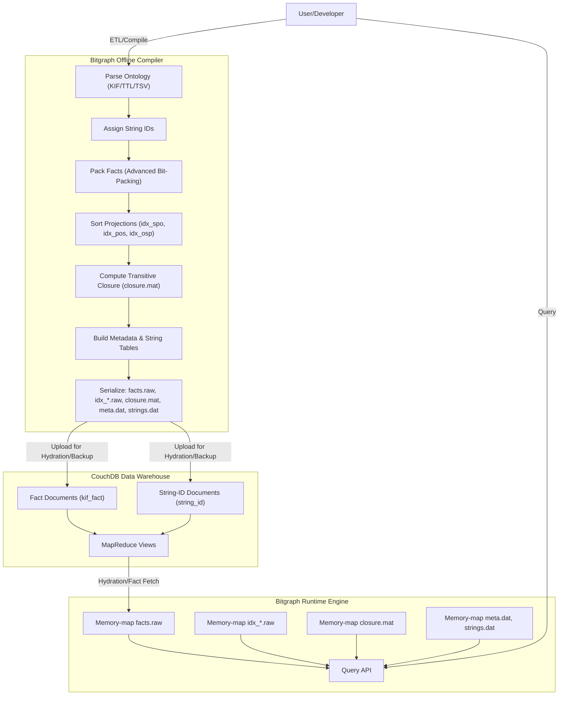

# Bitgraph, SUMO, and KIF Pipeline: Architectural Blueprint

---

## 1. Optimal Bitgraph Design

### Bitgraph Components
- **Fact Table (`facts.raw`)**: Core `LongArray` of packed facts.
- **Projection Indices (`idx_spo.raw`, `idx_pos.raw`, etc.)**: Sorted views for fast queries.
- **Transitivity Matrix (`closure.mat`)**: Precomputed bit matrix for hierarchical predicates.
- **Metadata & String Table (`meta.dat`, `strings.dat`)**: Maps between IDs and human-readable names.

### Fact Packing Example
```kotlin
// 64 bits: [4 meta | 28 object | 20 subject | 12 predicate]
object BitgraphPacking {
    // ... constants ...
    fun packFact(predicate: Int, subject: Int, obj: Int, meta: Int): Long = ...
    fun unpackFact(fact: Long): FactComponents = ...
    data class FactComponents(val predicate: Int, val subject: Int, val obj: Int, val meta: Int)
}
```

---

## 2. Data-Oriented Query Flow

1. **ID Resolution**: Use metadata tables to map names to IDs.
2. **Transitivity Check**: O(1) bit check in closure matrix.
3. **Projection Lookup**: O(log N) binary search in sorted projection.
4. **Fact Extraction**: Unpack facts with bitwise operations.

---

## 3. SUMO as the Target Corpus

- **Fits in memory**: All data structures can be dense, in-memory arrays.
- **Rapid iteration and TDD**: Enables fast development and validation.
- **Lays groundwork for future scaling**: Projections, closure, and metadata separation are future-proof.

---

## 4. KMP Principles

- **Pure Kotlin**: No JVM/Python dependencies in core logic.
- **Multiplatform**: Works on JVM, JS, Native, etc.
- **Coroutine-friendly**: For concurrency and async pipelines.
- **Data-oriented**: For memory and performance efficiency.

---

## 5. Pipeline and TDD

### Offline Compiler Pipeline
- Parse KIF/ontology.
- Assign IDs, pack facts.
- Sort projections, compute closure.
- Build meta/strings tables.

### TDD Test Harness
- Loads a toy or real SUMO KIF file.
- Runs the full pipeline.
- Asserts correctness of queries, closure, and projections.

---

## 6. MetaSeries and Join Patterns

- **MetaSeries**: For regular, indexable, functional mappings.
- **HashMap**: For dynamic, irregular, or concurrent mappings.
- **MetaSeries as Inline `when`**: For small, static, or enum-like mappings.

---

## 7. CoroutineContext Service Pattern

```kotlin
class MyService<A, T>(
    val metaSeries: MetaSeries<A, T>
) : CoroutineContext.Element {
    companion object Key : CoroutineContext.Key<MyService<*, *>>
    override val key: CoroutineContext.Key<*> get() = Key
}
```

---

## 8. SUMO Bitgraph Example (Normalized)

```kotlin
data class Bitgraph(
    val facts: LongArray,
    val idxSpo: LongArray,
    val idxPos: LongArray,
    val idxOsp: LongArray,
    val closureMat: LongArray,
    val meta: LongArray,
    val strings: ByteArray,
    val numConcepts: Int
) {
    // Query, projection, and closure methods
}
```

---

## 9. Mermaid Diagram: Bitgraph System Architecture



---

## 10. Scaling Considerations

| Component         | SUMO Scale         | YAGO 4.5 Scale         | Solution/Optimization                |
|-------------------|-------------------|------------------------|--------------------------------------|
| Fact Table        | In-memory         | Memory-mapped/Chunked  | Use mmap, chunked arrays             |
| Projections       | In-memory         | Memory-mapped/Chunked  | External/parallel sort, mmap         |
| Closure Matrix    | In-memory         | Sparse/Compressed      | RoaringBitmap, CSR, on-demand        |
| Metadata/Strings  | In-memory         | Memory-mapped/Compressed| Dedup, compress, mmap                |
| Pipeline          | Single-threaded   | Parallel/Chunked       | Streaming, distributed, chunked      |
| Query Engine      | In-memory         | Mmap/Chunked/Indexed   | Indexes, mmap, cache, batch queries  |

---

## 11. External Reference

- [quantori/kifparser](https://github.com/quantori/kifparser): Python SUO-KIF parser for reference, validation, or bootstrapping.

---

## 12. Key Takeaways

- **SUMO is the ideal target for rapid, in-memory, high-performance Bitgraph development.**
- **KMP ensures your code is portable, testable, and future-proof.**
- **MetaSeries and Join patterns provide zero-cost, idiomatic functional mapping.**
- **Scaling to YAGO or larger corpora will require memory-mapping, chunked processing, and possibly distributed computation—but your current architecture is ready for that leap.**

---

**If you need code, tests, or further diagrams for any specific part, just ask!** 