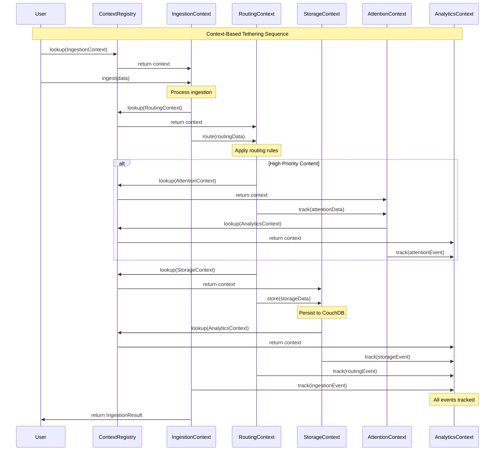
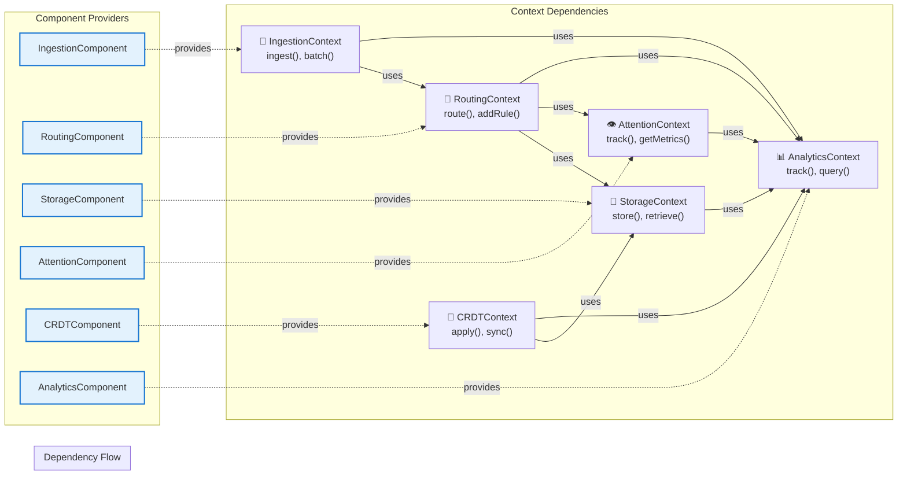

# Context-Based Tethering Architecture 

## Comprehensive System Diagram

```mermaid
graph TB 

    %% === CONTEXT REGISTRY (CENTRAL HUB) ===

    subgraph ContextRegistry["🏛️ Context Registry"]
            STORAGE_CTX[StorageContext]:::context
        ROUTING_CTX[RoutingContext]:::context
        ATTENTION_CTX[AttentionContext]:::context
        CRDT_CTX[CRDTContext]:::context
        ANALYTICS_CTX[AnalyticsContext]:::context
        INGESTION_CTX[IngestionContext]:::context
    end
 
    %% === COMPONENTS LAYER ===
    subgraph ComponentLayer["📦 Component Layer"]
        subgraph StorageComp["StorageComponent"]
            STORAGE_IMPL[StorageContextImpl]:::impl
            COUCH_API[CouchDB API]:::internal
            STORAGE_MUTEX[Mutex]:::internal
        end
        
        subgraph RoutingComp["RoutingComponent"]
            ROUTING_IMPL[RoutingContextImpl]:::impl
            ROUTING_RULES[Routing Rules]:::internal
            ROUTING_MUTEX[Mutex]:::internal
        end
        
        subgraph AttentionComp["AttentionComponent"]
            ATTENTION_IMPL[AttentionContextImpl]:::impl
            ATTENTION_PROTOCOL[Attention Protocol]:::internal
            ATTENTION_MUTEX[Mutex]:::internal
        end
        
        subgraph CRDTComp["CRDTComponent"]
            CRDT_IMPL[CRDTContextImpl]:::impl
             CRDT_MUTEX[Mutex]:::internal
        end
        
        subgraph AnalyticsComp["AnalyticsComponent"]
            ANALYTICS_IMPL[AnalyticsContextImpl]:::impl
            ANALYTICS_EVENTS[Event Store]:::internal
            ANALYTICS_MUTEX[Mutex]:::internal
        end
        
        subgraph IngestionComp["IngestionComponent"]
            INGESTION_IMPL[IngestionContextImpl]:::impl
            INGESTION_DATA[Ingestion Data]:::internal
            INGESTION_MUTEX[Mutex]:::internal
        end
    end
    
    %% === CONTEXT TRAIT INTERFACES ===
    subgraph ContextTraits["🔌 Context Trait Interfaces"]
        subgraph StorageTraits["StorageContext API"]
            STORE_OP["store data"]:::api
            RETRIEVE_OP["retrieve id"]:::api
            QUERY_OP["query"]:::api
            ONCHANGE_OP["onChange handler"]:::api
        end
        
        subgraph RoutingTraits["RoutingContext API"]
            ROUTE_OP["route data"]:::api
            ADDRULE_OP["addRule rule"]:::api
            ONROUTE_OP["onRoute handler"]:::api
        end
        
        subgraph AttentionTraits["AttentionContext API"]
            TRACK_OP["track data"]:::api
            GETMETRICS_OP["getMetrics id"]:::api
            ONATTENTION_OP["onAttention handler"]:::api
        end
        
        subgraph CRDTTraits["CRDTContext API"]
            APPLY_OP["apply operation"]:::api
            GET_OP["get entityId"]:::api
            SYNC_OP["sync data"]:::api
            ONUPDATE_OP["onUpdate handler"]:::api
        end
        
        subgraph AnalyticsTraits["AnalyticsContext API"]
            TRACK_ANALYTICS["track event"]:::api
            QUERY_ANALYTICS["query"]:::api
            ONMETRIC_OP["onMetric handler"]:::api
        end
        
        subgraph IngestionTraits["IngestionContext API"]
            INGEST_OP["ingest data"]:::api
            BATCH_OP["batch data"]:::api
            ONINGEST_OP["onIngest handler"]:::api
        end
    end
    
    %% === DATA FLOW LAYER ===
    subgraph DataFlow["📊 Data Flow"]
        subgraph FlowTypes["Data Types"]
            STORAGE_DATA[StorageData]:::datatype
            ROUTING_DATA[RoutingData]:::datatype
            ATTENTION_DATA[AttentionData]:::datatype
            CRDT_DATA[CRDTOperation]:::datatype
            ANALYTICS_DATA[AnalyticsEvent]:::datatype
            INGESTION_DATA[IngestionData]:::datatype
        end
        
        subgraph FlowResults["Result Types"]
            STORAGE_RESULT[StorageResult]:::result
            ROUTING_RESULT[RoutingResult]:::result
            ATTENTION_RESULT[AttentionResult]:::result
            CRDT_RESULT[CRDTResult]:::result
            ANALYTICS_RESULT[AnalyticsResult]:::result
            INGESTION_RESULT[IngestionResult]:::result
        end
    end
    
    %% === EXTERNAL INTEGRATIONS ===
    subgraph ExternalSystems["🌐 External Systems"]
        COUCHDB[(CouchDB)]:::external
        FIDUCIARY_CORE[Fiduciary Core]:::external
        PATRICK_ANALYZER[Patrick Analyzer]:::external
        PROTOCOL_LAYER[Protocol Layer]:::external
    end
    
    %% === CONTEXT PROVIDERS & CONSUMERS ===
    subgraph ContextFlow["🔄 Context Flow"]
        subgraph Providers["Context Providers"]
            STORAGE_PROVIDER[StorageComponent]:::provider
            ROUTING_PROVIDER[RoutingComponent]:::provider
            ATTENTION_PROVIDER[AttentionComponent]:::provider
            CRDT_PROVIDER[CRDTComponent]:::provider
            ANALYTICS_PROVIDER[AnalyticsComponent]:::provider
            INGESTION_PROVIDER[IngestionComponent]:::provider
        end
        
        subgraph Consumers["Context Consumers"]
            STORAGE_CONSUMER[Uses: Analytics]:::consumer
            ROUTING_CONSUMER[Uses: Storage, Attention, Analytics]:::consumer
            ATTENTION_CONSUMER[Uses: Analytics]:::consumer
            CRDT_CONSUMER[Uses: Storage, Analytics]:::consumer
            ANALYTICS_CONSUMER[Uses: None - Leaf]:::consumer
            INGESTION_CONSUMER[Uses: Routing, Analytics]:::consumer
        end
    end
    
    %% === MAIN EXECUTION FLOW ===
    subgraph ExecutionFlow["⚡ Execution Flow"]
        USER_INPUT[User Input]:::trigger
        CONTEXT_LOOKUP[Context Lookup]:::process
        API_CALL[API Call]:::process
        IMPL_EXECUTE[Implementation Execute]:::process
        DOWNSTREAM_CALLS[Downstream Context Calls]:::process
        EVENT_TRACKING[Event Tracking]:::process
        RESULT_RETURN[Result Return]:::process
    end
    
    %% === COMPONENT REGISTRATIONS ===
    STORAGE_IMPL -->|registers| STORAGE_CTX
    ROUTING_IMPL -->|registers| ROUTING_CTX
    ATTENTION_IMPL -->|registers| ATTENTION_CTX
    CRDT_IMPL -->|registers| CRDT_CTX
    ANALYTICS_IMPL -->|registers| ANALYTICS_CTX
    INGESTION_IMPL -->|registers| INGESTION_CTX 
    
    %% === CONTEXT IMPLEMENTATIONS ===
    STORAGE_CTX -.->|implements| STORE_OP
    STORAGE_CTX -.->|implements| RETRIEVE_OP
    STORAGE_CTX -.->|implements| QUERY_OP
    STORAGE_CTX -.->|implements| ONCHANGE_OP
    
    ROUTING_CTX -.->|implements| ROUTE_OP
    ROUTING_CTX -.->|implements| ADDRULE_OP
    ROUTING_CTX -.->|implements| ONROUTE_OP
    
    ATTENTION_CTX -.->|implements| TRACK_OP
    ATTENTION_CTX -.->|implements| GETMETRICS_OP
    ATTENTION_CTX -.->|implements| ONATTENTION_OP
    
    CRDT_CTX -.->|implements| APPLY_OP
    CRDT_CTX -.->|implements| GET_OP
    CRDT_CTX -.->|implements| SYNC_OP
    CRDT_CTX -.->|implements| ONUPDATE_OP
    
    ANALYTICS_CTX -.->|implements| TRACK_ANALYTICS
    ANALYTICS_CTX -.->|implements| QUERY_ANALYTICS
    ANALYTICS_CTX -.->|implements| ONMETRIC_OP
    
    INGESTION_CTX -.->|implements| INGEST_OP
    INGESTION_CTX -.->|implements| BATCH_OP
    INGESTION_CTX -.->|implements| ONINGEST_OP
    
    %% === CONTEXT USAGE PATTERNS ===
    INGESTION_CTX -->|uses| ROUTING_CTX
    INGESTION_CTX -->|uses| ANALYTICS_CTX
    
    ROUTING_CTX -->|uses| STORAGE_CTX
    ROUTING_CTX -->|uses| ATTENTION_CTX
    ROUTING_CTX -->|uses| ANALYTICS_CTX
    
    STORAGE_CTX -->|uses| ANALYTICS_CTX
    
    ATTENTION_CTX -->|uses| ANALYTICS_CTX
    
    CRDT_CTX -->|uses| STORAGE_CTX
    CRDT_CTX -->|uses| ANALYTICS_CTX
    
    %% === DATA TYPE FLOWS ===
    INGESTION_DATA -->|transforms to| ROUTING_DATA
    ROUTING_DATA -->|transforms to| STORAGE_DATA
    ROUTING_DATA -->|transforms to| ATTENTION_DATA
    ROUTING_DATA -->|transforms to| CRDT_DATA
    
    %% === EXTERNAL INTEGRATIONS ===
    STORAGE_IMPL -->|persists to| COUCHDB
    ATTENTION_IMPL -->|integrates with| FIDUCIARY_CORE
    ROUTING_IMPL -->|uses| PATRICK_ANALYZER
    CRDT_IMPL -->|uses| PROTOCOL_LAYER
    
    %% === EXECUTION FLOW ===
    USER_INPUT --> CONTEXT_LOOKUP
    CONTEXT_LOOKUP --> API_CALL
    API_CALL --> IMPL_EXECUTE
    IMPL_EXECUTE --> DOWNSTREAM_CALLS
    DOWNSTREAM_CALLS --> EVENT_TRACKING
    EVENT_TRACKING --> RESULT_RETURN
    
    %% === PROVIDER-CONSUMER RELATIONSHIPS ===
    STORAGE_PROVIDER -->|provides| STORAGE_CTX
    ROUTING_PROVIDER -->|provides| ROUTING_CTX
    ATTENTION_PROVIDER -->|provides| ATTENTION_CTX
    CRDT_PROVIDER -->|provides| CRDT_CTX 
    ANALYTICS_PROVIDER -->|provides| ANALYTICS_CTX
    INGESTION_PROVIDER -->|provides| INGESTION_CTX
    
    STORAGE_CONSUMER -->|consumes| ANALYTICS_CTX
    ROUTING_CONSUMER -->|consumes| STORAGE_CTX
    ROUTING_CONSUMER -->|consumes| ATTENTION_CTX
    ROUTING_CONSUMER -->|consumes| ANALYTICS_CTX
    ATTENTION_CONSUMER -->|consumes| ANALYTICS_CTX
    CRDT_CONSUMER -->|consumes| STORAGE_CTX
    CRDT_CONSUMER -->|consumes| ANALYTICS_CTX
    INGESTION_CONSUMER -->|consumes| ROUTING_CTX
    INGESTION_CONSUMER -->|consumes| ANALYTICS_CTX
    
    %% === STYLING ===
    classDef context fill:#e1f5fe,stroke:#01579b,stroke-width:3px,color:#000
    classDef impl fill:#f3e5f5,stroke:#4a148c,stroke-width:2px,color:#000
    classDef internal fill:#fff3e0,stroke:#e65100,stroke-width:1px,color:#000
    classDef api fill:#e8f5e8,stroke:#2e7d32,stroke-width:2px,color:#000
    classDef datatype fill:#fff8e1,stroke:#f57c00,stroke-width:1px,color:#000
    classDef result fill:#fce4ec,stroke:#c2185b,stroke-width:1px,color:#000
    classDef external fill:#f1f8e9,stroke:#558b2f,stroke-width:2px,color:#000
    classDef provider fill:#e0f2f1,stroke:#00695c,stroke-width:2px,color:#000
    classDef consumer fill:#fafafa,stroke:#424242,stroke-width:1px,color:#000
    classDef trigger fill:#ffebee,stroke:#d32f2f,stroke-width:3px,color:#000
    classDef process fill:#f9fbe7,stroke:#827717,stroke-width:2px,color:#000 
    
    %% === COMPONENT STYLING ===
    class STORAGE_CTX,ROUTING_CTX,ATTENTION_CTX,CRDT_CTX,ANALYTICS_CTX,INGESTION_CTX context
    class STORAGE_IMPL,ROUTING_IMPL,ATTENTION_IMPL,CRDT_IMPL,ANALYTICS_IMPL,INGESTION_IMPL impl
    class COUCH_API,STORAGE_MUTEX,ROUTING_RULES,ROUTING_MUTEX,ATTENTION_PROTOCOL,ATTENTION_MUTEX,CRDT_PROTOCOL,CRDT_MUTEX,ANALYTICS_EVENTS,ANALYTICS_MUTEX,INGESTION_DATA,INGESTION_MUTEX internal
    class STORE_OP,RETRIEVE_OP,QUERY_OP,ONCHANGE_OP,ROUTE_OP,ADDRULE_OP,ONROUTE_OP,TRACK_OP,GETMETRICS_OP,ONATTENTION_OP,APPLY_OP,GET_OP,SYNC_OP,ONUPDATE_OP,TRACK_ANALYTICS,QUERY_ANALYTICS,ONMETRIC_OP,INGEST_OP,BATCH_OP,ONINGEST_OP api
    class STORAGE_DATA,ROUTING_DATA,ATTENTION_DATA,CRDT_DATA,ANALYTICS_DATA,INGESTION_DATA datatype
    class STORAGE_RESULT,ROUTING_RESULT,ATTENTION_RESULT,CRDT_RESULT,ANALYTICS_RESULT,INGESTION_RESULT result
    class COUCHDB,FIDUCIARY_CORE,PATRICK_ANALYZER,PROTOCOL_LAYER external
    class STORAGE_PROVIDER,ROUTING_PROVIDER,ATTENTION_PROVIDER,CRDT_PROVIDER,ANALYTICS_PROVIDER,INGESTION_PROVIDER provider
    class STORAGE_CONSUMER,ROUTING_CONSUMER,ATTENTION_CONSUMER,CRDT_CONSUMER,ANALYTICS_CONSUMER,INGESTION_CONSUMER consumer
    class USER_INPUT trigger
    class CONTEXT_LOOKUP,API_CALL,IMPL_EXECUTE,DOWNSTREAM_CALLS,EVENT_TRACKING,RESULT_RETURN process 
```

## Context Tethering Flow

## Context Dependency Graph

## Key Architecture Benefits

### 🔌 **Interface-Based Integration**
- Components communicate only through context trait interfaces
- No direct coupling between components
- Easy to mock and test individual contexts

### 🏛️ **Centralized Context Registry**
- Single source of truth for all context APIs
- Components register their provided contexts
- Lookup mechanism for required contexts

### 🔄 **Deliberate Dependencies**
- Each component explicitly declares context dependencies
- Clear provider/consumer relationships
- Initialization order handled by registry

### 📊 **Comprehensive Analytics**
- All operations tracked through AnalyticsContext
- Unified event tracking across all components
- Real-time system monitoring and metrics

### 🎯 **Pluggable Architecture**
- Easy to swap context implementations
- Add new components without modifying existing ones
- Clear API boundaries for each context type

This architecture provides **true context-based tethering** where components are connected through deliberate, well-defined API contracts rather than tight coupling or loose event systems.