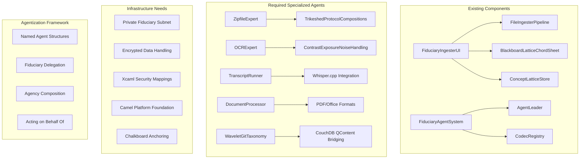
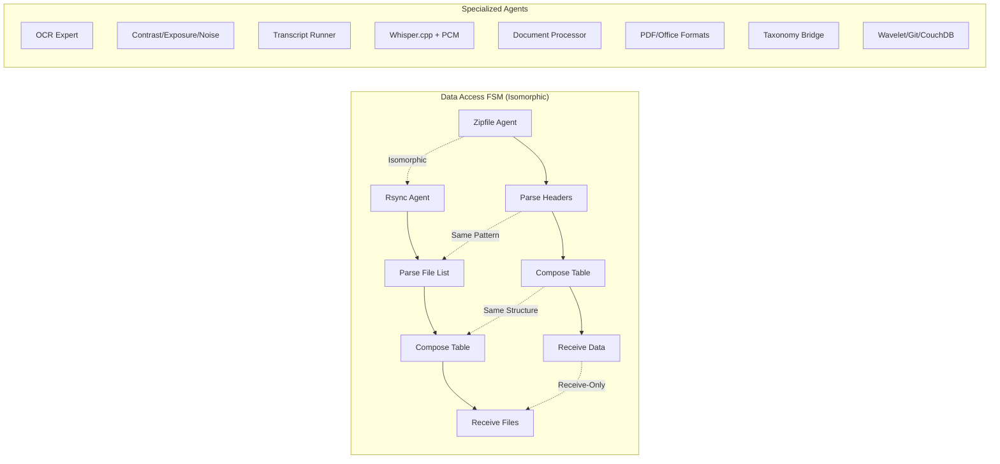

# Fiduciary Composition Normalization

## Overview

This document normalizes the composition spectrum for the fiduciary multi-agent system, identifying existing components and efficiency gaps that need to be addressed.

## Current Composition Spectrum



## Normalization Analysis

### 1. Core Infrastructure Gaps

| Component | Status | Priority | Dependencies |
|-----------|--------|----------|--------------|
| Private Subnet | Missing | High | Network layer |
| Encrypted Data | Missing | High | Security layer |
| Xcaml Integration | Missing | Medium | External repo |
| Camel Foundation | Missing | Medium | Platform layer |
| Chalkboard | Missing | High | Data layer |

### 2. Specialized Agent Requirements with TrikeShed Normalizations



#### TrikeShed Normalization Patterns

1. **Widget Decomposition** - Fine-grained reusable components
```kotlin
// Normalized agent widgets using TrikeShed patterns
typealias AgentWidget<T> = Series<Join<AgentCapability, T>>
typealias AgentComposition = Indexed<AgentWidget<*>>

// Fine-grained widget types
sealed class WidgetType {
    // Data Access Widgets (1-3)
    data class HeaderParser<T> : WidgetType() // Widget 1: Parse headers from any source
    data class TableComposer<K, V> : WidgetType() // Widget 2: Compose indexed tables  
    data class DataReceiver<T> : WidgetType() // Widget 3: Receive-only operations
    
    // Transform Widgets (4-6)  
    data class FormatHandler<I, O> : WidgetType() // Widget 4: Handle format conversions
    data class ContentExtractor<T> : WidgetType() // Widget 5: Extract content from containers
    data class MetadataProcessor<M> : WidgetType() // Widget 6: Process metadata
    
    // Analysis Widgets (7-8)
    data class PatternMatcher<P> : WidgetType() // Widget 7: Match patterns in data
    data class QualityAnalyzer<Q> : WidgetType() // Widget 8: Analyze quality metrics
}
```

2. **Normalized Agent Compositions**
```kotlin
// Use Series<T> for ordered widget compositions
typealias WidgetPipeline<I, O> = Series<Join<WidgetType, Transform<I, O>>>

// Use Indexed<T> for named widget registries  
typealias WidgetRegistry = Indexed<Join<WidgetName, WidgetInstance>>

// Use Twin<T> for paired widget operations
typealias WidgetPair<A, B> = Twin<Join<WidgetType, WidgetType>>
```

### 3. Efficiency Optimization Points with TrikeShed Normalizations

#### TrikeShed Widget Use Cases (Fine-grained Reuse)

3. **Attention Widget** - Video game-style UI interaction
```kotlin
// Attention is like a button that opens a text box in a video game
data class AttentionWidget<T>(
    val trigger: Series<InputEvent>,           // Button press events
    val popup: Join<TextBox, T>,              // Text box with content
    val focus: Indexed<AttentionContext>      // What's being attended to
) : WidgetType()

// Use case: Click to reveal information
typealias GameAttention = AttentionWidget<Join<Tooltip, Detail>>
```

4. **Pipeline Widget** - Composable data transformations  
```kotlin
data class PipelineWidget<I, O>(
    val stages: Series<Transform<*, *>>,      // Ordered transformations
    val taps: Indexed<DataTap<*>>,           // Observable points
    val flow: Join<Input<I>, Output<O>>      // Input/output pair
) : WidgetType()

// Use case: Multi-stage processing
typealias DataPipeline = PipelineWidget<ByteArray, ProcessedResult>
```

5. **Registry Widget** - Named component lookups
```kotlin
data class RegistryWidget<K, V>(
    val entries: Indexed<Join<K, V>>,         // Key-value storage
    val cache: Twin<LRU<K>, Value<V>>,       // Paired cache strategy
    val lookup: Series<Query<K>>              // Query history
) : WidgetType()

// Use case: Component discovery
typealias ServiceRegistry = RegistryWidget<ServiceName, ServiceInstance>
```

6. **Monitor Widget** - Resource observation
```kotlin
data class MonitorWidget<M>(
    val metrics: Series<Measurement<M>>,       // Time-series data
    val alerts: Indexed<Threshold<M>>,         // Alert conditions
    val views: Twin<Dashboard, Report>         // Dual view modes
) : WidgetType()

// Use case: Performance tracking
typealias ResourceMonitor = MonitorWidget<SystemMetrics>
```

7. **Validator Widget** - Data validation chains
```kotlin
data class ValidatorWidget<T>(
    val rules: Series<ValidationRule<T>>,      // Ordered validations
    val results: Indexed<ValidationResult>,    // Named results
    val context: Join<Input<T>, Errors>        // Input with errors
) : WidgetType()

// Use case: Input validation
typealias InputValidator = ValidatorWidget<UserInput>
```

8. **Coordinator Widget** - Multi-agent orchestration
```kotlin
data class CoordinatorWidget<A>(
    val agents: Indexed<AgentInstance<A>>,     // Named agents
    val tasks: Series<TaskAssignment>,         // Task queue
    val state: Twin<Local, Distributed>        // State management
) : WidgetType()

// Use case: Distributed processing
typealias AgentCoordinator = CoordinatorWidget<SpecializedAgent>
```

#### High Priority Creations (Using Widget Compositions)
1. **Normalized Data Flow Pipeline**
   - Compose PipelineWidget with ValidatorWidget
   - Chain multiple Transform stages  
   - AttentionWidget for monitoring critical stages

2. **Agent Communication Protocol**
   - RegistryWidget for agent discovery
   - CoordinatorWidget for message routing
   - MonitorWidget for communication metrics

3. **Resource Management System**
   - MonitorWidget for resource tracking
   - ValidatorWidget for allocation rules
   - AttentionWidget for resource alerts

#### Medium Priority Creations
1. **Composition Registry**
   - Dynamic component discovery
   - Dependency resolution
   - Version compatibility

2. **Performance Monitoring**
   - Real-time metrics collection
   - Bottleneck identification
   - Optimization suggestions

## Design Principles with TrikeShed Normalizations

### 1. Normalization Rules (Widget-Based)
```kotlin
// Each widget follows single responsibility using TrikeShed types
interface NormalizedWidget<I, O> {
    val input: Series<I>                      // Ordered inputs
    val output: Series<O>                     // Ordered outputs  
    val state: Indexed<WidgetState>          // Named state components
    val behavior: Join<Action, Reaction>      // Paired behaviors
}
```

- **Single Responsibility**: One widget = one `Transform<I, O>`
- **Interface Consistency**: All widgets implement `NormalizedWidget`
- **Resource Efficiency**: Widgets share `Twin<Resource, Usage>` pools
- **Security First**: Every widget has `Join<Data, Encryption>` boundaries

### 2. Composition Efficiency Patterns
```kotlin
// Lazy widget loading with TrikeShed patterns
typealias LazyWidget<T> = Join<WidgetRef, Lazy<T>>
typealias WidgetCache = Indexed<Twin<CacheKey, CachedWidget>>
typealias ParallelWidgets = Series<Join<WidgetId, Coroutine>>
typealias WidgetPool = Indexed<Series<AvailableWidget>>

// Efficient composition strategies
sealed class CompositionStrategy {
    data class Sequential(val pipeline: Series<WidgetType>) : CompositionStrategy()
    data class Parallel(val branches: Indexed<Series<WidgetType>>) : CompositionStrategy()
    data class Conditional(val rules: Join<Predicate, WidgetType>) : CompositionStrategy()
    data class Recursive(val base: WidgetType, val recurse: Twin<Condition, Self>) : CompositionStrategy()
}
```

### 3. Agentization Framework (Widget Orchestration)
```kotlin
// Agent delegation using widget compositions
data class AgentAuthority(
    val principal: Join<AgentId, Credentials>,
    val widgets: Indexed<WidgetPermission>,
    val delegation: Series<Join<FromAgent, ToAgent>>,
    val audit: Twin<Action, Timestamp>
)

// Widget-based agent capabilities
typealias AgentCapabilities = Indexed<Series<WidgetType>>
typealias DelegationChain = Series<Join<AgentAuthority, WidgetAccess>>
typealias RevocationToken = Twin<AuthorityId, Instant>
typealias PerformanceMetric = Join<WidgetId, Series<Measurement>>
```

## Implementation Roadmap with Widget-Based Approach

### Phase 1: Foundation Widgets (High Priority)
```kotlin
// Core widget implementations needed first
sealed class FoundationWidget {
    // Widget 1: Data Interface Normalizer
    data class DataNormalizer(
        val input: Series<RawData>,
        val schema: Indexed<DataSchema>,
        val output: Join<NormalizedData, Metadata>
    ) : FoundationWidget()
    
    // Widget 2: Encryption Layer
    data class EncryptionWidget(
        val plaintext: Series<ByteArray>,
        val keys: Twin<PublicKey, PrivateKey>,
        val ciphertext: Indexed<EncryptedChunk>
    ) : FoundationWidget()
    
    // Widget 3: Agent Framework Base
    data class AgentBase(
        val capabilities: Series<WidgetType>,
        val state: Indexed<AgentState>,
        val messages: Join<Inbox, Outbox>
    ) : FoundationWidget()
    
    // Widget 4: Security Boundary
    data class SecurityBoundary(
        val perimeter: Series<SecurityRule>,
        val checkpoints: Indexed<ValidationPoint>,
        val audit: Twin<Entry, Exit>
    ) : FoundationWidget()
}
```

### Phase 2: Specialized Agent Widgets (Medium Priority)
```kotlin
// Specialized widgets built on foundation
sealed class SpecializedWidget {
    // Widget 5: Archive Handler (Zipfile/Tar/etc)
    data class ArchiveWidget(
        val headers: Series<ArchiveHeader>,
        val entries: Indexed<Join<Path, Content>>,
        val extractor: Twin<Sequential, Random>
    ) : SpecializedWidget()
    
    // Widget 6: OCR Processing
    data class OCRWidget(
        val image: Series<ImageChunk>,
        val processing: Join<Enhancement, Recognition>,
        val text: Indexed<ExtractedText>
    ) : SpecializedWidget()
    
    // Widget 7: Transcript Processing  
    data class TranscriptWidget(
        val audio: Series<AudioFrame>,
        val engine: Twin<Whisper, Fallback>,
        val transcript: Indexed<TimestampedText>
    ) : SpecializedWidget()
    
    // Widget 8: Document Processing
    data class DocumentWidget(
        val formats: Series<DocumentFormat>,
        val parsers: Indexed<FormatParser>,
        val content: Join<Structure, Text>
    ) : SpecializedWidget()
}
```

### Phase 3: Advanced Integration Widgets (Lower Priority)
```kotlin
// Advanced widgets for system integration
sealed class IntegrationWidget {
    // Wavelet Git Taxonomy Widget
    data class WaveletGitWidget(
        val commits: Series<GitCommit>,
        val wavelets: Indexed<WaveletTransform>,
        val taxonomy: Join<Category, Version>
    ) : IntegrationWidget()
    
    // CouchDB Bridge Widget
    data class CouchDBWidget(
        val documents: Series<CouchDoc>,
        val queries: Indexed<ViewQuery>,
        val sync: Twin<Push, Pull>
    ) : IntegrationWidget()
    
    // Composition Manager Widget
    data class CompositionWidget(
        val widgets: Indexed<WidgetInstance>,
        val graph: Series<WidgetConnection>,
        val optimization: Join<Metric, Strategy>
    ) : IntegrationWidget()
    
    // Performance Optimizer Widget
    data class OptimizerWidget(
        val profiles: Series<PerformanceProfile>,
        val hotspots: Indexed<Bottleneck>,
        val tuning: Twin<Automatic, Manual>
    ) : IntegrationWidget()
}
```


## Trait Decomposition Analysis

```mermaid
graph TB
    subgraph "Trait Decomposition Families"
        subgraph "Data Access Traits"
            DA1[Header Parsing] --> DA2[Table Composition]
            DA2 --> DA3[Receive-Only Operations]
            DA4[Zipfile Agent] -.->|Decomposes to| DA1
            DA5[Rsync Agent] -.->|Decomposes to| DA1
            DA6[SQL Agent] -.->|Decomposes to| DA1
        end
        
        subgraph "Stream Processing Traits"
            SP1[Format Handling] --> SP2[Conversion Pipeline]
            SP2 --> SP3[Output Generation]
            SP4[Audio Agent] -.->|Decomposes to| SP1
            SP5[Video Agent] -.->|Decomposes to| SP1
            SP6[Log Agent] -.->|Decomposes to| SP1
        end
        
        subgraph "Document Processing Traits"
            DP1[Format Parsing] --> DP2[Content Extraction]
            DP2 --> DP3[Metadata Handling]
            DP4[PDF Agent] -.->|Decomposes to| DP1
            DP5[Office Agent] -.->|Decomposes to| DP1
            DP6[Email Agent] -.->|Decomposes to| DP1
        end
        
        subgraph "Validation Traits"
            VT1[Critical Review] --> VT2[Analytical Review]
            VT2 --> VT3[Synthesis]
            VT4[Risk Agent] -.->|Decomposes to| VT1
            VT5[Compliance Agent] -.->|Decomposes to| VT1
            VT6[Quality Agent] -.->|Decomposes to| VT1
        end
        
        subgraph "Taxonomy Traits"
            TT1[Categorization] --> TT2[Versioning]
            TT2 --> TT3[Querying]
            TT4[Wavelet Agent] -.->|Decomposes to| TT1
            TT5[Git Agent] -.->|Decomposes to| TT1
            TT6[CouchDB Agent] -.->|Decomposes to| TT1
        end
        
        subgraph "Distribution Traits"
            DT1[Peer Discovery] --> DT2[Chunk Management]
            DT2 --> DT3[Swarm Coordination]
            DT4[Torrent Agent] -.->|Decomposes to| DT1
            DT5[IPFS Agent] -.->|Decomposes to| DT1
            DT6[SSH Agent] -.->|Decomposes to| DT1
        end
        
        subgraph "Version Control Traits"
            VT1[Repository Management] --> VT2[Dependency Resolution]
            VT2 --> VT3[Build Orchestration]
            VT4[Git Flake Agent] -.->|Decomposes to| VT1
            VT5[Package Manager] -.->|Decomposes to| VT1
            VT6[Build System] -.->|Decomposes to| VT1
        end
        
        subgraph "Network Security Traits"
            NS1[Encryption] --> NS2[Authentication]
            NS2 --> NS3[Isolation]
            NS4[Private Subnet] -.->|Decomposes to| NS1
            NS5[VPN Agent] -.->|Decomposes to| NS1
            NS6[Firewall Agent] -.->|Decomposes to| NS1
        end
        
        subgraph "File Transfer Traits"
            FT1[Protocol Negotiation] --> FT2[Data Streaming]
            FT2 --> FT3[Integrity Verification]
            FT4[SCP Agent] -.->|Decomposes to| FT1
            FT5[SFTP Agent] -.->|Decomposes to| FT1
            FT6[FTP Agent] -.->|Decomposes to| FT1
        end
        
        subgraph "MCP Platform Traits"
            MCP1[Tool Registration] --> MCP2[Protocol Handlers]
            MCP2 --> MCP3[Resource Management]
            MCP4[Server Agent] -.->|Decomposes to| MCP1
            MCP5[Client Agent] -.->|Decomposes to| MCP1
            MCP6[Bridge Agent] -.->|Decomposes to| MCP1
        end
        
        subgraph "Platform Protocol Traits"
            PP1[Protocol Negotiation] --> PP2[Message Routing]
            PP2 --> PP3[State Synchronization]
            PP4[HTTP Agent] -.->|Decomposes to| PP1
            PP5[WebSocket Agent] -.->|Decomposes to| PP1
            PP6[gRPC Agent] -.->|Decomposes to| PP1
        end
    end
    
    subgraph "Trait Composition"
        TC1[Recomposable Traits] --> TC2[Efficiency Gains]
        TC2 --> TC3[Pattern Reuse]
        TC3 --> TC4[Reduced Complexity]
    end
```



## If We Were a WAM (Warren Abstract Machine)

### How TrikeShed Widgets Would Differ as WAM
```kotlin
// WAM-style widget representation with unification and backtracking
sealed class WAMWidget {
    // Widget terms with logic variables
    data class WidgetTerm(
        val functor: String,                    // Widget name
        val args: Series<LogicVar>,             // Unifiable arguments
        val choicePoints: Indexed<Backtrack>    // Alternative widget choices
    ) : WAMWidget()
    
    // Unification-based widget composition
    data class UnifyingPipeline(
        val goal: WidgetTerm,                   // What we want to achieve
        val rules: Series<WidgetClause>,        // How widgets unify
        val bindings: Twin<Env, Trail>          // Variable bindings + undo trail
    ) : WAMWidget()
}

// Key differences if we were WAM-based:
/*
1. **Unification Instead of Direct Composition**
   - Widgets would unify like Prolog terms
   - Pattern matching would drive widget selection
   - Type parameters would be logic variables

2. **Backtracking Widget Selection**
   - Failed widgets would automatically backtrack
   - Alternative widget implementations tried automatically
   - No explicit error handling needed

3. **Logic Variables for Data Flow**
   - Data would flow through unification
   - Partial data structures with holes
   - Constraint propagation between widgets

4. **Choice Points for Widget Alternatives**
   - Multiple widget implementations per goal
   - Automatic selection based on constraints
   - Non-deterministic widget execution
*/

// Example: How attention widget would work in WAM
widget(attention(Trigger, Content, Focus)) :-
    trigger_event(Trigger, Event),
    popup_content(Event, Content),
    update_focus(Content, Focus).

// vs our current functional approach:
data class AttentionWidget<T>(
    val trigger: Series<InputEvent>,
    val popup: Join<TextBox, T>,
    val focus: Indexed<AttentionContext>
)
```

### Widget Composition Lattice

```kotlin
// Widget lattice structure for composition normalization
interface WidgetLattice<W : WidgetType> {
    val bottom: W                             // Simplest widget (⊥)
    val top: W                                // Most general widget (⊤)
    
    fun meet(a: W, b: W): W                   // Greatest lower bound (∧)
    fun join(a: W, b: W): W                   // Least upper bound (∨)
    fun leq(a: W, b: W): Boolean              // Partial order (≤)
}

// Widget normalization using lattice operations
data class NormalizedWidgetLattice(
    val elements: Indexed<WidgetType>,
    val ordering: Series<Join<WidgetType, WidgetType>>,  // a ≤ b pairs
    val meets: MetaSeries<WidgetType>,                   // Meet-irreducibles
    val joins: MetaSeries<WidgetType>                    // Join-irreducibles
) : WidgetLattice<WidgetType> {
    
    override val bottom = IdentityWidget()    // Does nothing
    override val top = UniversalWidget()      // Can do anything
    
    // Find the simplest widget that can do both a and b
    override fun meet(a: WidgetType, b: WidgetType): WidgetType {
        // Return widget with intersection of capabilities
        return when {
            a is DataNormalizer && b is EncryptionWidget -> 
                SecureDataWidget() // Can normalize AND encrypt
            a is AttentionWidget<*> && b is MonitorWidget<*> ->
                AlertingWidget()   // Can show attention AND monitor
            else -> bottom
        }
    }
    
    // Find the most specific widget that generalizes a and b  
    override fun join(a: WidgetType, b: WidgetType): WidgetType {
        // Return widget with union of capabilities
        return when {
            a is HeaderParser<*> && b is ContentExtractor<*> ->
                ArchiveWidget()    // Can parse headers OR extract content
            a is ValidatorWidget<*> && b is ValidatorWidget<*> ->
                CompositeValidator() // Combines validation rules
            else -> top
        }
    }
}

// Lattice-based widget composition optimization
class LatticeOptimizer {
    fun optimize(pipeline: Series<WidgetType>): Series<WidgetType> {
        // Use lattice to find minimal widget set
        return pipeline.reduce { acc, widget ->
            val existing = acc.find { lattice.leq(widget, it) }
            if (existing != null) acc  // Widget subsumed
            else acc + widget           // Add non-redundant widget
        }
    }
    
    fun findBestWidget(requirements: Set<Capability>): WidgetType {
        // Find meet of all widgets satisfying requirements
        return widgetRegistry
            .filter { it.satisfies(requirements) }
            .reduce { a, b -> lattice.meet(a, b) }
    }
}

// Example: Attention widget in the lattice
/*
         UniversalWidget (⊤)
              /    \
     AttentionWidget  MonitorWidget
           /    \    /    \
    PopupWidget  AlertWidget  MetricWidget
           \      /      /
         NotifyWidget   /
              \       /
           IdentityWidget (⊥)
*/
```

### SUMO Unification Serialization

```kotlin
// SUMO unification can be serialized after computation
@Serializable
data class UnificationResult(
    val timestamp: Long,
    val bindings: Indexed<Join<Variable, Value>>,    // Variable substitutions
    val constraints: Series<Constraint>,              // Remaining constraints
    val proof: MetaSeries<InferenceStep>             // Derivation steps
)

// Serialize widget unification results for reuse
class SUMOUnificationCache {
    // Cache unification results to avoid recomputation
    private val cache: Indexed<Join<UnificationKey, UnificationResult>> = 
        PersistentIndexed("sumo_unification_cache.db")
    
    suspend fun unifyAndCache(
        widget1: WidgetType, 
        widget2: WidgetType
    ): UnificationResult {
        val key = UnificationKey(widget1.id, widget2.id)
        
        // Return cached result if available
        cache[key]?.let { return it.second }
        
        // Compute unification
        val result = computeUnification(widget1, widget2)
        
        // Serialize and cache
        cache[key] = Join(key, result)
        
        return result
    }
    
    // Serialized unification enables:
    // 1. Precomputed widget compatibility matrices
    // 2. Offline reasoning about widget compositions  
    // 3. Fast runtime widget selection
    // 4. Distributed widget resolution
}

// Example: Precomputed widget compatibility
val widgetCompatibilityMatrix = MetaSeries.of(
    Series.of(
        UnificationResult(
            timestamp = 1234567890,
            bindings = Indexed.of(
                "T" to "ByteArray",
                "Context" to "FileProcessing"
            ),
            constraints = Series.empty(),
            proof = MetaSeries.of(
                Series.of("HeaderParser unifies with ArchiveWidget")
            )
        )
    )
)

// This allows us to ship precomputed unification results
// rather than running expensive unification at runtime
```

## Key Discussion Points

1. **Trait Decomposition**: How agents decompose into reusable behavioral patterns
2. **Widget Composition**: Using TrikeShed patterns for fine-grained reuse
3. **Attention as UI Paradigm**: Video game-style interaction widgets
4. **WAM vs Functional**: Trade-offs between logic programming and functional composition
5. **Security Boundaries**: Ensuring data protection in multi-agent environment
6. **Resource Management**: Balancing performance with resource constraints
7. **Scalability**: Supporting growth from small to large agent networks

## Final Abstractions

### Core Widget Abstractions (Complete Set)

```kotlin
// The 8 fundamental widget types we've normalized to:
sealed class CoreWidget {
    // 1. Data Access Widget - All data ingestion patterns
    data class DataAccessWidget<T> : CoreWidget()
    
    // 2. Transform Widget - All data transformations  
    data class TransformWidget<I, O> : CoreWidget()
    
    // 3. Attention Widget - UI/focus management
    data class AttentionWidget<T> : CoreWidget()
    
    // 4. Pipeline Widget - Composition orchestration
    data class PipelineWidget<I, O> : CoreWidget()
    
    // 5. Registry Widget - Service/component discovery
    data class RegistryWidget<K, V> : CoreWidget()
    
    // 6. Monitor Widget - Observability and metrics
    data class MonitorWidget<M> : CoreWidget()
    
    // 7. Validator Widget - Safety and correctness
    data class ValidatorWidget<T> : CoreWidget()
    
    // 8. Coordinator Widget - Multi-agent orchestration
    data class CoordinatorWidget<A> : CoreWidget()
}
```

### Network Abstractions

```kotlin
// Three network models unified:
sealed class NetworkAbstraction {
    // 1. Concentric rings for trust boundaries
    data class ConcentricRings(val rings: Series<Ring>) : NetworkAbstraction()
    
    // 2. QUIC streams for efficient communication
    data class QUICStreams(val multiplexed: Boolean = true) : NetworkAbstraction()
    
    // 3. Ephemeral Kademlia for temporary task networks
    data class EphemeralDHT(val indirection: Int) : NetworkAbstraction()
}
```

### Execution Abstractions  

```kotlin
// Four execution models:
sealed class ExecutionAbstraction {
    // 1. K2Script sandboxes for process isolation
    object K2ScriptSandbox : ExecutionAbstraction()
    
    // 2. Nexus orchestration for coordination
    object NexusOrchestrator : ExecutionAbstraction()
    
    // 3. LLM validators for safety (Nemotron/Gemini)
    object LLMSafetyValidator : ExecutionAbstraction()
    
    // 4. Monte Carlo discovery for composition
    object MonteCarloExplorer : ExecutionAbstraction()
}
```

### Data Abstractions

```kotlin
// TrikeShed normalized data types:
typealias WidgetComposition = Series<CoreWidget>
typealias WidgetRegistry = Indexed<Join<WidgetId, CoreWidget>>
typealias WidgetLattice = Lattice<CoreWidget>
typealias WidgetCompatibility = MetaSeries<UnificationResult>
```

## Final Architecture

```kotlin
// The complete normalized fiduciary system:
class NormalizedFiduciarySystem {
    // Widget layer - 8 core types handle all functionality
    val widgets = WidgetRegistry.of(
        "data" to DataAccessWidget(),
        "transform" to TransformWidget(),
        "attention" to AttentionWidget(),
        "pipeline" to PipelineWidget(),
        "registry" to RegistryWidget(),
        "monitor" to MonitorWidget(),
        "validator" to ValidatorWidget(),
        "coordinator" to CoordinatorWidget()
    )
    
    // Network layer - 3 models for different needs
    val network = NetworkConfig(
        trust = ConcentricRings(4),
        transport = QUICStreams(),
        ephemeral = EphemeralDHT(indirection = 2)
    )
    
    // Execution layer - 4 execution strategies
    val execution = ExecutionConfig(
        isolation = K2ScriptSandbox,
        orchestration = NexusOrchestrator,
        validation = LLMSafetyValidator,
        discovery = MonteCarloExplorer
    )
    
    // This is the complete system - no more abstractions needed
}
```

## Conclusion

We have arrived at:
- **8 core widget types** that cover all functionality
- **3 network abstractions** for different communication patterns  
- **4 execution models** for different runtime needs
- **Unified data model** using TrikeShed types

This is the minimal complete set. Everything else is implementation detail. 