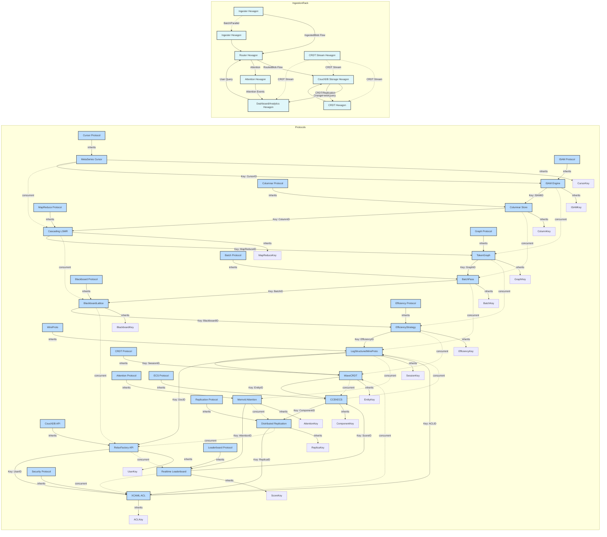

# Fiduciary Omnibus Architecture Diagram (Expanded)

```mermaid
graph LR
  %% Protocols and Primitives
  subgraph Protocols
    A1[WireProto]:::proto -->|inherits| B1[LogStructuredWireProto]:::proto
    A2[CouchDB API]:::proto -->|inherits| B2[RelaxFactory API]:::proto
    A3[CRDT Protocol]:::proto -->|inherits| B3[WaveCRDT]:::proto
    A4[Attention Protocol]:::proto -->|inherits| B4[Memvid Attention]:::proto
    A5[Leaderboard Protocol]:::proto -->|inherits| B5[Realtime Leaderboard]:::proto
    A6[ECS Protocol]:::proto -->|inherits| B6[CCEKECS]:::proto
    A7[Replication Protocol]:::proto -->|inherits| B7[Distributed Replication]:::proto
    A8[Security Protocol]:::proto -->|inherits| B8[XCAML ACL]:::proto
    A9[Cursor Protocol]:::proto -->|inherits| B9[MetaSeries Cursor]:::proto 
    A10[ISAM Protocol]:::proto -->|inherits| B10[ISAM Engine]:::proto
    A11[Columnar Protocol]:::proto -->|inherits| B11[Columnar Store]:::proto
    A12[MapReduce Protocol]:::proto -->|inherits| B12[Cascading LSMR]:::proto
    A13[Graph Protocol]:::proto -->|inherits| B13[TokenGraph]:::proto
    A14[Batch Protocol]:::proto -->|inherits| B14[BatchPass]:::proto
    A15[Blackboard Protocol]:::proto -->|inherits| B15[BlackboardLattice]:::proto
    A16[Efficiency Protocol]:::proto -->|inherits| B16[EfficiencyStrategy]:::proto
    %% Many-to-many key relationships 
    B1 -- Key: SessionID --> B3
    B1 -- Key: DocID --> B2
    B2 -- Key: UserID --> B8
    B3 -- Key: EntityID --> B6
    B4 -- Key: AttentionID --> B5
    B5 -- Key: ScoreID --> B6
    B6 -- Key: ComponentID --> B7
    B7 -- Key: ReplicaID --> B8
    B8 -- Key: ACLID --> B1
    B9 -- Key: CursorID --> B10
    B10 -- Key: ISAMID --> B11
    B11 -- Key: ColumnID --> B12
    B12 -- Key: MapReduceID --> B13
    B13 -- Key: GraphID --> B14
    B14 -- Key: BatchID --> B15
    B15 -- Key: BlackboardID --> B16
    B16 -- Key: EfficiencyID --> B1
    %% Tubular concurrency (visual metaphor)
    classDef proto fill:#bdf,stroke:#333,stroke-width:2px;
    class A1,A2,A3,A4,A5,A6,A7,A8,A9,A10,A11,A12,A13,A14,A15,A16,B1,B2,B3,B4,B5,B6,B7,B8,B9,B10,B11,B12,B13,B14,B15,B16 proto;
    %% Tubes (concurrent flows)
    B1 -.->|concurrent| B4
    B2 -.->|concurrent| B5
    B3 -.->|concurrent| B6
    B4 -.->|concurrent| B7
    B5 -.->|concurrent| B8
    B6 -.->|concurrent| B1
    B7 -.->|concurrent| B2
    B8 -.->|concurrent| B3
    B9 -.->|concurrent| B12
    B10 -.->|concurrent| B13
    B11 -.->|concurrent| B14
    B12 -.->|concurrent| B15
    B13 -.->|concurrent| B16
    B14 -.->|concurrent| B1
    B15 -.->|concurrent| B2
    B16 -.->|concurrent| B3
    %% Hanging keys (inheritance/association)
    B1 -->|inherits| K1[SessionKey]
    B2 -->|inherits| K2[UserKey]
    B3 -->|inherits| K3[EntityKey]
    B4 -->|inherits| K4[AttentionKey]
    B5 -->|inherits| K5[ScoreKey]
    B6 -->|inherits| K6[ComponentKey]
    B7 -->|inherits| K7[ReplicaKey]
    B8 -->|inherits| K8[ACLKey]
    B9 -->|inherits| K9[CursorKey]
    B10 -->|inherits| K10[ISAMKey]
    B11 -->|inherits| K11[ColumnKey]
    B12 -->|inherits| K12[MapReduceKey]
    B13 -->|inherits| K13[GraphKey]
    B14 -->|inherits| K14[BatchKey]
    B15 -->|inherits| K15[BlackboardKey]
    B16 -->|inherits| K16[EfficiencyKey]
  end
  %% Ingestion and Storage Rack (Hexagons)
  subgraph IngestionRack
    ING[Ingester Hexagon] -->|IngestedBlob Flow| ROUTER[Router Hexagon]
    ROUTER -->|RoutedBlob Flow| STORAGE[CouchDB Storage Hexagon]
    STORAGE -->|ChangeFeed/Query| DASH[Dashboard/Analytics Hexagon]
    ING -.->|Batch/Parallel| ING2[Ingester Hexagon]
    ING2 --> ROUTER
    ROUTER -->|Attention| ATTN[Attention Hexagon]
    ATTN -->|Attention Events| DASH
    STORAGE -->|CRDT/Replication| CRDT[CRDT Hexagon]
    CRDT --> STORAGE
    DASH -->|User Query| ROUTER
    %% CRDT Stream from PubSubbers
    PUBSUB[CRDT Stream Hexagon] -.->|CRDT Stream| CRDT
    PUBSUB -.->|CRDT Stream| STORAGE
    PUBSUB -.->|CRDT Stream| DASH
  end
  classDef hex fill:#e0f7fa,stroke:#333,stroke-width:2px;
  class ING,ROUTER,STORAGE,ATTN,CRDT,DASH,ING2,PUBSUB hex;
``` 

