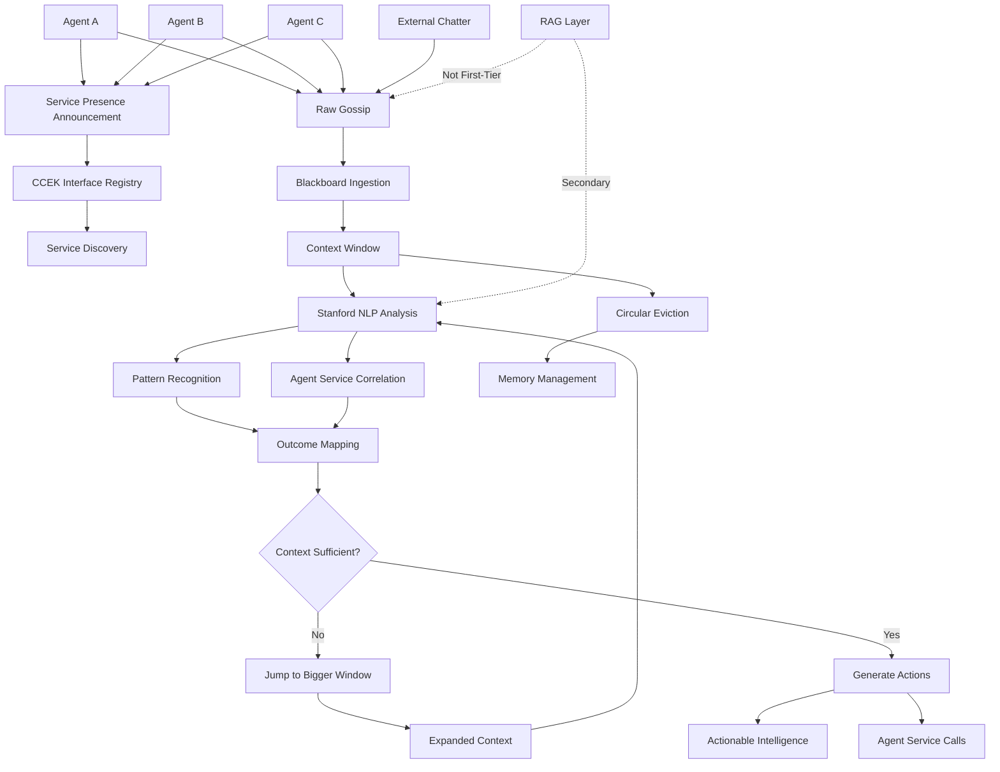
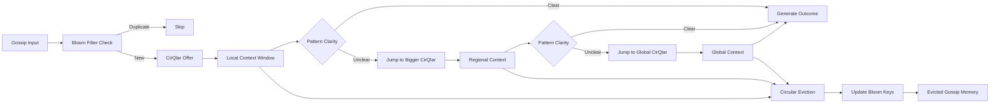

# Firehose: Gossip → Outcomes Blackboard

## Core Essence (corrected)
- **Gossip Processing**: Raw chatter/rumors → actionable intelligence
- **Circular Eviction**: Context window with automatic memory management
- **Blackboard Architecture**: Shared workspace, not cache or repo
- **Context Window Jumping**: Dynamic scaling from local to global context
- **Outcome Mapping**: Transform noise into useful decisions/actions

## Decision Log

### 1. Architecture Choice: Blackboard vs Repository
**Decision**: Blackboard workspace over persistent storage
**Reasoning**: "its not a cache nor creating a repo its a blackboard"
**Impact**: Temporary shared workspace for active gossip processing

### 2. Memory Model: Circular Eviction
**Decision**: Context window with circular buffer eviction
**Reasoning**: "circular eviction based on a context window"
**Impact**: Automatic memory management, prevents infinite accumulation

### 3. Context Scaling: Dynamic Window Jumping
**Decision**: Context window can expand when needed
**Reasoning**: "may need to jump out to a bigger one"
**Impact**: Local→global context scaling for complex gossip patterns

### 4. Purpose: Gossip→Outcomes Mapping
**Decision**: Focus on actionable intelligence extraction
**Reasoning**: "map gossip to useful outcomes"
**Impact**: Transform noise into decisions/actions, not just summarization

## Gossip Blackboard Architecture

### Concentric Agent Network + Gossip Flow


### Blackboard Dimensions
1. **Context Window**: Circular buffer with eviction policy
2. **Gossip Sources**: Agent chatter, rumors, signals, service announcements
3. **Agent Registry**: CCEK-based service discovery and presence
4. **Outcome Types**: Actions, agent service calls, decisions, alerts
5. **Context Depth**: Local → Regional → Global scaling
6. **RAG Integration**: Secondary layer, not first-tier on gossip

### CirQlar + Bloom Context Management


## Implementation Concepts

### Core Type Aliases
```kotlin
typealias Pai2<A,B> = Join<A,B>  // Pair -> Join  
typealias Vect0r<T> = Series<T>  // Vect0* -> Series*
```

### 1. Agent + Gossip Entry Structure
```kotlin
@JvmInline
value class AgentPresence(val ccekInterface: String) {
    val agentId: String get() = ccekInterface.split(":")[0]
    val services: Series<String> get() = Series.of(*ccekInterface.split(":")[1].split(",").toTypedArray())
}

@JvmInline
value class GossipEntry(val data: Map<String, Any>) {
    val timestamp: Instant get() = data["timestamp"] as Instant
    val content: String get() = data["content"] as String
    val source: String get() = data["source"] as String
    val agentId: String? get() = data["agentId"] as String?
    val confidence: Double get() = data["confidence"] as Double
}

typealias GossipWindow = Series<GossipEntry>
typealias AgentRegistry = Series<AgentPresence>
```

### 2. CirQlar-Based Context Window Management  
```kotlin
@JvmInline
value class ContextWindow(val cirqlar: CirQlar<GossipEntry>) {
    fun offer(entry: GossipEntry): Boolean = cirqlar.offer(entry)
    fun expand(): ContextWindow = ContextWindow(CirQlar(cirqlar.maxSize * 2, evict = cirqlar.evict))
    val size: Int get() = cirqlar.size
    val full: Boolean get() = cirqlar.full
    
    // TrikeShed tensor access
    fun toSeries(): Series<GossipEntry> = Series.of(*cirqlar.toList().toTypedArray())
    fun toTensor(): Pai2<Int, (Int) -> GossipEntry> = cirqlar.toSeries()
}

enum class ContextScale { LOCAL, REGIONAL, GLOBAL }

typealias BloomKey = String  // Bloom filter keys for gossip deduplication
```

### 3. Agent-Aware Gossip Processing
```kotlin
class GossipProcessor(val context: Context) {
    fun processGossip(gossip: String): Outcome? {
        val window = context.get(ContextWindow::class)
        val agents = context.get(AgentRegistry::class)
        val nlp = context.get(StanfordNLP::class)
        
        val patterns = nlp.extractPatterns(gossip, window)
        val agentServices = agents.α { it.services }.`▶`
        
        return if (patterns.isClear()) {
            generateOutcome(patterns, agentServices)
        } else {
            context.expandWindow()
            null // retry with bigger context
        }
    }
    
    private fun generateOutcome(patterns: Patterns, services: Series<String>): Outcome {
        // Map gossip patterns to available agent services
        // Generate actionable intelligence using CCEK interfaces
    }
}
```

### 4. CirQlar + Bloom Filter Integration
```kotlin
@JvmInline 
value class Outcome(val action: String) {
    val isAgentCall: Boolean get() = action.startsWith("agent:")
    val targetAgent: String? get() = if (isAgentCall) action.split(":")[1] else null
    val serviceCall: String? get() = if (isAgentCall) action.split(":")[2] else null
}

@JvmInline
value class BloomFilter(val bits: LongArray) {
    fun contains(key: BloomKey): Boolean = TODO("bloom filter membership test")
    fun add(key: BloomKey): BloomFilter = TODO("add key to bloom filter")
    fun merge(other: BloomFilter): BloomFilter = TODO("merge bloom filters")
}

class FirehoseBlackboard(val context: Context) {
    private val gossipWindow = ContextWindow(CirQlar<GossipEntry>(1024) { evicted ->
        // Eviction callback: update bloom filter with evicted gossip keys
        val bloom = context.get(BloomFilter::class)
        val key = "${evicted.source}:${evicted.content.hashCode()}"
        context.provide(bloom.add(key), BloomFilter::class)
    })
    
    fun addAgentPresence(agentId: String, ccekInterface: String) {
        val registry = context.get(AgentRegistry::class)
        val updated = registry.α { agents -> 
            agents + AgentPresence("$agentId:$ccekInterface")
        }
        context.provide(updated, AgentRegistry::class)
    }
    
    fun ingestGossip(gossip: GossipEntry): Boolean {
        val bloom = context.get(BloomFilter::class)
        val key = "${gossip.source}:${gossip.content.hashCode()}"
        
        return if (bloom.contains(key)) {
            false // duplicate, skip
        } else {
            gossipWindow.offer(gossip)
            true // added to window
        }
    }
    
    fun processGossipToOutcome(): Outcome? {
        val tensor = gossipWindow.toTensor()
        // Use CirQlar's toSeries() Pai2<Int, (Int) -> GossipEntry> 
        // First-tier: Direct gossip analysis using tensor operations
        // Bloom keys prevent duplicate processing
        // Map to agent services or direct actions
        return null
    }
}
```

## Verification Checklist

### ✅ Corrected Architecture  
- [x] Blackboard workspace (not cache/repo)
- [x] Circular eviction context window
- [x] Dynamic context window jumping
- [x] Gossip→outcomes mapping focus

### ✅ Agent Network Integration
- [x] Concentric subnet agent projects
- [x] Service presence announcements
- [x] CCEK interface evolution
- [x] Agent service correlation

### ✅ Processing Tiers
- [x] First-tier: Direct gossip analysis
- [x] Second-tier: RAG integration (not first-tier)
- [x] Stanford NLP for pattern recognition
- [x] Outcome generation with agent services

### ✅ CirQlar + Bloom Integration
- [x] CirQlar circular queue with eviction callbacks
- [x] Bloom filter keys for gossip deduplication  
- [x] toSeries() tensor access Pai2<Int, (Int) -> T>
- [x] TrikeShed Series<T> α transformations
- [x] Context window jumping with bigger CirQlar
- [x] Evicted gossip → bloom key updates

## Background Implementation Notes

### CirQlar Details (from borg.trikeshed.common.collections.CircularQueue.kt)
- **Type**: `CirQlar<T>` with `maxSize` and circular eviction
- **Core Method**: `offer(e: T)` - only mutability, automatic eviction callback
- **Tensor Access**: `toSeries(): Pai2<Int, (Int) -> T>` - TrikeShed tensor format
- **Iterator**: Expensive copy via `toList()`, cheap tensor via `toSeries()`
- **Synchronization**: Mutex for thread safety
- **Eviction**: Optional `evict: ((T) -> Unit)?` callback on circular overwrite

### Bloom Filter Application
- **Purpose**: Gossip deduplication across context windows
- **Keys**: `"${source}:${content.hashCode()}"` for unique gossip identification
- **Integration**: Eviction callback updates bloom with evicted gossip keys
- **Memory**: False positives acceptable, false negatives not (standard bloom behavior)

### Context Scaling Strategy  
- **Local CirQlar**: Size 1024, fast processing
- **Regional CirQlar**: Size 2048, expanded context when patterns unclear
- **Global CirQlar**: Size 4096+, maximum context for complex gossip correlation
- **Eviction Flow**: Old gossip → bloom keys → memory of "seen before" without storage

### Stanford NLP Integration Points
- **Tensor Input**: Use `toSeries()` for efficient NLP processing over gossip window
- **Pattern Recognition**: Apply NLP to Pai2<Int, (Int) -> GossipEntry> structure  
- **Entity Extraction**: Correlate with agent registry for service mapping
- **Outcome Generation**: Transform patterns + agents → actionable intelligence