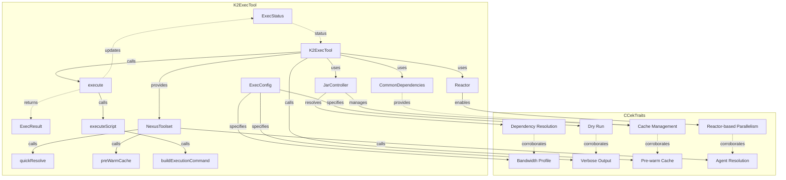

# K2ExecTool & CCek Traits Architecture

This diagram shows the relationship between `K2ExecTool`, its execution/caching/parallelism traits, and how these corroborate CCek traits.

```mermaid
flowchart TD
    subgraph K2ExecTool
        A[ExecConfig] 
        B[ExecResult]
        C[ExecStatus]
        D[K2ExecTool]
        E[JarController]
        F[Reactor<ExecStatus>]
        G[NexusToolset]
        H[quickResolve]
        I[preWarmCache]
        J[execute]
        K[executeScript]
        L[buildExecutionCommand]
        M[CommonDependencies]
    end
    subgraph CCekTraits
        N[Dependency Resolution]
        O[Cache Management]
        P[Reactor-based Parallelism]
        Q[Bandwidth Profile]
        R[Dry Run]
        S[Verbose Output]
        T[Pre-warm Cache]
        U[Agent Resolution]
    end
    D -->|uses| E
    D -->|uses| F
    D -->|calls| J
    J -->|calls| K
    K -->|calls| L
    D -->|provides| G
    G -->|calls| H
    G -->|calls| I
    D -->|uses| M
    E -->|resolves| N
    E -->|manages| O
    F -->|enables| P
    A -->|specifies| Q
    A -->|specifies| R
    A -->|specifies| S
    D -->|calls| T
    G -->|calls| U
    N -. corroborates .-> Q
    O -. corroborates .-> T
    P -. corroborates .-> U
    R -. corroborates .-> S
    M -. provides .-> O
    J -. returns .-> B
    J -. updates .-> C
    C -. status .-> D
``` 