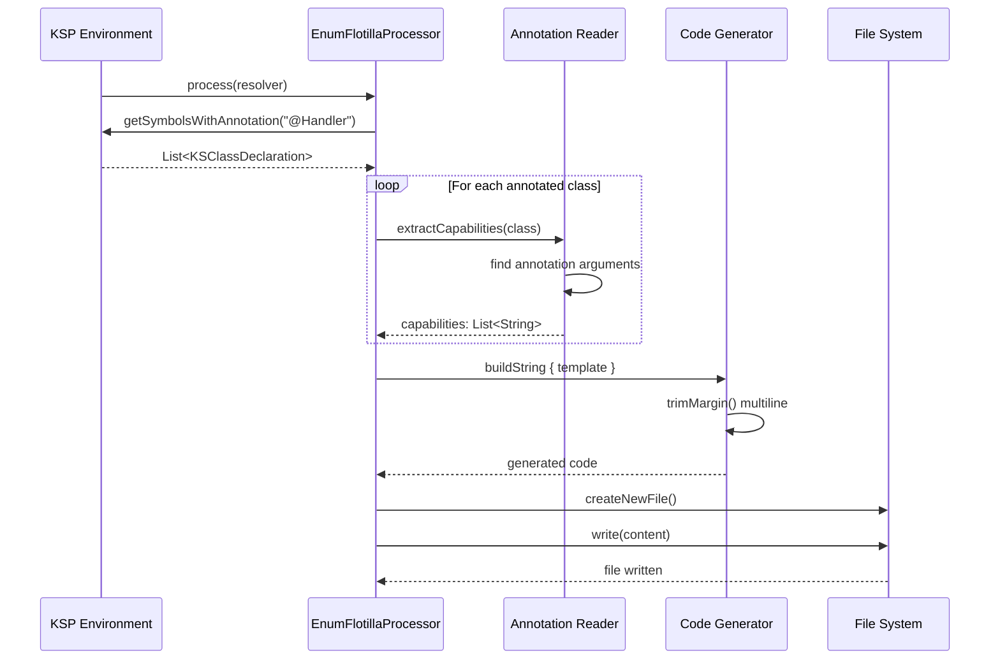
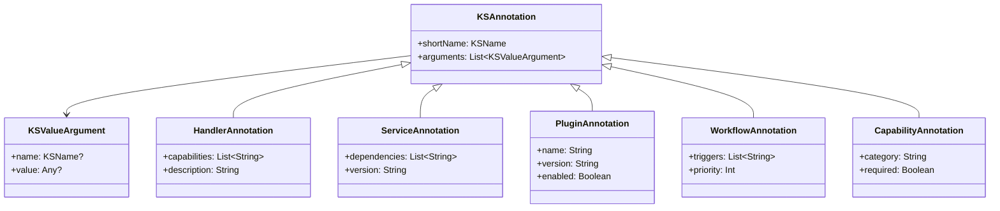

# Enum Flotilla KSP Model - Template Generation Time

## Overview
The EnumFlotillaProcessor creates agglomerated views of annotated classes at compile time.

## Model Diagram

```mermaid
graph TD
    subgraph "KSP Processing Phase"
        A[KSP Resolver] -->|finds annotations| B[Annotated Classes]
        B --> C1[@Handler Classes]
        B --> C2[@Service Classes]
        B --> C3[@Plugin Classes]
        B --> C4[@Workflow Classes]
        B --> C5[@Capability Classes]
    end

    subgraph "Collection Phase"
        C1 --> D1[List<KSClassDeclaration>]
        C2 --> D2[List<KSClassDeclaration>]
        C3 --> D3[List<KSClassDeclaration>]
        C4 --> D4[List<KSClassDeclaration>]
        C5 --> D5[List<KSClassDeclaration>]
    end

    subgraph "Extraction Phase"
        D1 --> E1[extractCapabilities<br/>extractDescription]
        D2 --> E2[extractDependencies<br/>extractVersion]
        D3 --> E3[extractPluginName<br/>extractEnabled<br/>extractVersion]
        D4 --> E4[extractTriggers<br/>extractPriority]
        D5 --> E5[extractCategory<br/>extractRequired]
    end

    subgraph "Template Generation"
        E1 --> F1[HandlerType enum<br/>- className: String<br/>- capabilities: Indexed<String><br/>- description: String]
        E2 --> F2[ServiceType enum<br/>- className: String<br/>- dependencies: Indexed<String><br/>- version: String]
        E3 --> F3[PluginCapability sealed<br/>- name: String<br/>- version: String<br/>- enabled: Boolean]
        E4 --> F4[WorkflowType enum<br/>- className: String<br/>- triggers: Indexed<String><br/>- priority: Int]
        E5 --> F5[CapabilityType enum<br/>- name: String<br/>- category: String<br/>- required: Boolean]
    end

    subgraph "Master Registry"
        F1 --> G[ComponentRegistry<br/>- handlers: Int<br/>- services: Int<br/>- plugins: Int<br/>- workflows: Int<br/>- capabilities: Int]
        F2 --> G
        F3 --> G
        F4 --> G
        F5 --> G
        G --> H[Companion Object<br/>- allHandlers()<br/>- allServices()<br/>- allPlugins()<br/>- allWorkflows()<br/>- allCapabilities()<br/>- findHandler()<br/>- findService()<br/>- findWorkflow()<br/>- findCapability()]
    end

    subgraph "Code Generation"
        F1 --> I1["""HandlerType.kt"""]
        F2 --> I2["""ServiceType.kt"""]
        F3 --> I3["""PluginCapability.kt"""]
        F4 --> I4["""WorkflowType.kt"""]
        F5 --> I5["""CapabilityType.kt"""]
        G --> I6["""ComponentRegistry.kt"""]
    end
```

## Data Flow at Template Time



## Annotation Processing Model



## Template Generation Strategy

```mermaid
graph LR
    subgraph "Template Components"
        A[Package Declaration] --> B[Imports]
        B --> C[Serializable Annotation]
        C --> D[Enum/Sealed Declaration]
        D --> E[Properties]
        E --> F[Enum Values]
        F --> G[Companion Methods]
    end
    
    subgraph "String Building"
        H[Triple Quotes """] --> I[Pipe Margins |]
        I --> J[String Interpolation ${}]
        J --> K[trimMargin()]
    end
    
    D -.-> H
    K --> L[Generated File]
```

## Key Design Decisions

1. **Agglomerated Views**: Each annotation type gets its own enum/sealed class flotilla
2. **Indexed Collections**: Uses `Indexed<T>` alias for `Series<T>` throughout
3. **Template Generation**: Triple-quoted strings with `trimMargin()` for clean multiline code
4. **Master Registry**: Central discovery point with companion object methods
5. **Type Safety**: Compile-time generation eliminates reflection needs
6. **Annotation Extraction**: Safe casting with sensible defaults when values missing