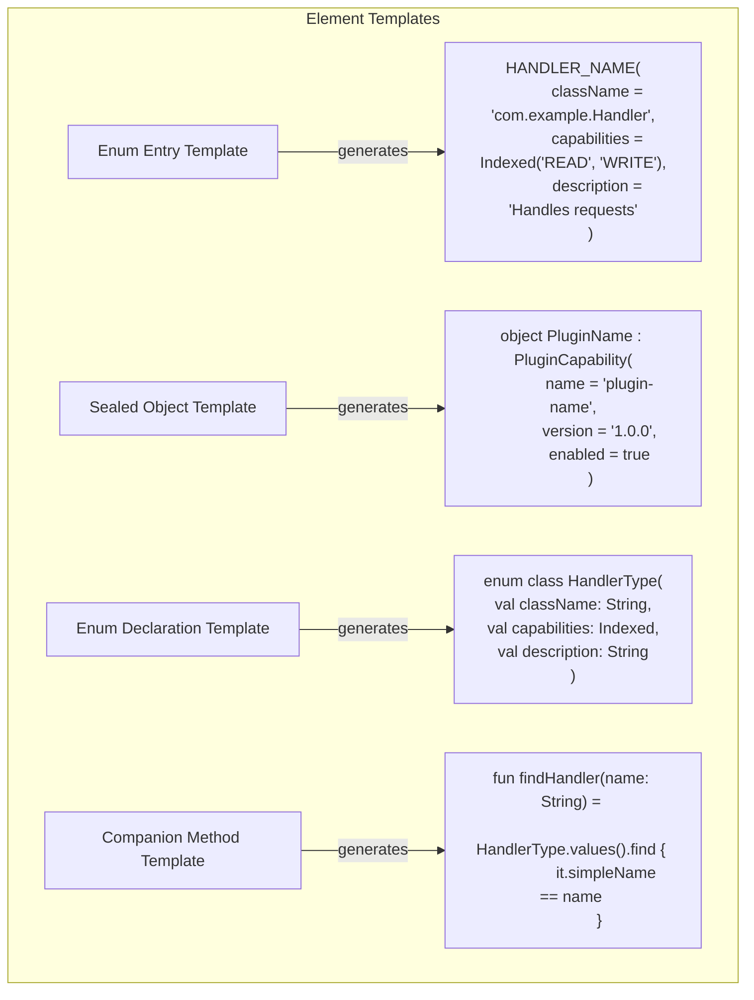

# Enum Flotilla Element Templates

```mermaid
graph TD
    subgraph "Element Templates"
        A[Enum Entry Template] -->|generates| B["HANDLER_NAME(
            className = 'com.example.Handler',
            capabilities = Indexed('READ', 'WRITE'),
            description = 'Handles requests'
        )"]
        
        C[Sealed Object Template] -->|generates| D["object PluginName : PluginCapability(
            name = 'plugin-name',
            version = '1.0.0',
            enabled = true
        )"]
        
        E[Enum Declaration Template] -->|generates| F["enum class HandlerType(
            val className: String,
            val capabilities: Indexed<String>,
            val description: String
        )"]
        
        G[Companion Method Template] -->|generates| H["fun findHandler(name: String) = 
            HandlerType.values().find { 
                it.simpleName == name 
            }"]
    end
```