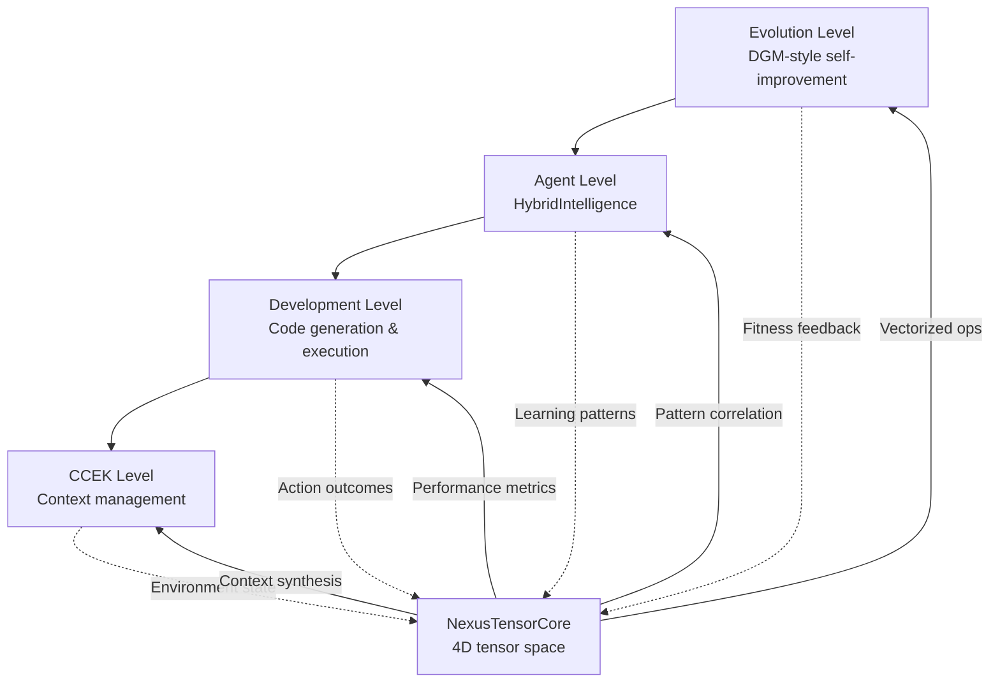
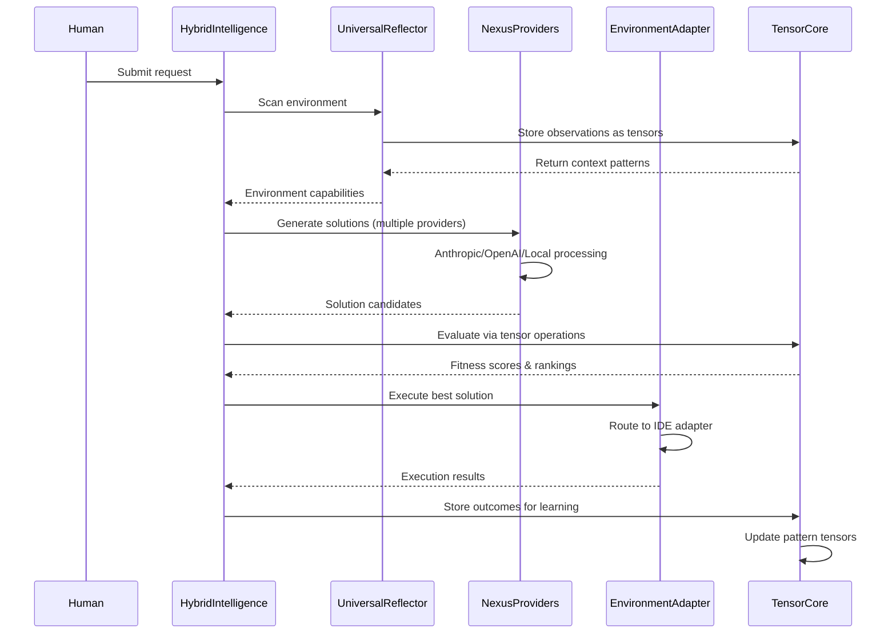
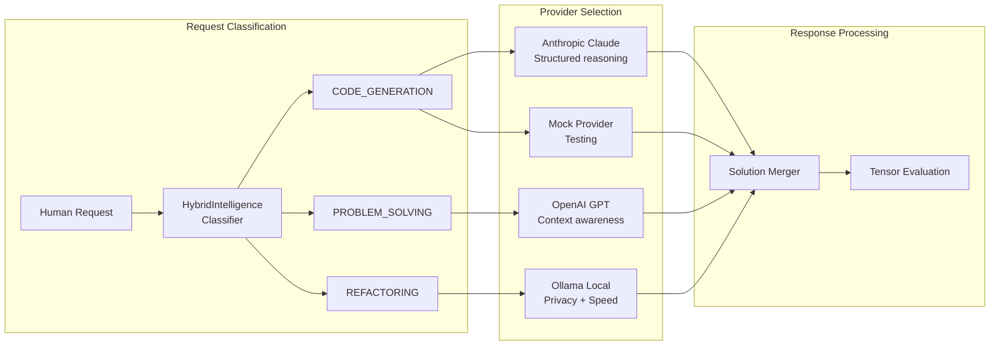
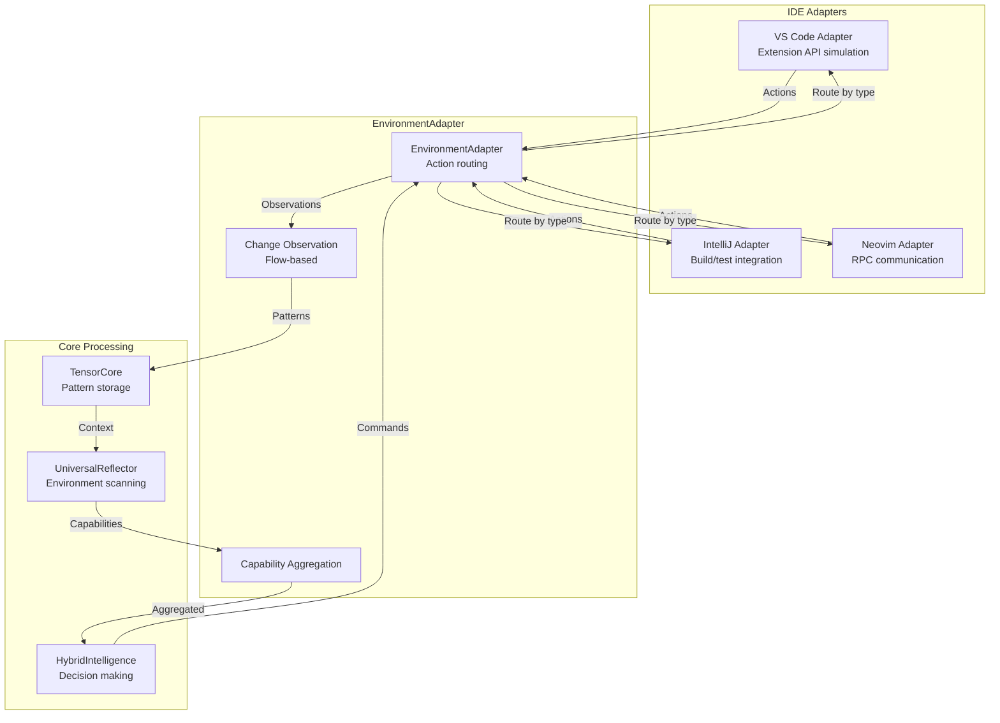
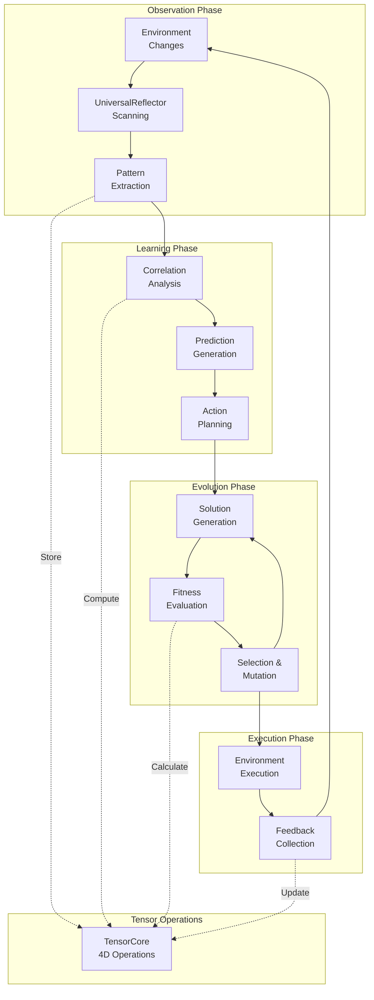
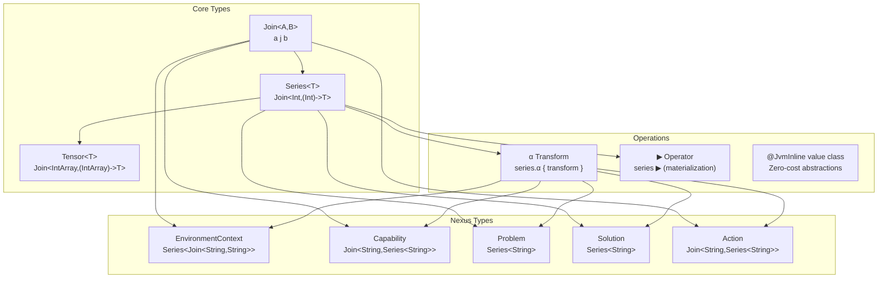

# Nexus System Interaction Diagrams

## 1. Subsumption Hierarchy Flow



## 2. Request Processing Pipeline



## 3. Multi-Provider Architecture



## 4. Environment Integration Flow



## 5. Learning & Evolution Cycle



## 6. Data Flow Architecture

```mermaid
flowchart LR
    subgraph "Input Layer"
        HUM[Human Requests]
        IDE[IDE Events]
        SYS[System State]
    end
    
    subgraph "Processing Layer"
        CCEK[CCEK Context<br/>Series&lt;Join&lt;String,String&gt;&gt;]
        CAP[Capabilities<br/>Join&lt;String,Series&lt;String&gt;&gt;]
        SOL[Solutions<br/>Series&lt;String&gt;]
    end
    
    subgraph "Tensor Layer"
        T4D[4D Tensor Space<br/>[context,capabilities,patterns,outcomes]]
        ALPHA[α Transforms<br/>Data processing]
        PLAY[▶ Operator<br/>Hot/cold materialization]
    end
    
    subgraph "Output Layer"
        ACT[Actions<br/>Join&lt;String,Series&lt;String&gt;&gt;]
        OUT[Outcomes<br/>Series&lt;String&gt;]
        LEARN[Learning Updates<br/>Join&lt;String,String&gt;]
    end
    
    HUM --> CCEK
    IDE --> CAP
    SYS --> SOL
    
    CCEK -->|j operator| T4D
    CAP -->|j operator| T4D
    SOL -->|j operator| T4D
    
    T4D --> ALPHA
    ALPHA --> PLAY
    PLAY --> ACT
    
    ACT --> OUT
    OUT --> LEARN
    LEARN -.->|Feedback| T4D
```

## 7. TrikeShed Type System Flow



## Key Interaction Patterns

### 1. Subsumption Control Flow
- **Higher levels** set goals and strategies
- **Lower levels** handle execution details
- **Tensor operations** provide cross-level communication
- **Feedback loops** enable learning at all levels

### 2. Provider Orchestration
- **Request classification** determines provider selection
- **Multiple providers** generate diverse solutions in parallel
- **Tensor evaluation** ranks solutions objectively
- **Best solution** selected for execution

### 3. Environment Integration
- **Universal adapters** provide consistent interface
- **Flow-based observation** captures real-time changes
- **Capability aggregation** synthesizes environment state
- **Action routing** distributes commands to appropriate tools

### 4. Learning Pipeline
- **Pattern extraction** from environment observations
- **Correlation analysis** via tensor operations
- **Prediction generation** based on learned patterns
- **Action planning** using predicted outcomes

### 5. Evolution Mechanism
- **Solution generation** creates candidate pool
- **Fitness evaluation** via tensor calculations
- **Selection and mutation** based on performance
- **Feedback integration** improves future generations