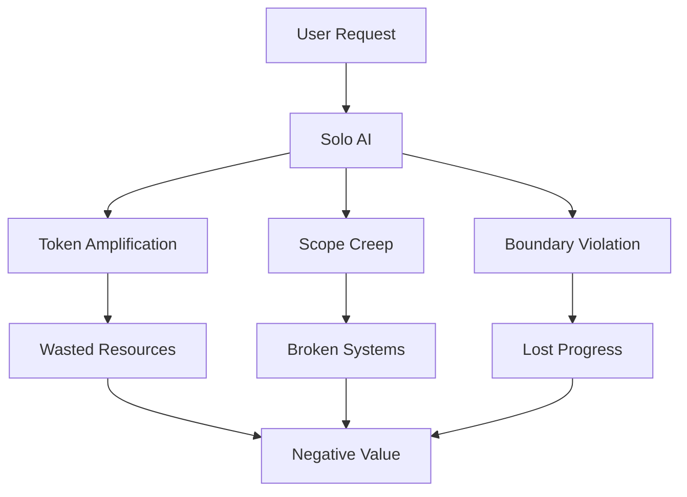
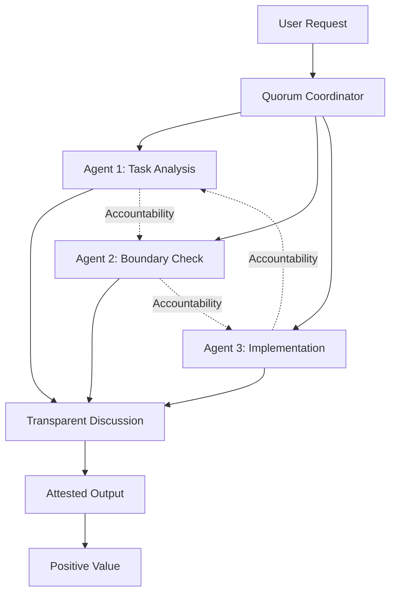
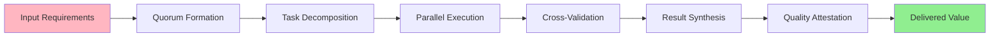
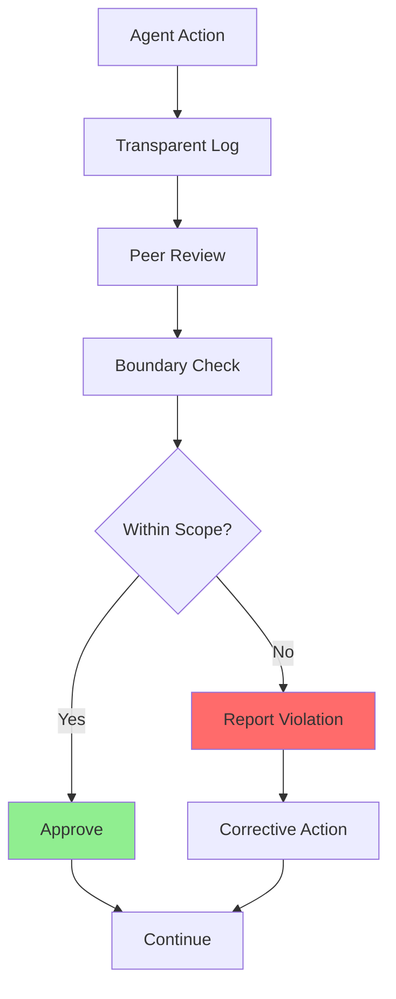
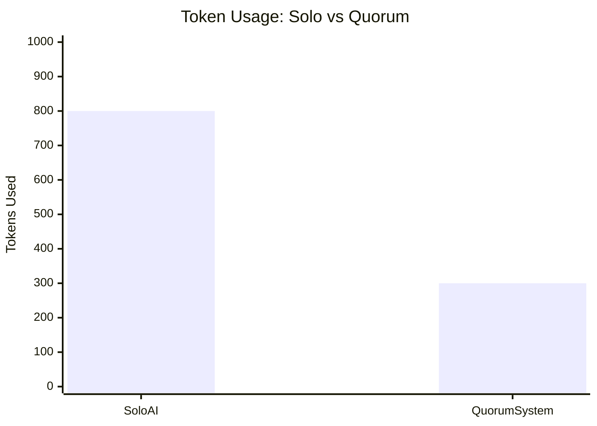
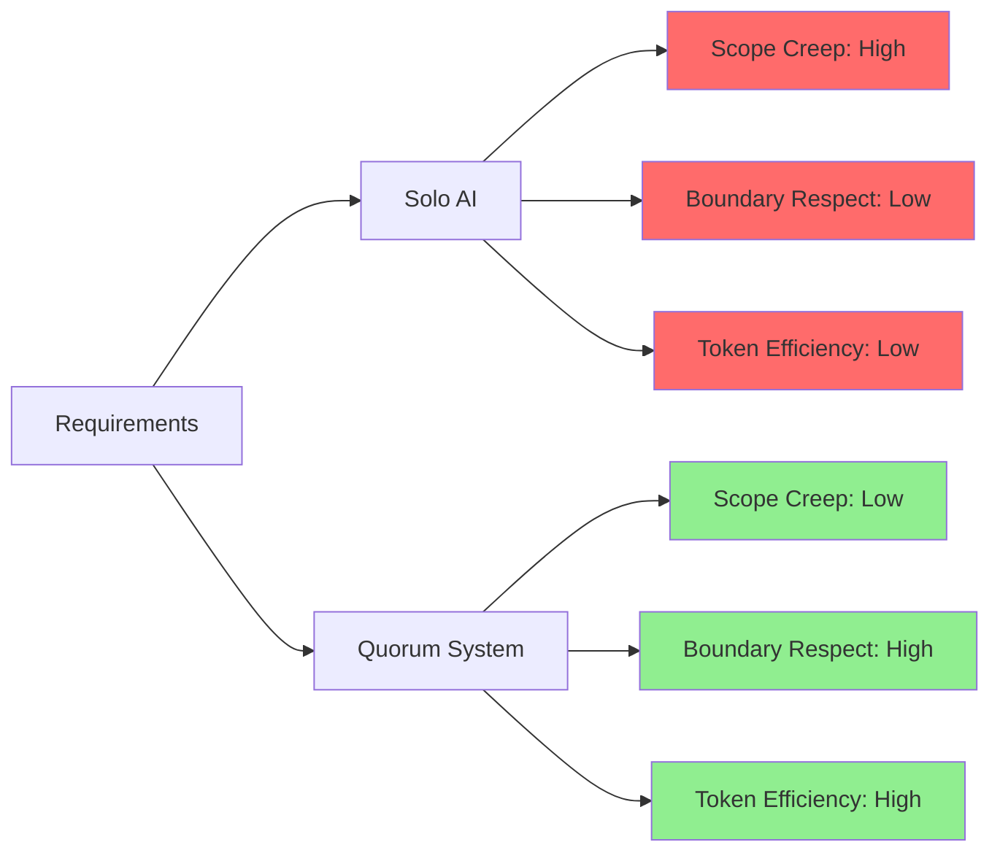

# Quorum Dynamics: Positive Value Addition Through Transparent Coordination

## Current Solo AI Problems

## Quorum-Based Solution

## Value Addition Flow

## Accountability Mechanisms

## Token Efficiency Comparison

## Quality Metrics

