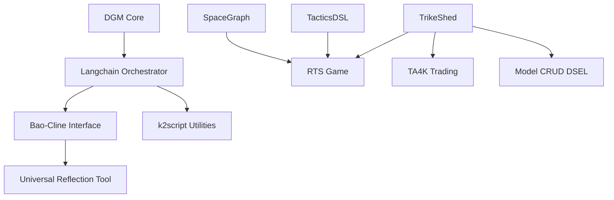

# Master TODO Consolidation

This document consolidates all unfinished work and planning across the superbikeshed project.

## Executive Summary

The project consists of several interconnected components that require integration and enhancement:

1. **DGM (Darwin Godel Machine)** - Self-improving code agent
2. **Bao-Cline** - IDE agent for VS Code  
3. **TrikeShed** - Tensor-based data processing system
4. **RTS Game** - Real-time strategy game implementation
5. **k2script** - Kotlin scripting system
6. **SpaceGraph** - Visualization framework
7. **TA4K** - Trading algorithm framework

## Priority 1: Core Integration Tasks

### Grand Integration Vision (DGM + Bao-Cline + k2script + Langchain)
**Status**: Conceptual design complete, implementation pending
**Priority**: High
**Dependencies**: Langchain orchestration design

- [ ] Implement Langchain orchestrator for DGM self-improvement loop
- [ ] Create Bao-Cline interface for DGM control and monitoring
- [ ] Develop k2script utilities for DGM evaluation and helper scripts
- [ ] Design tool integration layer between all components
- [ ] Implement "boosting DGM" with enhanced capabilities from other tools

### TrikeShed Type System Migration (CLAUDE.md Compliance)
**Status**: Partially complete, NIO migration done
**Priority**: High
**Dependencies**: None

- [x] Migrate borg.trikeshed.io.* to borg.trikeshed.nio.*
- [ ] Eliminate List<T> usage in favor of Series<T>
- [ ] Replace Pair<A,B> with Join<A,B> using j operator
- [ ] Implement α transform patterns for data manipulation
- [ ] Ensure ▶ materialization for standard collection access
- [ ] Convert all wrappers to @JvmInline value class
- [ ] Add typealias for recurring primitives

## Priority 2: Component Enhancement

### Bao-Cline UX & Build Improvements
**Status**: UX plan complete, build issues pending
**Priority**: Medium
**Dependencies**: VS Code extension architecture

- [ ] Implement basic/advanced settings modes
- [ ] Add task breadcrumb navigation
- [ ] Simplify one-step VSIX build process
- [ ] Remove build exclusions and fix underlying code issues
- [ ] Develop universal reflection CLI tool (IDE-agnostic)

### RTS Game Feature Integration
**Status**: Multiple features implemented, merge pending
**Priority**: Medium
**Dependencies**: Branch merge strategy

- [ ] Complete command hierarchy enhancements integration
- [ ] Finalize formation movement ("Codec Predictor Walk") system
- [ ] Integrate AI prediction interface with player interaction
- [ ] Balance test veterancy bonuses and authority systems
- [ ] Implement advanced veterancy abilities
- [ ] Design UI for displaying ranks and authority

### TacticsDSL Enhancement
**Status**: Core system complete, integration pending
**Priority**: Medium
**Dependencies**: RTS game integration

- [ ] Integrate visual programming interface with RTS game
- [ ] Expand macro library with more complex strategies
- [ ] Implement adaptive learning from player patterns
- [ ] Add hotkey customization system
- [ ] Create tutorial system for new users

## Priority 3: Advanced Features

### Universal Reflection Tool Development
**Status**: Conceptual only
**Priority**: Low
**Dependencies**: Core integration complete

- [ ] Define "elbow instruments" interface specification
- [ ] Design environment introspection capabilities
- [ ] Implement IDE adapter plugin system (VS Code, IntelliJ, Eclipse)
- [ ] Create VCS integration (Git, Subversion)
- [ ] Develop CLI architecture for cross-platform support

### Model CRUD via Generic DSEL Tree
**Status**: Architectural vision only
**Priority**: Low
**Dependencies**: TrikeShed system stable

- [ ] Define scope of models for CRUD operations
- [ ] Design generic DSEL tree structure and syntax
- [ ] Implement CRUD engine for DSEL execution
- [ ] Create TrikeShed parser integration
- [ ] Develop "garden collection lillpady" storage system

## In-Progress Technical Debt

### Code Quality & Performance
- [ ] Address TODO/FIXME comments across codebase (325+ files affected)
- [ ] Remove simulated benchmarks and demo-only code (CLAUDE.md compliance)
- [ ] Eliminate mock functionality and placeholder responses
- [ ] Performance profiling for integrated systems
- [ ] Memory optimization for cache-friendly data structures

### Documentation & Testing
- [ ] Update component documentation after integrations
- [ ] Create comprehensive testing strategy for integrated system
- [ ] Develop user guides for complex features
- [ ] Document API interfaces between components

## Cross-Component Dependencies

## Implementation Strategy

### Phase 1: Foundation Stabilization (4-6 weeks)
1. Complete TrikeShed type system migration
2. Resolve Bao-Cline build issues
3. Merge RTS game feature branches
4. Eliminate technical debt items

### Phase 2: Core Integration (6-8 weeks)
1. Implement DGM-Langchain orchestration
2. Create Bao-Cline-DGM interface
3. Develop k2script helper utilities
4. Test integrated system functionality

### Phase 3: Advanced Features (8-12 weeks)
1. Universal Reflection Tool development
2. Model CRUD DSEL implementation
3. Advanced AI capabilities
4. Performance optimization

## Risk Assessment

**High Risk Items**:
- Langchain orchestration complexity
- Cross-component integration points
- Performance impact of unified system

**Medium Risk Items**:
- VS Code extension compatibility
- TrikeShed migration breaking changes
- RTS game feature conflicts

**Mitigation Strategies**:
- Incremental integration approach
- Comprehensive testing at each phase
- Rollback plans for major changes
- Regular sync and reconciliation

## Success Metrics

1. **Integration Success**: All components working together seamlessly
2. **Performance**: No degradation from current individual component performance
3. **User Experience**: Improved workflow and reduced complexity
4. **Code Quality**: Elimination of technical debt items
5. **Documentation**: Complete and up-to-date documentation for all systems

---

*This document is automatically synchronized with component-specific todo lists and in-code comments. Last updated: $(date)*