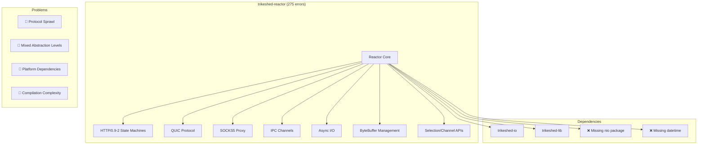
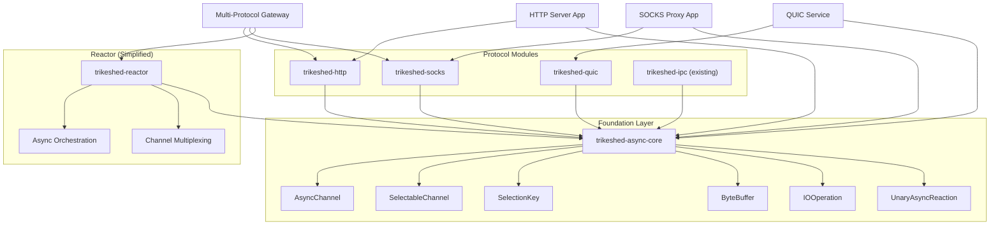

# Trikeshed Reactor Architecture Analysis

## Current State (BEFORE)



## Proposed State (AFTER)



## Module Responsibilities

### Before (Monolithic Reactor)
- **Everything in one place**: 275 compilation errors
- **Burden**: HTTP/0.9-2, QUIC, SOCKS5, IPC, async I/O, buffer management
- **Problem**: Can't use just SOCKS without dragging in HTTP and QUIC

### After (Modular Design)

#### trikeshed-async-core (Foundation)
```kotlin
// Minimal async abstractions
interface AsyncChannel
interface SelectableChannel 
class SelectionKey
class ByteBuffer
class IOOperation
typealias UnaryAsyncReaction
```

#### Protocol Modules
- **trikeshed-http**: HTTP state machines, HTTP/2 proxy
- **trikeshed-quic**: QUIC server/client implementation
- **trikeshed-socks**: SOCKS5 proxy (RFC compliant)
- **trikeshed-ipc**: Inter-process communication (already exists)

#### trikeshed-reactor (Orchestration Only)
- Channel multiplexing
- Async event loops
- Protocol composition
- No protocol implementations

## Benefits

1. **Tiny Scripts**: Each use case imports only what it needs
2. **Clear Dependencies**: Protocols depend on async-core, not on each other
3. **Easier Testing**: Test each protocol in isolation
4. **Reduced Compilation**: Smaller modules = faster builds
5. **Platform Flexibility**: Core abstractions can have platform-specific implementations

## Migration Path

1. Create `trikeshed-async-core` with minimal abstractions
2. Move protocol implementations to separate modules
3. Fix nio → io imports
4. Add missing dependencies (datetime)
5. Simplify reactor to orchestration only