# TrikeShed REST Client Context Graph

```mermaid
graph TD
    %% Core TrikeShed Types
    subgraph "TrikeShed Core Types"
        Join["Join<A,B>"]
        Indexed["Indexed<T>"]
        Series["Series<T>"]
        MetaSeries["MetaSeries<I,T>"]
    end

    %% REST Client Core
    subgraph "REST Client Core"
        RestClient["RestClient (interface)"]
        TrikeShedRestClient["TrikeShedRestClient (abstract)"]
        HttpRequest["HttpRequest = Join<RequestMeta, RequestBody?>"]
        HttpResponse["HttpResponse = Join<ResponseMeta, ResponseBody>"]
        HttpHeaders["HttpHeaders = Indexed<Join<String, String>>"]
    end

    %% Request/Response Flow
    subgraph "Request Flow"
        RequestMeta["RequestMeta\n- method: String\n- url: String\n- headers: HttpHeaders\n- timeout: Duration?"]
        ResponseMeta["ResponseMeta\n- statusCode: Int\n- headers: HttpHeaders\n- duration: Duration"]
        RequestBody["RequestBody = ByteArray"]
        ResponseBody["ResponseBody = ByteArray"]
    end

    %% Interceptors & Middleware
    subgraph "Interceptors"
        RequestInterceptor["RequestInterceptor"]
        RateLimiter["RateLimiter"]
        CircuitBreaker["CircuitBreaker"]
        LoggingInterceptor["LoggingInterceptor"]
        AuthInterceptor["AuthInterceptor"]
    end

    %% Advanced Features
    subgraph "Advanced Features"
        BatchExecutor["BatchExecutor\n- executeBatch(): Indexed<Response>"]
        ConnectionPool["ConnectionPool\n- connections: Indexed<Connection>"]
        WebSocketClient["WebSocketClient"]
        SseClient["SseClient"]
        MultipartFormData["MultipartFormData"]
    end

    %% Builder Pattern
    subgraph "Builder"
        RestClientBuilder["RestClientBuilder\n- baseUrl()\n- defaultHeaders()\n- addInterceptor()\n- build()"]
        UrlBuilder["UrlBuilder\n- addPath()\n- addQueryParam()\n- build()"]
    end

    %% Platform Implementations
    subgraph "Platform Specific"
        PlatformRestClient["PlatformRestClient"]
        JvmImpl["JVM Implementation\n(Java HttpClient)"]
        NativeImpl["Native Implementation\n(ktor/curl)"]
        JsImpl["JS Implementation\n(fetch API)"]
    end

    %% Relationships
    Join --> HttpRequest
    Join --> HttpResponse
    Join --> HttpHeaders
    Indexed --> HttpHeaders
    Indexed --> BatchExecutor
    Indexed --> ConnectionPool

    RestClient --> TrikeShedRestClient
    TrikeShedRestClient --> PlatformRestClient
    PlatformRestClient --> JvmImpl
    PlatformRestClient --> NativeImpl
    PlatformRestClient --> JsImpl

    HttpRequest --> RequestMeta
    HttpRequest --> RequestBody
    HttpResponse --> ResponseMeta
    HttpResponse --> ResponseBody

    RequestMeta --> HttpHeaders
    ResponseMeta --> HttpHeaders

    RestClientBuilder --> TrikeShedRestClient
    RestClientBuilder --> RequestInterceptor

    RequestInterceptor --> RateLimiter
    RequestInterceptor --> CircuitBreaker
    RequestInterceptor --> LoggingInterceptor
    RequestInterceptor --> AuthInterceptor

    TrikeShedRestClient --> ConnectionPool
    TrikeShedRestClient --> BatchExecutor
    TrikeShedRestClient --> RequestInterceptor

    RestClient --> WebSocketClient
    RestClient --> SseClient
    RestClient --> MultipartFormData

    %% Data Flow
    subgraph "Data Flow Example"
        UserCode["User Code"]
        UC_Request["client.get('/api/users')"]
        Interceptors_Chain["Interceptor Chain"]
        Platform_HTTP["Platform HTTP Engine"]
        Response_Transform["Response Transform"]
        UC_Response["Indexed<User>"]
    end

    UserCode --> UC_Request
    UC_Request --> Interceptors_Chain
    Interceptors_Chain --> Platform_HTTP
    Platform_HTTP --> Response_Transform
    Response_Transform --> UC_Response

    %% Styling
    classDef core fill:#f9f,stroke:#333,stroke-width:4px
    classDef trikeshed fill:#bbf,stroke:#333,stroke-width:2px
    classDef platform fill:#bfb,stroke:#333,stroke-width:2px
    classDef feature fill:#ffb,stroke:#333,stroke-width:2px

    class RestClient,TrikeShedRestClient,HttpRequest,HttpResponse core
    class Join,Indexed,Series,MetaSeries trikeshed
    class PlatformRestClient,JvmImpl,NativeImpl,JsImpl platform
    class BatchExecutor,ConnectionPool,WebSocketClient,SseClient feature
```



## Context Relationships

### 1. Type Dogfooding
- **Join<A,B>** → Used for Request/Response pairs, Headers as key-value pairs
- **Indexed<T>** → Used for Headers collection, Batch operations, Connection pools
- **Series<T>** → Used for streaming responses (planned)
- **MetaSeries<I,T>** → Used for enriched responses with metadata (planned)

### 2. Core Abstractions
```
RestClient (interface)
    ↓
TrikeShedRestClient (abstract common)
    ↓
PlatformRestClient (expect/actual)
    ↓
Platform Implementations (JVM/Native/JS)
```

### 3. Request Processing Pipeline
```
User Request
    → RestClientBuilder configuration
    → Interceptor chain processing
    → Header merging (default + request)
    → URL resolution
    → Platform HTTP execution
    → Response transformation
    → Logging/Metrics
    → User Response
```

### 4. Key Design Patterns

#### Interceptor Chain
```kotlin
Indexed<RequestInterceptor> → Sequential application
    → RateLimiter (request throttling)
    → CircuitBreaker (failure handling)
    → AuthInterceptor (authentication)
    → LoggingInterceptor (debugging)
```

#### Connection Pooling
```kotlin
ConnectionPool
    → connections: Indexed<Connection>
    → acquire(): Connection (with waiting)
    → release(Connection): Unit
```

#### Batch Operations
```kotlin
Indexed<HttpRequest> → Parallel execution with Semaphore
    → Coroutine per request
    → Maintains order
    → Returns Indexed<HttpResponse>
```

### 5. Integration Points

#### With Cursor Module
```kotlin
HttpResponse → JSON parsing → Cursor
    → column operations
    → filtering/sorting
    → aggregations
```

#### With Fiduciary Module
```kotlin
RestClient → ApiNavigator
    → search operations
    → attention tracking
    → data fetching
```

#### With Nexus Module
```kotlin
RestClient → AI provider backends
    → LLM API calls
    → streaming responses
    → batch inference
```

### 6. Platform Abstractions

Common API:
- `execute(request)` - Single request
- `stream(request)` - Streaming response
- `batch(requests)` - Parallel batch

Platform-specific:
- JVM: Java 11+ HttpClient
- Native: libcurl or ktor-client
- JS: Fetch API or axios

### 7. Memory Model
```
Request: Join<Meta, Body?>
    ↓
Processing: No intermediate collections
    ↓
Response: Join<Meta, Body>
    ↓
Transformation: Direct to user type
```

No List<T> allocations, all Indexed<T> with size-based construction.