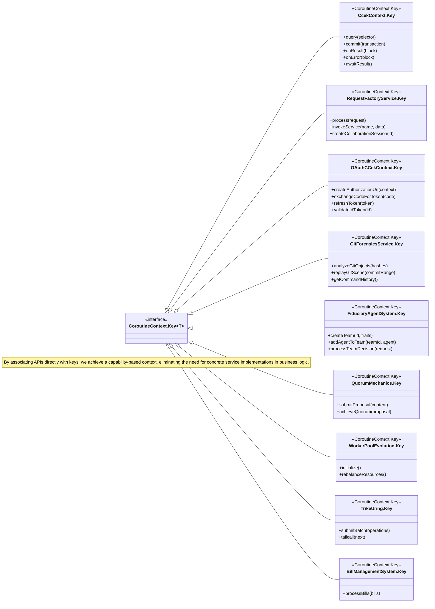

Of course. By associating API functions directly with the `CoroutineContext.Key`, we treat the context less like a container of disparate objects and more like a set of modular capabilities that can be progressively composed. This reframes coroutines to operate on keys, making the context the central mechanism for service discovery and execution.

### The Catalog of Context-Key-Associated APIs

Here is the complete catalog of API functions, structured as openers, conditionals, and terminals. This approach allows for building declarative, fault-tolerant, and observable execution flows directly on the `CoroutineContext`.

---

#### **Series 1: Openers (Initiating Operations)**

Openers are the entry points. They create the initial context for an operation, establishing the required services and returning a handle or a new context for further composition.

*   `http.request(request: HttpRequest)`: Initiates an HTTP request, placing an `HttpClient` and a unique `ExecutionId` into the context.
*   `datastore.query(query: CouchQuery)`: Starts a database query, establishing a `CouchDBClient` and query-specific metadata in the context.
*   `crdt.transact(waveletId: WaveletId)`: Begins a new CRDT transaction, creating a `WaveCRDTEngine` and transaction state within the context.
*   `dht.discover(targetId: NUID)`: Initiates a peer discovery process, establishing a `ChannelizedKademliaNode` in the context.
*   `file.stream(path: String)`: Opens a file for streaming, setting up a `CCEKFileChannel` in the context.
*   `swarm.download(magnetUri: String)`: Starts a torrent download, placing the `TorrentBatchController` and download metadata into the context.

#### **Series 2: Conditionals (Branching and Flow Control)**

Conditionals inspect the current context and route execution based on its state. They are essential for creating dynamic and resilient systems.

*   `onResult(block: suspend (result) -> Unit)`: Executes a block only if the previous operation in the context was successful.
*   `onError(block: suspend (error) -> Unit)`: Executes a block only if the previous operation resulted in an error.
*   `whenState(expected: FSMState, block: suspend () -> Unit)`: Executes a block only if the FSM component in the context is in the `expected` state.
*   `ifFeatureEnabled(flag: String, block: suspend () -> Unit)`: Checks a `FeatureContext` and executes a block only if the specified feature flag is active.
*   `hasCapability(capability: IoCapability, block: suspend () -> Unit)`: Checks for a specific I/O capability (e.g., `IoCapability.URING`) in the context before proceeding.
*   `withCircuitBreaker(config: CircuitBreakerConfig, block: suspend () -> Unit)`: Wraps an operation with a circuit breaker, using the context to maintain the breaker's state.

#### **Series 3: Terminals (Executing and Finalizing)**

Terminals are the final operations in a chain. They execute the core logic of a coroutine and produce a final result, often consuming or finalizing the context.

*   `awaitResult()`: Suspends until the operation identified by the context's `ExecutionId` is complete and returns its final result.
*   `collect()`: Used on a context that contains a `Flow`, this terminal operator collects all emissions from the flow.
*   `commit()`: Finalizes a transaction started by `crdt.transact`, applying all staged operations.
*   `release()`: Releases a resource (like a distributed lock or file handle) held within the context.
*   `tailcall(next: Sqe)`: In a `TrikeUring` context, performs a final, optimized submission to the kernel I/O ring, ending the coroutine's work.
*   `respond(response: HttpResponse)`: In an `HttpServer` context, sends the final HTTP response to the client, terminating the request-response cycle.

### UML Mermaid Diagram: Associating APIs with CoroutineContext.Key

This diagram illustrates the architectural shift. Instead of a coroutine "having" a service, it "uses a key" to access a capability. The functions become extensions on the keys themselves or on the context, emphasizing a capability-driven model over a service-locator pattern.

### Architectural Implications of This Migration

By migrating to this key-associated API model, the codebase will benefit significantly:

1.  **Decoupling and Testability**: Business logic no longer depends on concrete service implementations, only on the presence of a key and its associated API. This allows for easy mocking and testing by providing alternative implementations for the same key in test contexts.
2.  **Compile-Time Safety**: The use of extension functions on typed keys provides strong compile-time guarantees that an operation is valid for a given context.
3.  **Enhanced Readability**: Coroutine bodies become more declarative. Code like `http.request(..).onResult { ... }.onError { ... }.await()` clearly outlines the entire execution flow, including error handling.
4.  **True Composition**: This is the culmination of the CCEK pattern. The entire execution environment, from I/O capabilities to business logic, is composed through the `CoroutineContext`. The system becomes a set of interchangeable, composable functions orchestrated by the context, fulfilling the "beer goggles" vision where any platform can be made to look and act like any other.
